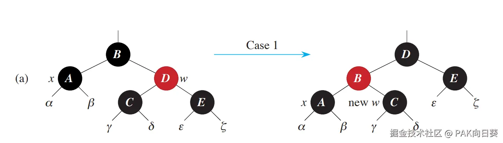
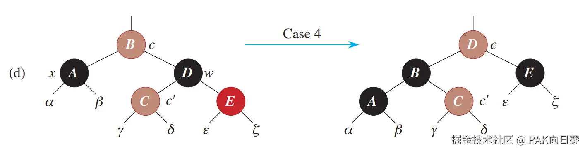

在之前的学习中，我们已经接触了二叉搜索树（Binary Search Tree, BST）和AVL树。

AVL树作为一种严格的平衡二叉搜索树，在一般BST树的基础上，实现了在向树中插入新节点或从树中删除已有节点后，仍然维持**严格平衡**的特性。这使得人们能够避免BST中任意节点的左右子树高度差异过大，以便将查找时间控制在比较理想的$O(\log_2{n})$。

但是AVL树也存在着比较明显的缺点。在执行删除操作后，AVL树为了重新恢复平衡所需要执行的旋转操作次数上界高达$O(\log_2{n})$，也就是说为了恢复严格平衡整棵树的形态都要发生比较大的变化。

而本文所要介绍的红黑树（Red-Black Tree）则是一种**近似平衡**的二叉搜索树。

红黑树插入新节点后更新节点信息（重染色）操作的上界为$O(\log_2{n})$，且只需执行常数次旋转操作，这与AVL树一致。但是针对删除操作，虽然两者更新节点信息操作的开销上界也都是$O(\log_2{n})$，但红黑树最多只需执行3次旋转操作即可重新恢复近似平衡，相比AVL树最多需执行$O(\log_2{n})$次旋转操作的确有一定的优势。

# 引入：红黑树的基本性质

## 红黑性质

如果一棵BST具备如下几条所谓的**红黑性质**，则称之为红黑树：

1.  每个节点要么是黑色的，要么是红色的。
2.  根节点是黑色的。
3.  每个叶节点（NIL，哨兵节点）是黑色的。
4.  如果一个节点是红色的，那么它的父节点和子节点都是黑色的。
5.  对于树上的每个节点，从该节点出发到其任意后代叶节点的简单路径上，所包含的黑色节点的数目是相同的。

如下图所示是一棵合法的红黑树：

对于初学者来说，要重点关注**性质3**。

我们很容易猜到，在真实的红黑树代码实现中，肯定是不可能为NIL节点真正去分配内存的。取而代之的只不过是将其父节点中对应的指针简单地赋值成`NULL`。

那为什么在红黑树的定义中，一定要重点强调NIL节点的颜色是黑色的呢？

事实上，将NIL节点假想成普通，这主要是为了使得后文中将要介绍的红黑树插入/删除操作算法具备一般性，而无需专门为处理NIL节点（也就是所谓的"边界情况"）引入额外的规则。

CLRS中亦将NIL节点称作"哨兵"。回忆一下在学习链表的时候，我们也有接触过"哨兵节点"的概念。所谓"哨兵"，不就是为了简化对边界情况的处理而引入的吗？

另外需要指出的是，在许多情况下为了展示方便，在图中并不会将NIL节点一并画出（例如下图）。在这种语境下红黑树的叶节点指的就是位于树最下层的合法节点。在后文中将不再对"叶节点"这一词汇的具体指代进行额外说明，请读者自行根据语境进行辨别！

## 红黑树的树高

根据CLRS中的证明，红黑树树高的上界为$2\log_2{(n+1)}$。因此红黑树的查找操作开销和AVL树同属于对数级别。虽然前者仅实现了近似的平衡，实际查找性能略逊于后者。

# 回顾

红黑树的插入/删除算法是在BST的几个基本算法的基础上实现的。

## BST的旋转操作

与AVL树一样，红黑树的平衡恢复操作依赖于BST的左旋和右旋这两种基本的旋转操作。

下图直观展示了这两种基本操作：

在实际编程实现旋转操作时，应注意：

1.  图中x、y节点都必须是真实存在的节点。而α、β和γ均有可能是NIL节点。
2.  以右旋为例，左旋同理：
    *   若原先y节点是根节点，则右旋后需要将根节点指针指向x节点，并将x的父节点指针（如果有的话）更新为NIL。
    *   若原先y节点有合法的父节点p，则右旋后需要将p的相应子节点指针指向x，x的父节点指针也要做相应更新。

下图展示了在实际BST中的旋转操作。从图中可见，旋转操作并不会破坏BST的基本性质。

## 查找BST中指定节点的后继（successor）

后继节点指的是BST中所有`value`取值大于指定节点的节点中，取值最小的那一个。查找后继节点的算法与实现BST中的删除操作密切相关。

该算法的实现是简单和直观的，直接上伪代码：

## BST的插入操作

BST的插入操作比较简单。

1.  设待插入节点为x，以`x.value`作为目标值，执行搜索算法。
2.  搜索算法会在BST的某一个叶节点处结束，则该叶节点即为待插入节点的父节点p。
3.  根据`x.value`与`p.value`的大小关系，将x作为p的左孩子或者右孩子，插入BST。

## BST的删除操作

设待删除的目标节点为z，则BST的删除操作可分为如下几种情况：

1.  z的左孩子为NIL，右孩子为普通节点。
2.  z的左孩子为普通节点，右孩子为NIL。
3.  z的左右孩子均为NIL。
4.  z的左右孩子均为普通节点。

情况1和情况2中z都至少有一个合法的子节点，只需要将z摘除后，使用该合法的子节点接替z的位置即可。至于情况3，显然是情况1和2的特例，在实际实现中可以直接复用前两种情况的代码，即只需将z的父节点的左孩子（或右孩子）指针更新为`NULL`即可。

情况4又可以进一步细分为如下的两类情形：

*   情况4-1：z的后继节点（successor）y恰好为z的右孩子。
*   情况4-2：z的后继节点y虽然位于其右子树中，但并不是直接与z相连的右孩子

> 由于进入情况4的前提是z的左右孩子都不为NIL，因此z合法的后继节点一定位于其右子树中。在实际实现时我们只需要`TREE-MINIMUM`那部分代码即可。

对于情况4-1的处理比较简单，只需将z摘除后，将y（即原先的`z.right`）与`z.left`和`z.parent`相连即可。

> 注意：后继节点不可能有左孩子！！！

情况4-2则更复杂一些，需要分解成如下几步完成：

*   将`y.right`和`y.parent`直接相连。这相当于在逻辑上把y从原先的位置上摘除掉。
*   将`y`与`z.right`相连。
*   按情况4-1的算法进一步进行处理。

# 算法：红黑树的插入新节点算法

## 算法

要向红黑树中插入新节点`z`，从整体上分为如下几步：

*   执行一般BST的插入算法，将`z`插入到树中的某一位置。
*   将`z`强制染成红色。
*   若`z.parent`亦为红色，则破坏了**红黑性质4**。有的资料中称这种现象为"**双红缺陷**"。此时执行红黑树插入修复算法，使红黑树恢复合法状态。

> 为什么我们不将`z`染成黑色呢？

下面给出`z`位于其祖父节点（grandparent, `z.parent.parent`）左子树时的插入修复算法。当`z`位于右子树时，其修复算法完全是前者的镜像版本。

若`z`的叔父节点（uncle, `z.parent.parent.right`）`y`为红色，则只需将祖父节点的黑色"下推"给`z`的父节点和叔父节点`y`。此时`z`和其父节点之间的双红缺陷被消除。但由于祖父节点从黑色变为红色，这意味着在红黑树的更高层可能又会产生新的双红缺陷。此时更新`z`指针，使其指向祖父节点，然后重新执行插入修复算法，直至更高层不再出现双红缺陷。

> 请你思考如下问题：
>
> 1.  修复算法执行前，祖父节点一定是黑色的吗？
> 2.  叔父节点`y`一定是合法的普通节点吗？`α`、`β`、`γ`、`δ`和`ε`呢？
> 3.  如果图中`new z`所指的节点恰好为根节点，应该如何处理才不会破坏任何一条**红黑性质**？

若`z`的叔父节点`y`为黑色，如下图所示，**最多经过两次旋转操作**，红黑树可以完全恢复合法状态。

## 实例

<https://walkccc.me/CLRS/Chap13/13.3/#133-2>

# 算法：红黑树的删除指定节点算法

## 出发：从一般BST删除算法入手考虑

有了学习红黑树插入算法的经验，我们不难猜测出，红黑树的删除算法是在一般BST删除算法的基础上进行改造而得来的。或者更直白地说，**红黑树删除算法=一般BST删除算法+红黑树删除修复算法+别的什么东西（如果有的话）**。

在正式介绍红黑树的删除修复算法前，首先请你思考一个问题：如果仅仅是简单地调用BST的删除算法来摘除红黑树上的节点，可能会导致哪些**红黑性质**被破坏呢？

我们还是分成如下的几种情况进行讨论。并且每种情况中，我们还需要细致地考察被摘除节点和接替者节点颜色对结果的影响：

1.  被摘除节点只有左孩子或者只有右孩子
2.  被摘除节点没有子节点
3.  被摘除节点左右孩子都有，且其后继不是右孩子
4.  被摘除节点左右孩子都有，且其后继恰为右孩子

### 情况1

在情况1中，如果被摘除节点恰好为黑色的，则至少会破坏**红黑性质5**。例如下图中我们将值为10的黑色节点摘除：

如果你的眼光足够敏锐，应该不难发现我们还很容易构造出这样的实例，让**红黑性质4**也在摘除过程中被破坏：

此外，如果我们尝试摘除根节点，**红黑性质2**也有可能惨遭破坏：

由此可见，仅就情况1而言，**摘除黑色节点可能会造成红黑性质2、4、5被破坏**。

另外我们注意到，**如果情况1中摘除的节点为红色，则绝不可能造成任何一条红黑性质被破坏**。这个结论的证明作为练习留给读者。

### 情况2

情况2作为情况1的特例，显然可以直接沿用情况1的结论。读者可以自行举例进行验证。

### 情况3

#### 引入：情况3-1

那么对于情况3，结论又如何呢？让我们从一种比较容易想到的情形入手。

从直观上就很容易想象得到，如果要摘除的节点是黑色的，而它的接替者（它的右子树中的某个节点）是红色的。那么如果直接让接替者顶替被摘除节点原先的位置，势必会导致原先被摘除节点的右子树的**红黑性质5**被破坏。此外，如果原先被摘除的黑色节点与某个红色节点相连，这种操作还会导致**红黑性质4**一并被破坏。

例如下面这个例子，我们执行一般的BST删除算法，将值为25的黑色节点摘除：

一种显而易见并且安全的解决方案是，我们可以**将接替者节点染成和被摘除节点一样的颜色**，问题即可得以解决。如下图所示：

好消息是，**在实际的红黑树删除算法中的确使用到了这种重染色的处理手法**。

不过，仅靠重染色，就能应对所有情况了吗？

你应该已经注意到了，刚才我们举的只是一个极为特殊的例子。我们还需要进一步罗列其他的各种情况，逐一进行考察：

*   情况3-1：被摘除节点为黑，接替者节点为红。
*   情况3-2：被摘除节点为黑，接替者节点为黑。
*   情况3-3：被摘除节点为红，接替者节点为红。
*   情况3-4：被摘除节点为红，接替者节点为黑。

刚才我们举的例子即为**情况3-1**。通过前面的分析可知，在这种情况下，通过将接替者节点重新染色为黑色，的确可以修复所有的红黑性质。

#### 情况3-2

现在我们考察**情况3-2**。在这种情况下接替者本身就是黑色的，重染色之后还是黑色的。我们很容易就能够理解，拿一个黑色的接替者节点去顶替原先为黑色的被摘除节点的位置，那么在该被摘除节点处显然不可能造成**红黑性质4、5**被破坏。但相应的，因为黑色的接替者节点被移动到了原先被摘除节点的位置，所以在接替者节点原先的位置上**红黑性质4、5**可能会被破坏！

下图给出了情况3-2的一个例子。

这里我们将值为25的黑色节点摘除，根据一般BST的删除算法，接下来该节点的原先位置将由值为27的接替者节点来顶替，而接替者节点原先的位置将由其右孩子（值为28的红色节点）来顶替。

从图中可以清晰地看到，由于黑色的接替者节点被移除出原位置，从根节点出发到值为28的红色节点的简单路径上的黑节点总数由3下降为2，即**红黑性质5**被破坏！同时由于接替者节点被移除出原位置，值为28和30的这两个红色节点直接相连，这意味着**红黑性质4**亦被破坏！

但我们事实上也并不是一无所获。例如，我们注意到从黑色根节点出发到值为22的黑色叶节点的简单路径上，出现的黑色节点的总数仍然是原先的3。我们又可以注意到对于值为32的那个黑色叶节点来说亦是如此。

这说明将接替者节点染成和原先待摘除的目标节点一样的颜色，仍然是有实际意义的。或者更直白而直观地说，**重染色操作将红黑性质被破坏的问题下放到了红黑树中比较低的层级**。在后续对红黑树删除算法的正式介绍中，你将会看到这对于降低算法的设计和分析难度，具有重大的意义。

#### 情况3-3

接下来我们考察**情况3-3**。这种情况是相当简单的：既然被摘除节点和接替者节点都是红色的，且执行删除操作前的红黑树是合法的（**红黑性质4、5都成立**），那么在进行摘除和接替处理后，红黑树的任何性质显然都不会被破坏。

#### 情况3-4

最后我们来考察**情况3-4**，其与**情况3-2**带来的问题是完全一致的。

在这种情况下，将原先为黑色的接替者节点染成红色，虽然不会在原先被摘除节点的位置引入新的黑高度，看似不会破坏**红黑性质5**，但实际上由于原先为黑色的接替者节点被从原位置移除，从树根节点出发到接替者节点原有的后代叶节点的简单路径上，黑色节点的数目就减少了1，因此**红黑性质5**在红黑树更低的层级上仍然被破坏了！

同时，与**情况3-2**相仿，在**情况3-4**中也有可能同时出现**红黑性质4**被破坏的问题。

下图给出了情况3-4的一个例子：

此外我们应注意到，**由于在处理情况3时引入了重染色的策略，倘若要摘除的目标节点恰好是根节点，那么在删除操作执行后，新的根节点必定仍然是黑色的，即红黑性质2不存在被破坏的可能性！**

### 情况4

从本质上来讲情况4可以看作是情况3的特例，情况3得出的结论对情况4仍然适用。读者可以自行分别举出情况4中的各种子情况的实例，来进一步验证：

*   情况4-1：被摘除节点为黑，接替者节点为红。
*   情况4-2：被摘除节点为黑，接替者节点为黑。
*   情况4-3：被摘除节点为红，接替者节点为黑。

### 总结

让我们总结一下，到目前为止我们都得到了哪些结论：

*   对于情况1（情况2）
    1.  被摘除节点为黑：直接调用一般BST的删除算法，可能会导致**红黑性质2、4、5**被破坏❌
    2.  被摘除节点为红：可以安全地直接调用一般BST的删除算法，而不会造成任何红黑性质被破坏✔
*   对于情况3（情况4），在一般BST的删除算法基础上引入了对接替者节点的重染色操作
    1.  被摘除节点为黑，接替者节点为红：安全✔
    2.  被摘除节点为黑，接替者节点为黑：可能会导致**红黑性质4、5**被破坏❌
    3.  被摘除节点为红，接替者节点为红（情况4不存在这种子情况）：安全✔
    4.  被摘除节点为红，接替者节点为黑：可能会导致**红黑性质4、5**被破坏❌

现在，为了能够充分理解后文中将要介绍的红黑树删除后修复算法，我们还需要再多做一些准备工作。

让我们把视角拉回情况3（情况4）中2和4这两种子情况，思考一个问题：仅从红黑树红黑性质的角度出发，到底是因为我们对哪个节点执行的操作，才导致了红黑性质被破坏呢？

是因为我们删除掉了目标节点吗？仔细一想，并非如此。因为当我们使用接替者节点（即要删除目标节点的后继节点）顶替掉被删除的目标节点的位置后，将接替者节点"重染色"为与被删除节点一样的颜色。从这个角度来看，由于"重染色"操作的存在，我们可以认为**在逻辑上**被删除节点并没有"被删除"，只不过是其数值域发生了更新而已。

> 注意我这里特别强调了"在逻辑上"。
>
> 在实际的代码实现中，人们是万万不可能真的去更新被删除节点的数值域的。合理的做法一定是前文我们介绍过的BST删除算法，即修改相关节点的指针，使用完整的替代者节点置换掉被删除节点。
>
> 请你思考一下这是为什么呢？

一旦你想明白了这点，正确答案也就呼之欲出了。是的，**在情况3（情况4）中红黑树红黑性质被破坏的根本原因在于，我们将接替者节点从它原先的位置移除出去了**！从这个角度来看，**从逻辑上来讲，在情况3（情况4）中我们实际上删除的是接替者节点**。而倘若接替者节点原先的颜色是黑色，这就意味着红黑树中就损失了一份黑色，从而致使相应的红黑性质被破坏！

现在请你再对照一下上文中我们所作的总结，一定会惊喜地发现情况3（情况4）中红黑性质被破坏的那两种子情况中，接替者节点原先的颜色恰好都是黑色；而红黑性质未被破坏的那两种子情况中，接替者节点的原颜色都是红色。至于被删除节点的颜色，很显然与最终红黑性质是否被破坏，是没有关系的。如此种种，与刚才我们从逻辑上出发的分析是完全吻合的！

> 这里先留一个问题。你可以先记下来，等到你完全理解红黑树的删除节点算法后，再来作回答。
>
> 在红黑树的删除节点算法中，为什么只有针对被删除节点X满枝的情况（即情况3/4），才会将接替者节点Y"重染色"成和X一样的颜色；而针对X非满枝的情况（即情况1/2），却没有对Y进行"重染色"这步操作呢？

到此为止，我们可以进一步总结出如下结论：**在红黑树中，在逻辑上实际被删除的那个节点若是黑色的，则有可能导致若干红黑性质被破坏。** 相应地，若在逻辑上实际被删除的那个节点是红色的，则红黑性质仍然保持，是绝对安全的。

## 理解"双黑节点"和"红黑节点"

现在我们已经对在红黑树上执行一般BST删除算法所会造成的各种问题，有了一个比较直观的了解。同时我们也认识到了一个关键结论：**在红黑树中，在逻辑上实际被删除的那个节点若是黑色的（即红黑树在实际上损失了一份黑色），则有可能导致若干红黑性质被破坏。** 而红黑树删除后修复算法的任务，就是去修复这些被破坏的红黑性质。

相较于插入后修复算法，红黑树的删除后修复算法要晦涩的多。为了对其建立更加直观的理解，在CLRS引入了两个概念——"双黑节点"和"红黑节点"。这又是什么玩意儿呢？

简单来说，我们可以**在逻辑上**认为当某个黑色节点被删除后，它会将自己的那一份黑色"下推"给自己的子节点。如果子节点原先是黑色的，那么在接收到这一份新的黑色后，它就变成了"双黑节点"；而如果子节点原先是红色的，它就会变成"红黑节点"。

这里要强调的是，如果被删除的黑色节点的两个孩子都是NIL节点，结合我们前面提到的红黑树中"NIL节点为黑色"的规定，该黑色节点那份黑色就会被"下推"给相应的NIL节点，从而使NIL节点变为"双黑节点"。

> 从这里我们就可以感受到引入NIL节点作为哨兵节点的便利性。即在分析算法的过程中，我们可以像对待普通节点那样来分析它们，而无需引入任何额外的规则或讨论！

现在让我们通过几个例子，来进一步理解一下"红黑节点"和"双黑节点"的概念。

显而易见的是，在引入了"双黑节点"和"红黑节点"的概念后，删除黑色节点后自然也就不会破坏**红黑性质4、5**了，这是因为**双黑节点或红黑节点多出来的那一份黑色，弥补了删除黑色节点后红黑树所损失的那一份黑色**。

然而，你一定已经注意到了，故事到这里肯定还没有结束...

## 红黑树删除后修复算法

根据**红黑性质1**，一棵合法的红黑树是不允许某个节点为双黑色或者红黑色的。

事实上，你很容易就能猜到，所谓的"双黑节点"或"红黑节点"只不过是红黑树修复过程中相应节点**在逻辑上**的一种过渡状态。或者更直白地说，仅仅是帮助我们理解红黑树删除后修复算法设计动机的一种辅助工具。因此，在实际的红黑树删除后修复算法的代码实现中，你也不可能找到这两种节点颜色状态对应的内容！

也就是说，最终我们仍然需要将相应节点恢复到合法的颜色，并确保红黑树的所有**红黑性质**得以恢复——这就是修复算法的最终目标！

现在有了"红黑节点"和"双黑节点"这两个强大的武器，我们可以正式介绍修复算法的工作流程了。

与红黑树插入后修复算法类似，删除后修复算法核心在于维护一个`x`指针，该指针始终指向**在逻辑上**持有多余一份黑色的红黑节点或双黑节点，并根据该指针所指节点的实际颜色（黑或红）采取不同的操作。

### 当`x`指向红黑节点时

当`x`指向一个红黑节点时，算法只需简单地将该节点的实际颜色由红色染成黑色，即完成了所有工作，同时红黑树的红黑性质得以全部修复。或者更形象地说，红节点"吸收"掉了它接收到的那份多余的黑色，从而变成了黑节点。

这个操作正确性的证明作为练习留给读者。

下图展示了一个实际的例子。可以看到，当红黑节点转变为实际的黑节点后，红黑树的所有红黑性质的确得到了恢复！

### 当`x`指向双黑节点时

当`x`指向逻辑上的双黑节点时，对于`x`实际指向的那个黑节点来说，它显然无法像红节点那样把这份多余的黑色给"吸收掉"，有的资料称这种现象为"双黑缺陷"。

对"双黑缺陷"的修复，又可以细分出若干种情况。在正式介绍它们之前，有一点希望你搞清楚：与修复"双红缺陷"类似，修复"双黑缺陷"的策略无非分为两大类。

*   要么将多余的那份黑色转移给其他节点，并确保转移后不会破坏任何一条红黑性质，然后算法结束。
*   要么多余的那份黑色向红黑树的高层转移，同时将`z`指针向树的高层移动，最后在更高层重新执行修复算法以修正"双黑缺陷"。

下面我们就正式来看"双黑缺陷"的若干种情况了。这里我们以`x`为父节点左孩子的情况为例。与修复"双红缺陷"类似，当`x`为右孩子时，处理手法是完全镜像的。

在分析各种情况时，也请你时刻留意红黑树的**红黑性质4、5**是否始终保持不变。

#### 情况1：`x`的兄弟节点`w`为红色

这种情况我们无法直接处理。注意到兄弟节点`w`的两个孩子都是黑色的，故对`x`和`w`的父节点执行一次左旋操作。而后`x`的新兄弟是黑色的，这就将情况1转化为了情况2、3或4。

#### 情况2：`x`的兄弟节点`w`为黑色，且`w`的两个孩子都是黑色的

在这种情况下，我们显然无法将`x`多出来的那份黑色转移给`w`的孩子。因此只能将这份黑色继续向上传递（将`x`指针上移）。同时为了保证**红黑性质5**不被破坏，我们需要将`w`重染色成红色。

> 在这种情况下，我们并不关心`x`父节点的颜色。这里我们将其涂成棕色，以示标记。后文中我们也将继续使用棕色来标记不关心具体颜色的节点。

容易注意到，若从情况1进入情况2，由于开始时`x`的父亲是红色的，因此当`x`的父亲"接收"到这份多余的黑色后，它将立即转变为红节点，从而"双黑缺陷"得以修复，整个算法即可宣告结束！

#### 情况3：`x`的兄弟节点`w`为黑色，且`w`的左孩子为红色，`w`的右孩子为黑色

这种情况我们也无法直接处理。我们需要交换`w`与其左孩子的颜色，并针对`w`执行右旋操作，之后方可进入情况4。

#### 情况4：`x`的兄弟节点`w`为黑色，且`w`的右孩子为红色

这是删除后修复算法中最复杂的一种情况了。

设`x`和`w`共同的父节点的颜色`c`，`w`左孩子的颜色为`c'`，那么要完成的操作分别如下：

*   将`w`的黑色"转交"给其红色的右孩子，使其变为黑色。
*   将`x`父节点的颜色`c`"转交"给`w`。
*   将`x`多出来的那一份黑色"转交"给父节点，使父节点变为黑色。
*   针对`x`的父节点执行一次左旋操作。

不难验证，经过如上操作之后，红黑树的各条红黑性质将完全得到恢复，至此修复算法宣告结束！

#### 情况5：`x`最终指向根节点

如果`x`指针经过若干次迭代最终指向了整棵树的根节点，这时候应该怎么办呢？

很简单，此时我们只需直接"抛弃"这份多出来的黑色即可。也就是说，当`x`指向根节点时，算法即可宣告结束，而无需任何额外的操作。

很容易证明，这个操作是安全的，并不会破坏任何的红黑性质。

## What' about 红黑性质2

在前文的叙述中，我们主要是探讨了红黑树删除算法及配套的修复算法能够实现对**红黑性质4、5**的维护。

至于这套算法能够正确维护**红黑性质2**的证明，其实是非常简单的，这里就留作练习交给读者了。

## 实例

<https://walkccc.me/CLRS/Chap13/13.4/#134-3>
