众所周知，《计算机组成原理》在包括我校在内众多高校的计算机专业，是一门必修的**八股文课**。那么为了应付这门课的期末考试，就必须用对付八股文课的方式来对付这门课，即对这门课中一些易错的概念题进行梳理，再在考前进行集中复习。

本文中的内容，系本人在学习计组过程中的梳理笔记。

# Part A. 计算机系统概述

### 计算机硬件由哪五大部件组成？CPU中包含了哪几类部件？

五大部件：运算器、控制器、存储器、输入设备、输出设备

CPU：运算器、控制器

### 下列选项中能缩短程序执行时间的措施是（）

I. 提高 CPU 的时钟周期

II. 优化数据通路结构

III. 对程序进行编译优化

A. 仅 I、II

B. 仅 I、III

C. 仅 II、III

D. I、II、III

**答案C。**

I显然可以排除，III显然要选。主要出问题的可能是II，即我们不知道什么是"数据通路"。下面来看看ChatGPT的总结：

> 数据通路结构是指在计算机系统中，处理器内部或处理器与其它硬件组件之间，用于传输数据的路径和相关的控制逻辑。它是计算机体系结构中的一个关键概念，涉及到**如何在处理器的各个部件（如寄存器、算术逻辑单元ALU、缓存等）之间以及这些部件与主存之间，高效、有序地传输和处理数据。**
> 
> 数据通路的设计对计算机的性能有直接影响。一个高效设计的数据通路可以减少数据传输和处理所需的时钟周期数，提高处理速度和整体性能。数据通路结构通常包括以下几个方面：
> 
> 1.  **数据流动路径**：数据如何从源头（例如内存）移动到目的地（例如处理器中的寄存器），以及在处理器内部的移动路径。
> 1.  **控制信号**：用于控制数据路径中数据流动方向、处理方式等的信号。
> 1.  **功能单元**：在数据路径中处理数据的逻辑单元，如算术逻辑单元（ALU）、寄存器组、缓存等。
> 1.  **存储元件**：存储数据或中间结果的元件，如寄存器、缓存、内存等。
> 
> 数据通路可以是简单的，比如单个的指令周期内只完成一项任务；也可以是复杂的，支持流水线操作，允许多个指令同时处于不同的执行阶段，从而提高处理器的吞吐率和效率。

### 冯·诺依曼机的基本工作方式是（）

A. 控制流驱动方式

B. 多指令多数据流方式

C. 微程序控制方式

D. 数据流驱动方式

**答案A。**

这道题如果对冯诺依曼机的概念并不是很清楚，也可以通过排除法选出答案。

- B选项从字面上看显然与并行计算机的体系结构有关，排除。

- C选项中的微程序控制方式指的是"一种实现计算机指令集的方法"，即CPU将用户级别的汇编指令进一步分解成微指令来指导计算机硬件的工作。**冯诺依曼机只是一个抽象模型，并不涉及具体的计算机硬件物理实现**，排除。

- D选项中的所谓"数据流驱动"指的是将计算机程序看作是由各种操作节点组成的图，数据在这些节点之间流动。当所有输入数据对于某个节点变得可用时，该节点才会执行（上一次看见"数据流"这个概念还是在研究V8 JavaScript Engine的Sea-of-Nodes技术时）。**这显然与冯诺依曼机的顺序执行设计不同**，排除。

最后来看看如何理解A选项中冯诺依曼机的"控制流驱动方式"。它指的是是将**程序指令和数据存储在同一读写存储器**中，通过一个**控制单元顺序地取出指令，进行解码，然后执行**。冯诺依曼体系结构是**大多数现代计算机（家用电脑、许多服务器...）设计的基础**

显然，我们平时在笔记本电脑上编写的C/C++程序（最终编译成的x86_64机器指令）的运行机制都是基于冯诺依曼机模型的。

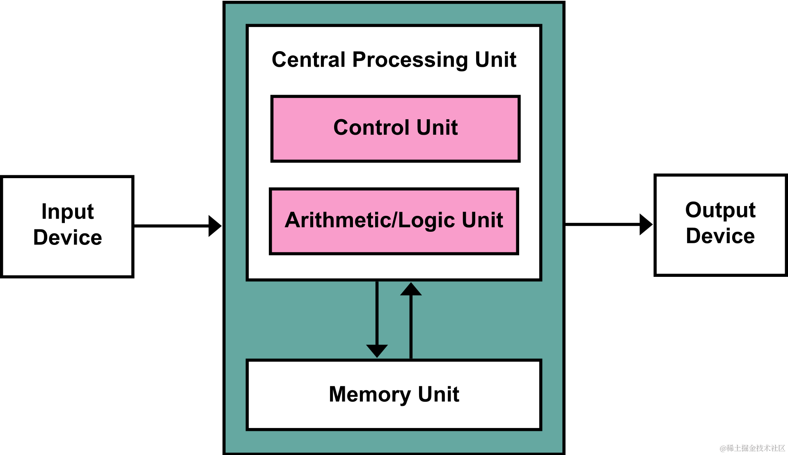

### 下列给出的部件中，其位数一定与机器字长相同是（）

A. ALU 处理的位数

B. 存储单元的位数

C. 总线的位数

D. 指令的位数

**答案A**

要解出这道题，首先需要搞清楚"机器字长"这个概念："机器字长"指CPU一次能处理的二进制位数，一般情况下：

**机器字长=ALU最大能处理位数=通用寄存器（rdi、rsi、rax...）位数**

**此外，计算机CPU内部数据总线宽度可能与机器字长相等（见2010年408真题第43题），但也有可能不相等（见2021年408真题第43题）。**

所以如果清楚这点的话，我们可以轻松地选出A选项。接下来看看另外几个选项：

- 存储单元的位数（B选项）通常指的是内存中每个存储位置可以保存的数据量，与处理器的字长没有直接的必然联系。
- 总线的位数（C选项）决定了总线一次可以传输多少位数据，但其宽度不一定与机器字长相等。
- 指令的位数（D选项）通常指的是指令集中指令的长度，因为要储存操作信息，它一般大于机器字长。一些处理器可能采用定长指令集（RISC），而另一些可能采用不定长指令集（x86_64）。

### 计算题

假定机器 M 的时钟频率为 200MHz，程序 P 在机器 M 上的执行时间为12s。对P优化时，将其所有乘 4 指令都换成了一条左移 2 位的指令，得到优化后的程序P’。若在 M 上乘法指令的 CPI 为 102，左移指令的 CPI 为 2，P 的执行时间是P'执行时间的 1.2 倍，则 P 中的乘法指令条数为多少？

**解：**

由题意，优化程序后，$t_新=10s$。不妨设要求的乘法指令数（也是优化后左移指令数）为$I$。

$t_旧=\frac{(CPI)_{乘法} × I + (CPI)_{other} × I_{other}}{f}$

$t_新=\frac{(CPI)_{左移} × I + (CPI)_{other} × I_{other}}{f}$

联立得$I = 4 × 10^6 条指令$

### 计算题

微机 A 和 B 是采用不同主频的 CPU 芯片，片内逻辑电路完全相同。假设 A 机的 CPU 主频为 8MHz，B 机为 12MHz。现在在这两台机器上运行某程序P，求：

1. 若A机运行程序P的平均指令执行速度为 0.4MIPS，则A机的平均指令周期为多少？
2. 在第1问的基础上，B机的平均指令执行速度为多少？

**解：**

(1)

这道题对于初学者来说主要的难点在于不知道什么是"平均指令周期"。

不过回想一下所学知识，我们学过"平均指令周期数"（cycle per instructions，CPI，平均每一条指令要跑几个时钟周期）。

那么我们就很容易知道$平均指令周期 = CPI × T$，其中$T$表示CPU跑一个时钟周期需要消耗的时间

由MIPS的定义，$MIPS = \frac{I}{(CPI)_A×I×T_A×10^6} = \frac{f_A}{(CPI)_A×10^6} = 0.4$

解出$(CPI)_A = 20$

于是$平均时钟周期 = (CPI)_A × T_A = 2.5 \mathrm{μs}$

(2)

"平均指令执行速度"即为IPS（instructions per second）。

由于A和B的逻辑电路相同，且运行的是同一个程序，有$(CPI)_A = (CPI)_B$

于是$(IPS) = \frac{I}{t} = \frac{I}{(CPI)_B×I×T_B} = \frac{f_B}{(CPI)_B} = 6 × 10^5$

# Part B. 总线

### 下列选项中，可提高同步总线数据传输率的是( )

I.增加总线宽度

II.提高总线工作频率

III.支持突发传输

IV.采用地址/数据线复用

A.仅I、II 　　B.仅I、II、III 　　C.仅III、IV 　　D.I、II、III和IV

**答案选B**

I. 增加总线宽度：总线宽度增加后，每个时钟周期内可以传输的数据量增加，因此可以提高总线的数据传输率。

II. 提高总线工作频率：总线工作频率提高后，每秒钟传输的数据量增加，因此可以提高总线的数据传输率。

III. 支持突发传输：突发传输模式在一次总线仲裁后允许连续传输多个数据块，从而避免了反复向CPU申请总线使用权（甚至申请可能遭到拒绝）和CPU反复进行总线仲裁，因此降低了延时，实现了总线数据传输率的提升。

IV. 采用地址/数据线复用：地址/数据线复用通常是为了减少引脚数量，虽然可以简化电路设计，但可能会导致数据传输时需要分时复用而引入额外的延迟，因此不一定能提高数据传输率，甚至可能降低。

### 请解释一下总线的异步定时（通信）？异步定时的应答方式可以分为哪三种类型？

**答：**

总线定时（总线通信）是指总线在双方交换数据的过程中需要时间上配合关系的控制，这种控制称为总线定时，它的实质是一种协议或规则。

在**异步定时方式**中，**没有统一的时钟**，也**没有固定的时间间隔**，完全依靠传送双方相互制约的“握手”信号来实现定时控制：主设备提出交换信息的“请求”信号，经接口传送到从设备;从设备接到主设备的请求后，通过接口向主设备发出“回答”信号。

根据“请求”和“回答”信号的撤销是否互锁，分为以下3 种类型。

- **不互锁**：主设备"请求"信号和从设备"回答信号"都自动撤销。速度最快，可靠性最差。
- **半互锁**：主设备"请求"信号在接收到从设备"回答信号"后才能撤销。
- **全互锁**：主从设备取消信号都依赖对方的响应。能保证两个工作速度相差很大的部件或设备之间可靠地进行信息交换，但速度较慢。

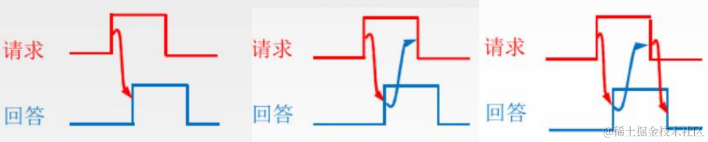

### 常见的集中式总线仲裁有哪几种方式？

**答：**

| 仲裁方式 | 链式查询 | 计数器定时查询 | 独立请求 |
|--|--|--|--|
| **控制线**     | 3  | 2+log2n | 2n |
| **响应速度**   | 慢 | 慢                  | 快 |
| **设备优先级** |固定| 可作适当变化（支持软件控制） | 可作灵活变化（支持软件控制） |
|**故障敏感度**  |非常敏感|不敏感|不敏感|
|**扩展支持度**| 易扩展| 需改变仲裁器逻辑，扩展困难 | 易扩展|

### 在单机系统中采用的三总线结构指的是()

A.数据总线、地址总线和控制总线 

B.系统总线、存储总线和I/O 总线

C.局部总线，系统总线和通信总线 

D.电缆式总线、主板式总线和背板式总线

**答案选B**

这道题很容易因为概念不清淅选A。因此我们必须要搞明白无论是"单总线结构"、"双总线结构"还是"三总线结构"，谈论的都是从组成完整的计算机系统的角度对总线类型进行分类。

对于采用"三总线结构"的计算机系统来说：

-   系统总线(System Bus)：通常指连接CPU和存储总线和I/O总线的**中间总线**，一般**它包含数据总线、地址总线和控制总线**。
-   存储总线(Memory Bus)：特指连接存储器（如RAM、ROM等）的总线，负责数据在存储设备间的传输。
-   I/O总线(Input/Output Bus)：连接各种输入/输出设备，如键盘、鼠标、显示器等，以及通向外部扩展设备的总线。

另外提一下C选项中"通信总线"这个概念：通信总线（外部总线）用于计算机系统之间或计算机系统和其他系统（远程通信设备、测试设备）之间信息传送。

### 单总线结构系统中系统总线中地址总线的作用是( ) 

A.用于选择存储单元 

B.用于选择进行信息传输的设备 

C.用于指定主存单元和 I/O 设备接口电路的地址 

D.用于传送主存物理地址和逻辑地址

**答案选C**

下面解释一下其他选项为什么不选：

- A. 选择存储单元 - 这个说法似乎没问题，但是相对于C选项来说，表述不够完整。地址总线确实用于选择存储单元，但它的用途更广，还包括选择I/O设备。

- B. 用于选择进行信息传输的设备 - 这个描述过于宽泛，虽然选择设备是地址总线的功能之一，但这个选项没有明确指出“进行信息传输”的设备包括存储单元和I/O设备，而且没有明确指出是通过地址来做这个选择。

- D. 用于传送主存物理地址和逻辑地址 - 地址总线无法直接传送逻辑地址（虚拟地址，Virtual Address）。逻辑地址必须通过CPU的MMU部件转换成物理地址，才能供地址总线传送。

# Part C. 存储器

### 某容量为256MB的存储器由若干4M×8位的DRAM芯片构成, 该DRAM芯片的地址引脚和数据引脚总数是( ) 

A. 19 

B. 22 

C. 30 

D. 36

这一题的关键在于抓住题目问的是**有关DRAM芯片的参数**，因此题中"256MB存储器"完全就是一个干扰信息。

存储器芯片的数据引脚数量与其内部一个super cell的比特位数相等，为8个。而存储器芯片内部的super cell的总数为4M，即222 个，又由所学的DRAM芯片内部结构知识知，地址引脚数应为22/2=11个。

**因此答案选A。**

（忘记存储器芯片内部结构的同学可看下图）

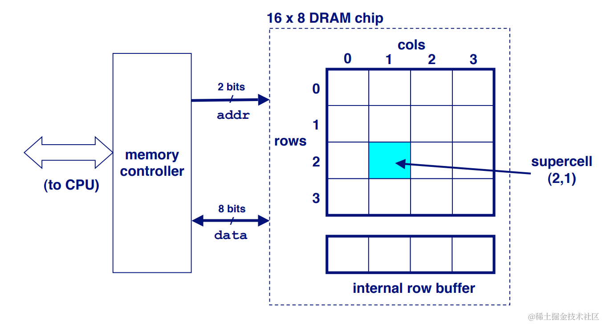

### 在 Cache 和主存构成的两级存储体系中，主存与 Cache 同时访问，Cache 的存取时间是100ns，主存的存取时间是 1000ns，若希望有效(平均)存取时间不超过 Cache 存取时间的115%，则 Cache 的命中率至少应为( )

A.90% 

B.98% 

C.95% 

D.99%

这题最重要的是看懂题目中所谓的"有效(平均)存取时间"其实就是一个加权平均数，之后就是初中数学级别的计算。

假设某一段时间内CPU共执行了m次对内存的存取操作。假如每次Cache都hit，则耗费的存取时间t0=100m . 

设题目所求的Cache命中率为P，则在实际情况下平均存取时间t1=P×100m + (1-P)×1000m .

由题目要求，t1≤1.15t0，解得P>98.333% .

**故答案选D**

### 下列关于多级存储系统的说法中，正确的有( )

I.多级存储系统是为了降低存储成本

II.主存和 Cache 之间的数据调动对应用程序开发人员是透明的

III.CPU 只能与 Cache 直接交换信息，CPU 与主存交换信息需要经过Cache

A. 仅I 

B. 仅I和II

C. I和III 

D. 仅II

I. 该说法正确。通过结合使用高速但昂贵的存储设备（如Cache）和低速但便宜的存储设备（如硬盘），多级存储系统能够在不显著增加成本的情况下提供更好的性能。

II. 该说法正确。数据调动由硬件和操作系统自动管理。

III. 该说法错误。虽然CPU访问主存储器的数据大多数情况下确实是通过Cache进行的，但是这并不意味着CPU不能直接与主存交换信息，或者这种交换必须经过Cache。在某些情况下，CPU可能需要绕过Cache直接访问主存。

**故答案选B.**

其实这题单从应试的角度来说选出正确答案还是比较容易的，但是肯定还有同学对说明III有所疑问。以下是ChatGPT提供的一个具体例子：

> 假设我们有一个实时控制系统，比如用于工业自动化的控制系统。在这种系统中，一个传感器连续监测某个关键参数，例如压力或温度，并将这些数据实时写入主存。为了确保系统的响应时间和数据的实时准确性，CPU在处理这些数据时需要绕过Cache直接从主存中读取最新的监测数据。
> 
> #### 具体实施：
> 
> 1.  **传感器数据写入**：传感器的数据通过一个专用的硬件接口（如DMA控制器）直接写入主存中的特定内存区域。这种写入方式确保数据立即可用，而不会因为Cache的延迟或替换策略而出现旧数据。
> 1.  **CPU访问设置**：为了让CPU直接从主存读取这些数据，相关的内存区域被设置为“非缓存”（Non-cacheable）区域。这意味着当CPU访问这些特定的内存地址时，它将直接与主存进行通信，而不经过Cache。
> 1.  **实时处理**：CPU处理这些数据时的延迟极小，因为它直接访问了存储在主存中的最新数据，从而满足了系统对实时性的要求。
> 
> 通过这种方式，系统可以保证数据的实时性和一致性，避免了Cache可能引入的数据时延和不一致问题。这在控制和实时监测应用中非常关键，尤其是在需要快速响应外部变化的场合。

### 假定用若干2K×4位的芯片组成一个8K×8位的存储器，则地址0B1FH所在芯片的最小地址是( )

A. 0000H 

B. 0600H 

C. 0700H 

D. 0800H

这道题考查对储存器芯片位扩展和字扩展的知识是否理解充分。首先让我们以本题为例来回顾一下：

我们需要先将两片2K×4位芯片位"扩展"成一片形式上的2K×8位芯片，再将4片2K×8位芯片字扩展成8K×8位的存储器。

当存储器工作时，其内部的译码器在接收到CPU要查询的物理地址后，会根据其高位（片选位）激活对应的2K×8位芯片，再将物理地址去除片选位的若干低位作为2K×8芯片内部访存数据的地址传入，以获取目标数据。由于2K×8位芯片的本质是由两片2K×4位芯片位扩展所得，因此它们需要共享传入的地址，分别取出数据（即8位数据的低4位和高4位）并拼接后返回给CPU。

有了上述的基础知识，我们就很容易计算这题的答案了。组成题中存储器的一块形式上的2K×8位芯片的容量为2K个数据单位（在本题中1个数据单位即为8bit），因此第一块芯片在存储器中贡献的地址范围为0x0000\~0x07FF，第二块为0x0800\~0x0FFF，题中的0x0B1F恰好在此范围内，而这个地址范围也是物理上实际组成2K×8位芯片的2片2K×4位芯片的地址范围。

**因此这题答案选D**

### 在一个高速缓存系统中，主存容量为 12MB，Cache 容量为 400KB，则该存储系统的容量为（ ） 

A. 12MB + 400KB 

B. 12MB 

C. 12MB ~ 12MB + 400KB 

D. 12MB - 400KB

这题考查对Cache基本概念的理解。由于Cache本质上只是主存中部分数据在CPU内部的**镜像**，它的存在上在逻辑上讲并不会使得存储系统能存储更多数据。

**因此这题选B**

### 相联存储器是按\_\_\_\_访问的存储器，用于\_\_\_\_场合，其功能全部由\_\_\_\_实现。

这道题考察相联存储器的基本概念。这里比较容易出问题的是第一个空。

我们知道在Cache结构中，想要确定要从哪个Cache Line中取出数据，是通过硬件并发比较每个Cache Line中的Tag Slot（即相联存储器中存储的内容）和要访存的物理地址中对应位是否相等来实现的。

**因此本题的答案为内容、实现高速缓存存储器、硬件**

以下两幅图分别展示了抽象的相联存储器结构，和其用作CPU Cache时的具体实现，可相互比较，帮助理解概念：

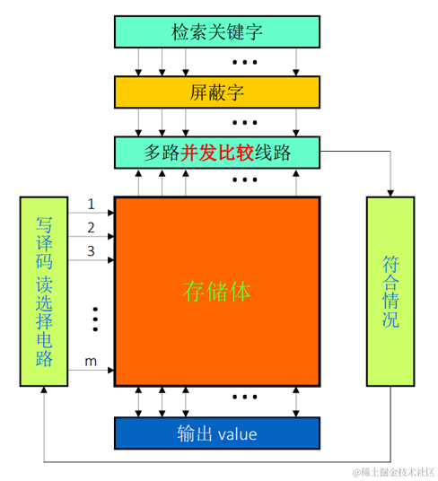

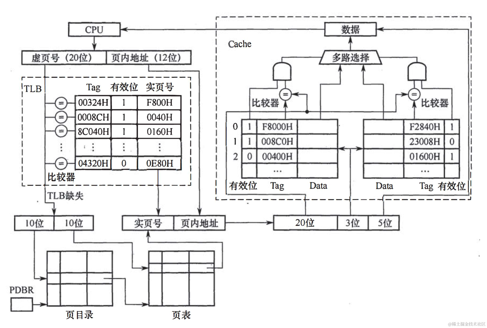

## \_\_\_\_存储器具有两个独立的端口，允许两个独立的控制器同时访问存储单元，但当访问时的\_\_\_\_相同时，会出现读写冲突。

本题考查双端口存储器的基本概念：

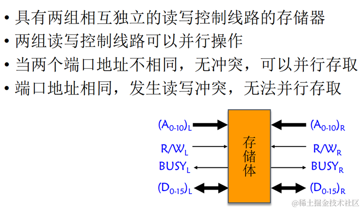

### 已知单个存储体的存储周期为110ns,总线传输周期为 10ns。现将多个这种存储体组织成低位交叉编址的多模块存储器时，从提升流水线效率最大化和降低制造成本的角度考虑，存储体数量应_____.

这道题考察对"低位交叉编址存储器"的理解。

我们知道，一般情况下为了使得多模块存储器中的多个存储体能够形成流水线式的轮流循环工作，应有`单个存储器存储周期 = 存储体数量 × 总线传输周期`，即`存储体数量 = 单个存储体周期 / 总线传输周期`。倘若存储体数量过少，会导致总线出现一段时间的闲置等待；若存储体数量过多，虽然一方面增大了存储器的容量，另一方面整个存储器仍然可以流水线式的状态工作，但一轮循环中较早完成在循环后期会进入闲置等待状态，与题意不符。

因此本题的答案为**存储体数量应等于11**.

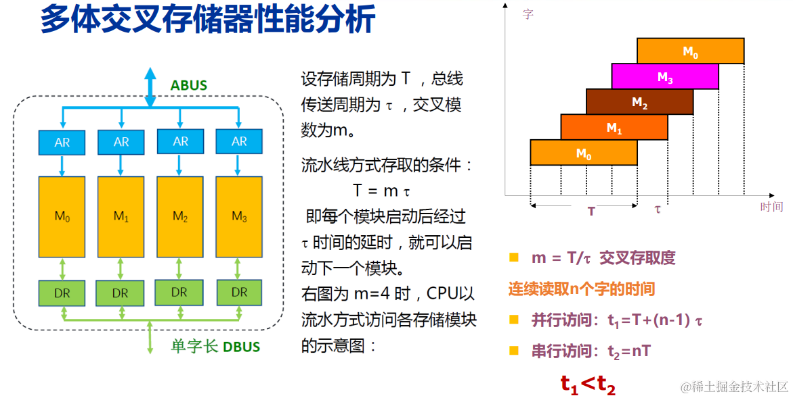

### Cache的写策略有\_\_\_\_策略和\_\_\_\_策略，\_\_\_\_策略没有脏数据， \_\_\_\_策略突发写的速度快。

这道题考查Cache的基本概念。这里比较容易出问题的是第三个空。

对于写回（Write Back）策略来说，当数据发生变化时，系统只在Cache中更新数据，并不立即写入主存，而是等到该缓存行被替换出去时才将其写入主存。因此，写回策略可以避免频繁地和主存进行通信，从而提高了性能。推而广之，我们很容易理解写回策略在突发写入时的速度较快。

本题的答案为**写回（Write Back）、写穿透（Write Through）、写穿透、写回**

### 在SRAM和DRAM中：①谁是破坏性读出？②谁需要刷新？③刷新有哪几种方式？④哪种刷新方式存在死区？

1.  **破坏性读出**：DRAM 在读取数据时是破坏性的，意味着读取过程会破坏存储在单元中的数据，因此需要在读取后重新写入数据以恢复原来的值。而SRAM的读取过程是非破坏性的，读取数据后不会改变存储单元中的信息。

1.  **需要刷新**：DRAM 需要定期刷新以保持其存储的信息。这是因为DRAM使用电容来存储信息，而电容会随时间漏电，如果不定期刷新，信息会丢失。SRAM不需要刷新，因为它使用晶体管来存储信息，只要电源保持开启，信息就会保持。

1.  **刷新有哪几种方式**：DRAM的刷新主要有三种方式：

    -   **集中刷新**：在数据丢失之前集中刷新所有行，无论存储单元是否需要刷新。**用在实时要求不高的场合。**
    -   **分散刷新**：读写某行+刷新某行，各刷新周期分散安排在存取周期中。**效率较低，用在低速系统中。**
    -   **异步刷新**：每隔一段时间，或根据特定需要，才刷新一次特定的行，**最常用**。

1.  **哪种刷新方式存在死区**：所谓“死区”，指的是在刷新操作进行时，**内存不能响应CPU的读写请求的时间段。全局刷新方式最可能导致死区，因为整个内存都在刷新过程中，无法进行其他操作。** 行刷新和异步刷新通过局部化刷新操作来减少对性能的影响，尤其是异步刷新，它能够最小化死区的出现，因为只有极少部分的内存单元在任何给定时刻被刷新。

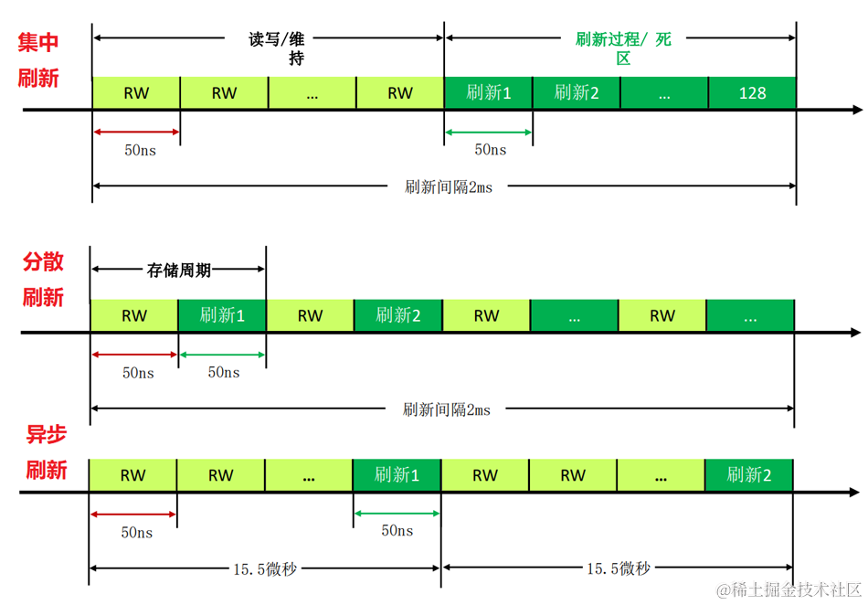

### 计算题

某 32 位计算机，CPU 地址总线 36 位，数据总线 32 位，存储器**按字编址**。请回答下列问题。

(1) 该机最大主存容量为多少字节?

(2) CPU 中的 MAR 和 MDR 分别为多少位?

(3) 现有若干个`1Mx4位`的DRAM芯片，用于形成该机`512M*32位`的RAM存储区域，共需要多少片 DRAM芯片？如何通过位扩展和字扩展实现该RAM存储区域？

**(1)解：**

$最大主存容量 = 2^{36}字 = 2^{36} × 4B = 256GB$

**(2)解：**

MAR位数与地址总线一致，共36bit.

MDR位数与数据总线一致，共32bit.

**(3)解：**

共需$\frac{512M × 32}{1M × 4} = 4096$片DRAM芯片.

先将8块`1Mx4位`DRAM芯片通过位扩展组合成1个`1M×32位`的DRAM芯片组，再将512个这样的DRAM芯片组通过字扩展组合成所求的RAM存储区域.

### 电路设计题

设某计算机系统的CPU有16根地址线，8根数据线，并用MREQ做访存信号（低电平有效），用WE作为读写控制信号。已知该计算机系统主存地址空间分配：6000H\~67FFH为系统程序区，6800H\~6BFFH为用户程序区。

现有下列存储芯片若干:1K×4位RAM，4K×8位RAM、8K×8位RAM、2K×8位ROM，4K×8位 ROM，8K×8位ROM、74LS138译码器、各种门电路。

请从中选择合适的芯片，画出 CPU 与存储器的连接图。

**解：**

由题意，该计算机系统按字节（8位）编址.

要为ROM区（即系统程序区）分配内存空间0x67FF - 0x6000 + 1 = 0x0800 Byte = 2048 Byte = 2KB . 因此我们选取1片2K×8位ROM芯片作为ROM区.

要为RAM区（即用户程序区）分配内存空间0x6BFF - 0x6800 + 1 = 0x0400 Byte = 1024 Byte = 1KB . 因此我们选取2片1K×4位RAM通过**位扩展**组成RAM区.

为了实现储存器内部的片选功能，我们需要使用74LS138译码器，进一步地我们知道，我们需要从CPU提供的16位地址信号中确定出3位作为片选信号。

下面为了确定片选信号，我们将ROM区和RAM区的地址范围写作二进制的形式：

ROM区：01**10 0**000 0000 0000 \~ 01**10 0**111 1111 1111

RAM区：01**10 1**000 0000 0000 \~ 01**10 1**011 1111 1111

通过对输入信号的分析，我们发现输入地址中A11~A13恰好具备区分ROM区和RAM区的功能，故我们选其作为片选信号。

最后完成电路图连线即可：

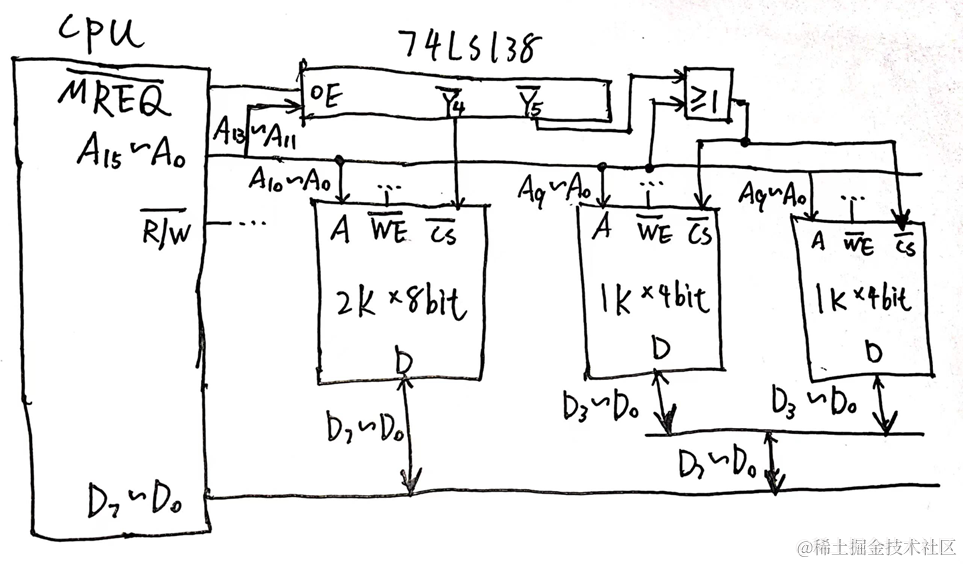

### 数组A[-1:9, 1:11]中,每个元素的长度为32位,从首地址S开始连续存放在主存储器中,主存储器字长为16位。

(1)存放该数组需要多少单元?

(2)存放该数组第 4 列所有元素至少需要多少单元?

(3)数组**按行存放**时,元素A[7][4]的起始地址是多少?

(4)数组**按列存放**时,元素 A[4][7]的起始地址是多少?

**(1) 解:**

由题意该数组可视作长宽都为11个元素的矩阵，其容量为32 × 11 × 11 bit

主存储器字长与存储器内部一个单元的大小相等，故存放该数组需要32 × 11 × 11 bit / 16 bit = 242 个存储单元.

**(2) 解:**

该数组一列有11个元素，因此存放一列所需的单元数32 × 11 bit / 16 bit = 22 个存储单元.

**(3) 解:**

由于A数组的下标并不是常规的C语言中从0开始计数的数组下标，一个重要的应试技巧是我们这里需要先进行一下变换——即在标准C语言中，题中所谓的`A[7][4]`实际上应表示为`A[8][3]`.

于是`&A[8][3] = S + (一行的宽度 × 8 + 3 × 一个元素的宽度) / (16bit) = S + (32 × 11 × 8 bit + 3 × 32 bit) / (16bit) = S + 182`

注意，这里之所以我们需要除掉16bit，是因为根据题意该存储器以16bit为一个单位进行编址，所以经过这样的换算之后我们才能得到正确的地址。

**(4) 解:**

将`A[4][7]`变换为标准的C语言表示形式，得到`A[5][6]`.

于是`&A[5][6] = S + (6 × 一列的宽度 + 5 × 一个元素的宽度) = S + (6 × 11 × 32 + 5 × 32 bit) / (16bit) = S + 142`

### 计算题

硬磁盘共有`4`个记录面，存储区城内半径为`10cm`，外半径为`15.5cm`，记录面道密度为`60道/cm`，平均道位密度为`600bit/cm`，转速为`6000 转/分`. 

1. 硬磁盘的磁道总数是多少? 

2. 硬磁盘的非格式化容量是多少? 

3. 假定每个扇区的容量为512B，每个磁道有12个扇区，寻道的平均等待时间为10.5ms，试计算磁盘平均存取时间。

**(1) 解:**

1个记录面共有磁道(15.5cm - 10cm) *  60道/cm

故4个记录面共有磁道4 * (15.5cm - 10cm) *  60道/cm = 1320道

**(2) 解:**

一条道的容量2 * 3.14 * 15.5cm * 75B/cm = 7300B

磁盘总容量1320 * 7300 = 9636000B

**(3) 解:**

由题意，盘片旋转一圈需要花费的时间t转=60s/6000=1s/100=10ms

假设平均情况下盘片旋转的时间为t转/2

硬盘以扇区为单位存取数据，磁头转过一个扇区的时间大约为t转/12

所求时间t=t寻道 + t转/2 + t转/12 = 16.33ms

### 计算题

一个直接映射的 Cache 有 128 个字块，主机内存包含 16K 个字块，每个块有16 个字，访问 Cache 的时间是 10ns，填充一个 Cache 字块的时间是 200 ns，Cache 的初始状态为空。

(1)如果按字寻址，请定义主存地址字段格式，给出各字段的位宽。 

(2)CPU 从主存中依次读取位置 16~210 的字，循环读取 10 次，则访问Cache 的命中率是多少? 

(3)10 次循环中，CPU平均每次循环要花费多少读取数据的时间?

**(1)解：**

对于基于直接映射的Cache，主存地址可划分为tag、index、offset三部分。

对于offset，由题意每个cache block的大小为16个字，故offset的宽度应为4bit。

对于index，由题意整个cache系统共包含128个cache block，故index的宽度应为7bit。

对于tag，由题意整个主存空间的大小为$16K × 16 = 2 ^ {18}字$，即主存地址宽度应为18bit，因此tag段的大小应为18-4-7=7bit。

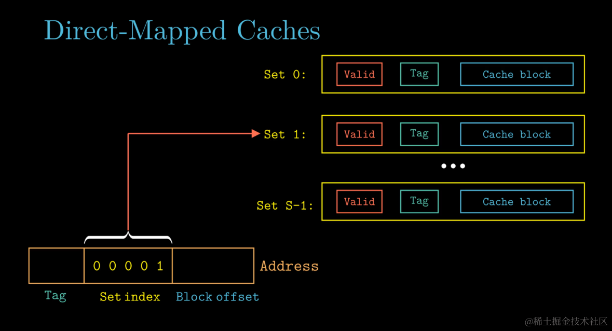

**(2)解：**

先分析一下访存过程中哪些block会被搬到cache中。

由题意，访存的地址范围为16~210（单位为"字"），而每个block的大小为16字，因此访问block的范围为$\lfloor \frac{16}{16} \rfloor = 1$到$\lfloor \frac{210}{16} \rfloor = 13$，总共13个block。

而题目已经告诉我们整一套cache系统的容量为128个block，因此在访存过程中可以装下所有被访问到的主存block，也就是说访问地址范围为16~210的主存一次之后，接下来再重复就一定能保证cache hit.

由上述分析，首轮访存时会发生13次cache miss，之后所有的主存块被搬入cache中，接下去的9轮访存中全部发生cache hit，故$命中率 = \frac{(210-16+1)×10-13}{(210-16+1)×10} = 99.33\%$

**(3)解：**

在十轮访存的过程中，每次需要访问cache共$(210-16+1) × 10=1950次$。同时在整个过程中，会发生13次cache miss导致系统需要将主存块搬入cache中，这部分的开销为$13 × 200 = 2600 ns$

因此平均每轮访存的耗时为$\frac{1950×10 + 2600}{10} = 2210ns$.

### 计算题

某高级语言语句`for(i=0;i<N;i++) sum=sum+a[i];`，其中`N=100`，假定数组a中每个元素都是 int 类型，依次连续存放在首地址为`0x00000800`的内存区域中，`sizeof(int)=4`。运行上述代码的处理器带有一个数据区容量为`64KB`的 data cache，其主存块大小为`256B`，采用直接映射、随机替换和写穿策略(Write Thrugh)；可寻址的最大主存地址空间为`4GB`，配置的主存容量为`2GB`，按字节编址。

请回答下列问题。

(1)主存地址至少占几位?

(2)data cache 共有多少行?主存地址如何划分?

(3)数组 a 占用几个主存块?所存放的主存块号分别是什么?

(4)在访问数组 a 的过程中数据的缺失率为多少?

**(1)解：**

由题意，可寻址的最大主存空间为$4GB = 2^{32}B$，因此主存地址的宽度至少应为32bit.

**(2)解：**

$Cache Line行数 = \frac{64KB}{256B} = 256行$

主存地址划分为tag、index、offset三部分，offset占8bit，index占8bit，tag占32-8-8=16bit.

**(3)解：**

由于数组a的首地址为0x800，0x800 % 256 = 0，即数组首地址已按主存块大小对齐。

数组a占用的总大小400B，于是可直接算出占用的主存块数目$\lceil \frac{400}{256} \rceil = 2$，且占用的主存块为第8块和第9块。

**注意理清题意，这里题目问的是数组元素占用主存中的哪些主存块里，不是问主存中的数据会被储存在哪个Cache Line里，要小心不要混淆概念了。**

**(4)解：**

首先根据题意知道，整套cache可容纳256个block，而数组总共只占2个block，因此不会发生cache line不够用而冲突的问题。

在访问整个数组中100个元素的过程中，会发生2次cache miss，$缺失率=\frac{2}{100} = 2\%$.

### 计算题

某计算机有64KB的主存和1KB的Cache，Cache每组2块，每块64字节，存储系统按组相联方式工作。 请回答下列问题。 

(1) 设计主存地址格式。 

(2) 若Cache原来是空的，CPU以字节为单位依次从`0`号地址单元顺序访问到`1029`号单元，再按此顺序重复访问存储器`5`次，页面替换采用先进先出算法。请计算Cache-主存系统的命中率。

(3) 接第(2)问，若访问Cache的时间为`20ns`，访问主存的时间为`200ns`，计算Cache-主存系统的平均访问时间、访问效率。

**(1)解：**

主存地址分为tag, set index, offset三部分。

- cache block的大小为64B，故offset段的宽度为6bit.
- 整套cache共有$\frac {1KB}{2×64B} = 2^3组$，故set index段的宽度为3bit.
- 主存空间共有$2^{16}B$，因此主存地址宽度为16bit，tag段的宽度为16-6-3=7bit.

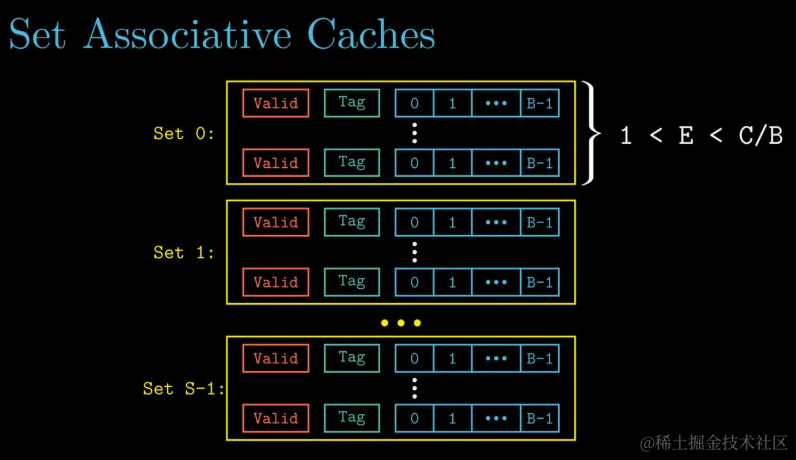

**(2)解：**

下面先分析一下cache miss和cache line的替换情况。

第一轮循环时：

- 访问第0~1023号，会引发$\frac{1024B}{64B}=16次$cache miss，而后整套cache全部被装满.
- 访问第1024\~1029号，会引发1次cache miss，而后由"先进先出"规则，装有第0\~63号单元数据的cache line被替换.

第二轮循环时：

- 访问第0~63号，会引发1次cache miss，而后由"先进先出"规则，装有第64\~127号单元数据的cache line被替换.
- 访问第64\~127号，会引发1次cache miss，装有第128\~191号单元数据的cache line被替换.
- ...
- 访问第896\~959号，会引发1次cache miss，装有第960\~1023号数据单元的cache line被替换.
- 访问第960\~1023号，会引发1次cache miss，装有第1024\~1029号数据单元的cache line被替换.
- 访问第1024\~1029号，会引发1次cache miss，装有第0\~63号单元数据的cache line被替换.

第二轮循环时：
- ...

可以看到，在"先进先出"机制的作用下，在每一轮循环的过程中，总要引发17次cache miss，因此$命中率=\frac{1029 × 5 - 5 × 17}{1029 × 5} = 98.35\%$.

**(3)解：**

$平均访问时间 = \frac{17 × 220 + (1029 - 17) × 20}{1029} = 23.30ns$

$访问效率 = \frac{访问cache耗时}{平均访问时间} = \frac{20}{23.30} = 85.83\%$

# Part D. 数据的表示

### 设$[x]_{补}=1.x_{1}x_{2}x_{3}x_{4}$，当满足（）时，有$x < -\frac{1}{2}$成立.

A. $x_{1}$必须为$1$，$x_{2}, x_{3}, x_{4}$中至少有一个为$1$.

B. $x_{1}$必须为$1$，$x_{2}, x_{3}, x_{4}$任意.

C. $x_{1}$必须为$0$，$x_{2}, x_{3}, x_{4}$中至少有一个为$1$.

D. $x_{1}$必须为$0$，$x_{2}, x_{3}, x_{4}$任意.

**答案选D**

本题考查对补码性质的熟悉程度。

在补码系统中，有一个重要的性质——对于某个负数的补码编码，遮住它的符号位不看，则补码编码的剩余部分代表的无符号整数值越小，则原先的这个负数也相应地越小。例如对于八位整型来说，$(-128)_{10}=(10000000)_{2}$,$(-64)_{10}=(11000000)_{2}$,$(-1)_{10}=(11111111)_{2}$,相应地有$-128<-64<-1$.

对于这个性质仍然感到困惑的同学，可以回忆一下移码的定义，再思考一下为什么可以这么定义。

回到本题，由于题目要求$x < -\frac{1}{2}$，而$[-\frac{1}{2}]_{补}=1.1000$，因此只需要确保$(x_{1}x_{2}x_{3}x_{4})_{2} < (1000)_{2}$，于是乎可以快速选出正确答案。

### 计算题

[X]补=0.1101   [Y]补=1.1101   用Booth算法求[X]补×[Y]补

**答案：**

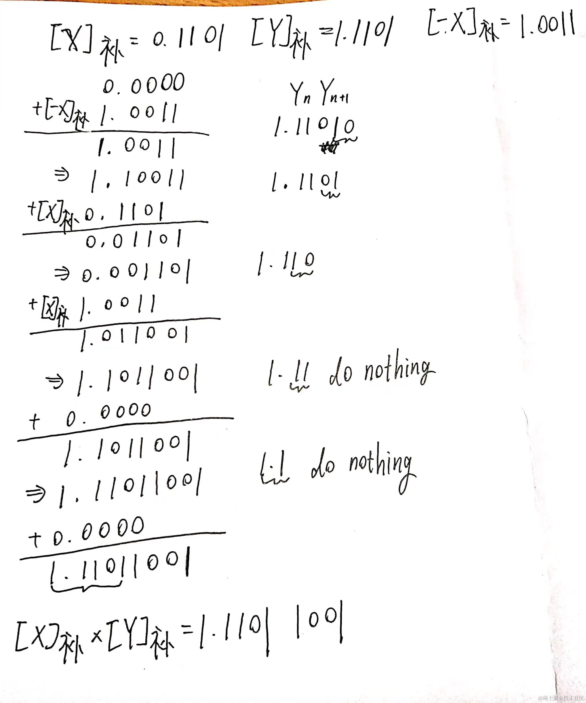

### 计算题

X=0.1001   Y=0.1011   用加减交替法求 X÷Y

**答案：**

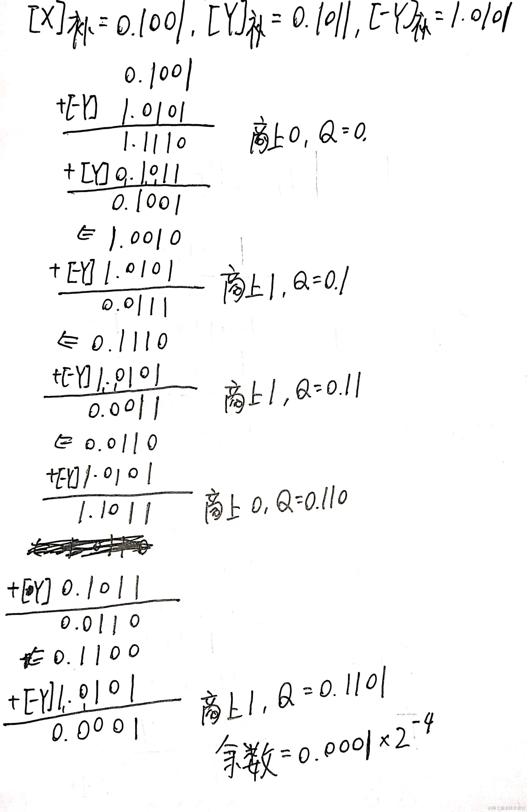

### 计算题

两浮点数 x = 2101×0.11011011，y = 2111×(-0.10101100)。尾数用12位变型补码表示，包含2位符号位；阶码以5位变型补码表示，包含2位符号位，求 x + y。

**答案：**

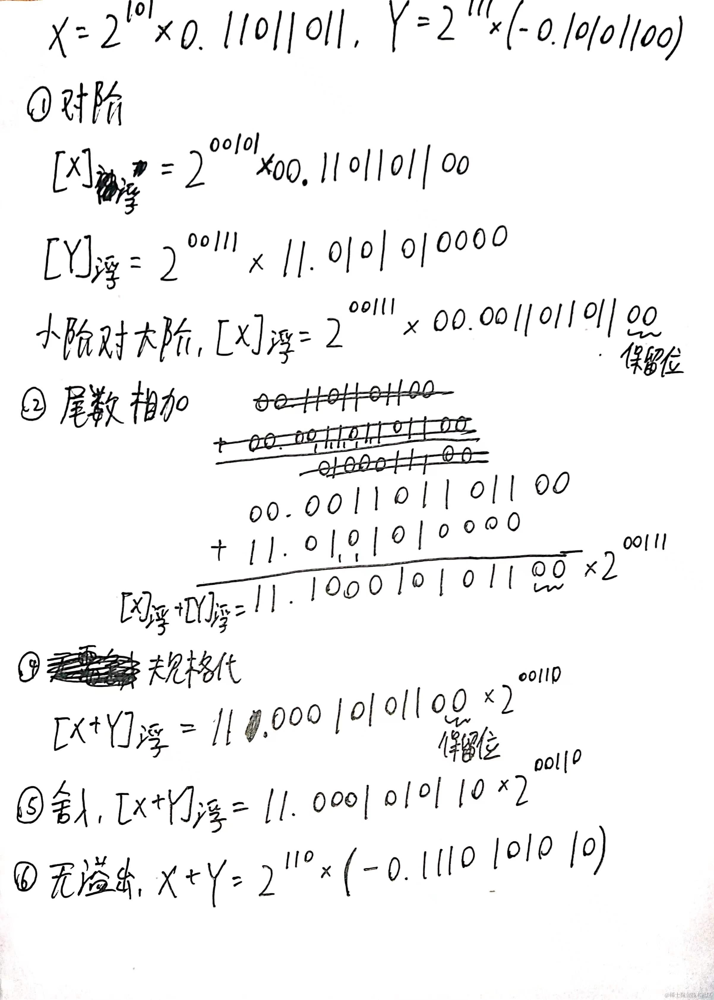

### 假设现在要传输4位有效信息1100，计算下列问题：

（1）求循环校验码（CRC），生成多项式选用1101.

（2）假定没有3位错，求能纠正1位错误并同时能够识别另外的2位错的海明校验码.

**（1）解:**

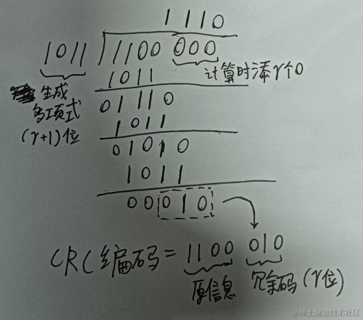

**（2）解:**

海明不等式$m+r+1≤2^r$，其中$m$表示待传输的信息位数，$r$表示海明校验位的位数，求得$r_{min}=3$。但若直接取$r=3$进行编码，最多只能检测1位错误，并同时纠正另外的1位错误。若需满足题中检测2位错误，并同时纠正另外的1位错误的需求（此为海明码纠错检错能力的极限），需要再引入一个全局奇(偶)校验位。因此所求海明码的长度应为4+3+1=8位。

设所求海明码为$H_{1}H_{2} \dots H_{8}$，则：

首先编排待传输信息，$H_{3}=1, H_{5}=1, H_{6}=0, H_{7}=0$.

再计算各个校验位，

$H_{1} = H_{3} ⊕ H_{5} ⊕ H_{7} = 0$，

$H_{2} = H_{3} ⊕ H_{6} ⊕ H_{7} = 1$，

$H_{4} = H_{5} ⊕ H_{6} ⊕ H_{7} = 1$，

全局奇偶校验位$H_{8} = H_{1} ⊕ H_{2} ⊕ \dots ⊕ H_{7} = 0$，

故所求海明码为$01111000$.

关于更详细的海明码纠错检错能力分析，请参考https://blog.csdn.net/CharmingSun/article/details/114473221

# Part E. 指令系统

### 某计算机按字节编址，指令字长固定且只有两种指令格式，其中三地址指令29条，二地址指令107条，每个地址字段为6位，则指令字长至少应该是(   )。

A.44位

B.26位

C.28位

D.32位

设三地址指令中OP字段的长度为$r$，则为了保证二地址指令能凑够107条，有$(2^r - 29) × 2^6 ≥ 107$.

解得$r ≥ 5$，即指令字长≥23. 又由于该计算机按字节编址，指令字长必须是8bit的倍数，因此**本题答案选D**.

### 某计算机采用16位定长指令字格式，操作码位数和寻址方式位数固定，指令系统有48条指令，支持直接、间接、立即、相对4种寻址方式。**单地址指令中**，直接寻址方式的可寻址范围是(    )。

A. 0~255

B. 0~1023

C. -128~127

D. -512~511

本题需要注意的点在于分析指令字长的结构时，不要漏掉表示寻址方式的字段。

由题意，在单地址指令中，操作码字段占6bit，寻址方式字段占2bit，剩下的8bit储存目标地址（直接寻址方式下目标地址不可能为负数），故**本题答案选A**.

### 单地址指令为了完成两个数据的算术运算，除地址指明的一个操作数外，另一个操作数采用(    )寻址方式。

A.堆栈

B.立即

C.隐含

D.间接

本题可用排除法。

- A选项中所谓的堆栈寻址主要用于函数的调用与返回（x86基于运行时栈实现函数返回地址的保存和针对通用寄存器的保护现场），或者表达式求值（Python等基于栈虚拟机的编程语言），与题意不符。
- 由于题目中指明了"单地址指令"，可排除B和D。
- C选项中所谓的"隐含寻址"指的是，在单地址指令中，一个操作数通过指令中的地址字段指明，另一个操作数通常是隐含在指令中的寄存器（如累加器）中，符合题意。

**故本题应选C。**

### 立即寻址是指( )。

A.指令中直接给出操作数地址

B.指令中直接给出操作数

C.指令中间接给出操作数

D.指令中间接给出操作数地址

-   **立即寻址**：指令中包含了实际要操作的数值（操作数），无需再通过任何地址去内存中获取数据。
-   **直接寻址**：指令中包含了操作数所在的内存地址，通过该地址可以找到操作数。
-   **间接寻址**：指令中包含一个地址，该地址对应的内存单元中储存着指向另一个内存单元的地址，实际操作数存储在该单元中。
-   **隐含寻址**：指令隐含使用某个固定的寄存器或特定位置的操作数。

**故本题答案选B**

### 某机器字长为16位，主存按字节编址，转移指令采用相对寻址，由2字节组成，第一字节为操作码字段，第二字节为相对位移量字段。假定取指令时，每取一个字节PC自动加1。

若某转移指令所在的主存地址为2002H，相对位移量字段的内容为06H，则转移指令成功转移后的目标地址为多少？

**解：**

由于每取出一个字节PC就要加1，而该指令包含2个字节，因此在计算时别忘了加2。

答案 = 2002H + 2H + 06H = **200AH**

### 设某指令系统指令字长16位，每个地址码为6位。若要求设计二地址指令15条、一地址指令34条，那么最多还可设计多少条零地址指令？

$$((2^4 - 15) × 2^6 - 34) × 2^6 = 1920条$$

### 一台字长16位的计算机，有16个寄存器，主存容量为8M。该计算机具有无操作数、单操作数、双操作数三类指令,其中无操作数指令10个,单操作数指令20个,双操作数指令8个。假设该计算机指令的操作码位宽固定，试问：

**(1)操作码的位宽应是多少?** 

**(2)RS型双操作数间接寻址所允许的最大寻址空间大小是多少?**

**(1) 解：**

注意这题中"操作码位宽固定"，因此本题直接计算即可，无需像""进行分析。

$2^r ≥ 38 ⇒ r = 6$

**(2) 解：**

这题首先要看懂题目，"RS型"指的是双操作数指令中一个操作数为寄存器（register）编号，另一个操作数为存储器（storage）的地址。

对于寄存器间接寻址，由于寄存器的位宽为16bit（等于机器字长），因此可间接寻址到的地址空间大小为2^16=64K.

该指令中用于内存间接寻址的内存宽度为16-6-4=6bit，该地址指向的内存单元中存放着真正数据的地址。由于题目中没有任何附加条件，我们默认假定该计算机的存储字长与机器字长一致，且在间址周期内从主存中读取的实际地址长度最宽为存储字长，即16bit。因此通过内存间接寻址可达的最大寻址空间大小仍然为64K.

综上所述，所求最大寻址空间为64K.

# Part F. 中央处理器

### 通用寄存器是( )

A.可存放指令的寄存器                  

B.可存放程序状态字的寄存器

C.本身具有计数逻辑与移位逻辑的寄存器  

D.可编程指定多种功能的寄存器

- IR寄存器存放指令。排除A。
- CPU中有专门的寄存器来存放程序状态字（Program Status Word, PSW）。PSW的内容包括ZF、CF等condition code、CPU属于用户态还是内核态、CPU当前处于开中断状态还是关中断状态等。排除B。
- C选项描述的是计数器（比如PC寄存器自带计数逻辑）或移位寄存器。而通用寄存器主要用于多种用途的数据存储和处理，不一定具备特定的计数或移位逻辑。排除C。
- 通用寄存器在计算机系统中可以用于存储各种类型的数据，包括操作数、临时结果、地址等。在使用高级语言编程时，通用寄存器的具体用途是依赖编译器的寄存器分配方案而定的，因而可以说它能够在编程时灵活指定用途。

**本题答案选D。**

### 间址周期结束时，CPU内寄存器MDR中的内容为()

A.指令

B.操作数地址

C.操作数

D.无法确定

在某些体系结构的处理器中，在取指周期（Fetch Cycle）结束后会有一个间址周期（Indirect Cycle）。用于根据间接寻址指令中提供的地址，通过访问内存找到目的操作数的实际地址，以便在接下来的执行周期（Execute Cycle）中进行运算。而在访存时，访存所得的内容会被放入MDR（Memory Data Register）中，因此**本题答案选B**。

> 间址周期的微操作可表示如下：
>
> t1: MAR <- (IR(Address)) 
> 
> t2: MBR <- Memory 
> 
> t3: IR(Address) <- (MBR(Address))

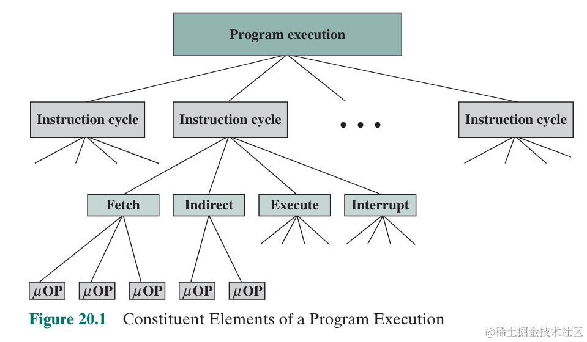

### 下列部件不属于控制器的是()

A.指令寄存器      

B.程序计数器        

C.程序状态字寄存器 （PSW Register）

D.时序电路

本题考查CPU中控制器部件的基本概念。CPU控制器的基本功能总结如下：

- 操作控制：CPU不断地从内存中取出指令存入IR指令寄存器并进行译码（由instruction decode unit实现），再根据译码结果生成控制信号驱动计算机中各个部件运行，达到指令执行的效果。
- 程序控制：CPU内部维护PC程序计数器，确保用户程序能够按照顺序正确执行。
- 时序控制：CPU通过内部的时序信号产生器，控制驱动不同计算机部件的信号的产生时机以及持续时长。
- 异常控制：CPU通过内部的interrupt controller，正确处理外部设备发出的中断请求，以及CPU内部产生的异常（内中断）。

对照上述的CPU控制器的概念，发现程序状态字寄存器与实现CPU控制器基本功能最没有关系，应该不属于控制器部件，**本题选C**。