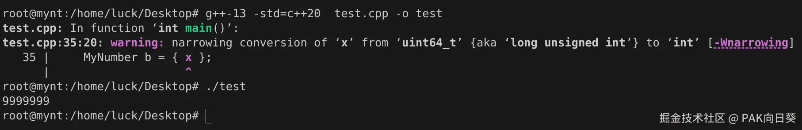

截至C++11标准，该语言中共有三种主要的创建对象的方式，分别为*List Initialization*, *Direct Initialization*和*Copy Initialization*。

# 似乎没啥差别？

乍看上去，似乎很难想到它们之间的区别是什么，比如下面这个例子：

```C++
#include <iostream>

class MyNumber {
private:
    int value;
public:
    MyNumber(int v) : value(v) {}
    void printValue() const {
        std::cout << value << std::endl;
    }
};

int main() {
    MyNumber a = { 1 };  // List Initialization
                         // 亦可写作MyNumber a { 1 };
    MyNumber b(2);       // Direct Initialization
    MyNumber c = 3;      // Copy Initialization
    a.printValue();      // 1
    b.printValue();      // 2
    c.printValue();      // 3
}
```

查看MSVC调试模式下生成的汇编代码，可知这三种初始化方式的行为在这里的确是一致的：

```assembler
    MyNumber a = { 1 };  // List Initialization
00007FF674B31A1E  mov         edx,1  
00007FF674B31A23  lea         rcx,[a]  
00007FF674B31A27  call        MyNumber::MyNumber (07FF674B313A2h)  
00007FF674B31A2C  nop  
    MyNumber b(2);       // Direct Initialization
00007FF674B31A2D  mov         edx,2  
00007FF674B31A32  lea         rcx,[b]  
00007FF674B31A36  call        MyNumber::MyNumber (07FF674B313A2h)  
00007FF674B31A3B  nop  
    MyNumber c = 3;      // Copy Initialization
00007FF674B31A3C  mov         edx,3  
00007FF674B31A41  lea         rcx,[c]  
00007FF674B31A45  call        MyNumber::MyNumber (07FF674B313A2h)  
00007FF674B31A4A  nop
```

但事情肯定没这么简单，不然我也不会写这篇博客了。下面我将对这三种初始化方式的特点逐一进行分析。

# List Initialization

采用列表初始化，与我们的直觉一样，编译器会优先尝试直接使用构造函数初始化对象。

这种方法的特色在于，其禁止**窄化转换**（收缩转换，*narrowing conversion*）。这意味着它会防止潜在的数据丢失或精度问题。例如，试图将 double 转换为 int 会产生编译错误，而不是进行隐式的截断。

因此以下的代码在MSVC上就无法被编译：

```C++
// 错误C2398 : 从“double”转换为“int”需要收缩转换
MyNumber a = { 1.1 };

uint64_t x = 9999999;
// 错误C2398 : 从“uint64_t”转换为“int”需要收缩转换
MyNumber b = { x };
```

需要注意的是，事实上在这里不同编译器的实现是有所差异的。例如上边的第二段代码在g++-13上就只会抛出一个警告，但仍然能通过编译：



应该要理解的是，编译器在处理构造对象的代码时，在考虑潜在的隐式转换，会首先遍历所有程序员自定义的构造函数，看看是否有类型直接对应的构造函数可以选用。只有在没有找到直接可用的构造函数，编译器才会考虑对传入参数进行隐式类型转换。

因此下面的代码就可以正确通过编译和运行：

```C++
#include <iostream>

class MyNumberPlus {
private:
    int value;
public:
    MyNumberPlus(int v) : value(v) {
        std::cout << "Here is MyNumberPlus(int v)" << std::endl;
    }
    MyNumberPlus(double v) : value(v) {
        std::cout << "Here is MyNumberPlus(double v)" << std::endl;
    }
    void printValue() const {
        std::cout << value << std::endl;
    }
};

int main() {
    double x = 3.14;
    int y = 2024;
    MyNumberPlus a = { x }; // 输出Here is MyNumberPlus(double v)
    MyNumberPlus b = { y }; // 输出Here is MyNumberPlus(int v)
    a.printValue();         // 输出3
    b.printValue();         // 输出2024
}
```

**编译器的这个选取构造函数的原则，对Direct Initialization和Copy Initialization同样适用！！！！！**

# Direct Initialization

相比列表初始化，直接初始化更宽松，它允许隐式类型转换。比如，如果构造函数需要 int，但提供了 double，则编译器可能会自动进行类型转换，而不会抛出错误。

对于下面的例子，在MSVC上就能通过编译，虽然编译器仍然会抛出一个警告：

```C++
double x = 3.14
// 警告 C4244 : 从“double”转换到“int”，可能丢失数据
MyNumber a(x);
// 输出3
a.printValue();  
```

查看汇编代码可知，在这种情况下编译器确实会手工调用`cvttsd2si`指令，对需要窄化转换的浮点数进行截断操作：

```assembler
    double x = 3.14;
00007FF764A61AFE  movsd       xmm0,mmword ptr [__real@40091eb851eb851f (07FF764A6ABB0h)]  
00007FF764A61B06  movsd       mmword ptr [x],xmm0  
    MyNumber a(x);
00007FF764A61B0B  cvttsd2si   eax,mmword ptr [x]  
00007FF764A61B10  mov         edx,eax  
00007FF764A61B12  lea         rcx,[a]  
00007FF764A61B16  call        MyNumber::MyNumber (07FF764A6146Fh)  
00007FF764A61B1B  nop
```

# Copy Initialization

对于复制初始化，一种用法就是我们上面所展示的`MyNumber c = 3`，即如果构造函数只需要接收一个参数的话，那么我们就可以直接用一个等号的形式把参数传递给构造函数。这是很容易理解的。

此外，复制初始化还有一种非常常用的方式，就是"创建一个新对象，并将某个已有对象的成员变量一键拷贝给这个新对象"。

比如下面这个例子：

```C++
class Point {
private:
    double x, y;
public:
    Point(double x, double y) : x(x), y(y) {}
    void print() const {
        std::cout << "(" << x << ", " << y << ")" << std::endl;
    }
};

int main() {
    Point p1(1, 2);
    Point p2 = p1;  // Copy Initialization
    p1.print();     // 输出(1, 2)
    p2.print();     // 输出(1, 2)
}
```

这段代码由MSVC生成的汇编代码为：

```assembler
    Point p1(1.0, 2.0);
00007FF65414660F  movsd       xmm2,mmword ptr [__real@4000000000000000 (07FF65414ACA8h)]  
00007FF654146617  movsd       xmm1,mmword ptr [__real@3ff0000000000000 (07FF65414AC98h)]  
00007FF65414661F  lea         rcx,[p1]  
00007FF654146623  call        Point::Point (07FF65414150Ah)  
00007FF654146628  nop  
    Point p2 = p1;  // Copy Initialization
00007FF654146629  lea         rax,[p2]  
00007FF65414662D  lea         rcx,[p1]  
00007FF654146631  mov         rdi,rax  
00007FF654146634  mov         rsi,rcx  
00007FF654146637  mov         ecx,10h  
00007FF65414663C  rep movs    byte ptr [rdi],byte ptr [rsi]
```

阅读分析这段汇编代码可知，程序会从栈上`p1`变量的首地址起，批量拷贝`ecx=0x10=16`个字节，到以栈上`p2`变量首地址为开头的内存区域处，而16个字节又恰好为一个`Point`对象要在内存中占用的大小。也就是说，**通过Copy Initialization可以将一个已存在的C++对象中的内容，一键拷贝给一个新创建的同类型对象**。

当然，有时候我们会有更精细的拷贝需求，比如某对象中有一个指向buffer的指针，我们希望在使用Copy Initialization创建新对象时，能够把指针指向的那个buffer也拷贝一份给新对象，即所谓的**深拷贝**。

显然，编译器提供的Copy Initialization实现只支持简单的**浅拷贝**。因此**拷贝构造函数**就孕育而生了——它允许程序员自定义拷贝初始化新对象的过程！

```C++
class Point {
private:
    double x, y;
public:
    Point(double x, double y) : x(x), y(y) {}
    Point(const Point& p) {
        x = p.x;
        y = p.y;
    }
    void print() const {
        std::cout << "(" << x << ", " << y << ")" << std::endl;
    }
};

int main() {
    Point p1(1.0, 2.0);
    Point p2 = p1;  // Copy Initialization
    p1.print();     // 输出(1, 2)
    p2.print();     // 输出(1, 2)
}
```

其对应的汇编代码如下。可以看到在存在程序员自定义的拷贝构造函数的情况下，编译器不会再自动生成批量拷贝代码，而是会在执行拷贝构造时直接跳转到程序员自定义的拷贝构造函数来做进一步处理：

    Point(const Point& p) {
    ...
            x = p.x;
    00007FF7B5431BF2  mov         rax,qword ptr [this]  
    00007FF7B5431BF6  mov         rcx,qword ptr [p]  
    00007FF7B5431BFA  movsd       xmm0,mmword ptr [rcx]  
    00007FF7B5431BFE  movsd       mmword ptr [rax],xmm0  
            y = p.y;
    00007FF7B5431C02  mov         rax,qword ptr [this]  
    00007FF7B5431C06  mov         rcx,qword ptr [p]  
    00007FF7B5431C0A  movsd       xmm0,mmword ptr [rcx+8]  
    00007FF7B5431C0F  movsd       mmword ptr [rax+8],xmm0  
    ...
    }

    int main() {
    ...
        Point p2 = p1;  // Copy Initialization
    00007FF7B5432158  lea         rdx,[rbp]  
    00007FF7B543215C  lea         rcx,[p2]  
    00007FF7B5432160  call        Point::Point (07FF7B54311F4h)  
    00007FF7B5432165  nop
    ...
    }

# 补充：Move Initialization

既然提到了拷贝构造，那我们就顺带着来聊一下移动构造。

在某些情况下，特别是针对一些内部buffer存储了大量数据的、位于堆栈上的c++对象，当它生命周期结束即将被回收时，我们往往需要将它内部的buffer数据转移给其他对象来继续进行管理。

对于这种需求，程序员通过自定义拷贝构造函数显然可以满足需求，不过效率却很低！一种更加聪明且符合人类直觉的方法是，直接将原对象中管理的buffer等数据的"控制权"，转交给某一个新对象，不就完事了嘛。这就是移动构造函数产生的背景。

下面的例子展示了c++中移动构造函数的基本用法：

```C++
#include <iostream>

using namespace std;

class DynamicArray {
private:
    int* data;
    size_t size;
public:
    DynamicArray(size_t size) : size(size), data(new int[size]) {
        cout << "Constructor called!" << endl;
    }
    DynamicArray(DynamicArray&& other) noexcept : data(other.data), size(other.size) {
        other.data = nullptr;
        other.size = 0;
        cout << "Move constructor called!" << endl;
    }
    ~DynamicArray() {
        delete[] data;
    }

    size_t getSize() const {
        return size;
    }
    const int* getBuffer() const {
        return data;
    }
};

int main() {
    DynamicArray ar1(5);
    cout << "ar1.size=" << ar1.getSize() << endl;
    cout << "ar1.data=" << ar1.getBuffer() << endl;

    DynamicArray ar2 = std::move(ar1);
    cout << "ar1.size=" << ar1.getSize() << endl;
    cout << "ar1.data=" << ar1.getBuffer() << endl;
    cout << "ar2.size=" << ar2.getSize() << endl;
    cout << "ar2.data=" << ar2.getBuffer() << endl;

    return 0;
}
```

这段代码在我的电脑上某一次运行的结果如下：

```text
    Constructor called!
    ar1.size=5
    ar1.data=000001AF8C846480
    Move constructor called!
    ar1.size=0
    ar1.data=0000000000000000
    ar2.size=5
    ar2.data=000001AF8C846480
```

可以看到，借助移动构造函数`DynamicArray(DynamicArray&& other)`，原对象`ar1`中的数据被成功转交给了`ar2`。而`ar1`由于不再享有对这些数据的"控制权"，因此在移动构造函数中，它的`int* data`和`size_t size`也要作相应的修改。

让我们最后再来看一眼这段程序的汇编代码：

```assembler
int main() {
00007FF7AFAC5360  push        rbp  
00007FF7AFAC5362  sub         rsp,0A0h  
00007FF7AFAC5369  lea         rbp,[rsp+20h]  
    DynamicArray ar1(5);
00007FF7AFAC536E  mov         edx,5  
00007FF7AFAC5373  lea         rcx,[rbp]  
00007FF7AFAC5377  call        DynamicArray::DynamicArray (07FF7AFAC1438h)  
00007FF7AFAC537C  nop  
    DynamicArray ar2 = std::move(ar1);
00007FF7AFAC537D  lea         rdx,[rbp]  
00007FF7AFAC5381  lea         rcx,[ar2]  
00007FF7AFAC5385  call        DynamicArray::DynamicArray (07FF7AFAC1451h)  
00007FF7AFAC538A  nop
...
}
```

可以看到，**`std::move`这个模板函数在机器指令的层面上并不会做任何事情**。它在这里的职责只不过是在编译阶段提示编译器，让编译器选用移动构造函数`DynamicArray(DynamicArray&& other)`来初始化对象`ar2`。
