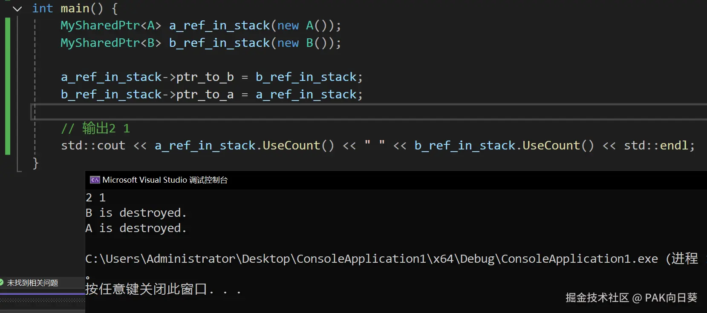

# 基本框架

共享指针的基本框架是非常简单的，啪啪啪几下就能敲好。

唯独需要注意的几点：

*   引用计数本身并不是共享指针的一个成员变量，而是在堆上进行维护。共享指针只持有一个指向引用计数的指针。
*   考虑到移动赋值/移动构造后，源共享指针会失去对共享资源的引用，`ref_cnt_`相应地也会变成`nullptr`。所以在代码每次尝试访问`ref_cnt_`时，都应特别小心，以防其已变成空指针。

```C++
template<typename T>
class MySharedPtr {
 private:
     T* ptr_;
     uint64_t* ref_cnt_;

     void Release() {
         if (ref_cnt_ != nullptr && --(*ref_cnt_) <= 0) {
             if (ptr_) delete ptr_;
             delete ref_cnt_;
         }
     }

 public:

     friend class MyWeakPtr<T>;
     
     MySharedPtr() : ptr_(nullptr), ref_cnt_(nullptr) {}

     explicit MySharedPtr(T* ptr) : ptr_(ptr), ref_cnt_(nullptr) {
         if (ptr_) ref_cnt_ = new uint64_t(1);
     }

     MySharedPtr(const MySharedPtr& other) : ptr_(other.ptr_), ref_cnt_(other.ref_cnt_) {
         if (ref_cnt_) ++(*ref_cnt_);
     }

     MySharedPtr(MySharedPtr&& other) noexcept : ptr_(other.ptr_), ref_cnt_(other.ref_cnt_) {
         other.ptr_ = other.ref_cnt_ = nullptr;
     }

     ~MySharedPtr() {
         Release();
     }

     uint64_t UseCount() const {
         return ref_cnt_ ? *ref_cnt_ : 0;
     }

     MySharedPtr& operator=(const MySharedPtr& other) {
         if (this != &other) {
             Release();  // Release the old pointer I owned.
             ptr_ = other.ptr_;
             ref_cnt_ = other.ref_cnt_;
             if (ref_cnt_) ++(*ref_cnt_);
         }
         return *this;
     }

     MySharedPtr& operator=(MySharedPtr&& other) noexcept {
         if (this != &other) {
             ptr_ = other.ptr_;
             ref_cnt_ = other.ref_cnt_;
             other.ptr_ = other.ref_cnt_ = nullptr;
         }
     }

     T* Get() const {
         return ptr_;
     }

     T* operator->() const {
         return ptr_;
     }

     T& operator*() const {
         return *ptr_;
     }

     explicit operator bool() {
         return ptr_ != nullptr;
     }
};
```

# 循环引用问题

循环引用问题是我们在学习`std::shared_ptr`时绕不开的问题。

对于我们刚才手写的共享智能指针，不难构造出如下的实例：

```C++
class A;
class B;

class A {
public:
    MySharedPtr<B> ptr_to_b;
    A() {}
    ~A() {
        std::cout << "A is destroyed." << std::endl;
    }
};

class B {
public:
    MySharedPtr<A> ptr_to_a;
    B() {}
    ~B() {
        std::cout << "B is destroyed." << std::endl;
    }
};

int main() {
    MySharedPtr<A> a_ref_in_stack(new A());
    MySharedPtr<B> b_ref_in_stack(new B());

    a_ref_in_stack->ptr_to_b = b_ref_in_stack;
    b_ref_in_stack->ptr_to_a = a_ref_in_stack;

    // 输出2 2
    std::cout << a_ref_in_stack.UseCount() << " " << b_ref_in_stack.UseCount() << std::endl;
}
```

对于上述代码中的，分配在堆内存中的A对象来说，有两个共享智能指针持有对它的引用，分别是位于栈上的`a_ref_in_stack`（`main`函数退出后会自动析构并释放引用），以及同样位居堆内存中的B对象的`ptr_to_a`。B对象亦是同理。

由于A对象需要等到B对象放弃对其的引用（即B对象被释放，其中的`ptr_to_a`智能指针被析构）才能被释放，而B对象也需要等到A对象放弃对其的引用才能被释放，于是就造成了死锁，最终的结果是双方都不会被释放。

不同于CPython、QuickJS等基于引用计数GC的虚拟机，C++ STL库中并没有提供可以解开循环引用的算法，而是又引入了一个新的概念来回避循环引用的问题。

# 弱引用Weak Ptr

为了回避循环引用的问题，C++中又引入了一个叫`std::weak_ptr`（弱引用）的玩意。

从所有权语义上来讲，我们假设对象A持有对另外一个对象B的弱引用，那么这仅仅表示**对象A可以访问到对象B**，但**并不意味着对象A拥有对象B**。换句话说，**对象A并没有对于对象B只有使用权，而没有所有权**。

现在让我们更进一步：按这套逻辑，既然对象A并不拥有对象B，那么对象B什么时候被释放自然也就不关对象A什么事啦。

落实到`std::weak_ptr`的执行效果，当对象A通过这种类型的智能指针建立对B的弱引用后：

*   针对B对象的引用计数就不会发生自增。
*   弱引用指针没有任何权利来决定何时释放对象B。
*   弱引用智能指针仅有权访问B对象，或观测B对象的引用计数是否归零（即是否已经被释放）。

于是乎C++就通过引入新概念的方式，把循环引用的问题给回避掉了。

如果你还是觉得这比较抽象，可以再看看下面几个例子：

> 一个公司类可以拥有员工，那么这些员工就使用std::shared\_ptr维护。另外有时候我们希望员工也能找到他的公司，所以员工类中也需要一个对公司实例的引用指针。由于员工并不拥有公司，所以应该用std::weak\_ptr来维护对公司的指针。

> 我们要使用异步方式执行一系列的Task，并且Task执行完毕后获取最后的结果。所以发起Task的一方和异步执行Task的一方都需要拥有Task。但是有时候，我们还想去了解一个Task的执行状态，比如每10秒看看进度如何，这种时候也许我们会将Task放到一个链表中做监控。这里需要注意的是，这个监控链表并不应该拥有Task本身，放到链表中的Task的生命周期不应该被一个观察者修改。所以这个时候就需要用到std::weak\_ptr来安全的访问Task对象了。

下面我们也来手写一个简单的Weak Ptr类：

```C++
template<typename T>
class MyWeakPtr {
private:
    T* ptr_;
    uint64_t* ref_cnt_;

public:

    MyWeakPtr() : ptr_(nullptr), ref_cnt_(nullptr) {}

    explicit MyWeakPtr(const MySharedPtr<T>& shared_ref)
        : ptr_(shared_ref.ptr_), ref_cnt_(shared_ref.ref_cnt_) {}

    MyWeakPtr(const MyWeakPtr& other)
        : ptr_(other.ptr_), ref_cnt_(other.ref_cnt_) {}

    ~MyWeakPtr() {}

    uint64_t UseCount() const {
        return ref_cnt_ ? *ref_cnt_ : 0;
    }

    MyWeakPtr& operator=(const MyWeakPtr& other) {
        ptr_ = other.ptr_;
        ref_cnt_ = other.ref_cnt_;
    }

    MyWeakPtr& operator=(const MySharedPtr<T>& other) {
        ptr_ = other.ptr_;
        ref_cnt_ = other.ref_cnt_;
        return *this;
    }

    // 判断弱引用的目标对象是否已被释放
    bool Expired() const {
        return UseCount() == 0;
    }

    // 将弱引用提升为一般引用
    MySharedPtr<T> lock() const {
        MySharedPtr<T> ret;
        if (ref_cnt_ && *ref_cnt_) {
            ret.ptr_ = ptr_;
            ret.ref_cnt_ = ref_cnt_;
        }
        return ret;
    }

    T* Get() const {
        return ptr_;
    }

    T* operator->() const {
        return ptr_;
    }

    T& operator*() const {
        return *ptr_;
    }

    explicit operator bool() {
        return ptr_ != nullptr;
    }
};
```

由于`MyWeakPtr`中需要访问`MySharedPtr`对象中的私有成员，因此我们要将前者设置为后者的友元，并在后者之前提前给出前者的定义：

```C++
template<typename T>
class MyWeakPtr;

template<typename T>
class MySharedPtr {
 private:
     // ...

 public:

     friend class MyWeakPtr<T>;
     
     // ...
}
```

最后，让我们把A对B的引用修改成弱引用：

```C++
class A {
public:
    MyWeakPtr<B> ptr_to_b;
    A() {}
    ~A() {
        std::cout << "A is destroyed." << std::endl;
    }
};
```

再次运行测试，应该能够看到A和B对象都能够被成功释放了：



> 读到这里相信你也注意到了，在实践中要使用弱引用时，我们必须首先搞清楚谁对谁应该持有弱引用，谁又该对谁持有一般的强引用。而这是与我们具体的代码逻辑密切相关的！
