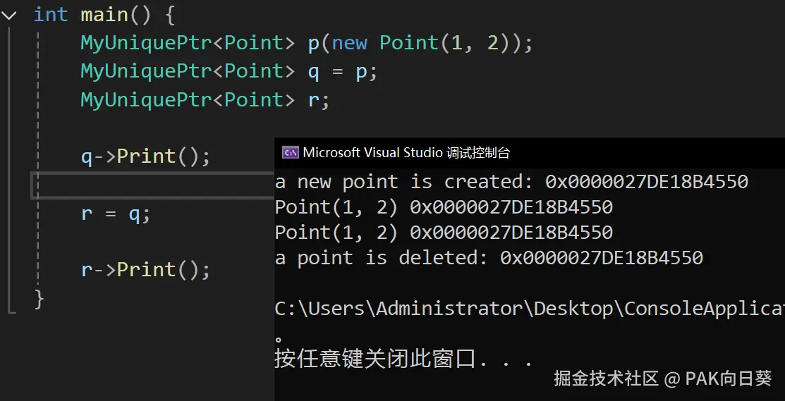

我们先写一个简单的`MyUniquePtr`类，它可以实现最基本的"裸指针所有权转移"。以及我们测试智能指针用的测试类`Point`：

```C++
class Point {
 private:
     int x_, y_;
 
 public:
     Point(int x, int y) : x_(x), y_(y) {
         std::cout << "a new point is created: 0x" << this << std::endl;
     }

     ~Point() {
         std::cout << "a point is deleted: 0x" << this << std::endl;
     }

     void Print() const {
         std::cout << "Point(" << x_ << ", " << y_ << ") 0x" << this << std::endl;
     }
};
```

```C++
template <typename T>
class MyUniquePtr {
 private:
     T* ptr_;

 public:
    MyUniquePtr() : ptr_(nullptr) {}

    explicit MyUniquePtr(T* ptr) : ptr_(ptr) {}

    MyUniquePtr(MyUniquePtr& other) : ptr_(nullptr) {
        Reset(other.Release());
    }

    ~MyUniquePtr() {
        Reset();
    }

    // Reset语义：
    // 释放持有裸指针所指向的内存，并使智能指针管理另外一个裸指针。
    void Reset(T* new_ptr = nullptr) {
        // 简单起见，我们这里直接认为new_ptr和原ptr相等是非法操作。
        assert(ptr_ == nullptr || ptr_ != new_ptr);

        if (ptr_) {
            delete ptr_;
        }
        ptr_ = new_ptr;
    }

    // Relase语义：
    // 放弃智能指针对其所持有裸指针的控制权，但不会释放该裸指针所指向的内存
    T* Release() {
        T* old_ptr = ptr_;
        ptr_ = nullptr;
        return old_ptr;
    }

    MyUniquePtr& operator=(MyUniquePtr& other) {
        Reset(other.Release());
        return *this;
    }
};
```

接下来，我们重载一下`*`和`->`运算符，让`MyUniquePtr`的行为看上去更像一个指针：

```C++
    T& operator*() const {
        return *ptr_;
    }

    T* operator->() const {
        return ptr_;
    }
```

现在一切看上去都很不错，写个代码测试一下：


不过真的就这么简单？其实不然，虽然我们重载了`MyUniquePtr`的拷贝构造函数和赋值函数，看似实现了"对裸指针控制权进行转移"的需求，但这种方式可能会使得我们程序的行为看上去十分令人困惑。

这是因为拷贝构造（赋值）函数的**语义**是**从源对象中复制一份数据给新对象**，因此从常理上来说我们不应该去变更源对象的任何属性。

例如下面这个令人困惑的例子：

```C++
void DoSomething(MyUniquePtr<Point> q) {
    q->Print();
}

int main() {
    MyUniquePtr<Point> p(new Point(1, 2));
    DoSomething(p);
    p->Print();  // Crash!!!
}
```

从代码语义上来讲，我们显然期望`DoSomething`函数中的智能指针q是`main`函数中p的一个副本（当然这是unique智能指针在功能定义上所不允许的），然而事实却是q夺走了p所管理的裸指针的控制权，并在`DoSomething`函数退出后直接释放掉了该裸指针所指向的内存。

> 这也是早期C++标准中`std::auto_ptr`所存在的比较严重的问题。现在该智能指针已经从语言标准中被移除了。

于是乎，重载拷贝构造（赋值）函数的方法肯定是不能用了。为了从根本上避免造成混乱，我们这里就直接把它们给禁用掉：

```C++
MyUniquePtr(MyUniquePtr&) = delete;
MyUniquePtr& operator=(MyUniquePtr&) = delete;
```

但同时我们又需要实现"转移裸指针"控制权的需求，因此就借助C++的移动构造函数和移动赋值函数来取而代之：

```C++
MyUniquePtr(MyUniquePtr&& other) noexcept : ptr_(nullptr)  {
    Reset(other.Release());
}

MyUniquePtr& operator=(MyUniquePtr&& other) noexcept {
    Reset(other.Release());
    return *this;
}
```

经过如上修改之后，我们在转移对裸指针控制权时，代码就可以写成这样：

```C++
// 这里我们并不希望夺取传入智能指针的控制权，只想通过它来访问真正的对象。
// 因此这里直接写一个引用就行了。
void DoSomething(MyUniquePtr<Point>& p) {
    p->Print();
}

int main() {
    MyUniquePtr<Point> p(new Point(1, 2));
    MyUniquePtr<Point> q = std::move(p);
    MyUniquePtr<Point> r;

    q->Print();

    r = std::move(q);
    r->Print();

    DoSomething(r);
}
```

我们实现的智能指针也可以被放到容器中进行管理，这是没有任何问题的：

```C++
int main() {
    MyUniquePtr<Point> a(new Point(3, 4));
    MyUniquePtr<Point> b(new Point(5, 6));
    std::vector<MyUniquePtr<Point>> vec;
    vec.push_back(std::move(a));
    vec.push_back(std::move(b));

    for (const auto& ptr : vec) {
        ptr->Print();
    }
}
```

从代码语义上来看，**移动语义**表示的是**将自己的资源转让给别人，而不是复制一份给别人**。对应到我们的智能指针，我们所希望实现的需求是**将自己对裸指针的控制权转让给别人**，符合移动语义。由此可见这里我们的修改方案是合理的，同时这也是C++标准中`std::unique_ptr`所采用的方案。

到这里我们手写的`std::unique_ptr`已经基本完成了。还有一些细节可以进一步完善一下。

比如我们可以添加一个用于获取智能指针所管理的裸指针的工具方法：

```C++
    T* Get() const {
        return ptr_;
    }
```

又比如，我们可以重载将智能指针对象显式转换为布尔值的函数。

```C++
    explicit operator bool() const {
        return ptr_ != nullptr;
    }
```

这让我们的智能指针的行为看上去更像一个普通的裸指针：

```C++
int main() {
    MyUniquePtr<Point> p(new Point(1, 2));
    p.Reset();
    // if语句(以及三目表达式)具备显式将对象转换为布尔值的功能！
    if (p) {
        std::cout << "p isn't nullptr." << std::endl;
    }
    else {
        std::cout << "p is nullptr." << std::endl; // 输出这里！
    }
}
```

最终的完成代码如下：

```C++
template <typename T>
class MyUniquePtr {
 private:
     T* ptr_;

 public:
    MyUniquePtr() : ptr_(nullptr) {}

    explicit MyUniquePtr(T* ptr) : ptr_(ptr) {}

    MyUniquePtr(const MyUniquePtr&) = delete;

    MyUniquePtr(MyUniquePtr&& other) noexcept : ptr_(nullptr)  {
        Reset(other.Release());
    }

    ~MyUniquePtr() {
        Reset();
    }

    // Reset语义：
    // 释放持有裸指针所指向的内存，并使智能指针管理另外一个裸指针。
    void Reset(T* new_ptr = nullptr) {
        // 简单起见，我们这里直接认为new_ptr和原ptr相等是非法操作。
        assert(ptr_ == nullptr || ptr_ != new_ptr);

        if (ptr_) {
            delete ptr_;
        }
        ptr_ = new_ptr;
    }

    // Relase语义：
    // 放弃智能指针对其所持有裸指针的控制权，但不会释放该裸指针所指向的内存
    T* Release() {
        T* old_ptr = ptr_;
        ptr_ = nullptr;
        return old_ptr;
    }

    T* Get() const {
        return ptr_;
    }

    T& operator*() const {
        return *ptr_;
    }

    T* operator->() const {
        return ptr_;
    }

    MyUniquePtr& operator=(const MyUniquePtr&) = delete;

    MyUniquePtr& operator=(MyUniquePtr&& other) noexcept {
        Reset(other.Release());
        return *this;
    }

    explicit operator bool() const {
        return ptr_ != nullptr;
    }
};
```
