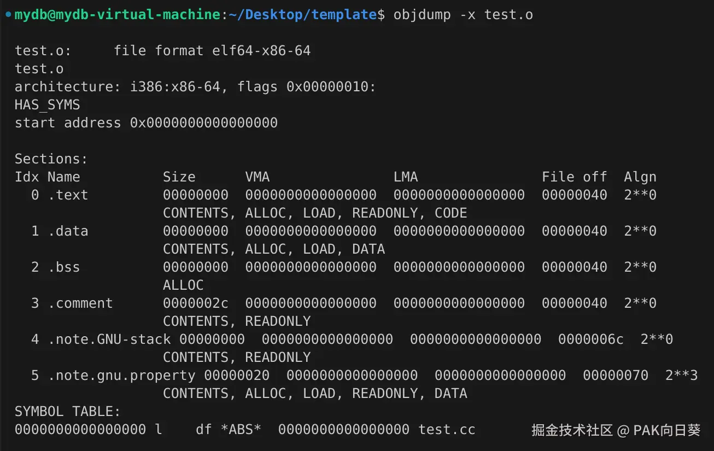

# 热身：从一个链接问题看函数模板的本质

## 抛出问题

假设我们有一个`main.cc`，其代码内容如下：

```C++
template <typename T>
T add(T a, T b);

int main() {
    int a = 1;
    int b = 2;
    int c = add(a, b);
}

template <typename T>
T add(T a, T b) {
    return a + b;
}
```

毫无疑问，这段代码肯定是能够编译成功和运行的。

现在，我们将`add`模板函数的实现源码移动到另外一个文件`test.cc`中，并尝试用g++分别编译这两个代码文件，并链接成一个完整的可执行文件。你觉得这能成功吗？

很遗憾，我们在链接的这一步失败了：


为什么会这样呢？

## 解开困惑

我们先检查一下`main.o`的反汇编代码。可以看到在`main`函数中会尝试调用另外一个函数，很显然它应该就是我们所关心的`add`函数。但该函数的偏移地址（在`0x25`处）却为空，说明在`main.cc`中应该是没有关于该函数的实现代码的，需要在链接阶段从其他.o文件中找到该函数的实现代码，并重新确定此处的函数偏移地址。


`main.o`中的符号表和待链接符号信息也印证了这一点：


这里我们还可以用c++filt（GNU Binutils中的一个工具），来解码这个g++编译器生成的函数签名：


由此可见g++编译器对`main.cc`的处理是完全符合我们的直觉和预期的：在`main`函数中调用`int add<int>(int, int)`这个模板实例化之后得到的函数。但由于模板函数在该cc文件中只有声明却没有定义，因此`int add<int>(int, int)`这个函数需要在编译阶段才能被找到。

现在让我们把目光转向`test.o`。按我们的直觉和预期，我们应该期望能够在该文件中找到`int add<int>(int, int)`这个模板实例化后的函数的代码。

然而现实是残酷的：



`test.o`的代码段空空如也，符号表中也没有任何函数签名，说明编译器在生成`test.o`时压根没对模板函数进行实例化。

现在我们再来看看编译器为一开始那段代码所生成的.o文件。从图中可见，在编译阶段虽然函数调用的偏移地址还无法确定，但模板实例`int add<int>(int, int)`的代码已经被成功生成了。


接下来，经过链接器处理，函数偏移地址被最终确定下来，并被填充到call指令所在的地方：


## 另一种解决方案

除了强行将函数模板的定义和使用该模板实例的程序代码放置在一起（或者，至少你应该将前者完整地写进头文件里，然后让后者引用）这种做法，C++中还提供了一种让程序员显式地要求编译器进行模板实例化的功能。

例如，我们可以将`test.cc`修改如下：

```C++
template <typename T>
T add(T a, T b) {
    return a + b;
}

// 强制要求编译器在生成test.o时进行模板实例化
template int add<int>(int, int);
```

现在你再试试看编译和链接，应该就不会报错了。

## 总结

总结一下这个热身问题带给我们的结论：

函数模板的本质是在**编译阶段**，根据程序代码中提供的类型信息，对函数模板进行实例化（即生成一份特定的汇编代码，用来处理特定的类型）。

# 重学：函数模板

## 函数模板的重载问题

C++中的函数模板机制具有高度的灵活性，但这样同时也会导致许多令人困惑的现象。

这部分内容我建议你只作简单了解，而没有记忆C++编译器处理函数模板重载详细规则的必要。你只需要在阅读别人代码并碰到类似坑点的时候，知道可能需要往这个方向排查就行了。

### 函数模板与函数模板重载

看个例子感受一下：

```C++
#include <iostream>

// Template 1
template <typename T>
T add(T a, T b) {
    std::cout << "I'm template 1." << std::endl;
    return a + b;
}

// Template 2
template <typename T1, typename T2>
T1 add(T1 a, T2 b) {
    std::cout << "I'm template 2." << std::endl;
    return a + b;
}

int main() {
    int a = 1;
    double b = 3.14;
	
    // Example 1
    // Compile Error: no instance of function template "add" matches the argument list
    // std::cout << add(a,b) << std::endl;
	
    // Example 2
    // Output: I'm template 2.
    std::cout << add<int>(a, b) << std::endl;

    // Example 3
    // Output: I'm template 1.
    std::cout << add<int>(b, a) << std::endl;
}
```

Example1无法通过编译，这没什么好说的了吧，而Example2/3就令人有些困惑了。

Example2的道理在于template2中的T2会被自动推导成double，因此相比于template1的实例会少掉一次对实参的类型转换。编译器认为这样是更合理的。

而Example3就显得比较匪夷所思了，因为无论选择template1还是2，都需要对第一个实参进行一次类型转换，看上去没啥差别。。。

由此可见，C++中的函数模板重载机制是非常容易造成困惑和混乱的，我们在实际开发中应该尽量避免使用。即使要用，也应该隐式地实例化模板函数，至少这么做能够保证让C++编译器选择它认为最适合的那个模板（一般是需要对实参类型转换最少的那个）。

### 函数模板与普通函数重载

如下例子：

```C++
#include <iostream>

double add(int a, double b) {
    std::cout << "I'm normal function." << std::endl;
    return a + b;
}

// Template 1
template <typename T>
T add(T a, T b) {
    std::cout << "I'm template 1." << std::endl;
    return a + b;
}

// Template 2
template <typename T1, typename T2>
T1 add(T1 a, T2 b) {
    std::cout << "I'm template 2." << std::endl;
    return a + b;
}

int main() {
    int a = 1;
    double b = 3.14;
	
    // Example 4
    // Output: I'm normal function.
    std::cout << add(a, b) << std::endl;
}
```

可以看到当有普通函数和函数模板都符合函数调用语句的传参时，编译器会优先选择普通函数。不采用函数模板是因为函数模板的实例化需要额外的编译时间，并且还会增加编译产物代码段的大小。

## 模板特化

在函数模板的使用中，有时候会有一些通用模板处理不了的情况，除了定义普通函数外，我们还可以借助特化模板来解决。虽然普通函数看上去，但有些场景下是必须使用特化模板的。

它的形式如下：

1.  template后直接跟 <> ，里面不写类型
2.  在函数名后跟 <> ，其中写出要特化的类型

实例：

```C++
#include <iostream>
#include <cstring>
#include <memory>

// Template 1
template <typename T>
T add(T a, T b) {
    std::cout << "I'm template 1." << std::endl;
    return a + b;
}

// Template 2
template <>
const char* add<const char*>(const char* s1, const char* s2) {
    char* ret = new char[strlen(s1) + strlen(s2) + 1]();
    strcat(ret, s1);
    strcat(ret, s2);
    return ret;
}

int main() {
    // Example 5
    auto str = add("Hello", " World");
    puts(str);
}
```

需要指出的是，**使用模板特化前，必须要先有基础的函数模板**。例如上例中的template2是对基础函数模板template1的特化。如果我们将上例中template1的代码删除，则是无法通过编译的（虽然编译器事实上并不会生成任何有关template1的代码指令）。

下面我们来看看特化模板和普通函数之间的优先级谁更高？

```C++
#include <iostream>
#include <cstring>
#include <memory>

// Template 1
template <typename T>
T add(T a, T b) {
    std::cout << "I'm template 1." << std::endl;
    return a + b;
}

// Template 2
template <>
const char* add<const char*>(const char* s1, const char* s2) {
    char* ret = new char[strlen(s1) + strlen(s2) + 1]();
    strcat(ret, s1);
    strcat(ret, s2);

    std::cout << "I'm specialized template." << std::endl;

    return ret;
}

const char* add(const char* s1, const char* s2) {
    char* ret = new char[strlen(s1) + strlen(s2) + 1]();
    strcat(ret, s1);
    strcat(ret, s2);

    std::cout << "I'm normal function." << std::endl;

    return ret;
}

int main() {
    // Example 6
    // Output: I'm normal function.
    auto str = add("Hello", " World");
    puts(str);
}
```

于是乎，我们得出结论，当三者都可供选择时，从优先级上讲：**普通函数 > 特化模板函数 > 一般函数模板**

## 模板参数

模板参数列表中可以填写两大类参数：

*   类型参数：代指某种数据类型
*   非类型参数：需要是整型数据（char/short/int/long/size\_t等），不允许
    是浮点型（float/double等）

类似于函数形参列表的默认值，模板参数列表中也可以为这两大类参数设置默认值。

如果某个函数模板中涉及到非类型参数，除非已为其设定了默认值，否则必须通过模板显式实例化来向编译器提供该参数。

且由于模板实例化在编译阶段完成，这意味着提供非类型参数的形式必须是整形字面量或者一个常量变量。

实例：

```C++
#include <iostream>
#include <cstring>
#include <memory>

template <typename T, int kBase>
T multiply(T a, T b) {
    return a * b * kBase;
}

template <typename T = int, int kBase = 3>
T multiply_(T a, T b) {
    return a * b * kBase;
}

int main() {

    // Compile Error!
    // std::cout << multiply(1, 2) << std::endl;
    // std::cout << multiply<int>(1, 2) << std::endl;

    std::cout << multiply<int, 3>(1, 2) << std::endl;

    std::cout << multiply_(1, 2) << std::endl;
    std::cout << multiply_<double>(1.5, 2.5) << std::endl;

    // Compile Error!
    // int n = 3;
    // multiply<int, n>(1, 2);
    
    const int n = 3;
    std::cout << multiply<int, n>(1, 2) << std::endl;
}
```

最后我们来看看模板参数中**类型参数的优先级问题**。这里我们仍然通过一个例子来理解。

```C++
template <typename T = short, typename S = int>
S multiply(T a, T b) {
    return a * b;
}

int main() {
    auto a = multiply(1.5, 2.5);
    auto b = multiply<int>(1.5, 2.5);
    auto c = multiply<double, double>(1.5, 2.5);
}
```

这里我们直接借助objdump和c++filt分析出来的函数签名，来考察模板实例化的情况：


以下是对这三个模板实例化结果的解释：

1.  在这个函数模板中，S的类型是永远无法被编译器推导出来的。
2.  第一个是隐式的模板实例化，此处编译器推导T的类型为int。显然只有在**编译器推导得出类型的优先级在默认类型之上**的情况下，我们才能得到`int multiply<double, int>(double, double)`。
3.  第二个中显式指定了T的类型为int。显然只有在**程序员显式指定类型的优先级在编译器自动推导得出类型之上**的情况下，我们才会得到`int multiply<int, int>(int, int)`。
4.  第三个中除了显式指定T之外，亦显式指定了S。显然只有在**程序员显式指定类型的优先级在默认类型之上**的情况下，我们才会得到`double multiply<double, double>(double, double)`

据此，我们可以得出结论。

**函数模板中类型参数的优先级：程序员显式指定的类型 > 编译器推导出的类型 > 函数模板中的默认类型**

## 函数模板用作类的成员变量

这没啥好说的，直接上例子：

```C++
#include <iostream>

class Point {
 private:
    int x_, y_;

 public:
    Point(int x, int y) : x_(x), y_(y) {}

    template <typename T>
    T GetX() {
        return static_cast<T>(x_);
    }

    template <typename T>
    T GetY();
};

template <typename T>
T Point::GetY() {
    return static_cast<T>(y_);
}

int main() {
    Point p(1, 2);
    std::cout << p.GetX<int>() << " " << p.GetY<int>() << std::endl;
}
```

从上例中的汇编代码也可以看出，作为类方法的函数模板除了是个可以访问对象this指针的方法外，与一般的函数模板并没有啥区别。在编译阶段也要进行类的实例化。

    00000000000011e9 <main>:
        11e9:       f3 0f 1e fa             endbr64 
        11ed:       55                      push   %rbp
        11ee:       48 89 e5                mov    %rsp,%rbp
        11f1:       53                      push   %rbx
        11f2:       48 83 ec 18             sub    $0x18,%rsp  // 在栈上分配空间
        11f6:       64 48 8b 04 25 28 00    mov    %fs:0x28,%rax
        11fd:       00 00 
        11ff:       48 89 45 e8             mov    %rax,-0x18(%rbp)
        1203:       31 c0                   xor    %eax,%eax
        1205:       48 8d 45 e0             lea    -0x20(%rbp),%rax  // 计算出Point p的首地址
        1209:       ba 02 00 00 00          mov    $0x2,%edx
        120e:       be 01 00 00 00          mov    $0x1,%esi
        1213:       48 89 c7                mov    %rax,%rdi  // 将Point p的首地址存入%rdi寄存器，作为接下来函数调用的第一个参数（this指针）
        1216:       e8 eb 00 00 00          call   1306 <_ZN5PointC1Eii>  // 调用Point::Point(int, int)
        121b:       48 8d 45 e0             lea    -0x20(%rbp),%rax  // 计算出Point p的首地址
        121f:       48 89 c7                mov    %rax,%rdi  // 将Point p的首地址存入%rdi寄存器，作为接下来函数调用的第一个参数（this指针）
        1222:       e8 07 01 00 00          call   132e <_ZN5Point4GetXIiEET_v>  // 调用int Point::GetX<int>()
        后略...

**这里唯一要注意的是，对于类的虚方法，是不能定义成函数模板的！！！**

> 请你结合C++中虚方法的实现机制，解释为什么我们不能这么做？

# 重学：类模板

类模板是将函数模板的概念推广到了C++类上，对于经常使用STL库的我们来说，应该是非常容易理解的概念了。

这里仅给出一个例子：

`stack.h`:

```C++
#ifndef STACK_H_
#define STACK_H_

template <typename T, int kCapacity = 10>
class Stack {
public:
    Stack();
    ~Stack();
    bool empty() const;
    bool full() const;
    void push(const T&);
    void pop();
    T& top();

private:
    int _top;
    T * _data;
};

#endif
```

`stack.cc`:

```C++
#include "stack.h"

#include <iostream>

using namespace std;

template <class T, int kCapacity>
Stack<T, kCapacity>::Stack()
 : _top(0), _data(new T[kCapacity]()) 
{
    cout << "Stack()" << endl;
}

template <typename T, int kCapacity>
Stack<T, kCapacity>::~Stack() {
    if(_data){
        delete [] _data;
        _data = nullptr;
    }
    cout << "~Stack()" << endl;
}

template <typename T, int kCapacity>
bool Stack<T, kCapacity>::empty() const {
    return _top == 0;
}


template <typename T, int kCapacity>
bool Stack<T, kCapacity>::full() const {
    return _top == kCapacity;
}

template <typename T, int kCapacity>
void Stack<T, kCapacity>::push(const T & elem) {
    if (full()) {
        throw "The stack is full!";
    }
    _data[_top++] = elem;
}

template <typename T, int kCapacity>
void Stack<T, kCapacity>::pop() {
    if (empty()) {
        throw "The stack is empty!";
    }
    --_top;
}

template <typename T, int kCapacity>
T& Stack<T, kCapacity>::top() {
    if (empty()) {
        throw "The stack is empty!";
    }
    return _data[_top - 1];
}

template class Stack<int>;
```

`main.cc`

```C++
#include "stack.h"

#include <iostream>

int main() {
    Stack<int> stack;
    stack.push(0);
    stack.push(1);
    stack.push(2);
    while (!stack.empty()) {
        std::cout << stack.top() << std::endl;
        stack.pop();
    }
}
```

这里我唯一希望你注意的是，在`stack.cc`中我们也使用到了强制显式实例化（`template class Stack<int>;`）的技巧。如果删去这行代码，我们又将遭遇链接错误。

当然，在难以确定我们需要哪些模板类的实例的时候（也就是说你不确定用户在使用你的模板类的时候，会往<>里填啥东西），你也可以考虑将`Stack`类中的所有方法实现，一股脑地全塞进头文件里——这样总是不会出问题的。事实上，C++ STL库就是这么做的。

# 重学：可变参数模板

## 例子引入

在正式介绍可变参数模板的语法前，我们先通过一个具体的例子来引入一下。

假如让你用动态语言通过递归的方式，实现一个可以处理任意任意个数参数的`sum`函数，你会怎么写呢？

如果用JavaScript来写，应该会是下面这样：

```JS
function sum(first_arg, ...args) {
    return args.length > 0 ? first_arg + sum(...args) : first_arg;
}

console.log(sum(1, 2, 3, 4, 5));  // Output: 15
```

如果你会Python的话，那就是这样：

```Python
def sum(first_arg, *args):
    return first_arg + sum(*args) if len(args) > 0 else first_arg

print(sum(1, 2, 3, 4, 5))  # Output: 15
```

是不是还挺像的，哈哈哈。

下面告诉你个好消息，用C++的可变参数模板也可以写出类似的形式：

```C++
#include <cstdio>

// 递归出口：当模板参数为空时
template <typename T>
T sum(T first_arg) {
    return first_arg;
}

template <typename T, typename... Arg>
T sum(T first_arg, Arg... args) {
    return first_arg + sum(args...);
}

int main() {
    // Output: 15
    printf("%d\n", sum(1, 2, 3, 4, 5));
}
```

现在的问题是，不同的编程语言分别是如何实现支持接收不确定个数实参的函数的？

对于JavaScript和Python，我们不难猜到它们的函数实参列表的长度（可以装载实参的数目），应该是在某一次函数调用真正执行的阶段才被动态确定下来的。因此对于它们这种动态语言来说，实现**动态参数列表**的特性易如反掌。

然而，C++作为一种静态编译型语言，它为什么也能实现类似的效果呢？

还是依靠模板展开！

事实上，在编译阶段，C++编译器就能够静态推导出`sum`函数分别可能会接收的参数数目可能有哪些，然后根据函数模板分别生成出相应的函数代码。

关于这个结论，拖到IDA里看一眼就非常清楚了：


而函数模板中所谓的"递归调用"，则本质上是让可以接收更多参数的函数，在内部去进一步调用可以接收参数更少的函数。

例如：


事实上，我们是可以直接这么写的，就像在Python或在JS中那样。不过这里的`int sum()`是不能被删去的，尽管它永远不会被调用。否则编译器中将抛出错误！

```C++
#include <iostream>

int sum() {
    std::cout << "I will never be executed." << std::endl;
    return 0;
}

template <typename T, typename... Arg>
T sum(T first_arg, Arg... args) {
    return sizeof...(args) > 0 ? first_arg + sum(args...) : first_arg;
}

int main() {
    std::cout << sum(1, 2, 3, 4, 5) << std::endl;
}
```

> 为什么我们不能删除毫无用处的`int sum()`？

## 语法介绍

有了刚才例子的直观感受后，我们再来学习可变参数模板的语法规则，就轻松很多了。

可变参数模板和普通模板的语义是一样的，只是写法上稍有区别，声明可变参数模板时需要在typename 或 class 后面带上省略号 “...”

```C++
// 可变参数模板
template <typename ...Args>  
void func1(Args ...args);

// 普通函数模板
template <typename T1, typename T2, typename T3, typename T4, typename T5>
void func2(T1 t1, T2 t2, T3 t3, T4 t4, T5 t5);
```

在上面这段代码中：

*   Args叫做**模板参数包**，相当于将 T1/T2/T3/...等**类型参数**打了包。应注意，这里不同的类型是可以被打包在一起的。
*   args叫做**函数参数包**，相当于将 t1/t2/t3/...等**函数参数**打了包。

> 记忆：在可变参数模板的语义中，"..."写在标识符**左边**，表示**打包**

同时C++中也对sizeof关键字的功能进行了扩展，使我们可以在可变参数模板当中，获取到模板参数包/函数参数包中参数数目：

```C++
#include <iostream>

using namespace std;

template <class ...Args>//Args 模板参数包
void display(Args ...args)//args 函数参数包
{
    //输出模板参数包中类型参数个数
    cout << "sizeof...(Args) = " << sizeof...(Args) << endl;
    //输出函数参数包中参数的个数
    cout << "sizeof...(args) = " << sizeof...(args) << endl;
}

int main() {
    // sizeof...(Args) = 0
    // sizeof...(Args) = 0
    display();
    // sizeof...(args) = 5
    // sizeof...(args) = 5
    display(1, "hello", 3.3, true, 5);
}
```

> 显然，这个值也是在编译阶段进行模板展开时就被确定下来的常量。

想要从函数参数包中提取出具体的参数，最基础的方法是递归展开法，除了刚才引入阶段的`sum`函数，这里再为你提供一个例子：

```C++
#include <iostream>

using namespace std;

// 递归的出口
void print() {
    cout << endl;
}

// 重新定义一个可变参数模板，至少得有一个参数
template <class T, class ...Args>
void print(T x, Args ...args) {
    cout << x << " ";
    print(args...);
}

int main() {
    // 调用普通函数
    // 不会调用函数模板，因为函数模板至少有一个参数
    print();

    // 递归调用顺序：
    // print(1, "hello", 3.3, true, 5);
    // print("hello", 3.3, true, 5);
    // print(3.3, true, 5);
    // print(true, 5);
    // print(5);
    // print();
    // 
    // 最终输出：1 hello 3.3 1 5
    print(1, "hello", 3.3, true, 5);
}
```

> 记忆：在可变参数模板的语义中，"..."写在标识符**右边**，表示**解包**

需要特别指出两点：

1.  **参数包可以为空**：例如在上面这个例子中，当`print`函数中的`x`为5时，参数包已变为空。
2.  从刚才`sum`函数的例子中我们可以看到：**程序员必须显式给出参数包被递归展开时的递归出口（即当参数包为空时的函数定义）**，尽管它在代码逻辑上可能永远不会被执行！

可变参数模板递归展开的递归出口方案并不是唯一的，关键在于要让编译器知道当它递归展开到的仅剩若干个参数后，递归就可以结束了。

例如下面这个例子也是可以编译成功的：

```C++
#include <iostream>

using namespace std;

// 递归的出口
template <typename T1, typename T2>
void print(T1 x, T2 y) {
    cout << x << " " << y << endl;
}

template <typename T, typename ...Args>
void print(T x, Args ...args) {
    cout << x << " ";
    print(args...);
}

int main() {
    // 递归调用顺序：
    // print(1, "hello", 3.3, true, 5);
    // print("hello", 3.3, true, 5);
    // print(3.3, true, 5);
    // print(true, 5);
    // 
    // 最终输出：1 hello 3.3 1 5
    print(1, "hello", 3.3, true);
}
```

应指出的是，递归的出口可以使用普通函数或者普通的函数模板，但是**规范操作是使用普通函数**。理由如下：

*   我们应尽量避免函数模板之间的重载；
*   普通函数的优先级一定高于函数模板，更不容易出错。

***

进一步学习可变参数模板可参考这篇文章<https://www.cnblogs.com/qicosmos/p/4325949.html>
