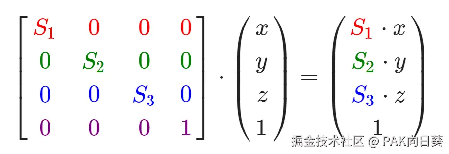
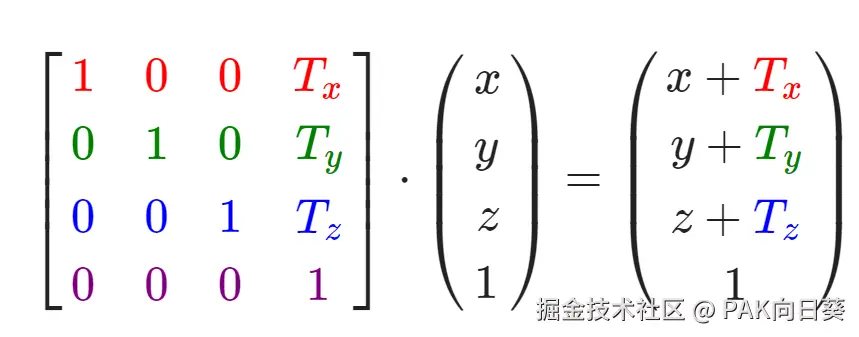

# GLM库的介绍与安装方法

## 什么是GLM库

GLM库，全称为OpenGL Mathematics，是专门为OpenGL设计的一个C++数学库，它提供了向量、矩阵、四元数以及其他数学结构的实现，极大地简化了OpenGL中的数学运算操作。

GLM库的实现代码全部编写在头文件当中。因此我们可以很方便地将其引入自己的OpenGL C++项目当中，而无需对项目的编译配置进行复杂的修改。

官方GitHub：<https://github.com/g-truc/glm>

## 如何在Visual Studio 2022中为自己的项目安装GLM库


## 在Visual Studio 2022中安装完成后，如何调用GLM库

引入如下头文件即可：

```C++
#include <glm/glm.hpp>
#include <glm/gtc/matrix_transform.hpp>
#include <glm/gtc/type_ptr.hpp>
```

# 使用GLM库实现简单的向量/矩阵运算

## 向量运算

1.  加法
2.  减法
3.  缩放
4.  点乘
5.  叉乘

```C++
#include <glm/glm.hpp>
#include <glm/gtc/matrix_transform.hpp>
#include <glm/gtc/type_ptr.hpp>

#include <iostream>

int main() {
    // 创建两个向量
    glm::vec3 vec1(1.0f, 2.0f, 3.0f);
    glm::vec3 vec2(4.0f, 5.0f, 6.0f);

    // 向量加法
    glm::vec3 vec_add = vec1 + vec2;
    std::cout << "Vector Addition: ("
        << vec_add.x << ", "
        << vec_add.y << ", "
        << vec_add.z << ")\n";

    // 向量减法
    glm::vec3 vec_sub = vec1 - vec2;
    std::cout << "Vector Subtraction: ("
        << vec_sub.x << ", "
        << vec_sub.y << ", "
        << vec_sub.z << ")\n";

    // 向量缩放
    float scaleFactor = 2.0f;
    glm::vec3 vec_scale = vec1 * scaleFactor; // 或者使用 glm::scale() 函数
    std::cout << "Vector Scaling: ("
        << vec_scale.x << ", "
        << vec_scale.y << ", "
        << vec_scale.z << ")\n";

    // 点乘
    float dot_product = glm::dot(vec1, vec2);
    std::cout << "Dot Product: " << dot_product << "\n";

    // 叉乘
    glm::vec3 cross_product = glm::cross(vec1, vec2);
    std::cout << "Cross Product: ("
        << cross_product.x << ", "
        << cross_product.y << ", "
        << cross_product.z << ")\n";

    return 0;
}
```

输出结果：


## 矩阵运算

1.  创建矩阵
2.  矩阵加法
3.  矩阵乘法
4.  矩阵与向量相乘

```C++
#include <glm/glm.hpp>
#include <glm/gtc/matrix_transform.hpp>
#include <glm/gtc/type_ptr.hpp>

#include <iostream>

// 自定义打印矩阵的函数
void printMatrix(const glm::mat4& mat) {
    for (int i = 0; i < 4; ++i) {
        std::cout << "| ";
        for (int j = 0; j < 4; ++j) {
            std::cout << mat[j][i] << " "; // GLM 使用列主序存储
        }
        std::cout << "|\n";
    }
}

int main() {
    // 1. 创建矩阵
    glm::mat4 matrix1(1.0f);  // 创建一个 4x4 单位矩阵
    glm::mat4 matrix2 = glm::mat4(1.0f);  // 另一种方式同样创建单位矩阵

    // 通过初始化矩阵来创建一个 4x4 的矩阵
    glm::mat4 matrix3 = glm::mat4(1.0f, 2.0f, 3.0f, 4.0f,
        5.0f, 6.0f, 7.0f, 8.0f,
        9.0f, 10.0f, 11.0f, 12.0f,
        13.0f, 14.0f, 15.0f, 16.0f);

    std::cout << "matrix3:\n";
    printMatrix(matrix3); // 打印矩阵

    // 2. 矩阵加法
    std::cout << "matrix_add:\n";
    glm::mat4 matrix_add = matrix1 + matrix3; // 矩阵加法
    printMatrix(matrix_add);

    // 3. 矩阵乘法
    std::cout << "matrix_mul:\n";
    glm::mat4 matrix_mul = matrix1 * matrix3; // 矩阵乘法
    printMatrix(matrix_mul);

    // 4. 矩阵与向量相乘
    glm::vec4 vec(1.0f, 2.0f, 3.0f, 1.0f); // 创建一个 4D 向量
    glm::vec4 result = matrix_mul * vec; // 矩阵与向量相乘
    std::cout << "Matrix-Vector Multiplication Result: ("
        << result.x << ", "
        << result.y << ", "
        << result.z << ", "
        << result.w << ")\n";

    return 0;
}
```

输出结果：


## 利用矩阵变换向量

### 缩放

原理公式：



示例代码：

```C++
#include <glm/glm.hpp>
#include <glm/gtc/matrix_transform.hpp>
#include <glm/gtc/type_ptr.hpp>

#include <iostream>

// 自定义打印矩阵的函数
void printMatrix(const glm::mat4& mat) {
    std::cout << "-----------\n";
    for (int i = 0; i < 4; ++i) {
        std::cout << "| ";
        for (int j = 0; j < 4; ++j) {
            std::cout << mat[j][i] << " "; // GLM 使用列主序存储
        }
        std::cout << "|\n";
    }
    std::cout << "-----------\n";
}

int main() {

    // 创建一个单位矩阵
    glm::mat4 transformer(1.0f);
    printMatrix(transformer);

    // 为单位矩阵设置缩放功能
    transformer = glm::scale(transformer, glm::vec3(1.0f, 2.0f, 3.0f));
    printMatrix(transformer);

    // 由于采用齐次坐标，这里需要再补充一个值为1的分量
    glm::vec4 vector = glm::vec4(1.0f, 2.0f, 3.0f, 1.0f);  

    // 利用矩阵对向量进行变换
    // 注意乘号左边为变换矩阵，右边为待变换的向量，顺序不能搞反！！！
    glm::vec4 new_vector = transformer * vector;

    // 输出变换后向量坐标
    printf("new vector (%.1lf, %.1lf, %.1lf)\n", new_vector.x, new_vector.y, new_vector.z);

    return 0;
}
```

输出结果：


### 位移

原理公式：



示例代码：

```C++
int main() {

    // 创建一个单位矩阵
    glm::mat4 transformer(1.0f);
    printMatrix(transformer);

    // 为单位矩阵设置平移功能
    transformer = glm::translate(transformer, glm::vec3(1.0f, 2.0f, 3.0f));
    printMatrix(transformer);

    // 由于采用齐次坐标，这里需要再补充一个值为1的分量
    glm::vec4 vector = glm::vec4(1.0f, 2.0f, 3.0f, 1.0f);  

    // 利用矩阵对向量进行变换
    // 注意乘号左边为变换矩阵，右边为待变换的向量，顺序不能搞反！！！
    glm::vec4 new_vector = transformer * vector;

    // 输出变换后向量坐标
    printf("new vector (%.1lf, %.1lf, %.1lf)\n", new_vector.x, new_vector.y, new_vector.z);

    return 0;
}
```

输出结果：


### 旋转

以"绕z轴逆时针旋转90°"为例，代码如下：

```C++
int main() {

    // 创建一个单位矩阵
    glm::mat4 transformer(1.0f);
    printMatrix(transformer);

    // 为单位矩阵设置旋转功能
    // glm::rotate的三个参数分别为(待变换的矩阵, 逆时针旋转角度, 基于右手系的旋转轴)
    transformer = glm::rotate(transformer, glm::radians(90.0f), glm::vec3(0, 0, 1));
    printMatrix(transformer);

    // 由于采用齐次坐标，这里需要再补充一个值为1的分量
    glm::vec4 vector = glm::vec4(3.0f, 4.0f, 0.0f, 1.0f);  

    // 利用矩阵对向量进行平移
    // 注意乘号左边为变换矩阵，右边为待变换的向量，顺序不能搞反！！！
    glm::vec4 new_vector = transformer * vector;

    // 输出变换后向量坐标
    printf("new vector (%.1lf, %.1lf, %.1lf)\n", new_vector.x, new_vector.y, new_vector.z);

    return 0;
}
```

输出结果：


示意图：


### 组合变换矩阵

根据矩阵乘法的性质，我们可以将多种变换效果叠加到同一个变换矩阵上去，再使用这个叠加后的变换矩阵一次性对目标向量进行变换。

以下是"先逆时针旋转90°，再沿x轴拉伸3倍并沿y轴拉伸4倍"的示例代码：

```C++
int main() {

    // 创建一个单位矩阵
    glm::mat4 transformer(1.0f);

    // 为单位矩阵设置旋转功能
    transformer = glm::rotate(transformer, glm::radians(90.0f), glm::vec3(0, 0, 1));
    // 再在该矩阵上叠加缩放效果
    transformer = glm::scale(transformer, glm::vec3(3, 4, 0));

    // 由于采用齐次坐标，这里需要再补充一个值为1的分量
    glm::vec4 vector = glm::vec4(3.0f, 4.0f, 0.0f, 1.0f);  

    // 利用矩阵对向量进行平移
    // 注意乘号左边为变换矩阵，右边为待变换的向量，顺序不能搞反！！！
    glm::vec4 new_vector = transformer * vector;

    // 输出变换后向量坐标
    printf("new vector (%.1lf, %.1lf, %.1lf)\n", new_vector.x, new_vector.y, new_vector.z);

    return 0;
}
```


# 变换矩阵与坐标系统

## 如何理解OpenGL中的变换矩阵与坐标系统

为了确定一个三维物体（比如一个正方体）在二维的计算机屏幕上的显示位置，我们就需要确定这个三维物体中的各个顶点最后显示在计算机屏幕上的位置。

针对这个问题，OpenGL引入了局部空间、世界空间、视图空间和裁剪空间这几个位居不同层次的坐标系。三维物体顶点在这几个空间中的坐标则分别称之为局部坐标、世界坐标、视图坐标和裁剪坐标。为了使得三维物体顶点在某个坐标系空间中的坐标可以被变换到更高层次的坐标系，OpenGL又引入了模型矩阵（局部坐标->世界坐标）、视图矩阵（世界坐标->视图坐标）和投影矩阵（视图坐标->裁剪坐标）来提供底层支持。

程序员想要通过OpenGL在计算机屏幕上绘制一个三维物体，首先需要规定出该三维物体各个顶点在局部空间中的坐标。

例如要绘制一个正方体，我们首先要确定它的八个顶点的局部坐标：


紧接着，我们需要通过模型矩阵对八个顶点的局部坐标进行变换，以确定确定它们在世界空间中的坐标位置：


> unity中世界坐标系的概念与这里OpenGL中世界坐标系的概念是类似的。除了我们要准备绘制的，在游戏中的其他物体也都会在世界坐标系中有一个属于自己的坐标。

接下来，我们需要通过视图矩阵对八个顶点的世界坐标进行变换，以确定它们相对于摄像机视角的视图坐标：


随后，为了符合现实世界中的透视规则，一般还需要对摄像机拍摄到的顶点进行修正，即使用投影将视图空间坐标转换为裁剪空间坐标。


到此为止，程序员的工作全部完成。

最后OpenGL流水线内部会完成裁剪（丢弃）位居视锥体之外顶点、透视除法、计算规范化设备坐标（NDC，取值范围\[-1, 1]）和视口变换（确定顶点在机器屏幕上的真实位置）的后续处理步骤。

上述由程序员一路将三维物体的坐标由局部空间坐标一路变换为可以提交给OpenGL流水线处理的裁剪空间坐标的过程，可以概括为以下的公式：

`Clip Space Postion = Projection Matrix × View Matrix × Model Matrix × Vertex Local Space Position`

## 关于局部空间、世界空间、视图空间、裁剪空间的更详细描述

参考<https://learnopengl-cn.github.io/01%20Getting%20started/08%20Coordinate%20Systems/>

## 代码实例

以下代码实例演示了如何利用OpenGL的坐标系统来实现一个简单的"3D正方形薄片绕Z轴旋转"的动画。

从代码中可以看到，在实际的OpenGL编程中，对顶点局部空间坐标进行一系列变换得到裁剪空间坐标的操作其实是在顶点着色器中实现的。当一系列变换（一系列矩阵乘法）完成后，在顶点着色器内程序员需要通过手工设置`gl_Position`四维齐次向量的方式，来将最终所得的裁剪空间坐标提交给OpenGL流水线，由OpenGL内部完成后续的处理步骤！

```C++
// main.cpp

#include <glad/glad.h>
#include <GLFW/glfw3.h>

// GLM用于矩阵变换
#include <glm/glm.hpp>
#include <glm/gtc/matrix_transform.hpp>
#include <glm/gtc/type_ptr.hpp>

#include <iostream>

const unsigned int SCREEN_WIDTH = 800;
const unsigned int SCREEN_HEIGHT = 600;

// 顶点着色器源码
const char* vertexShaderSource = R"(
#version 330 core
in vec3 aPos;

// 矩阵变换
uniform mat4 model;
uniform mat4 view;
uniform mat4 projection;

void main()
{
    gl_Position = projection * view * model * vec4(aPos, 1.0);
}
)";

int main()
{
    // 初始化GLFW
    glfwInit();
    // 配置GLFW：OpenGL版本3.3，核心模式
    glfwWindowHint(GLFW_CONTEXT_VERSION_MAJOR, 3);
    glfwWindowHint(GLFW_CONTEXT_VERSION_MINOR, 3);
    glfwWindowHint(GLFW_OPENGL_PROFILE, GLFW_OPENGL_CORE_PROFILE);

    // 创建窗口
    GLFWwindow* window = glfwCreateWindow(SCREEN_WIDTH, SCREEN_HEIGHT, "3D Cube Demo", NULL, NULL);
    if (window == NULL)
    {
        std::cout << "Failed to create GLFW window" << std::endl;
        glfwTerminate();
        return -1;
    }
    glfwMakeContextCurrent(window);

    // 初始化GLAD，加载所有OpenGL函数指针
    if (!gladLoadGLLoader((GLADloadproc)glfwGetProcAddress))
    {
        std::cout << "Failed to initialize GLAD" << std::endl;
        return -1;
    }
    // 编译顶点着色器
    int vertexShader = glCreateShader(GL_VERTEX_SHADER);
    glShaderSource(vertexShader, 1, &vertexShaderSource, NULL);
    glCompileShader(vertexShader);
    // 检查编译错误
    int success;
    char infoLog[512];
    glGetShaderiv(vertexShader, GL_COMPILE_STATUS, &success);
    if (!success)
    {
        glGetShaderInfoLog(vertexShader, 512, NULL, infoLog);
        std::cout << "ERROR::VERTEX_SHADER::COMPILATION_FAILED\n" << infoLog << std::endl;
    }

    // 链接着色器程序
    int shaderProgram = glCreateProgram();
    glAttachShader(shaderProgram, vertexShader);
    
    glLinkProgram(shaderProgram);
    // 检查链接错误
    glGetProgramiv(shaderProgram, GL_LINK_STATUS, &success);
    if (!success)
    {
        glGetProgramInfoLog(shaderProgram, 512, NULL, infoLog);
        std::cout << "ERROR::SHADER_PROGRAM::LINKING_FAILED\n" << infoLog << std::endl;
    }
    // 删除着色器，因为已经链接到程序中了
    glDeleteShader(vertexShader);

    // 立方体的顶点数据
    float vertices[] = {
        -0.5f, -0.5f, 0.5f,
         0.5f, -0.5f, 0.5f,
         0.5f,  0.5f, 0.5f,
         0.5f,  0.5f, 0.5f,
        -0.5f,  0.5f, 0.5f,
        -0.5f, -0.5f, 0.5f,
    };

    unsigned int VBO, VAO;
    glGenVertexArrays(1, &VAO);
    glGenBuffers(1, &VBO);

    // 绑定VAO
    glBindVertexArray(VAO);

    // 绑定VBO并传递数据
    glBindBuffer(GL_ARRAY_BUFFER, VBO);
    glBufferData(GL_ARRAY_BUFFER, sizeof(vertices), vertices, GL_STATIC_DRAW);

    // 设置顶点属性指针
    glVertexAttribPointer(0, 3, GL_FLOAT, GL_FALSE, 3 * sizeof(float), (void*)0);
    glEnableVertexAttribArray(0);

    // 解绑
    glBindBuffer(GL_ARRAY_BUFFER, 0);
    glBindVertexArray(0);

    glEnable(GL_DEPTH_TEST);

    // 渲染循环
    while (!glfwWindowShouldClose(window)) {

        // 渲染指令
        glClearColor(0.2f, 0.3f, 0.3f, 1.0f);
        // 清除颜色缓冲和深度缓冲
        glClear(GL_COLOR_BUFFER_BIT | GL_DEPTH_BUFFER_BIT);

        // 使用着色器程序
        glUseProgram(shaderProgram);

        // 创建变换矩阵
        glm::mat4 model = glm::mat4(1.0f);
        // 使用时间旋转立方体
        model = glm::rotate(model, (float)glfwGetTime() * glm::radians(-55.0f), glm::vec3(0.0f, 1.0f, 0.0f));
        // 视图矩阵
        glm::mat4 view = glm::mat4(1.0f);
        view = glm::translate(view, glm::vec3(0.0f, 0.0f, -3.0f));
        // 投影矩阵
        glm::mat4 projection = glm::mat4(1.0f);
        projection = glm::perspective(glm::radians(45.0f), (float)SCREEN_WIDTH / SCREEN_HEIGHT, 0.1f, 100.0f);

        // 将矩阵传递给着色器
        unsigned int modelLoc = glGetUniformLocation(shaderProgram, "model");
        unsigned int viewLoc = glGetUniformLocation(shaderProgram, "view");
        unsigned int projLoc = glGetUniformLocation(shaderProgram, "projection");
        glUniformMatrix4fv(modelLoc, 1, GL_FALSE, glm::value_ptr(model));
        glUniformMatrix4fv(viewLoc, 1, GL_FALSE, glm::value_ptr(view));
        glUniformMatrix4fv(projLoc, 1, GL_FALSE, glm::value_ptr(projection));

        // 绑定VAO，绘制立方体
        glBindVertexArray(VAO);
        glDrawArrays(GL_TRIANGLES, 0, 6);
        glBindVertexArray(0);

        // 交换缓冲并检查事件
        glfwSwapBuffers(window);
        glfwPollEvents();
    }

    // 删除资源
    glDeleteVertexArrays(1, &VAO);
    glDeleteBuffers(1, &VBO);

    // 终止GLFW
    glfwTerminate();
    return 0;
}
```

# 相机

## 概述

与方便好用的unity不同，OpenGL中事实上并没有相机的概念。但幸运的是，通过手工配置在上节"坐标系统"中提到的"视图矩阵"，我们可以控制三维物体在"视图空间"下的坐标位置，即在OpenGL中实现相机的效果！

## 如何在数学上描述一个相机？

我们先来了解如何在数学上描述一个相机。从直观上来说，要描述一个相机，我们至少需要知道该相机在世界空间中的位置、以及它的拍摄方向。

在《Learn OpenGL》教程中，作者将我们的直观理解进一步细化为以下几个三维向量：

*   相机位置
*   相机方向
*   相机右轴
*   相机上轴


以下是这几个三维向量的计算方法。

1.  **相机在世界空间中的位置**可以由程序员任意指定。例如：

```C++
glm::vec3 cameraPos = glm::vec3(0.0f, 0.0f, 3.0f);
```

2.  **相机方向**实际上并不是从相机指向目标点的方向向量，而是该方向向量的反方向，即相机自身局部坐标系中的z轴方向。因此在向量做差时需要特别注意到底是谁减去谁。例如：

```C++
glm::vec3 cameraTarget = glm::vec3(3.0f, 0.0f, 0.0f);
glm::vec3 cameraDirection = glm::normalize(cameraPos - cameraTarget);
```

3.  **相机右轴**表示相机自身局部坐标系中的x轴方向。该方向向量可通过世界坐标系的向上方向向量，与相机方向向量叉乘得到（注意叉乘符号的左右两边各自是谁，如果弄反了就会得到反方向的向量）。例如：

```C++
glm::vec3 up = glm::vec3(0.0f, 1.0f, 0.0f); 
glm::vec3 cameraRight = glm::normalize(glm::cross(up, cameraDirection));
```

4.  **相机上轴**表示相机自身局部坐标系中的y轴方向。我们直接通过相机方向向量与相机右轴方向向量叉乘即可得到。例如：

```C++
glm::vec3 cameraUp = glm::cross(cameraDirection, cameraRight);
```

## 如何在OpenGL中用视图矩阵描述一个相机？

为了在OpenGL中实现相机的效果，根据前面"概述"中的介绍，我们就需要根据相机在世界坐标系中所处的位置和拍摄方向，确定出将三维物体各顶点的坐标由世界坐标系转换到视图坐标系的视图矩阵。

幸运的是，GLM库已经为我们提供了一个强大的工具函数`glm::lookAt(glm::vec3 camera_pos, glm::vec3 target_pos, glm::vec3 world_up)`，来帮助我们直接求出这个最关键的视图矩阵，使我们免于承受数学和编程之苦。

该函数接收三个参数：

*   camera\_pos：相机在世界坐标系中的位置
*   target\_pos：相机拍摄的目标点，用于和相机自身位置共同确定相机的拍摄方向。
*   world\_up：世界坐标系的向上方向。一般取`glm::vec3(0.0f, 1.0f, 0.0f)`即可

例如，我们可以将前面介绍过的"3D正方形薄片绕Z轴旋转"中计算视图矩阵的代码直接替换成如下的形式：

```C++
// 前代码略...
glm::mat4 view = glm::lookAt(
    glm::vec3(0.0f, 0.0f, 3.0f),  // 相机自身的位置
    glm::vec3(0.0f, 0.0f, 0.0f),  // 相机拍摄目标点
    glm::vec3(0.0f, 1.0f, 0.0f)   // 世界坐标系向上方向
);
// 后代码略...
```

重新编译并运行程序，应该能够看到与之前相同的效果！

最后，让我们试试让相机自身运动起来。

在前面介绍过的"3D正方形薄片绕Z轴旋转"例子中，我们是通过在每帧中改变正方形薄片自身各个顶点在世界坐标系中的位置的方式，来实现正方形薄片绕z轴旋转的效果。

现在，让我们使得**保持正方形薄片自身不动**，通过**让摄像机绕z轴旋转的方式**，来达到相同的动画效果。

首先，让我们注释掉前边代码中计算模式矩阵的代码，即模式矩阵就是一个没有任何变换效果的单位阵，也就是让正方形薄片的各个顶点在世界坐标系中的位置保持不动：

```C++
// 前代码略...
// 创建变换矩阵
glm::mat4 model = glm::mat4(1.0f);
// 使用时间旋转立方体
//model = glm::rotate(model, (float)glfwGetTime() * glm::radians(-55.0f), glm::vec3(0.0f, 1.0f, 0.0f));
// 后代码略...
```

然后，让我们修改一下计算，让摄像机自身在世界坐标系中的位置，在每帧中发生变化：

```C++
// 视图矩阵
float radius = 3.0f;
float camX = sin(glfwGetTime()) * radius;
float camZ = cos(glfwGetTime()) * radius;
glm::mat4 view = glm::lookAt(
    glm::vec3(camX, 0.0f, camZ),
    glm::vec3(0.0f, 0.0f, 0.0f),  // 相机始终面向目标点
    glm::vec3(0.0f, 1.0f, 0.0f)
);
```

## 使用键盘移动摄像机的位置

下面我们开始实现"允许用户使用键盘移动摄像机位置"的功能。

为了便于对摄像机进行控制，我们首先需要引入一个专门的变量`cameraFront`用于表示摄像机的拍摄方向。

那么摄像机拍摄的目标点则可以简洁地取作`cameraPos + cameraFront`。可以这么取是因为目标点坐标的意义在于和`cameraPos`联合确定摄像机拍摄的方向，所以事实上取从摄像机坐标`cameraPos`出发，沿`cameraFront`方向射线上的任意一点都可以。这里为了方便我们就直接从简处理了！

于是计算视图矩阵的代码可修改如下：

```C++
glm::mat4 view = glm::lookAt(cameraPos, cameraPos + cameraFront, worldUp);
```

接下来我们再来添加代码响应用户的键盘操作，使得摄像机的位置可以随用户操作AWSD按键而移动。

首先创建处理用户键盘操作的处理函数：

```C++
void processInput(GLFWwindow* window) {
    // cameraSpeed为摄像机移动的速度
    // 为了达到令人舒适的视觉效果，cameraSpeed的取值在不同设备上可能差异很大！
    float cameraSpeed = 0.0005f;
    // W键，摄像机向前移动
    if (glfwGetKey(window, GLFW_KEY_W) == GLFW_PRESS)
        cameraPos += cameraSpeed * cameraFront;
    // S键，摄像机向后移动
    if (glfwGetKey(window, GLFW_KEY_S) == GLFW_PRESS)
        cameraPos -= cameraSpeed * cameraFront;
    // A键，摄像机向左移动
    if (glfwGetKey(window, GLFW_KEY_A) == GLFW_PRESS)
        cameraPos -= glm::normalize(glm::cross(cameraFront, worldUp)) * cameraSpeed;
    // D键，摄像机向右移动
    if (glfwGetKey(window, GLFW_KEY_D) == GLFW_PRESS)
        cameraPos += glm::normalize(glm::cross(cameraFront, worldUp)) * cameraSpeed;
}
```

这段代码的数学原理可以通过下图来理解：


在每一帧中，用户都有可能发出键盘操作，因此在每一帧中我们都要调用函数，来判断用户是否有程序期望的键盘操作，如有则需要作出相应的响应：

```C++
int main() {
    // ...
    while (!glfwWindowShouldClose(window)) {

        // 处理用户的键盘操作
        processInput(window);

        // 渲染指令
        glClearColor(0.2f, 0.3f, 0.3f, 1.0f);
        // 清除颜色缓冲和深度缓冲
        glClear(GL_COLOR_BUFFER_BIT | GL_DEPTH_BUFFER_BIT);
        
        // ...
    }
    // ...
}
```

编译运行，现在摄像机应该能够跟着我们的键盘操作来上下左右移动了。

最后我们来处理一下移动速度的问题。

目前我们的移动速度是个常量。理论上没什么问题，但实际情况下由于设备之间性能的差异，有些人可能会比其他人每秒绘制更多帧，也就是以更高的频率调用processInput函数。结果就是，根据配置的不同，有些人可能移动很快，而有些人会移动很慢——这肯定是不可接受的！

解决这个问题的思路是，引入变量`deltaTime`表示从上一帧到当前帧走过的时间多少。在每次调用`processInput`函数时，我们都用这个变量与相机的绝对速度相乘，以确定当前帧中相机要移动的距离多少。这样，如果某用户的设备性能较差（即帧率较低，单位时间播放的帧数较少），间隔时间`deltaTime`相应地就较大，每帧中相机移动的距离也就较大。反则反之。使用这种方法，无论你的电脑快还是慢，摄像机的速度都会相应平衡，这样每个用户的体验就都一样了。

为了在每帧中计算`deltaTime`变量，我们还需要引入记录变量`lastFrame`用于表示播放到上一帧时已经流逝的绝对时间，并使用OpenGL的`glfwGetTime()`函数获取播放到当前帧时已经流失的绝对时间，则两者之差即为我们关心的`deltaTime`。

最终代码如下：

```C++
// ...
glm::vec3 cameraPos = glm::vec3(0.0f, 0.0f, 3.0f);
glm::vec3 cameraFront = glm::vec3(0.0f, 0.0f, -1.0f);
glm::vec3 worldUp = glm::vec3(0.0f, 1.0f, 0.0f);

float deltaTime = 0.0f;	// time between current frame and last frame
float lastFrame = 0.0f;

void processInput(GLFWwindow* window) {
    float cameraSpeed = static_cast<float>(2.5 * deltaTime);
    // W键，摄像机向前移动
    if (glfwGetKey(window, GLFW_KEY_W) == GLFW_PRESS)
        cameraPos += cameraSpeed * cameraFront;
    // S键，摄像机向后移动
    if (glfwGetKey(window, GLFW_KEY_S) == GLFW_PRESS)
        cameraPos -= cameraSpeed * cameraFront;
    // A键，摄像机向左移动
    if (glfwGetKey(window, GLFW_KEY_A) == GLFW_PRESS)
        cameraPos -= glm::normalize(glm::cross(cameraFront, worldUp)) * cameraSpeed;
    // D键，摄像机向右移动
    if (glfwGetKey(window, GLFW_KEY_D) == GLFW_PRESS)
        cameraPos += glm::normalize(glm::cross(cameraFront, worldUp)) * cameraSpeed;
}

int main() {
    // ...
    while (!glfwWindowShouldClose(window)) {

        // 计算deltaTime并更新lastFrame
        float currentFrame = static_cast<float>(glfwGetTime());
        deltaTime = currentFrame - lastFrame;
        lastFrame = currentFrame;

        // 处理用户的键盘操作
        processInput(window);

        // 渲染指令
        glClearColor(0.2f, 0.3f, 0.3f, 1.0f);
        // 清除颜色缓冲和深度缓冲
        glClear(GL_COLOR_BUFFER_BIT | GL_DEPTH_BUFFER_BIT);
        
        // ...
    }
    // ...
}
```

## 摄像机方向与欧拉角

通过前文对相机代码的调整，我们现在可以方便地通过设置方向向量`cameraFront`的方式来调节摄像机的拍摄方向。但为了能够更加方便地对摄像机的拍摄方向进行控制，我们还需要引入欧拉角的概念。

欧拉角有三种：

*   俯仰角（pitch）：表示拍摄方向与x-z平面之间形成的夹角
*   偏航角（yaw）：表示摄像机镜头绕y轴转过的角度
*   滚转角（roll）：表示摄像机镜头自身的旋转角度。这里我们不使用！


但是光有欧拉角其实没啥用，我们需要建立起欧拉角和该欧拉角所确定的摄像机拍摄方向的方向向量之间的换算关系。

我们先来分析一下俯仰角。

俯仰角为一线面角，则如图所示，


若从沿俯仰角方向的射线上上截取一长度为1的单位向量，我们有该向量沿y轴的分量模长为`sin(glm::radians(pitch))`，并且该向量在x-z平面上的分量模长为`cos(glm::radians(pitch))`。

而如果只考虑偏航角，则如图所示，


若从沿偏航角方向的射线上截取一长度为1的单位向量，我们有该向量沿x轴的分量模长为`cos(glm::radians(yaw))`，沿z轴的模长分量为`sin(glm::radians(yaw))`

根据下面这幅原理图，我们可以把对俯仰角和偏航角的几何分析结合起来，得出如下的将已知欧拉角转换为摄像机方向向量`cameraFront`的公式：

```C++
glm::vec3 front;
front.x = cos(glm::radians(yaw)) * cos(glm::radians(pitch));
front.y = sin(glm::radians(pitch));
front.z = sin(glm::radians(yaw)) * cos(glm::radians(pitch));
cameraFront = glm::normalize(front);
```


最后，我们只需要将欧拉角`pitch`、`yaw`与用户的鼠标移动操作关联起来就行了。

## 实现根据用户移动鼠标的操作，调整摄像机拍摄方向

代码的基本思路为在每一帧中，将上一帧用户鼠标的横纵坐标，与当前帧的鼠标坐标做差，分别得出两帧之间用户鼠标在水平和竖直方向上的变化大小。根据水平方向上的变化大小更新偏航角`yaw`，根据竖直方向上的变化大小更新俯仰角`pitch`。最后把更新后的欧拉角代入公式，更新直接参与视图矩阵计算的`cameraFront`方向向量即可。

完整代码如下：

```C++
#include <glad/glad.h>
#include <GLFW/glfw3.h>

// GLM用于矩阵变换
#include <glm/glm.hpp>
#include <glm/gtc/matrix_transform.hpp>
#include <glm/gtc/type_ptr.hpp>

#include <iostream>

const unsigned int SCREEN_WIDTH = 1920;
const unsigned int SCREEN_HEIGHT = 1080;

// 顶点着色器源码
const char* vertexShaderSource = R"(
#version 330 core
in vec3 aPos;

// 矩阵变换
uniform mat4 model;
uniform mat4 view;
uniform mat4 projection;

void main()
{
    gl_Position = projection * view * model * vec4(aPos, 1.0);
}
)";

glm::vec3 cameraPos = glm::vec3(0.0f, 0.0f, 3.0f);
glm::vec3 cameraFront = glm::vec3(0.0f, 0.0f, -1.0f);
glm::vec3 worldUp = glm::vec3(0.0f, 1.0f, 0.0f);

float deltaTime = 0.0f;
float lastFrame = 0.0f;

void processInput(GLFWwindow* window)
{
    float cameraSpeed = static_cast<float>(2.5 * deltaTime);
    if (glfwGetKey(window, GLFW_KEY_W) == GLFW_PRESS)
        cameraPos += cameraSpeed * cameraFront;
    if (glfwGetKey(window, GLFW_KEY_S) == GLFW_PRESS)
        cameraPos -= cameraSpeed * cameraFront;
    if (glfwGetKey(window, GLFW_KEY_A) == GLFW_PRESS)
        cameraPos -= glm::normalize(glm::cross(cameraFront, worldUp)) * cameraSpeed;
    if (glfwGetKey(window, GLFW_KEY_D) == GLFW_PRESS)
        cameraPos += glm::normalize(glm::cross(cameraFront, worldUp)) * cameraSpeed;
}

bool firstMouse = true;
float lastX = 0.0;
float lastY = 0.0;
float yaw = -90.0f;;
float pitch = 0.0f;

void mouse_callback(GLFWwindow* window, double xpos, double ypos)
{
    if (firstMouse) {
        lastX = static_cast<float>(xpos);
        lastY = static_cast<float>(ypos);
        firstMouse = false;
    }

    float xoffset = static_cast<float>(xpos) - lastX;
    // 因为我们希望当用户鼠标向上挪动时，摄像机镜头向下转动；
    // 当用户鼠标向下挪动时，摄像机镜头向上转动
    // 所以在计算yoffset时要取反一下！
    float yoffset = lastY - static_cast<float>(ypos);
    lastX = static_cast<float>(xpos);
    lastY = static_cast<float>(ypos);

    // 设置灵敏度系数对xoffset, yoffset进行缩放
    // 以避免鼠标稍微动一下，摄像机角度就发生非常显著的变化
    float sensitivity = 0.05;
    xoffset *= sensitivity;
    yoffset *= sensitivity;

    yaw += xoffset;
    pitch += yoffset;

    // 将俯仰角限制在[-89°, 89°]范围内，避免潜在的显示异常
    if (pitch > 89.0f)
        pitch = 89.0f;
    if (pitch < -89.0f)
        pitch = -89.0f;

    glm::vec3 front;
    front.x = cos(glm::radians(yaw)) * cos(glm::radians(pitch));
    front.y = sin(glm::radians(pitch));
    front.z = sin(glm::radians(yaw)) * cos(glm::radians(pitch));
    cameraFront = glm::normalize(front);
}

void framebuffer_size_callback(GLFWwindow* window, int width, int height) {
    // 重新计算视口
    // 当用户拖拉改变窗口大小时，显示图形的大小能够自适应地发生变化
    glViewport(0, 0, width, height);
}

int main()
{
    // 初始化GLFW
    glfwInit();
    // 配置GLFW：OpenGL版本3.3，核心模式
    glfwWindowHint(GLFW_CONTEXT_VERSION_MAJOR, 3);
    glfwWindowHint(GLFW_CONTEXT_VERSION_MINOR, 3);
    glfwWindowHint(GLFW_OPENGL_PROFILE, GLFW_OPENGL_CORE_PROFILE);

    // 创建窗口
    GLFWwindow* window = glfwCreateWindow(SCREEN_WIDTH, SCREEN_HEIGHT, "3D Cube Demo", NULL, NULL);
    if (window == NULL)
    {
        std::cout << "Failed to create GLFW window" << std::endl;
        glfwTerminate();
        return -1;
    }
    glfwMakeContextCurrent(window);
    // 注册鼠标移动回调函数mouse_callback
    glfwSetCursorPosCallback(window, mouse_callback);
    // 注册用户变化窗口回调函数
    glfwSetFramebufferSizeCallback(window, framebuffer_size_callback);

    // 初始化GLAD，加载所有OpenGL函数指针
    if (!gladLoadGLLoader((GLADloadproc)glfwGetProcAddress))
    {
        std::cout << "Failed to initialize GLAD" << std::endl;
        return -1;
    }
    // 编译顶点着色器
    int vertexShader = glCreateShader(GL_VERTEX_SHADER);
    glShaderSource(vertexShader, 1, &vertexShaderSource, NULL);
    glCompileShader(vertexShader);
    // 检查编译错误
    int success;
    char infoLog[512];
    glGetShaderiv(vertexShader, GL_COMPILE_STATUS, &success);
    if (!success)
    {
        glGetShaderInfoLog(vertexShader, 512, NULL, infoLog);
        std::cout << "ERROR::VERTEX_SHADER::COMPILATION_FAILED\n" << infoLog << std::endl;
    }

    // 链接着色器程序
    int shaderProgram = glCreateProgram();
    glAttachShader(shaderProgram, vertexShader);
    
    glLinkProgram(shaderProgram);
    // 检查链接错误
    glGetProgramiv(shaderProgram, GL_LINK_STATUS, &success);
    if (!success)
    {
        glGetProgramInfoLog(shaderProgram, 512, NULL, infoLog);
        std::cout << "ERROR::SHADER_PROGRAM::LINKING_FAILED\n" << infoLog << std::endl;
    }
    // 删除着色器，因为已经链接到程序中了
    glDeleteShader(vertexShader);

    // 立方体的顶点数据
    float z_pos = 0.0f;
    float vertices[] = {
        -0.5f, -0.5f, z_pos,
         0.5f, -0.5f, z_pos,
         0.5f,  0.5f, z_pos,
         0.5f,  0.5f, z_pos,
        -0.5f,  0.5f, z_pos,
        -0.5f, -0.5f, z_pos,
    };

    unsigned int VBO, VAO;
    glGenVertexArrays(1, &VAO);
    glGenBuffers(1, &VBO);

    // 绑定VAO
    glBindVertexArray(VAO);

    // 绑定VBO并传递数据
    glBindBuffer(GL_ARRAY_BUFFER, VBO);
    glBufferData(GL_ARRAY_BUFFER, sizeof(vertices), vertices, GL_STATIC_DRAW);

    // 设置顶点属性指针
    glVertexAttribPointer(0, 3, GL_FLOAT, GL_FALSE, 3 * sizeof(float), (void*)0);
    glEnableVertexAttribArray(0);

    // 解绑
    glBindBuffer(GL_ARRAY_BUFFER, 0);
    glBindVertexArray(0);

    glEnable(GL_DEPTH_TEST);

    // 渲染循环
    while (!glfwWindowShouldClose(window)) {

        float currentFrame = static_cast<float>(glfwGetTime());
        deltaTime = currentFrame - lastFrame;
        lastFrame = currentFrame;

        processInput(window);

        // 渲染指令
        glClearColor(0.2f, 0.3f, 0.3f, 1.0f);
        // 清除颜色缓冲和深度缓冲
        glClear(GL_COLOR_BUFFER_BIT | GL_DEPTH_BUFFER_BIT);

        // 使用着色器程序
        glUseProgram(shaderProgram);

        // 创建变换矩阵
        glm::mat4 model = glm::mat4(1.0f);
        // 视图矩阵
        glm::mat4 view = glm::lookAt(cameraPos, cameraPos + cameraFront, worldUp);
        // 投影矩阵
        glm::mat4 projection = glm::mat4(1.0f);
        projection = glm::perspective(glm::radians(45.0f), (float)SCREEN_WIDTH / SCREEN_HEIGHT, 0.1f, 100.0f);

        // 将矩阵传递给着色器
        unsigned int modelLoc = glGetUniformLocation(shaderProgram, "model");
        unsigned int viewLoc = glGetUniformLocation(shaderProgram, "view");
        unsigned int projLoc = glGetUniformLocation(shaderProgram, "projection");
        glUniformMatrix4fv(modelLoc, 1, GL_FALSE, glm::value_ptr(model));
        glUniformMatrix4fv(viewLoc, 1, GL_FALSE, glm::value_ptr(view));
        glUniformMatrix4fv(projLoc, 1, GL_FALSE, glm::value_ptr(projection));

        // 绑定VAO，绘制立方体
        glBindVertexArray(VAO);
        glDrawArrays(GL_TRIANGLES, 0, 6);
        glBindVertexArray(0);

        // 交换缓冲并检查事件
        glfwSwapBuffers(window);
        // 处理用户改变窗口大小、移动鼠标等事件
        // 此处代码会触发我们注册的mouse_callback等回调函数！
        glfwPollEvents();
    }

    // 删除资源
    glDeleteVertexArrays(1, &VAO);
    glDeleteBuffers(1, &VBO);

    // 终止GLFW
    glfwTerminate();
    return 0;
}
```

进一步代码细节请参考<https://learnopengl-cn.github.io/01%20Getting%20started/09%20Camera/>
