### 1. 设img为OpenCV的imread()函数读取的RGB彩色图像，若`img[m,n,:]=(100,110,120)`，则像素点`(m,n)`红色分量的值为____.

**答：** OpenCV采用BGR颜色格式，红色分量为120

### 2. 有一幅RGB彩色图像，已知其高度为720个像素，每个像素单个颜色分量以1字节表示，不作编码压缩处理时图像数据共2764800字节，则该图像的宽度为___像素。

**答：**

每个像素点占用3字节，故图像中的像素点总数 = 2764800字节 / 3字节 = 921600

宽度 = 921600 / 720 = 1280像素

### 3. 请写出如下的二值图像的8方向边界链码表示（以左上角为起点），并给出起点归一化后的结果。

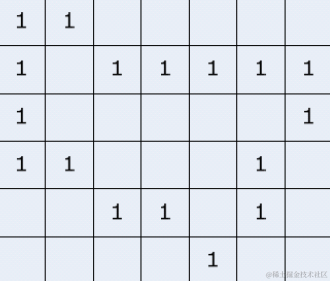

**答：**

8方向边界链码的编码规则如下图所示：

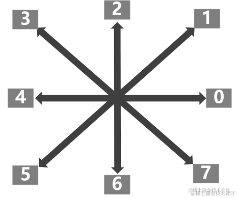

故所求的链码为`07000065653434222`.

归一化结果为`00006565343422207`.

### 4. 设下图中的（A）和（B）分别对应“input_A.png”和“input_B.png”，阅读以下程序代码。

A： B: 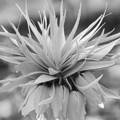

代码:
```python
import cv2
import os
import numpy as np

im_path = 'input_A.png'
im_A=cv2.imread(im_path, cv2.IMREAD_GRAYSCALE)
im_path = 'input_B.png'
im_B = cv2.imread(im_path, cv2.IMREAD_GRAYSCALE)

dft_A = cv2.dft(np.float32(im_A), flags=cv2.DFT_COMPLEX_OUTPUT)
dft_B =cv2.dft(np.float32(im_B), flags=cv2.DFT_COMPLEX_OUTPUT)

dft_mag_A = cv2.magnitude(dft_A[:,:,0], dft_A[:,:,1])
dft_mag_B = cv2.magnitude(dft_B[:,:,0], dft_B[:,:,1])

dft_X = dft_A

rows, cols = im_A.shape

for y in range(0, rows):
    for x in range(0, cols):
        dft_X[y, x, 0] = dft_mag_B[y,x]*dft_A[y,x,0]/(dft_mag_A[y,x]+0.005)
        dft_X[y, x, 1] = dft_mag_B[y,x]*dft_A[y,x,1]/(dft_mag_A[y,x]+0.005)

im_i = cv2.idft(dft_X, flags=cv2.DFT_SCALE)
img_X = cv2.magnitude(im_i[:,:,0],im_i[:,:,1])
img_X = img_X.clip(0, 255).astype(np.uint8)

cv2.imwrite('result.png', img_X)
```

#### (1) 请说明程序完成的功能

**答：**

这段程序在读入图像`input_A.png`和`input_B.png`后对它们进行离散傅里叶变换，并且根据`input_A.png`的频率域实、虚部以及`input_B.png`的幅度谱来计算结果图像的频率域实、虚部，最后通过逆离散傅里叶变换将结果图像的频率域变换回人类可以直接阅览的空域。

#### (2) 程序产生的结果图像为下图中的（C）还是（D）所示的图像？

C: 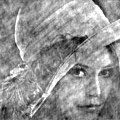 D: 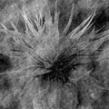

**答：**

图像的相位信息（储存在傅里叶变换结果的实部和虚部当中）主要决定了图像的结构和位置关系，而幅度信息主要反映了亮度和对比度。

由于该代码将图像A的相位信息与图像B的幅度谱进行组合，因此最终生成的图像会保留图像A（人脸）的结构和形状特征，同时混合了图像B（花）的强度信息。

这意味着输出图像将主要表现出人脸的轮廓和细节，但可能在纹理和对比度上受到花的影响。**故答案为(C)。**

### 5. 以下为实现图像幂次变换（伽马变换）的Python代码

```python
import cv2
import numpy as np

def gamma_correction(image, gamma):
    # 建立从原灰度值到变换后灰度值的查找表
    table = np.array([((i / 255.0) ** gamma) * 255 for i in np.arange(0, 256)]).astype("uint8")
    # 应用查找表来调整图像
    return cv2.LUT(image, table)

image = cv2.imread('lenna.jpg', cv2.IMREAD_GRAYSCALE)
corrected_image = gamma_correction(image, 0.5)

cv2.imshow('Original Image', image)
cv2.imshow('Gamma Corrected Image', corrected_image)

cv2.waitKey(0)
cv2.destroyAllWindows()
```

若以`gamma=0.5`调用`gamma_correction`函数来处理原图像（A），则将产生如下图（B）、（C）或（D）的哪个图像？

A: 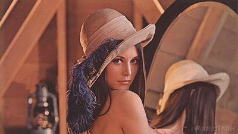

B: 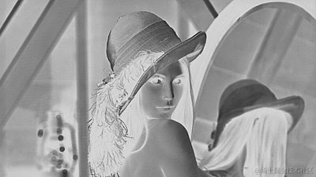

C: 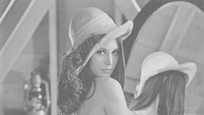

D: 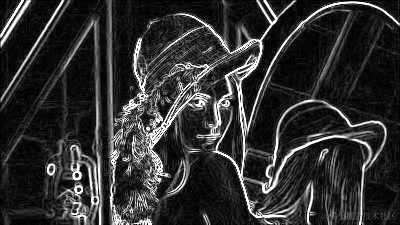

**答：**

这题考察对伽马变换的理解。

伽马变换的公式为$s = cr^{γ}$，其中$0 ≤ r ≤ 1$表示变换前（经归一化处理的）原灰度级，$s$表示变换之后$r$对应的新灰度级。

显然，当$γ>1$时，$s$相比于$r$会更小，图像看上去更加灰暗，且$γ$愈趋近于1，抑制效果越明显；当$0 < γ < 1$时，$s$相比于$r$会更大，图像看上去更加明亮，且$γ$愈趋近于0，增强效果越明显。（可以通过比较$y = x^2$和$y = \sqrt{x}$来帮助理解）

**因此本题的答案为C**。

再来看看其他答案。

B与原图像相比，原本颜色较暗的地方变得明亮，原本颜色较亮的地方变得黑暗，因此推测其是图像经过负片变换之后得到的结果。

测试代码如下：

```python
import numpy as np
import cv2

image = cv2.imread('lenna.jpg', cv2.IMREAD_GRAYSCALE)
negative_image = 255 - image
cv2.imwrite('negative_image.png', negative_image)
```

D是图像经过某种边缘检测算法得到的结果，有可能是Robert、Sobel或Laplace等算子。但不太可能是Canny，因为一般Canny检出的边缘是非常细且不怎么有噪声的。

Sobel算子的测试代码如下：

```python
import cv2
import numpy as np
import matplotlib.pyplot as plt

# 读取图像
image = cv2.imread('lenna.jpg', cv2.IMREAD_GRAYSCALE)

# 计算Sobel边缘检测
sobelx = cv2.Sobel(image, cv2.CV_64F, 1, 0, ksize=3)  # x方向的梯度
sobely = cv2.Sobel(image, cv2.CV_64F, 0, 1, ksize=3)  # y方向的梯度

# 计算梯度的幅值
sobel_combined = cv2.magnitude(sobelx, sobely)

# 将梯度幅值转为8位图像
sobel_combined = cv2.convertScaleAbs(sobel_combined)

cv2.imwrite('sobel.png', sobel_combined)
```

### 6. 有三位量化的灰度图像，其直方图如下表所示，对该图像作直方图均衡化处理，请以表格形式写出均衡化后的直方图。

|灰度|0|1|2|3|4|5|6|7|
|-|-|-|-|-|-|-|-|-|
|直方图|338|2452|289|2309|18|112|32|47|

**答：**

|灰度|0|1|2|3|4|5|6|7|
|-|-|-|-|-|-|-|-|-|
|直方图|338|2452|289|2309|18|112|32|47|
|归一化直方图|0.06|0.44|0.05|0.41|0.00|0.02|0.01|0.01|
|变换函数|0.06|0.50|0.55|0.96|0.97|0.99|0.99|1.00|
|映射后灰度值|0|3|4|7|7|7|7|7|
|变换后直方图|338|0|0|2452|289|0|0|2518|
|变换后归一化直方图|0.06|0.00|0.00|0.44|0.05|0.00|0.00|0.45|

变换前直方图如下：

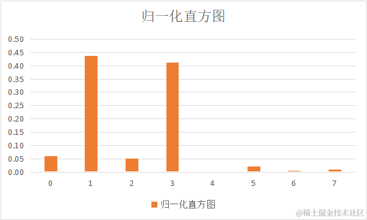

变换后直方图如下：

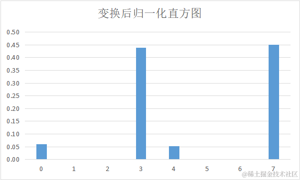

### 7. 写出直方图均衡化算法的伪代码

**答：**

```python
import numpy as np

# 假设这是源图像中不同灰度级的像素点数目
original = np.array([790, 1023, 850, 656, 329, 245, 122, 81], dtype=np.uint32)

# 源图像中不同灰度级像素的分布频率
probability = original / np.sum(original)

# 累积分布函数
cdf = np.array([np.sum(probability[0:i + 1]) for i in range(0, 8)])

# 原灰度级到新灰度级的映射
map_table = np.round(cdf * 7).astype(np.uint8)
# 均衡化之后图像不同灰度级的像素点数目
result = np.zeros(8, dtype=np.uint32)

print('灰度级映射结果如下：')
for i in range(len(map_table)):
    print(f"{i} -> {map_table[i]}")
    result[map_table[i]] += original[i]

print(f"新图像的灰度级分布情况如下：{result}")
```

### 8. 有三位量化的灰度图像，其直方图如下表所示，以此图像为信源，请问：

|灰度|0|1|2|3|4|5|6|7|
|-|-|-|-|-|-|-|-|-|
|直方图|$\frac{1}{32}$|$\frac{1}{16}$|$\frac{1}{8}$|$\frac{1}{4}$|$\frac{1}{8}$|$\frac{1}{4}$|$\frac{1}{8}$|$\frac{1}{32}$|

#### (1) 该信源的熵为多少比特/符号？

**答：**

信息量的定义为$I(x) = \log_{2}{\frac{1}{p(x)}} = - \log_{2}{p(x)}$，表示事件$x$发生的概率越小，其发生时所传递的信息量越大。

某个信源$X$的加权平均信息量，即为该信源的熵，公式$H(X) = - \sum\limits_{i=1}^{n} {p_i \log_{2}{p_i}}$.

数据代入公式，所求信源的熵 = 43 / 16 = 2.6875 比特/符号

#### (2) 在无干扰、无失真条件下对上述信源进行编码，其平均码长的下限为多少比特/符号？

在无干扰、无失真条件下，平均码长的下限等于熵，即2.6875 比特/符号。

### 9. 设有8\*8图像$f$，下图给出了对图像作傅立叶变换后幅度谱$|F|$的部分结果（左上角点的坐标为(0, 0)，行坐标在前，列坐标在后）。

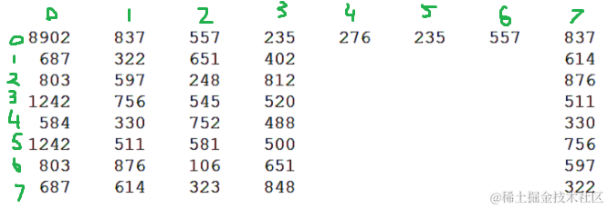

试求：

#### (1) $|F(3, 5)|$

傅里叶变换频谱图的对称性$|F(u, v)| = |F(M - u,N-v)|$，其中$M$、$N$分别表示图像的高度和宽度。

故$|F(3, 5)| = |F(5, 3)| = 500$

#### (2) $|F(6, 6)|$

同理可得，$|F(6, 6)| = |F(2, 2)| = 248$

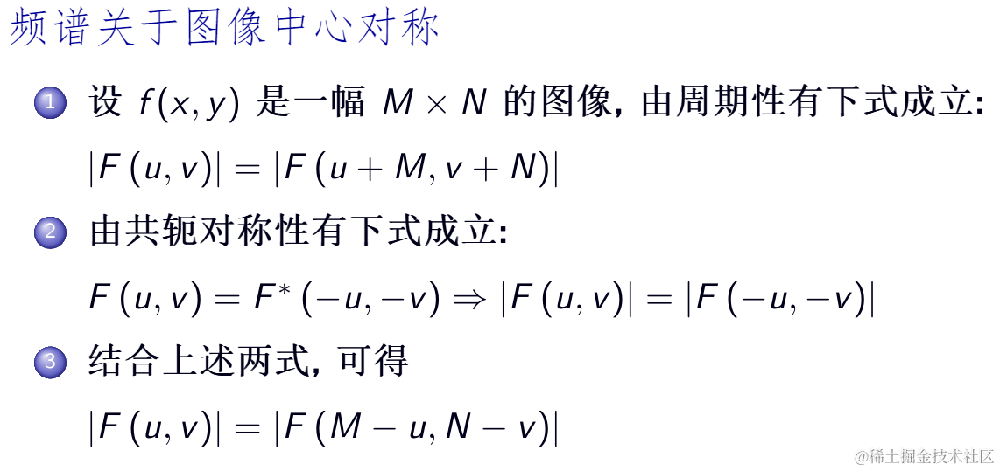

### 10. 简述图像信号的冗余表现在哪些方面。

- 编码冗余（Coding redundancy）：假如直接采用RGB888之类的等长编码对图像进行编码，则会导致编码冗余。这是因为某些像素值出现的频率可能较大，而另外的一些则较小。对此我们应使用变长编码，对于出现频率高的像素值赋较短的编码，对出现频率低的赋较长的编码。

- 像素间冗余（Inter-pixel redundancy）：邻域范围内的像素，往往具有相近的灰度值。对这些像素点的灰度值进行频繁的记录，可能会导致冗余。

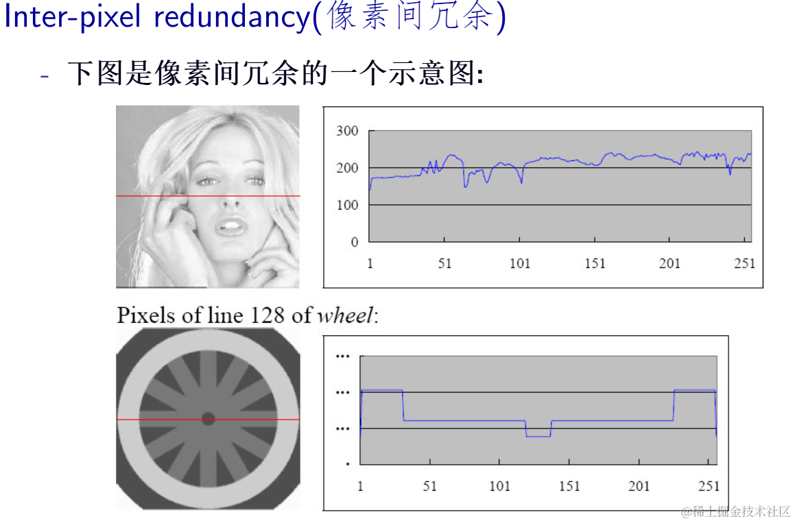

- 心理-视觉冗余（Psycho-visual redundancy）：人类视觉系统对某些细节信息的不敏感性。在图像和视频压缩领域，这种冗余可以被利用来去除一些人眼不容易察觉的细节，从而减少数据量而不显著影响感知质量。例如，在使用JPEG算法压缩图片时，适当削减图片中的高频成分并不会影响图片的观感，这是因为人眼对图片中的某些高频细节并不敏感。又比如，对于视频中快速运动的花草，人眼很难注意到具体的草叶抖动细节，因此这些细节可以在视频压缩过程中被更多地舍弃。

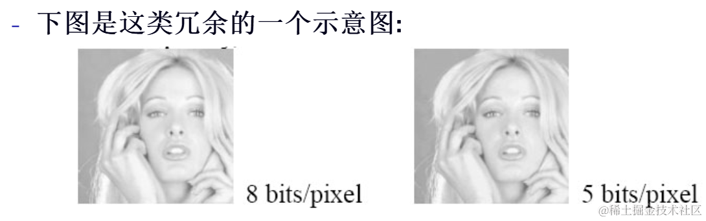

- 帧间冗余（Inter-frame redundancy）：视频中两帧之间的图像内容可能非常相似，人眼对此并不敏感。

### 11. 设结构元素$B$的大小为3\*3，且所有元素都为1。

现在将$B$与图像$A$作某种形态学运算$AΘB = \left\{ (x,y) \mid B_{(x,y)} \subseteq A \right\}$。其中$B_{(x,y)}$表示将$B$随原点整体平移至图像$A$的$(x,y)$位置。

请问：运算结果将使得图像的面积变大、变小还是不变？

**答：** 对图像作腐蚀运算，结果图像的面积将变小。

### 12. 设原图像A，结构元素$B$（原点位于中心）。求$A \oplus B$的结果图像。

A: 

```text
0 0 0 0 0 0 0 0 0 0 0 
0 0 0 0 0 0 0 0 0 0 0 
0 0 0 0 0 0 0 0 0 0 0 
0 0 0 1 1 1 1 1 0 0 0 
0 0 0 1 1 1 1 1 0 0 0 
0 0 0 1 1 1 1 1 0 0 0 
0 0 0 0 0 0 0 0 0 0 0 
0 0 0 0 0 0 0 0 0 0 0 
0 0 0 0 0 0 0 0 0 0 0 
```

B:

```text
1 0 0
0 1 0
0 0 1
```

**答：**

由于$B$关于原点中心对称，故$\hat{B} = B$.

结果图像如下：

```text
0 0 0 0 0 0 0 0 0 0 0 
0 0 0 0 0 0 0 0 0 0 0 
0 0 1 1 1 1 1 0 0 0 0
0 0 1 1 1 1 1 1 0 0 0
0 0 1 1 1 1 1 1 1 0 0
0 0 0 1 1 1 1 1 1 0 0
0 0 0 0 1 1 1 1 1 0 0
0 0 0 0 0 0 0 0 0 0 0 
0 0 0 0 0 0 0 0 0 0 0 
```

### 13. 某信源包含7个符号A、B、C、D、E、F、H，以 Huffman 编码进行编码后每个 符号对应的编码如下表。


|符号|A|B|C|D|
|-|-|-|-|-|
|编码|1010|1011|100|111|

|符号|E|F|H|
|-|-|-|-|
|编码|00|110|01|

若有编码后的比特串：`1011101011110110000110`，试求解码后的符号串？

**答：**

1. `1011`与B匹配，剩余字符串`101011110110000110`
1. `1010`与A匹配，剩余字符串`11110110000110`
1. `111`与D匹配，剩余字符串`10110000110`
1. `1011`与B匹配，剩余字符串`0000110`
1. `00`与E匹配，剩余字符串`00110`
1. `00`与E匹配，剩余字符串`110`
1. `110`与F匹配，程序结束

故解码后的字符串为`BADBEEF`

### 14. 设图像$f$和某种卷积模板$M$。

f如下：

```text
1 2 5 7 2
1 2 7 3 6
5 5 8 1 2
9 2 8 3 5
1 7 5 3 3
```

M如下：

```text
-1 -1 -1
2  2  2
-1 -1 -1
```

试问：

#### (1) 求$f * M$所得结果$(2,3)$位置的值

**答:** 所求结果 = 7+3+6-8\*2-1\*2-2\*2+8+3+5 = 10

#### (2) 分析卷积模板$M$能实现什么功能？

尽管该模板并不属于标准的Sobel或Prewitt模板，但依旧可以用于检测水平方向的边缘。

当模板中心上下侧的像素值差异不大或呈现线性递增规律时，该模板认为此处没有边缘，因此不会有显著的响应。比如下面的两个例子：

```text
100 100 100       -1 -1 -1
150 150 150   *    2  2  2   =  0
200 200 200       -1 -1 -1

100 100 100       -1 -1 -1
101 101 101   *    2  2  2   =  15
97  97  97        -1 -1 -1
```

当模板中心上下侧的像素值出现明显差异时，无论模板中间行的像素值与哪一侧较为接近，该模板都会认为此处有边缘，会产生显著的响应。比如下面的两个例子：

```text
100 100 100       -1 -1 -1
255 255 255   *    2  2  2   =  780
150 150 150       -1 -1 -1

100 100 100       -1 -1 -1
125 125 125   *    2  2  2   =  300
250 250 250       -1 -1 -1
```

### 15. 给出图像分割的定义，举例说明图像分割的作用。

图像分割（Image Segmentation）的定义是将图像划分为多个有意义的区域或对象，使得区域内部特征相似而区域间特征有显著差异。通过图像分割，可以识别和提取图像中的目标对象和背景，以便进一步分析或处理。

举例：

- 自动驾驶：在自动驾驶车辆中，车载摄像头获取的路况图像需要分割出行人、车道线、交通标志和其他车辆等不同区域。
- 遥感图像处理：利用卫星或无人机拍摄的遥感图像，可以分割出农田、水体、城市建筑等不同地物类型。
- 人脸识别：在人脸识别系统中，图像分割用于提取脸部区域并分离背景，例如识别出的脸部特征用于身份验证。
- 工业自动化：在工业检测中，图像分割用于检测流水线上产品的缺陷，比如检测手机屏幕上的划痕或印刷电路板上的短路。

### 16. 有如下 4×8 的 8 位图像，请计算图像的熵

```text
21 21 21 95 169 243 243 243
21 21 21 95 169 243 243 243
21 21 21 95 169 243 243 243
21 21 21 95 169 243 243 243
```

**答：**

不同灰度值出现的频率如下：

|灰度级|21|95|169|243|
|---|-|-|-|-|
|频率|$\frac{12}{32}$|$\frac{4}{32}$|$\frac{4}{32}$|$\frac{12}{32}$|

所求熵$H = -\frac{12}{32} × \log_2{\frac{12}{32}} - \frac{4}{32} × \log_2{\frac{4}{32}} - \frac{4}{32} × \log_2{\frac{4}{32}} -\frac{12}{32} × \log_2{\frac{12}{32}}$

得$H ≈ 1.81比特/符号$

### 17. 有一幅64\*64，8bit灰度级的图像，其归一化灰度直方图如下：

|灰度级|0|1|2|3|
|-|-|-|-|-|
|频率|0.19|0.25|0.21|0.16|

|灰度级|4|5|6|7|
|-|-|-|-|-|
|频率|0.08|0.06|0.03|0.02|

现对该图进行某种灰度级变换$E(r) = \lfloor {\frac{r^2}{7} + 0.5} \rfloor$，求经过变换后所得结果图像的直方图（可列表）？

**答：**

灰度变换结果如下：

|原灰度级|0|1|2|3|
|-|-|-|-|-|
|新灰度级|0|0|1|1|

|原灰度级|4|5|6|7|
|-|-|-|-|-|
|新灰度级|2|4|5|7|

变换后图像的直方图列表如下：

|新灰度级|0|1|2|3|
|-|-|-|-|-|
|频率|0.44|0.37|0.08|0|

|新灰度级|4|5|6|7|
|-|-|-|-|-|
|频率|0.06|0.03|0|0.02|

### 18. 如下图所示输入的二值图像，经过怎样的形态学处理能产生如图所示的结果图像？

输入图像： 

结果图像： 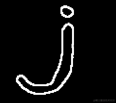

#### 方法一

先对原图像进行腐蚀，再将原图像减去腐蚀结果即可。

代码：

```python
import cv2
import numpy as np

image = cv2.imread('j_pattern.png', cv2.IMREAD_GRAYSCALE)
_, image = cv2.threshold(image, 0, 255, cv2.THRESH_BINARY)

kernel = np.ones((9, 9), np.uint8)
eroded_image = cv2.erode(image, kernel, iterations=1)

result = np.copy(image)
result[eroded_image == 255] = 0

cv2.imwrite('result.png', result)
```

#### 方法二

先对原图像使用Canny提取出极细的边缘，再对边缘图像进行适当的膨胀操作，也可以达到题目所要求的效果。

代码如下：

```python
import cv2
import numpy as np

image = cv2.imread('j_pattern.png', cv2.IMREAD_GRAYSCALE)
_, image = cv2.threshold(image, 0, 255, cv2.THRESH_BINARY)

edges = cv2.Canny(image, 100, 200)

kernel = np.ones((3, 3), np.uint8)
dilated_image = cv2.dilate(edges, kernel, iterations=1)

cv2.imshow('edges', edges)
cv2.imshow('result', dilated_image)
cv2.waitKey()
cv2.destroyAllWindows()
```