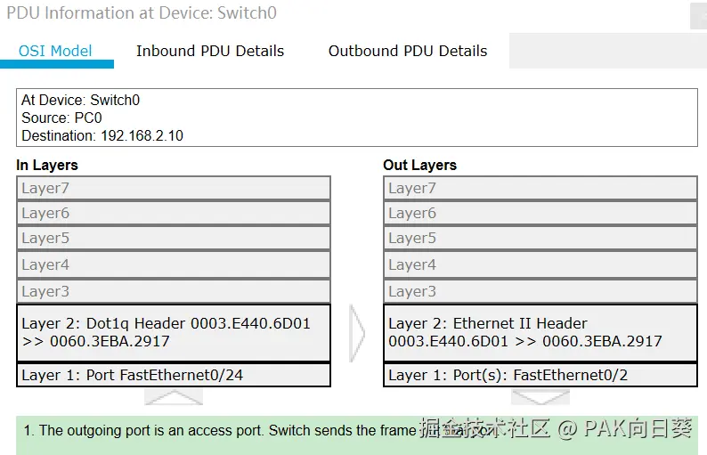

计网实验课涉及到的单臂路由网络拓扑乍，一看让人感到十分困惑。具体来说，奇怪的地方可能包括如下几点：

*   为什么三级路由器只有一根线和二级交换机相连，却能实现沟通`192.168.1.0`和这`192.168.2.0`两个不同子网的效果？
*   为什么二级交换机和三级路由器相连的物理接口要设置成trunk口？
*   ......

为了解答这些问题，最好的办法还是把主机PC0（`192.168.1.10`）尝试ping通主机PC1（`192.168.2.10`）的整套流程按部就班地走一遍。

# 阶段1：PC0获取其所在网络默认网关的MAC地址

刚开始的时候，**我们假设PC0的ARP表为空**。

那么，因为PC0注意到它将要请求的目标IP地址`192.168.2.10`和自己（`192.168.1.10`）并不处于同一网段，于是若想要成功请求目标IP，ICMP数据包就必须先发送到PC0所在网络`192.168.1.0`的网关路由器`192.168.1.1`上。

> 注意：PC0自身的IP地址和默认网关地址都已由我们事先手工设置过了，所以PC0可以知道这些信息！

不幸的是，由于PC0的ARP表是空的，PC0并不知道默认网关的MAC地址是啥。所以它就会发出一个广播请求，以求在自己所在的网络中找到默认网关：

接下来这个ARP数据包会被发送到二级交换机上。

由于PC0所连接的交换机Fa0/1端口被我们事先划到了vlan10，而PC1所接端口Fa0/2端口则被划到了vlan20，所以这个数据包并不会被交换机转发到PC1。

同时，由于我们事先已经为三级路由器配置了虚拟出来的子接口Fa0/0.1（配置命令见下图），并且将该子接口划入vlan10，故我们的ARP数据包可以经由交换机的trunk口（被封装成IEEE 802.1q以太网帧后）抵达路由器的虚拟子接口Fa0/0.1！

> 现在我们就可以理解配置路由器时`encapsulation dot1Q 10`这条命令的作用了。这条命令至少描述了两件事：
>
> *   虚拟接口Fa0/0.1收发的是IEEE 802.1q以太网帧，这与交换机的trunk口相对应！
> *   虚拟接口Fa0/0.1被划入vlan10，这样它才能收得到经由交换机转发的来自PC0的数据包！

ARP数据包进出交换机的封装情况如下图所示：

当三级路由器接收到来自二级交换机转发的ARP数据包后，它能够发现IP为`192.168.1.10`的主机（PC0）所要请求的IP（`192.168.1.1`）与自己的IP地址相等，遂作出响应，将自己的MAC地址`0003.e440.6d01`返回给PC0。

与此同时，**三级路由器自身也知道了IP地址`192.168.1.10`所对应的MAC地址为`000C.CFD9.000B`，它也会将这条信息记录到自己的ARP表中去**。（后面有用！）

接下来，三级路由器发出的ARP响应数据包会被交换机转换为普通的以太网帧，并发回给PC0：

PC0收到ARP响应数据包后，就可以知道自己所在网络的默认网关的MAC地址了。

# 阶段2：PC0的第一次尝试

现在PC0要开始尝试向它真正的目标`192.168.2.10`发送ICMP数据包了。

这个从PC0发出的ICMP数据包还是比较有意思的。可以看到，虽然其中网络层的目标IP地址填写的是实际想要请求的PC1的`192.168.2.10`，但在数据链路层填写的目标MAC地址却是刚才获取到的默认网关的MAC地址`0003.e440.6d01`。

这想想也是比较合理的，毕竟涉及跨网段通信，无论如何我们都必须先将数据包发给默认网关嘛！

接下来PC0发出的ICMP数据包被交换机接收，并被封装成IEEE 802.1q以太网帧（注意VID被标记为10），最终从trunk口被发往路由器。

> 注意：由于交换机工作在数据链路层，因此ICMP数据包中网络层的IP地址无论填啥，都不会影响到交换机的转发工作。

在由交换机从trunk口发出的IEEE 802.1q以太网帧中，已经明确给出了目标路由器的MAC地址和目标VID，因此肯定能被路由器（的虚拟接口Fa0/0.1）正确接收。

接下来路由器检查ICMP数据包，发现目标IP`192.168.2.10`与自身路由表中的`192.168.2.0/24`网络段相匹配，且路由器自身已通过虚拟接口Fa0/0.2与该网络（的二级交换机）相连。

也就是说，接下来路由器只需要将该数据包重新封装并投递给`192.168.2.0/24`网络的二级交换机，就大功告成了。

然而，不幸的事又发生了。由于路由器自身的ARP表中目前并没有IP地址`192.168.2.10`所对应的MAC地址的记录，因此ICMP数据包在数据链路层无法完成封装！在Cisco Packet Tracer模拟器中可以看到，在此情况下路由器会选择**直接丢弃该ICMP请求，而不给予最初发送该请求的PC0任何响应**。

这就解释了为什么本次实验中，我们在ping请求PC1的时候，第一次请求会出现超时的奇怪现象：

# 阶段3：路由器获取PC1的MAC地址

当然，路由器的工作到这里并没有结束，它还必须想办法获取到IP为`192.168.2.10`的机器的MAC地址，这样才能确保下次它能够成功地在数据链路层封装针对该IP地址的网络请求！

此时路由器封装的ARP数据包如下图所示：

这里需要特别注意，虽然路由器是因为不知道目标设备的MAC地址才导致的丢包，但回顾上述过程我们可以发现，路由器至少还是知道自己已经（通过虚拟接口Fa0/0.2）与目标设备处于同一个网络（`192.168.2.0`）当中。因此，只需要向该网络进行广播，应该就能找到目标设备的MAC地址。

这就不难理解为什么此时路由器发出的ARP数据包中填写的源IP地址是`192.168.2.1`，而非`192.168.1.1`了！

相应地，路由器从虚拟接口Fa0/0.2中发出的IEEE 802.1q以太网帧中VID字段也应填写20（十六进制0x14），而非10（十六进制0x0a）了！

交换机接收到该IEEE 802.1q以太网帧后，进行vlan20内部进行广播转发，继而被PC1接收到。这个过程没啥好说的。

PC1接收到来自路由器的ARP请求后，作出响应，将自己的MAC地址经由交换机再发回给交换机。这个过程也比较简单。

当路由器（经由Fa0/0.2虚拟接口）接收到ARP响应后，就会更新自己的ARP表。现在它总算知道IP地址为`192.168.2.10`的设备的MAC地址了。

# 阶段4：PC0的第二次尝试

在阶段2的分析中我们已经知道，由于在路由器转发ICMP数据包到网络`192.168.2.0`后发生了丢包而导致PC0发现请求超时，接下来PC0就会再次尝试向PC1发出请求。下面让我们来看看这次请求能否成功。

经过阶段1的折腾，现在PC0已经知道了其所在网络默认网关（也就是我们的路由器）的MAC地址，因此可以完成数据包的封装。接下来，数据包将被投递给二级交换机。

二级交换机再将数据包经trunk口投递给路由器，没啥好说的：

这一次，由于路由器的ARP表中已经知道了目标IP`192.168.2.10`所对应的MAC地址，因而可以顺利完成数据包的封装，并经由交换机发往PC1！

> 注意：在路由器网关封装的请求中，源IP地址仍然是PC0的IP地址，但是源MAC地址却已经被替换成了三级路由器自己的MAC地址。这也体现了计算机网络各个层次的封装关系，即从网络层看，似乎一直是PC0和PC1之间经历着层层转发在通信；但深入到数据链路层，就能发现网关其实在底层扮演着至关重要的中间人的角色。

二级交换机将ARP数据包转发到PC1，这一步没啥好说的：

PC1接收到ICMP请求后作出响应。注意这里虽然网络层的目标IP填的仍然是PC0的地址，但从数据链路层来看，实际上还是要先发回给我们的三级路由器：

ICMP响应经由交换机被路由器接收后，路由器注意到如下两件事：

*   根据自己的路由表可知，路由器自身已处于目标IP`192.168.1.10`所在的网络当中，即`192.168.1.0`。 更直白地说，路由器应该已经与该网络的二级交换机相连。
*   在阶段1中，路由器自身已经知道了目标IP（PC0）所对应的MAC地址是多少。

综合这两点，路由器得以成功地进行数据包的封装，并经由二级交换机投递给PC0。

最终，ICMP响应被PC0接收，一次完整的ping过程完成！

