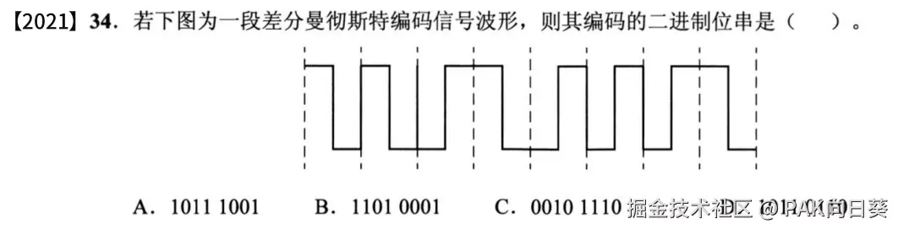
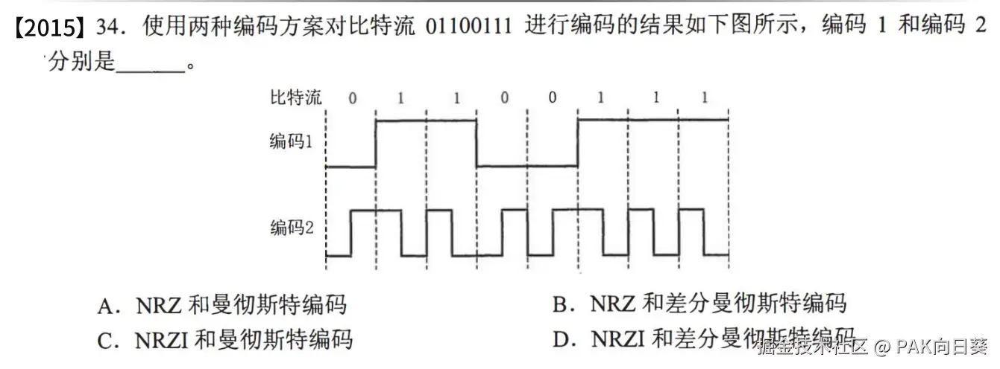
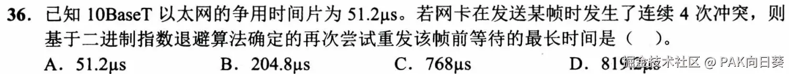
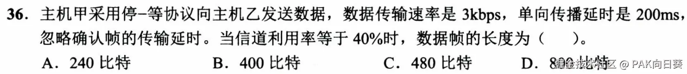

# 绪论

## 计算机网络模型分层体系

其中所谓的五层参考模型结合了OSI参考模型和TCP/IP实现模型，主要用于教授计算机网络课程。

## 计算机网络中，"协议"（Protocol）与"服务"（Service）这两个概念有何区别？有何关系？

区别：

协议是一组规则和约定，用于在网络中不同的设备之间进行通信。协议定义了数据在网络的某一分层中是如何被存储、传输、处理与接收的。

服务是指一种提供功能的能力，它通常是建立在协议之上的。某一网络分层所实现的协议，为更高的网络分层提供了某种功能或保证（即所谓的"服务"），比如支持传输数据、支持存储数据等。

联系：

服务的实现通常依赖于一种或多种协议，协议提供了实现服务所需的基础功能。例如，传输层可以向应用层提供可靠的端到端数据传输连接服务，而这种服务是依赖传输层的TCP协议实现的。

# 物理层

在OSI参考模型中，物理层指的是**物理连接**。

这句话可以从物理层提供的功能来理解。物理层的主要功能就是利用传输介质搭建起物理连接，**实现二进制比特流的透明传输**，尽可能屏蔽掉具体传输介质和物理设备的差异。有了物理层为我们实现比特流的传输，我们才能使用计算机网络中传输以太网帧——因为以太网帧在本质上就是由一串二进制序列所构成的信息！

## 传输介质

### ⭐双绞线（Twisted Pair）

从屏蔽措施来看，可以分为STP和UTP两类：

从内部排线构造来看，可以分为直连线和交叉线两类：

1.  **直连线（copper straight-through）** ：用于**连接不同类型的设备**，例如将计算机连接到交换机或集线器。这种电缆的两端使用相同的线序，即两端的接针排列是相同的。
2.  **交叉线（copper cross-over）** ：用于**连接相同类型的设备**，比如将两台计算机直接连接在一起，或将两个交换机、集线器连接在一起。在这种电缆中，两端的接针排列不同，其中一端的发射端口和接收端口会交叉，从而使得信号能够正确传输。

### 同轴电缆（Coaxial）

### ⭐光纤（Fiber）

注意区分**单模光纤**和**多模光纤**的物理特性区别，以及它们所应用的场景！

### 以太网命名规则

#### 例题

解答：

T表示双绞线（twisted pair），故选A。

## 传输编码

### 曼彻斯特编码

**考试中以太网信道默认采用的编码格式。**

波形图按时间间隔分割后，规定每个间隔内下降沿为1、上升沿为0，反之亦可。

#### 例题

解答：

可能表示`11001001`或者`00110110`，故选A。

### 差分曼彻斯特编码

每一个时间间隔开始时，电平相较于上一个间隔结束时发生跳变，则当前间隔表示比特0，否则表示比特1。

#### 例题

解答：

第一个比特位可能是0也可能是1，故选A。

### 归零编码（RZ编码）

### 不归零编码（NRZ编码）

### 反向不归零编码（NRZI编码）

可以对比差分曼彻斯特编码进行记忆：

*   相同点：都用信号翻转表示0，信号不翻转表示1。
*   不同点：差分曼彻斯特编码除了在每两个时间间隔交界处可能会发生翻转外，在每个时间间隔内都会有一次高低电平的翻转变化。而NRZI编码只有在两个时间间隔交界处可能发生翻转。

#### 例题

解答：

编码1的方波图正好对应了要表示的比特流，因此是不归零编码（NRZ）。编码2中每一个时间间隔中若出现上升沿则恰好表示0，若出现下降沿则恰好表示1，故为曼彻斯特编码。

选A。

## 信道复用

### 频分复用/频分多址（Frequency Division Multiple Access, FDMA）

类比：不同的两位需要互相交谈的学生（通信设备）在同一个教室（物理信道）中分别用不同的方言（频率）交谈（通信）。

### 波分复用

### 时分复用（Time division multiple access, TDMA）

类比：不同的两位需要互相交谈的学生，分别在不同的时间段在同一个教室中交谈。

### 码分复用/码分多址（Code Division Multiple Access, CDMA）

例题：

解答：

将C收到的序列按每四个数字分成一组，得到`(2, 0, 2, 0)`、`(0, -2, 0, -2)`和`(0, 2, 0, 2)`这三个向量。将它们分别与站点A的码片序列（向量）作内积，得到+4、-4和+4。每个码片序列都有四个分量组成，所以我们再把结果除以4，得到+1、-1和+1。根据所学，+1代表比特1，-1代表比特0，故C收到A发送的数据为二进制序列`101`。

## 物理层设备

**中继器（Repeater）** 可以对衰减的信号进行放大，保持与原数据相同，以**增加信号传输的距离**，延长网络的长度。

**集线器（Ethernet hub）** 可以将多条以太网双绞线或光纤集合连接在同一段物理介质下的设备。其依赖**CSMA/CD** 进行介质访问控制。其效果可以类比将多台网络设备接到同一个网络总线上。

**注意区分集线器和交换机的差异！** 前者工作在物理层，只不过是机械地传递信号，并且无法隔离冲突域（即当同时有多台网络设备的流量通过Hub这个单一的物理信道时，它就会把这些流量数据混到一起而无法区分开来），而需要使用CSMA/CD机制来避免冲突。而后者工作在数据链路层，具备根据MAC地址表定向转发以太网帧、隔离冲突域等高级功能！

## 物理层的四大接口特征

机械特性

*   定义：规定了接线器的形状、尺寸，引脚数和排列、固定和锁定装置
*   举例：RJ45 是常见的以太网接口，其机械特性包括：
    *   形状和尺寸：RJ45 的接口形状标准，通常有 8 个引脚（也称为接触点）并排列在一排列中，外形呈长方形，这样可以方便插拔。
    *   引脚数和排列：RJ45 接口具有 8 个接点，按照特定的顺序排列，使得网络设备能够通过这些引脚连接在一起。
    *   固定和锁定装置：RJ45 有一个卡扣设计，插入后会有“咔哒”声，以确保连接不松动，这样可以避免网络中断。

电气特性

*   定义：规定了线路上的电压范围
*   举例：在100BASE-TX （100Mbps，百兆宽带）标准中，线上的信号电压通常在 2.5V 到 5V 之间。

功能特性

*   定义：规定了线路上出现的某一电平表示的含义
*   举例：在曼彻斯特编码中，规定上升沿表示二进制0、下降沿表示二进制1。

过程特性

*   定义：规定了不同功能的事件可能出现的顺序
*   举例：当两台以太网设备建立连接时，它们首先分别需要进行自检与初始化，而后它们会分别向对方发送特定的信号，以协商传输速度、是否支持全双工通信等关键信息（以太网自协商），最后才进行数据传输。

# 数据链路层

数据链路层的三大问题：

*   封装成帧
*   透明传输
*   差错检测

## 封装成帧与透明传输

通过计算机网络传输的数据，在数据链路层会被包装成以太网帧的形式。以太网帧也是学习和理解数据链路层的核心。

在真实的计算机系统中，软硬件以如下的方式协同工作，来接收以太网帧：

1.  网卡（NIC）硬件电路接收到电信号，根据特定的编码规则（如以太网默认采用曼彻斯特编码），将其解码为明文的二进制比特串。
2.  网卡将比特串按某种特定的规则拆分为独立的以太网帧，对以太网帧进行差错校验，之后经DMA通道将以太网帧分别写入操作系统内核（从计算机主存中分配的）缓冲区中。
3.  网卡向CPU发送硬中断，CPU停止当前工作，转而进入中断处理程序进一步处理已存储进主存的、完整的以太网帧。
4.  ...

进一步细节可参考[这篇文章](https://mp.weixin.qq.com/s?__biz=MjM5Njg5NDgwNA==\&mid=2247484058\&idx=1\&sn=a2621bc27c74b313528eefbc81ee8c0f\&chksm=a6e303a191948ab7d06e574661a905ddb1fae4a5d9eb1d2be9f1c44491c19a82d95957a0ffb6\&cur_album_id=1532487451997454337\&scene=190#rd)。

### 如何确定以太网帧的边界：字符填充法

要实现**封装成帧**，要解决的第一个问题是：当一连串二进制数据被网卡接收到之后，它要如何将其正确地拆分为若干个互相独立的以太网帧呢？这个问题换种说法，也就是说如何在一连串二进制数据中，确定出每个以太网帧的起始边界和结束边界呢？

在谢希仁的计网教材中，给出了一种**理论上可行的办法**，称作"字符填充法"。

如果以太网帧中的数据仅含可打印ASCII字符的文本，那么在ASCII码表中已经给出了一个用于表示起始和结束的特殊字符，分别为SOH（`0x01`）和EOT（`0x04`）。只需将他们分别添加到单个以太网帧的头部和尾部，就能将不同的以太网帧区分开来。

但这种方法对于要传输一般二进制字节流的情况就不灵了，毕竟谁也不知道上层协议会在以太网帧中封装什么字节。如下图所示，倘若上层协议硬是要在以太网帧中塞入取值为`0x01`或者`0x04`的字节，那么这个方法就失效了。

在谢希仁教材中，对此给出了一种补救办法，即引入转义字符ESC（`0x1b`）。如果上层协议硬是要在以太网帧中塞SOH和EOT，那么就在这些字符前面添加上转义字符ESC。当网卡解析以太网帧时，如果碰到了ESC，那么它会认为后面跟随的那个字节只不过是一个普通的数据，而不是以太网帧的开始/结束控制字符。

同时，网卡解析以太网帧时，会顺带着把插入的转义字符，以保证接收方软件接收到的上层数据，和发送方应当是一致的，这就是所谓的**透明传输**。

### 真实世界的以太网帧

**在真实世界中，数据链路层使用了更加复杂的同步机制和状态机控制，来实现对不同以太网帧的区分。** 因为考试不考，且可能会涉及到通信原理的知识，这里就不进一步深究了。

在真实世界中，以太网帧的两种主要标准为Ethernet II帧（更常见）和IEEE 802.3帧。

*   Ethernet II帧不会在帧头部明确给出以太网帧中有效荷载的总长度，而仅在类型字段中明确指出该帧中封装的上层协议（如IPv4、IPv6、ARP等），帧的长度由物理层和链路层的边界检测机制（如前导码和SFD）确定。
*   IEEE 802.3帧会在帧头部明确给出以太网帧中有效荷载的总长度。至于帧内封装了什么上层协议，则使用另外的机制予以通告，这增加了以太网帧的复杂性和处理开销。
*   Ethernet II帧的类型字段，和IEEE 802.3帧荷载长度字段，在单个以太网帧中的内存布局中位于相同位置,

下图展示了以MTU=1500进行传输时的Ethernet II帧的完整格式。

## ⭐差错检测：CRC校验（循环冗余校验）

从以太网帧的结构图中可以看到，在负载（用于嵌入IP数据包）之后跟随着一个大小为4个字节的冗余校验码（FCS）。事实上根据以太网帧规范，网络设备在数据链路层会使用CRC校验，以检验以太网帧在传输过程中是否会出现差错。

> 这里需要特别指出：差错检测是一种基础功能，用于发现数据帧在传输过程中是否受到干扰而出现错误。虽然数据链路层本身不负责重传或保证可靠性，但差错检测可以让设备在发现数据帧出错时直接丢弃错误帧，而不是继续将错误数据传递到更高层协议。这样可以减少传递错误的可能性，提升整个通信系统的效率和质量。

这样就涉及到两个问题：

*   对于发送设备，如何确定以太网帧冗余校验码字段要填写什么东西？
*   对于接收设备，如何根据冗余校验码字段来检测传输过程中是否发生了错误？

发送设备根据相关网络协议规范中规定的生成多项式来确定冗余校验码。例如，某发送设备要发送一个二进制比特流`1101011011`，且约定的生成多项式为$P(x) = x^4 + x + 1$，则冗余校验码的计算过程如下：

第一步，将生成多项式由公式的形式，转换成二进制序列。由$P(x) = 1x^4 + 0x^3 + 0x^2 + 1x^1 + 1x^0$，得生成多项式的5位二进制序列表示为$(10011)_2$。

第二步，由于生成多项式有5个比特位，按照算法规定，我们在欲发送的比特流后添加5-1=4个0比特位，然后将其作为被除数，且将二进制序列形式的生成多项式作为除数，进行**模二除法**。

最后我们会得到这个模二除法的余数`000...01110`。同样地，取该余数的最后5-1=4个比特位，即为欲发送以太网帧的校验码`1110`。发送设备将其拼接在以太网帧荷载（Payload）字段之后发送即可！

> 注意，在真实的以太网帧中，FCS字段是由以太网帧的Header字段和Payload字段共同确定的。不妨试想一下，如果以太网帧在传输过程中，Header（包含下一跳设备的MAC地址）如果出现差错，即使嵌入在Payload字段的IP数据包原封不动，势必也会造成严重的问题！

接下来，当接收设备收到以太网帧后，它要如何确定传输过程中是否出现了差错呢？按如下方式操作即可：

第一步，将接收到的校验码直接拼接在接收到的数据之后，得到二进制串`11010110111110`。

第二步，将该二进制串作为被除数，生成多项式二进制串作为除数，作模二除法：

第三步，检查所得余数，发现其全为0，说明数据传输时没有发生差错；反之若不全为0，则可断定传输过程中有差错发生！

> 在实际的网络规范中，生成多项式是唯一确定的。也就是说无论是发送方还是接收方，都是事先知道这个唯一的生成多项式的，这才能够保证差错校验得以实现。

## ⭐多路访问协议

在早期的以太网工程实现中，即在交换式以太网出现之前，人们会将多台计算机同时挂在一根大的通信总线上，以将它们组合成一个网络。但这就会导致一个尴尬的问题，这根大的通信总线对于所有计算机来说，是一个竞争资源。倘若有多台计算机同时使用这条总线来收发数据（以太网帧），那么这些数据在总线上的电信号势必会发生碰撞"搅在一起"，引发混乱。

为了消除这种碰撞，主要有两种思路。其一为划分广播信道带宽，物理层介绍的时分复用、频分复用和码分复用等都属于这一范畴。其二为使用载波侦听多路访问（Carrier-sense multiple access, CSMA）技术。

## CSMA与CSMA/CD

CSMA技术思路称之为**载波侦听**：总线上的某台计算机A在发送以太网帧之前，先侦听总线。如果发现总线上另一台计算机B正在发信，则A会进行等待，直到发现总线上没有其他计算机正在发信，才发送自己的以太网帧。

遗憾的是，CSMA仍然存在缺陷。比如说，总线上的两台计算机A和B离得非常远，假如计算机A已经开始发信，而由于A开始发信的信号传播到B存在一定的时延，计算机B此时不一定就能恰好监听到A已经在占用总线发信了。而如果这时候计算机B恰巧也要发信，那么就会造成误判，最终导致数据碰撞。

数据碰撞所导致的问题是显而易见的，即我们宝贵的信道资源被白白用来传输了分别来自计算机A和B的、经过数据碰撞已经损坏了的以太网帧。如果这种碰撞时常发生，将极大拉低整个总线式以太网的传输效率。

为了能够让计算机A和B及时检测到此类数据碰撞的发生，从而终止此时进行的数据传输（数据都搅在一起没法修复了，只能及时止损咯），以提高信道的传输效率，人们又提出了CSMA/CD协议。

所谓CSMA/CD，就是在CSMA的基础上又引入了**碰撞检测**：计算机A**在发信的过程中保持对总线的监听**。如果在此过程中它发现有另外一台计算机B同时在使用总线发信，则会立即停止发送数据。此后计算机A等待一段时间，再执行"监听-总线空闲时发信"的循环。对于B来说，如果它在发信过程中也恰巧监听到了A的发信信号，那么它也要进行同样的操作。

了解了CSMA/CD的基本思路后，我们不禁想要问一个问题：对于计算机A来说，假设在发信过程中与计算机B发生了碰撞，那么从它开始发信算起，最坏情况下需要再经过多少时间才能得知发生碰撞这个不幸的消息呢？

来来来，直接看图：

从图中可见，当$δ→0$，即A发信的电信号抵达B且B此时恰好刚开始发信时（假设B非常倒霉，刚开始发信时仍然没有检测到来自A的电信号正在总线上传播），A检测到发生碰撞的等待时间最长，为$2τ$，即两倍的总线端到端的**电信号传播延时**（或总线端到端电信号往返延时）。在有些参考资料中，称$2τ$为总线式以太网的争用期（RTT）。

现在让我们考虑一种情况。假如A要发送的以太网帧非常小，只需一个远小于$2τ$的时间就能发送完毕（一旦发送完毕A也就会结束对总线的监听），而后该以太网帧就在总线上进行传输。然而很不巧的是，这个以太网帧的电信号在抵达B处时，B恰好刚刚开始发信不久，于是乎便发生了数据碰撞。但这个时候尴尬的事情就发生了，由于A这个时候早就结束了对总线的监听，它自然也不可能知道它发出的以太网帧已经在抵达B附近的地方发生了碰撞损坏，自然也不会重发这个以太网帧了。

要解决这个问题的办法也非常简单粗暴——让A发的时间足够久（$≥2τ$），以确保在最坏情况下（$t→2τ$时）它也能在发送数据的过程中察觉到B发信产生的电信号，从而意识到发生了数据碰撞！

而为了让A发得足够久，我们就需要让A发的以太网帧足够长。于是乎采用CSMA/CD协议的总线式以太网的最小帧长公式便呼之欲出了——$最小帧长=2τ×总线传输速率$。

> 从上述的表述看，似乎是先有了所谓的总线电信号端到端传播延时（$τ$）/总线电信号端到端往返传播时延（$2τ$），然后才有了最小帧长。
>
> 但在实际的网络规范中，事实上人们首先人为规定了以太网帧的最小帧长为64Byte（256bit）这个定值，然后再根据以太网的传输速率再计算出对应$τ$或$2τ$的大小。以10Mbps以太网为例，就有$2τ = \frac{最小帧长}{总线传输速率} = \frac{256\text{bit}} {10\text{Mbps}} = 25.6\text{μs}$。最后在进行工程实现时，只需要确保电信号在物理信道上的传播速度能够达到这一数值即可。

注意，在实际实现中，若欲发送的以太网帧长不足64Byte，则发送设备需要预先给以太网帧填充一些无用字节，以达到最小帧长的要求！

到这里还没完，现在问题又来了。

假如就是那么巧，计算机A和B同时监听到了对方在发信而终止数据传输并进入临时的等待状态，那么它们分别应该等待多久然后再次尝试发信呢？显而易见的是，总不能让它们等待相同的时间然后再同时发信吧——那样它们就又得冲突了！于是乎我们就需要用到计算机网络课程中常用的一个处理手法，即引入一个随机的等待时间。

现在我们就能理解CSMA/CD所使用的算法的合理性了。简单分析该算法，可知如果某台计算机运气不是很好，在发信过程中已经遭遇了多次碰撞，那么可供它等待的时间范围也就越大，从直觉上来看也就更容易在等待结束后避免再次遭遇碰撞。

> 图中重传次数亦为发生碰撞的次数。

### 例题

**解答：**

设调整前最小帧长为$L$，帧长变化量$ΔL=-800\text{bit}$. 两个站点之间的距离为$x$，距离变化量$Δx$.

调整最小帧长前，$(RTT)_1 = \frac{L}{传输速率}$，即$传输速率=\frac{L}{(RTT)_1}$.

调整最小帧长后，$(RTT)_2 = \frac{L+ΔL}{传输速率}$，即$传输速率=\frac{L+ΔL}{(RTT)_1}$.

根据RTT的物理意义，又有$(RTT)_1 = \frac{2x}{200000\text{km/s}}$，$(RTT)_2 = \frac{2(x+Δx)}{200000\text{km/s}}$.

联立上述方程，可得$ΔL = -80\text{m}$，选D。

**解答：**

*   CDMA：码分复用，属于信道划分协议，不会发生冲突
*   CSMA：载波侦听多路访问，在设备发信时可能会发生冲突
*   TDMA：时分复用，属于信道划分协议，不会发生冲突
*   FDMA：频分复用，属于信道划分协议，不会发生冲突

选B。

**解答：**

*   A. CSMA/CD引入了碰撞检测，正确
*   B. CSMA/CD用于总线式以太网，错误
*   C. 根据公式，最小帧长与RTT（涉及到线路物理距离、电信号在物理线路上的传播速度）和数据传输速率有关，正确
*   D. 信号传播延时趋于0，则始终不会出现以太网帧发送过程中产生碰撞的情况，信道始终被用于传递有效的数据，信道利用率达到100%，正确

**解答：**

$128\text{bit} × 8 = 2τ × 100\text{Mb/s}$，解得$τ= 5.12\text{μs}$，选B。

**解答：**

选C。

## 链路层协议

### PPP协议（Point-to-Point Protocol）

互联网用户通常需要连接到某个ISP（电信、移动、联通）才能接入到互联网，PPP协议就是用户计算机和ISP进行通信时所使用的数据链路层协议。

## 链路层设备

常见的链路层设备：

*   网桥（桥接器）：能够识别数据链路层中的数据帧，并将这些数据帧临时存储于内存，再重新生成信号作为一个全新的数据帧转发给相连的另一个网段（即网络设备）。
*   交换机：多端口的网桥。

### 例题

**解答：**

选A

**解答：**

本题考查交换机MAC地址表的原理。选B。

**解答：**

*   A. 该说法正确。
*   B. 基于交换机构建的交换式以太网不存在冲突域的问题，错误。
*   C. 交换机作为二级设备，并无法像三级路由器那样隔离广播帧（也就是说交换机收到来自某个物理端口的广播帧就会进行泛洪）， 该说法错误。
*   D. 虽然交换机在数据链路层可以将不同网络层协议的网络连接在一起，但由于网络层协议不同，这些网络之间仍然无法互相通信（即实现所谓的互联），该说法错误。

中继器和集线器工作在物理层，既无法隔离冲突域，也无法隔离广播域。

网桥工作在数据链路层，只解决了总线式以太网冲突域的问题，但无法隔离广播域。

路由器工作在网络层，一般情况下其不会向外转发广播帧，可以实现隔离广播域。

本题选D。

## 可靠传输（理论上的）

理论上可以在数据链路层制定一些协议，来实现网络数据的可靠传输。但在现实中，网络的可靠传输实际上是由传输层的TCP协议实现的。**因此这部分内容仅供应付考试，不必当真**。虽然学习这些理论上的协议的思想，可以更好地帮助我们理解TCP协议中可靠传输的原理。

以下介绍考试中可能出现的几种理论上的可靠传输协议。

### 停止等待-协议

停止-等待协议的原理图如下，非常好理解。这里需要注意的是，超时重传定时器的等待时间应该设置成比数据帧传输往返时间（RTT）略长一些。

#### 例题

**解答：**

选D。

### 滑动窗口

若采用滑动窗口来实现多帧并行发送（解决停止-等待协议同步发送效率低的问题），则可以考虑选择以下两种机制用于实现可靠传输：

#### 例题

**解答：**

选C。

**解答：**

选B。

# 网络层

## ⭐IP地址及其分类

按照古老的传统，会将IP地址划分为A、B、C等几类。具体的划分方案如下：

| Class | Binary Tag | Range                        | Useable Range                | Subnet Mask   | Tip           |
| ----- | ---------- | ---------------------------- | ---------------------------- | ------------- | ------------- |
| A     | 0          | 0.0.0.0 \~ 127.255.255.255   | 1.0.0.1 \~ 127.255.255.254   | 255.0.0.0     | 适用于大量主机的大型网络  |
| B     | 10         | 128.0.0.0 \~ 191.255.255.255 | 128.0.0.1 \~ 191.255.255.254 | 255.255.0.0   | 适用于中等规模主机数的网络 |
| C     | 110        | 192.0.0.0 \~ 223.255.255.255 | 192.0.0.1 \~ 223.255.255.254 | 255.255.255.0 | 适用于小型局域网      |
| D     | 1110       | 224.0.0.0 \~ 239.255.255.255 |                              |               | 组播地址，不能分配给主机  |
| E     | 1111       | 240.0.0.0 \~ 255.255.255.255 |                              |               | 保留不用          |

其中，A、B、C三类网络地址中又分别再划分出一段区间，用作局域网私有地址：

| Class | Range                          | Useable Range                  |
| ----- | ------------------------------ | ------------------------------ |
| A     | 10.0.0.0 \~ 10.255.255.255     | 10.0.0.1 \~ 10.255.255.254     |
| B     | 172.16.0.0 \~ 172.31.255.255   | 127.16.0.1 \~ 172.31.255.254   |
| C     | 192.168.0.0 \~ 192.168.255.255 | 192.168.0.1 \~ 192.168.255.254 |

此外，还有一些IP地址有特殊用途：

*   127.0.0.1\~127.255.255.254：用于本地软件回环测试，IP数据包不会被封装成帧再被网卡发送出去。
*   0.0.0.0：表示本网络中的本主机，在DHCP协议中会使用；或表示存在于Internet中的某个地址，在配置三级路由器的路由表时会用到。
*   255.255.255.255：表示对本网络内的所有设备进行广播。广播底层仍然依赖二级交换机实现，且广播帧不会被三级路由器发送出网。
*   网络号不全为1，且主机号全为1的IP地址（例如12.13.255.255/16）:表示对该网络号所对应的计算机网络中的所有设备进行广播。路由器经过一定配置后可以转发此类广播帧。

### 例题

**解答：**

*   A. 0.0.0.0地址在DHCP协议中用户设备发出DHCP DISCOVER、DHCP REQUEST和DHCP ACK时，作为源地址填写到IP数据报头。显然，0.0.0.0不能作为目的地址。
*   B. 回环地址。在进行本地软件开发时，既可以作为源地址也可以作为目标地址。
*   C. 普通的C类地址，既可以作为源地址也可以作为目标地址。
*   D. 作用于局域网内部的广播地址。只能作为目标地址。

故本题选A。

## ⭐基于CIDR的子网划分与路由聚合

### 例题

**解答：**

$(248)_{10} = (11111000)_2$，可见可用于子网划分的比特位数为5，用于主机号分配的比特位数为3。

故共可划分子网$2^5=32$个，每个子网内可包括$2^3 - 2 = 6$（去除表示网址的IP地址和三级广播地址），选B。

**解答：**

从图中信息可知路由器R1已经直连网络192.168.1.0，而没有直连的网络为192.168.2.0/25和192.168.2.128/25。显然这两个没有直连的网络都是对大网络192.168.2.0/24的划分结果，且路由器R2恰与这两个网络直连。因此想要经过R1访问这两个没有直连的网络，只需将所有目标地址符合192.168.2.0/24特征的数据包都转发到R2即可，之后R2会再将数据包转发到目标网络。

选D。

掩码$(252)_{10} = (1111 1100)_2$，IP地址中$(77)_{10} = (0100 1101)_2$。

两者作按位与，可知IP分组的网络地址为$180.80.(0100 1100)_2.0/22$，该分组的广播地址为$180.80.(0100 1111)_2.255/22$，选D。

本题考查路由器进行转发时的最长前缀匹配原则，选C。

$2^7=128$，所以还要从大网络的主机号中拿出7个比特位用作子网号，所以还剩16-7=9个比特位用来表示主机号。所以每个子网内最多可以有$2^9-2=510$台主机，选C。

本题考查路由器进行路由聚合时的最长相同前缀原则，选C。

**解答：**

划分方案如下图所示，可见最小子网需要消耗4个bit来作为子网号，而整个IP地址至此就只剩下8个bit用作主机号，故最多可接$2^8-2=254$台主机，选B。

**解答：**

若待划分的子网为192.168.9.0/24，则划分出三个子网的方案如下：

于是可以排除A、C

若待划分的子网为192.168.9.128/25，则划分出三个子网的方案如下：

于是可以排除D

如果想要出现B选项，则必须按如下的等长方案进行划分

显然这样就会出现四个子网，与题意不符，故选B。

## ⭐路由算法与路由表

从算法原理上，路由算法可分为两大类：

*   距离向量路由算法：本质上就是个贪心算法。路由器仅与邻接的路由器定期交换信息，在一定条件下（比如得知经由某邻接路由器可以以更小的代价到达目标网络）会更新路由表。
*   链路状态路由算法：网络拓扑上的单台路由器需要拿到所有网络拓扑上所有路由器的链路状态信息（即路由器分别邻接了哪些节点，从路由器跳到这些节点的开销有多大），然后构建出整张网络拓扑图并执行迪杰斯特拉算法找出路由表中通往每一个目标网络的最优路径，以确定路由表中为了抵达每一个目标网络，下一跳分别应跳到哪台路由器上去。

不同的路由协议采用不同的路由算法进行实现：

*   RIP协议：工作在应用层，基于UDP协议交换报文，采用距离向量路由算法作为底层算法。
*   OSPF协议：工作在网络层，直接将交换报文封装在IP数据报中，采用链路状态路由算法作为底层算法。

### RIP

#### 工作流程

#### 协议缺陷

#### 例题

**解答：**

RIP协议中，如果跳数大于等于16，则表示相应网络不可达。故本题选D。

**解答：**

刚开始时，三台路由器针对目标网络的路由表条目分别如下：

*   R3：以目标网络的网关路由器（我们不妨记作R4）为下一跳，再经过1跳可以抵达目标网络
*   R2：以R3为下一跳，再经过2跳可以抵达目标网络
*   R1：以R3为下一跳，再经过2跳可以抵达目标网络

现在根据题意，R3和R4之间连接断开，即R3会把路由表中到达目标网络的总跳数更新为16。

接下来题目玩了个文字游戏，所谓的"并向R2通告一次新的距离向量"暗示R3在检测到与R4断开连接后，只通告了R2而没通告R1。那么此时R2会将到目标网络的距离更新为17，而R1仍然以为以R3作为下一跳，经过2跳可以抵达目标网络。

最后R1会向R2发送通告，于是乎R2误以为以R1作为下一跳，再经过3跳可以抵达目标网络。故本题选B。

> 说实话我觉得这题出得并不好，主要有以下两点原因：
>
> 1.  没有明确说明"R3没有通知R1新的距离向量"。
> 2.  没有明确说明所求的是R2在接收到来自R3以及R1的通告后，到目标网络的距离是多少。

**解答：**

本题考查距离向量路由算法的原理。选D。

### OSPF

**解答：**

分别设图中4个子网的网关路由器为R5\~R8，则迪杰斯特拉算法的运行过程如下：

## ⭐网络层提供的数据交换服务

### 网络层可能选择的数据交换方案有哪些？

我们首先来了解三种可供选择的方案，之后再来理解在实际的IP协议中最终采用了哪种方案。

电路交换

*   概念：在通信之前，通信双方需要先建立一条固定的、专用的通信线路，数据沿该线路以固定的带宽连续传输。通信结束后，释放该线路。
*   举例：老式固定电话，需要接线员进行接线以建立完整的通信线路。

报文交换

*   概念：数据以报文为单位传输，每个报文在到达**交换节点**时会**被存储、处理并转发**到下一个节点。不需要建立专用的通信线路。
*   举例：传统的电报系统就是一种报文交换形式，电报在不同的中继站被存储并转发到最终目的地。

分组交换

*   将数据报分割成**小的分组**，每个分组**独立传输**，可能通过**不同的路径**到达目的地，由接收端**按序重组**成完整的数据报。
*   举例：互联网协议（IP）是典型的分组交换实现，每个IP分组独立进行路由！

### 真实世界：IP数据报与IP分组

在真实世界的网络层，上层传输层的报文会被进一步封装成IP数据报进行传输。

IP数据报的头部格式如下

有了IP数据报之后，操作系统需要进一步将其封装成以太网帧（数据链路层）并通过网卡发送出去。那么，一个以太网帧最多能封装多少来自上层（网络层）的数据呢？

这个问题的答案与MTU（Maximum Transmission Unit）有关。该参数代表了从发送方到接收方所经过的数据链路上，每个以太网帧最多能封装的网络层数据包（IP数据报）的大小是多少。**如果IP数据报的大小过大，就需要进行IP分组，然后将分组后所得的多个IP数据报分别封装到多个以太网帧中。**

> 从如上的介绍中可知，IP协议采用的是分组交换方案。因此，在有的参考资料或考题中，也会将经过分组后得到的单个IP数据报称为"IP分组"。

显然，MTU受到途径数据链路中的硬件设备性能的制约，也就是说每个硬件设备能够处理的以太网帧最大大小是不同的。事实上，每一台设备都有自己的一个MTU值。

默认情况下，发送方和接收方的MTU都取1500。然而这还不够，我们需要知道整条数据链路上途径的若干台设备的MTU值的最小值，才能正确地进行IP分片。至于这个要怎么获取，就不是期末考试的考点了，我这里就放个[参考链接](https://blog.csdn.net/JiMoKuangXiangQu/article/details/134484455)好了。

### 尽最大努力交付

分析网络层IP数据报（IP分组）的传输方式，我们注意到IP协议具备以下几个特点：

*   无连接：IP协议在传输数据前不建立连接，也不保证两端之间的通信路径是固定的。
*   不可靠：IP协议并不保证数据包（分组）一定能够成功到达目的地，也不保证：
    *   数据包不会丢失。
    *   数据包到达的顺序与发送顺序一致。
    *   数据不会出现重复或损坏。
*   无反馈：如果数据包在传输过程中发生错误（如丢失、超时、拥塞等），IP协议不会主动通知发送方应进行重传。

换句话说，IP协议只负责将数据“尽最大努力”地从源地址传输到目标地址，至于数据是否成功送达、顺序是否正确，交由上层协议（如TCP）处理。

为什么IP协议被设计为“尽最大努力的交付”而非可靠交付呢？这个问题可从如下几个方面进行回答：

*   分层设计原则：网络通信协议通常采用分层设计，网络层只关注“尽力把数据传送到目的地”。更高层（如传输层）可以根据需求提供可靠传输（如TCP）或无连接传输（如UDP）。这种设计分离了功能，提高了灵活性和模块化，使得不同的应用可以根据自身需要选择适合的传输方式。
*   容错与适应能力：在一个可能出现路由中断、设备故障的网络拓扑中，完全可靠的网络层设计可能反而降低了网络的健壮性。“尽最大努力”的设计允许某些数据包丢失而不影响整体网络的运行，避免单点故障对整个网络的影响。
*   性能和效率：实现可靠传输（如保证不丢包、按序到达）需要复杂的确认、重传、拥塞控制机制，这会显著增加网络层的开销。在高流量的网络环境中，保持简单的“尽最大努力”机制有助于提高数据传输效率，避免因可靠性机制引发的更大延迟。

### 例题

**解答：**

由题意原IP数据报中的数据段总长度为1580-20=1560字节。

另外，MTU=800B，故分片后所得的每个IP数据报中数据段长度不能超过800-20=780字节。

注意，IP数据报报头记载的片偏移量是实际片偏移量除以8的结果，这意味着实际的片偏移量必须按8字节对齐，也就是说分片后的每个IP数据报中的数据段长度都必须是8字节的倍数。而最接近780的又是8的倍数的数值为776，故实际上分片后每个IP数据报中数据段的长度最大为776字节。

根据以上分析，原IP数据报的分片方案如下：

本题选B。

## NAT

经过NAT转换后应该得到一个形如`195.123.0.x/30`的公网地址，排除C、D。

$(35)_{10} = (0010 0011)_2$，最低两位全1，也就是说192.123.0.35是广播地址，排除B。

故选A。

**解答：**

（1）配置R2的静态NAT如下：

（2）

*   H2发送时：src=192.168.1.2, dst=203.10.2.2
*   R3转发后：src=203.10.2.6, dst=203.10.2.2
*   R2转发后，src=203.10.2.6, dst=192.168.1.2

## 网络层协议

### ARP协议

**解答：**

选A。

### ICMP协议

选B。

注意区分ARP协议和ICMP协议封装方式的差异，前者报文直接封装在以太网帧之中；而后者报文需要先封装到IP数据报中，然后再把IP数据报封装进以太网帧。

## 网络层设备

**解答：**

选C。

## 从IPv4到IPv6过渡：隧道技术

IPv6协议普及还不广泛，而且它的报文结构和IPv4还不太一样，不能够被仅支持IPv4的网络设备直接处理。

如图所示，假如两台网络设备A和F需要通过IPv6报文进行通信，但是它们中间相隔的路由器却只支持处理IPv4报文。这时就需要隧道技术，才能实现A和F的网络层通信。

图中路由器B和E是用于连接IPv6网络和IPv4网络的边界路由器，它们分别作为隧道的两端。而中间的若干台仅支持IPv4协议的路由器则构成了隧道。

从图中我们可以一目了然地看到隧道的工作原理，即当A向F发送IPv6数据报时，在隧道入口B处，会将该数据报使用IPv4数据报再次进行封装，并且将IPv4数据报的目的地指向隧道出口F，然后送入隧道进行传输。对于隧道中的IPv4路由器来说，它们会认为进入隧道的只不过是一个普通的IPv4数据报，而不会去关心该数据报中具体封装了什么上层数据。当被封装的数据报抵达隧道出口E时，E会负责将被封装的IPv6数据报解包出来，然后转发给目的地F。

可以看到，对于A和F来说，IPv6数据报被二次封装后穿越隧道的整个过程是完全透明的，即它们并不知道IPv6数据报传输中间发生了该过程。这也体现了计算机网络领域常见的"透明传输"思想。

## IP组播（多播）技术

# 传输层

## UDP

### 报头格式

UDP是一种无连接、不可靠的传输层协议，报头格式如下：

### 差错检测

UDP协议提供**可选的**差错检测机制。

要理解UDP协议的差错检测机制，首先需要注意到：UDP报文中虽然有校验和字段，但对于校验失败的UDP数据报实际上接收设备会采取直接丢弃（并且不会以任何形式
通知发送方）的处理方式。

也就是说虽然校验和字段存在，但这并不意味着UDP具备可靠传输（或者所谓的"差错控制"）的功能。

另外，UDP协议中发送方和接收方在计算校验和时，依据的是伪首部、UDP报头和应用层数据三部分。

后两者我们很熟悉，但是什么是伪首部呢？请看下图中涂黑的部分：

可见，除了16位UDP总长度，伪首部中的其余各个字段由来自IP数据报中的一些信息构成。换句话说，在计算UDP报头的校验和时，会把下层IP数据报中的一些信息一并计算进去，还把UDP报文的总长度多计算了一次！

### 多路复用和多路分解

UDP支持所谓的多路复用和多路分解。多路复用和多路分解的具体概念如下：

*   `多路复用: multiplexing`

    *   在源主机中，操作系统从不同进程（或Socket）中收集数据块,并为每个数据块封装上首部信息从而生成UDP报文，然后将UDP报文段传递给操作系统实现封装网络层IP数据报的程序。
    *   在操作系统处理网络层封装的程序中，会自动将目标IP相同的UDP报文封装进**同一个IP数据报之中**，并继续向下层（数据链路层）传递以作进一步封装，并最终通过网卡发送出去。这就实现了所谓的多路复用。

*   `多路分解: demultiplexing`

    *   在接收端，操作系统负责解封装传输层的程序会从接收到的IP数据包中提取出被打包在一起的若干个UDP报文。
    *   操作系统依据UDP报文中的目的端口，将这些报文中封装的数据**分别推送给相应的进程**（或Socket）。这就实现了所谓的多路分解。

## TCP

### 报文格式

TCP同样通过端口号来确定收发进程（本质是Socket），故同样可以实现多路复用和分解！

#### 例题

**解答：**

本题考查对UDP报文头部长度（8字节），以及TCP报文最小头部大小（20字节）的记忆。选D。

### 区分面向连接和面向报文服务

**TCP协议提供面向连接的服务：**

*   **连接建立**：在数据传输前，通信双方需要通过握手，建立一个逻辑连接。
*   **可靠性**：提供可靠的数据传输，确保数据包按顺序到达、无丢失、无重复，并且可以进行错误检测和恢复。
*   **流量控制**：支持流量控制，动态调整发送速度以适应接收方的处理能力。
*   **拥塞控制**：能够根据网络状况进行拥塞控制，以减少网络拥堵。
*   **状态管理**：在整个连接期间，通信双方会各自维护连接的状态信息，确保传输的连续性和可靠性

**UDP协议提供面向报文的服务**

*   **无连接性**：不需要在发送数据之前建立连接，每个数据报文独立发送，常见的协议有UDP（用户数据报协议）。
*   **不可靠性**：不保证数据包的传输可靠性，可能会有丢包、重排、重复等情况，适合对实时性要求高而对可靠性要求低的应用。
*   **无流量控制和拥塞控制**：没有流量控制和拥塞控制机制，发送速度由应用程序决定，可能导致网络拥堵。
*   **低延迟**：由于省略了连接建立和维护的过程，通常具有较低的延迟，适合需要快速传输的应用，如视频会议、在线游戏等。
*   **简单性**：实现相对简单，因为不需要维护状态信息。

### 差错检测

TCP协议提供了类似UDP的差错检测机制，可以通过对比它们之间的异同来加深理解记忆。

同

*   都基于校验和进行差错校验
*   计算校验和时都需要包括伪首部

异

*   TCP协议在传输时必须启用差错检测，而UDP则是可选的
*   TCP协议在差错校验的基础上，实现了基于可靠传输机制的差错控制。而对于UDP协议来说，对于未通过差错检测的数据报，会被接收方直接丢弃！

### 连接的建立与释放

#### 三次握手

##### 理论分析

标准的三次握手流程如下：

当服务端的操作系统收到来自客户端的SYN包（第一次握手）后，首先会新创建一个半连接控制块并添加到（相应socket的）半连接队列中，为后面正式建立连接（即进入ESTABLISHED状态）做好准备。

接着，服务端操作系统会向客户端发送第二次握手，告知对方：自己已经做好正式建立连接的准备。

客户端在接收到第二次握手后，还需要通告第三次握手，明确地向服务端通告：自己已经知道服务端的存在，且已经做好正式建立连接以传输数据的准备。

在收到第三次握手后，服务端的操作系统会将相应的半连接控制块从半连接队列中移除，并连接队列中创建一个连接控制块，以对该连接进行管理。同时，将连接状态切换到ESTABLISHED。

为了**避免系统资源被浪费**，若经过一段时间，服务端迟迟没有收到来自客户端的第三次握手，其操作系统可能会认为该连接是无效连接（客户端无法/不愿意与服务端建立正式连接），从而将相应的连接从半连接队列中直接移除释放。**这也就是客户端第三次握手的意义所在！**

什么情况下会出现这种所谓的"无效连接"呢？下面给出两个例子：

*   在网络链路上有一个滞留的SYN包最终被服务端接收，服务端会误以为有客户端想要与其建立通信，从而为其分配系统资源（创建半连接控制块）。
*   有攻击者向服务端发送了海量SYN包，迫使服务端在半连接队列中创建了大量控制块，并向攻击者发送第二次握手。这个过程会导致服务端的系统资源被迅速榨干，而攻击者的目的到此也就达成了，自然没有再向服务端发送第三次握手的必要。这就是所谓的SYN Flood攻击。

##### 实际抓包与观察

如果使用wireshark实际抓包观察，会发现前两次握手的SYN包的头部大小会比20字节大，也就是说这两个包的选项字段也被启用了：

**在这些选项中，MSS这个字段在考题中会出现，这里我重点讲一下。** MSS用于告知对方向自己发送TCP数据包时，每个TCP数据包中最多能封装多少应用层数据。MSS和MTU密切相关，如果取MTU=1500，那么有MSS=MTU-IP数据报头部大小-TCP数据报头部大小=1500-20-20=1460。

另外需要说明的是，虽然**在考试中我们默认第三次握手的tcp包中即携带了要传输的应用层数据**，但实际在使用wireshark进行抓包时，可能会观察到如下现象：

从图中可见实际上在进行第三次握手时，发送方发送了两个TCP包，区别于第二个包，实际上第一个包中并不含任何应用层数据。不过这两个包的seq号的确是一样的，因此"**第三次握手tcp包的seq号，即为要传输的应用层数据的第一个字节的序号**"这个结论仍然是成立的。

#### 四次挥手

##### 理论分析

标准的四次挥手流程如下：

要理解四次挥手，还需要结合断开连接过程中客户端进程和服务端进程的具体行为来看：

*   客户端进程主动执行`close()`系统调用，（客户端进程所在的操作系统）向服务端进程发出FIN包（**第一次挥手**），以告诉服务端"自己不会再向服务端发送任何**应用层数据**"。
*   服务端进程（所在的操作系统）接收到FIN包后，会执行如下几件事情：
    *   立即向客户端发送一个ACK确认包。（**第二次挥手**）
    *   在服务端进程的socket字节流管道末尾插入一个文件结束符（EOF），以便服务端进程中的代码能够感知到客户端进程已经发送第一次挥手了。
    *   服务端进程（的socket）转入CLOSE-WAIT状态。
*   服务端进程中的代码通过`read()`系统调用读取到了EOF，接下来它有几种选择：
    *   若服务端进程已没有应用层数据要向客户端发送，那么它会立即执行`close()`系统调用。
    *   若服务端进程还有应用层数据需要向客户端发送，那么它会继续向socket字节流管道中写入数据。这些数据也仍然能被客户端进程接收，客户端（所在的操作系统）也仍然能向服务端发送ACK确认包。当要发送的数据全部发送完毕后，服务端进程也应当执行`close()`系统调用。
*   当服务端进程执行`close()`系统调用后，操作系统向客户端发送FIN包，以告诉客户端"自己不会再向客户端发送任何**应用层数据**"。（**第三次挥手**）
*   客户端接收到来自服务端的FIN包后，执行如下几件事：
    *   立即向服务端发送一个ACK确认包。（**第四次挥手**）
    *   启动时间等待计时器（Time-Wait Timer，有的资料亦称作2MSL计时器）。
*   服务端收到第四次挥手的ACK包后，释放为该连接申请的系统资源。
*   定时器到期后客户端释放为该连接申请的系统资源。

这里需特别说明几点：

*   客户端执行第四次挥手后启动时间等待计时器的意义在于：如服务端在发送第三次挥手后，迟迟没有收到来自客户端的第四次挥手确认，就意味着第四次挥手在传输的过程中可能发生了超时或丢包。服务端就会再次发送FIN包，以提醒客户端重发第四次挥手。如果客户端在第四次挥手后立即释放连接资源，这个重发第四次挥手的过程自然无法实现，这最终会导致**服务端的连接资源应接收不到最后的第四次挥手ACK包，而无法被正确释放**。
*   计时器等待时长2MSL是不确定的，其取值与不同操作系统的实际实现有关！
*   在接收到第一次挥手后，如果服务端进程选择直接执行`close()`系统调用而不再发送应用层数据，在操作系统底层可能会直接将第二次挥手和第三次挥手合并，即四次挥手变三次挥手。具体请参考这篇[文章](https://www.51cto.com/article/717235.html)。

##### 实际抓包与观察

绝大多数情况下，我们都认为第一次挥手时候的FIN包中是不含应用层数据的。虽然如同建立连接时前两次握手的SYN包一样，FIN包仍然要占用一个序号。就像下面这样：

但在理论上，依据有关网络规范，第一次挥手的FIN包中也可以在告知对方准备断开连接的同时，顺带捎上自身最后准备发送的应用层数据。

#### 例题

**解答：**

*   对话管理：应用层实现的功能，排除。
*   路由选择：网络层实现的功能，正确。
*   端到端报文传输：TCP层实现的功能，排除。
*   结点到结点流量控制：TCP层实现的功能，排除。

**解答：**

选D。

**解答：**

主机甲发送第一次握手的tcp包时，seq=1000。虽然第一次握手的tcp包中并不含任何应用层数据，但按照网络规范它仍然要占用掉一个单位的序号。因此主机甲发送第三次握手的tcp包时，其序号为seq=1001。此时我们就需要知道，**第三次握手tcp包的seq号，即为要传输的应用层数据的第一个字节的序号！**

于是总共已经发送的应用层数据共有5001-1001=4000个字节，选C。

> 我认为这题还是不够严谨的，应该明确说明发送第一次挥手前，所有的应用层数据已经传输完毕。

**解答：**

选B。

**解答：**

选D。

### 滑动窗口

滑动窗口是TCP协议实现可靠传输和流量控制以及拥塞控制的底层保障，这一概念包括发送窗口（swnd）和接收窗口（rwnd）两部分。

对于建立TCP连接的双方，它们各自都拥有自己的发送缓冲区，和接收缓冲区。前者用来暂存自己待发送的应用层数据，后者用来暂存自己接收到的来自对方的应用层数据。相应地，发送窗口和接收窗口就分别建立在这两个缓冲区之上。

如下图所示为发送窗口的构造：

要准确把握发送窗口这个概念，有以下两个要点：

1.  发送窗口的大小受到流量控制和拥塞控制机制的制约。稍后我们将详细探讨这个问题。
2.  如上图所示，发送窗口内部被划分为了"已发送待确认"和"待发送"两部分。这表明在发送方发送一个TCP数据包时，一般来说并不会把发送窗口中所有的字节一口气都封装到这个数据包中发出去，而是会留一部分在发送窗口之中，即图中"待发送"的部分。

如下图所示为接收窗口的构造：

接收窗口的大小非常简单，rwnd=操作系统分配的缓冲区总大小 - 等待被进程拉取/消耗的数据的大小。

### 流量控制与零窗口探测

这里我们需要理解TCP连接为什么需要所谓的"流量控制"。

之前已经介绍过，TCP连接的接收方会将接收到的数据存放到操作系统分配的接收缓冲区中，以供上层应用层程序拉取。那么自然而然，这个接收缓冲区是有一定大小的，并且每当接收到新的数据，缓冲区的剩余空间大小就要减小；每当应用程序又读出了一些数据，缓冲区的剩余空间大小就要增大。

在某一次接收到发送方的数据后，为了避免下一次发送方再发送大量数据而导致接收缓冲区溢出，接收方需要在反馈给发送方的ACK包的报文头"窗口大小"字段中，通告发送方自己的缓冲区中还剩多少空间可以接收数据（即接收方的rwnd），以免发送方下一次一口气发送超出这个大小的数据。

这就是所谓的"流量控制"。

到此为止还有一个问题，假如某次接收方向发送方的ACK包中通告"rwnd=0"，那么接下来发送方要等到何时才能继续向发送方发送数据呢？

一个可能的解决方案是，当接收方的接收缓冲区中又有空闲时，重新向发送方发送一个ACK包用于通告新的rwnd大小。但仅凭这种方法可能会造成死锁，因为这个ACK包可能会在传输过程中发生丢包。具体请参考《自顶向下方法（第一版）》。

要避免死锁，还需要引入坚持计时器（Persist Timer）。当接收方被告知"rwnd=0"后，它就会启动坚持计时器。当坚持计时器到期后，发送方就会主动向接收方发送一个探测包，要求接收方告知此时其rwnd的大小。如果接收方通告其rwnd仍然为0，则发送方会重新启动坚持计时器，循环往复上述过程，直至接收方通告的rwnd>0。

### 可靠传输

我们首先仍然需要搞清楚TCP协议为什么需要可靠传输。当发送方发出某个（或某几个）连续序号的TCP数据包后，这些数据包可能在半路上因为网络拥塞等原因丢包了。作为一个可靠连接的协议，就要求发送方能够主动或被动地感知到发生了丢包，进而对丢失的TCP数据包进行重传。

TCP协议的重传机制主要包括两部分：超时重传、快速重传。

**超时重传**指的是发送方发送某个，或某几个连续序号的TCP数据包后会自动启动一个超时重传计时器（Retransmission Timer，有的资料亦称作RTO计时器）。该计时器的时长可能与之前介绍数据链路层时提到的RTT有关。

如果在计时器到期之后仍然没有收到该数据包的ACK消息，或者在连续发包的情况下只收到了前几个TCP包的ACK消息，则认为发生了丢包并进行主动重传。

下图是一个超时重传的例子：

从图中可见，发送方连发了seq=701\~800和seq=801\~900两个包并启动了定时器。那么在正常情况下，如果第一个包被接收而第二个包丢失，那么发送方将收到ack=801的确认包；而如果两个包都发送成功，那么发送方将收到ack=901的确认包。然而直到定时器结束，发送方并没有收到上述两种确认包中的任何一种，因此它便能够推断出至少seq=701\~800这个包发生了丢包，故进行超时重传。

这里顺带解释一下为什么接收方在收到seq=801\~900这个包之后会发送ack=701的确认消息。这表明TCP协议的可靠传输机制参考了GBN协议"累计确认"的设计思想，即始终向发送方通告按序号从小到大排列，下一个理应收到的数据包是谁。

但需要注意的是，实际的TCP协议与理论上的GBN协议有显著差异。实现TCP协议的接收方会把成功接收但失序的数据包存入缓冲区中（图中seq=801\~900的包），而不会丢弃。这样接下来发送方只需重发seq=701\~800包，接下来发送方就会告知它接下来直接发送起始序号为seq=901的包即可。这就避免了不必要的重发seq=801\~900包操作。

**快速重传**指的是，接收方在收包的过程中发现了丢包，根据"累计确认"的原则就会发送预期接收的下一个数据包起始序号的方式来提醒发送方。若发送方连续收到了三条相同的提醒消息，则会认为对应的数据包发生了丢包，故进行重传。

这样的好处在于，如果当前发送方准备一次性发送较多数量的数据包，那么它的定时器就会开得比较久，不利于尽早意识到丢包的发生。而快速重传就弥补了这个缺陷。

下图是一个快速重传的例子：

从图中可见，当接收方成功收到起始序号seq=401的TCP包后，它就立马能够意识到发生了丢包。因为它知道自己在收到起始序号为seq=401的包之前，理应先收到seq=301的包。因此接下来在收到来自发送方后续序号的数据包后，它将始终发送ack=301的ACK包，以提醒发送方seq=301包发生了丢包。最终，当发送方连续收到三个相同的ACK包之后，它在定时器到期前，提前意识到了丢包的发生并进行重传。

#### 例题

**解答：**

建立连接由TCP层实现，因此网络层并没有实现虚电路服务。可靠传输由TCP层实现，因此网络层并没有实现可靠传输。选A。

**解答：**

选B。

**解答：**

选C。

### 糊涂窗口综合症

TCP协议中的糊涂窗口综合征是指**因频繁使用TCP数据包传输数据量极小的数据，导致网络效率和资源利用率下降的现象。**

#### 发送方产生的综合征

在了解了滑动窗口的基本概念之后，我们来考虑一种极端情况：假设某个发送方生产应用层数据的速度非常缓慢，每次只能向发送缓冲区写入1个字节的数据。且每次发送方应用程序向发送缓冲区中写入数据后，发送方所在的操作系统就会立即将这1个字节的数据封装成TCP包发送出去。

现在我们来估算一下，在这种极端情况下，数据的传输效率是多少。已知IP数据报报头的大小是20字节，TCP报头的大小也是20字节，那么`传输效率=1个字节/(20字节+20字节+1字节)=2.44%`——这对于一个高性能网络来说显然是无法接受的！

解决这个问题的思路是显而易见的：发送方不要急着一有新的应用层数据就发送，而是将数据先攒起来，攒到了一定程度再发送！

如果你想到了这点，那么恭喜你，这就是Nagle算法的基本思想。

下面给出Nagle算法解决发送方产生糊涂窗口综合征的具体步骤：

1.  对于发送方第一次写入发送缓冲区的数据，即使只有1个字节，操作系统也应当立即发送出去。这是为了尽早确认TCP连接仍然通畅。
2.  此后发送方欲发送的数据会在发送缓冲区中被积累起来。直到满足如下条件之一，发送方才会将缓冲区中的数据打包成一个TCP包发送出去：
    1.  缓冲区积累的数据大小大小达到1个MSS。因为数据量再大的话，就不能打包进一个TCP包发送出去了。
    2.  发送方收到来自接收方的ACK包。作为发送方来讲，对于接收方的需求必须立马满足，否则从接收方的视角来看发送方就存在明显的延迟。因此拖着再不发送数据显然是不合理的。
3.  不停重复第2步即可。

#### 接收方产生的综合征

我们再来考虑另外一种极端情况：假设某个接收方消耗应用层数据的速度非常缓慢，每次只能从接收缓冲区中消耗掉1个字节的数据。但与之相对的，发送方生产应用层数据的速度却快得多，一下子就把接收方的接收缓冲区给填满了。

当接收方缓冲区满了之后，它就应当在最后一次给发送方的ACK包中向其通告：自己的接收窗口大小已经归零了。发送方在收到这个消息后，自然就会暂停数据发送并启动坚持计时器——这是我们之前已经介绍过的。

回到接收方这边，当它好不容易消耗掉1个字节的应用层数据后（即接收缓冲区又空出了1个字节），很有可能就会选择立即向发送方发送一个ACK包，向对方通告"我的接收窗口大小变为1个字节了，你又可以"这个好消息。

那么此时对于发送方来说，在收到这个好消息后，自然可能会选择立即向接收方发送1个字节的数据。但是，这就又回到了老问题，发送1个字节的传输效率仅约为`2.44%`，实在是一种莫大的浪费！

由此可见，接收方消耗数据的速度过慢，也会引发糊涂窗口综合征。该如何修复这个问题呢？

一种可能的办法是所谓的"延迟确认"，即接收方在收到数据后，等一段时间才向发送方发送相应的ACK确认包。通过前面的学习我们已经知道，发送方的发送窗口大小是有限的，而接收方延迟确认又会使得发送方发送窗口的滑动速度减缓，从而避免接收方的接收缓冲区被发送方在短时间内迅速填满，也就自然消除了接收方产生滑动窗口综合征的前提条件。

对于延迟确认技术，我们需辩证地看待：

*   优点：除了能够较好地消除接收方产生滑动窗口综合征，延迟确认还为接收方实现"同时确认多个来自发送方的数据包"创造了条件，从而降低了ACK确认包在通信过程中出现的频率，改善了通信效率。
*   缺点：如果接收方延迟确认的时间大于发送方超时重传计时器的时间，会导致发送方误以为相应的数据包发生了丢包而进行重传，这又会导致宝贵的信道资源被浪费。

在实践中，想要平衡好延迟确认的优势和劣势，就必须设置合适的延迟时间，既不能太短，也不能太长。

### 拥塞控制

计算机发送的TCP数据包需要通过数据链路进行传递，数据链路上的路由器等设备可能会出现问题而导致超时或丢包，这也就是所谓的拥塞。

这意味着，一方面发送方不能无节制地向数据链路中发送TCP包，否则可能会导致网络拥塞。而严重的网络拥塞将会导致发送方需要不停地重发TCP包，而这又会进一步加剧网络拥塞问题。另一方面，发送方又不能把发包的速率压得太低，这意味着没有充分压榨网络可用带宽。为了平衡好这两个方面，"拥塞控制"的概念就孕育而生了。

TCP协议引入拥塞窗口（cwnd）的概念来制约每个RTT单位时间可以发送的TCP包数量。cwnd的单位虽然是字节，但其数值取MSS的整数倍，因此可以用于表示TCP包数量的概念。稍后我将具体解释这其中的原因。

拥塞窗口在每个RTT单位时间结束后，都会发生更新，其大致包括以下几种情况：

*   好消息：当前RTT单位时间开始时发出的TCP包，全部接收到了相应的ACK包。这表明网络通畅，可以继续加大拥塞窗口大小，以便下次发更多的数据包。
*   *   如果这时候拥塞窗口还比较小，那就多增加一点儿，加快发包速度。
*   *   如果这时候拥塞窗口已经比较大了，那就少增加一点儿，避免一下子加太多引发网络拥堵。
*   坏消息：
*   *   定时器超时：发送方认定网络出现了严重的拥塞，导致发出的数据包丢包了。这时应该剧烈收缩拥塞窗口的大小，以避免下一次发包会加剧网络拥塞。
*   *   收到三次重复ACK包：发送方同样会认定网络出现拥塞而导致丢包，但情况比定时器超时要乐观，毕竟来自接收方的重复ACK包还是可以收到的。这时应该适当收缩拥塞窗口的大小。

以下通过一个具体的例子，定量地说明拥塞窗口大小是如何增减的。

注意，从本质上来讲，慢开始阶段发送方每接收到一个ACK包，其拥塞窗口就会增加1MSS。上图中所谓的指数增长，只不过是某一轮发送之后，接收方逐个对收到的TCP包发送了相应的ACK包（而没有发送一次性确认多个TCP包的ACK包）的特殊情况。在这种特殊情况下，在一个RTT时间结束（即发送方收到所有相应的ACK确认包）后，发送方的拥塞窗口大小会恰好增长到原来的2倍。

如果发生了定时器超时，则一夜回到解放前，重新回到慢开始的状态：

如果是遭遇了快速重传，则执行快速恢复，cwnd不必重新从1MSS开始重新增长：

### 接收窗口、拥塞窗口、MSS和发送窗口三者的关系

发送窗口（swnd）决定了在某一时刻发送方可从缓冲区中发送的应用层数据总量的上限值。而swnd又受到接收方的接收窗口（rwnd）和自身的拥塞窗口（cwnd）共同制约，公式swnd=min(rwnd, cwnd)。

由于单个TCP包的大小受到MSS的制约（本质是下层IP层MTU的制约），因此发送方需要将发送窗口内待发送的数据划分为多个不超过 MSS 大小的报文段。这些报文段被逐一封装成 TCP 数据包，然后通过网络栈封装成以太网帧，最终经由网卡按顺序发送到网络中。

#### 例题

**解答：**

*   起始: rwnd=16, cwnd=1, swnd=1
*   1RTT: rwnd=15, cwnd=2, swnd=2
*   2RTT: rwnd=13, cwnd=4, swnd=4
*   3RTT: rwnd=9, cwnd=8, swnd=8
*   4RTT: rwnd=1, cwnd=16, swnd=1

选A。

**解答：**

*   超时发生后：cwnd=1, ssthresh=8
*   1RTT: cwnd=2
*   2RTT: cwnd=4
*   3RTT: cwnd=8（接下来进入拥塞避免阶段）
*   4RTT: cwnd=9

选C。

**解答：**

本题虽然没有告知预设的ssthresh值到底是多少，但既然题目问的是需要的最长时间，我们可以认为当前8KB的拥塞窗口早已超过了门限值的大小，现在正处于拥塞避免阶段。即在不出现拥塞的情况下，每经过一个RTT发包以及收ACK包的过程后，拥塞窗口的大小都仅会增加1MSS。

选D。

**解答：**

由于甲现在只收到了一个ack=501的确认帧，所以肯定不会触发针对seq=501数据包的快速重传，只会把滑动窗口中的数据不断地封装成TCP包一个接一个往外发，排除ABD。并且根据乙最新通告的接收窗口大小，下一个甲的TCP包中最多能装载500-200=300B的应用层数据。

选C。

**解答：**

*   起始（发生超时后）: cwnd=1, ssthresh=8
*   1RTT: cwnd=2
*   2RTT: cwnd=4
*   3RTT: cwnd=8（达到阈值，接下来转入拥塞避免模式）
*   ...
*   11RTT: cwnd=16

选C。

### TCP协议中的那些计时器

从上面的学习中，我们已经接触到了TCP协议中所使用的一些重要计时器。在此你可以自行再次回忆它们的作用：

*   重传计时器（Retransmission Timer, RTO）
*   坚持计时器（Persist Timer）
*   时间等待计时器（Time-Wait Timer）

此外，TCP协议的实现中还使用了如下计时器：

*   保活计时器（Keep-Alive Timer）
    *   功能：检测空闲连接是否仍然有效。
    *   细节：
        1.  如果 TCP 连接在一定时间（通常为 2 小时）内没有任何数据传输，启动保活计时器。
        2.  保活计时器到期后，主动若干个发送保活探测包（Keep-Alive Probe），如果仍未收到任何响应，视为连接失效并关闭连接。

# 应用层

## DHCP（Dynamic Host Configuration Protocol）

## DNS（Domain Name System）

传统上的DNS协议采用UDP作为传输层协议。后来随着标准的发展，又引入了可选的TCP支持。考题中如果没有特殊说明，按前者来答题即可。

DNS协议考察的重点是DNS查询的执行过程。

以下是一个具体的例子。这里我们假设所有参与查询的DNS服务器和请求主机的缓存都为空。

1.  请求主机`cse.nyu.edu`想要查询域名`gaia.cs.umass.edu`的IP地址，因此它向本地DNS服务器（可能由运营商部署在学校或者小区内部）发出请求。
2.  假设本地DNS服务器也不知道所求IP地址，它首先会请求根DNS服务器进行查询。
3.  根DNS服务器注意到要查询的域名以`.edu`作为顶级域名，随即向本地DNS服务器返回负责提供针对`.edu`顶级域名查询服务的顶级域DNS服务器（TLD）的列表。
4.  本地DNS服务器从顶级域DNS服务器（TLD）的列表中选择一项，继续向它发送查询请求。
5.  被选中TLD服务器注意到要查询的域名以`usmass.edu`作为二级域名，随即向本地DNS服务器通告提供针对`usmass.edu`二级域名查询的权威DNS服务器为`dns.umass.edu`。
6.  本地DNS继续向权威DNS服务器发送请求。
7.  权威DNS服务器从自己的DNS解析记录中成功找到目标域名的IP地址，返回给本地DNS服务器。
8.  本地DNS服务器将目标域名IP地址存入自己的DNS缓存，并且也将这个IP地址返回给最初发送请求的主机`cse.nyu.edu`。请求主机收到查询结果后，也会更新自己的DNS缓存。

在此过程中：

*   请求主机向本地DNS服务器发出请求，DNS服务器经过一系列查询后返回结果给请求主机的过程，称为"递归查询"。
*   本地DNS服务器依次查询根服务器、TLD服务器和权威服务器的过程，称为"递推查询"。

注意，理论上来说所有DNS查询都可以通告纯粹的递归查询实现（如下图所示）。但为了避免无限递归的风险，一般实践中不会这么做。

## HTTP（Hypertext Transfer Protocol）

HTTP协议涉及到的内容多而细碎。这里只列举一部分。

### Cookie

浏览器初次访问某网站后，Web服务器可能会在HTTP响应报文中给浏览器提供一个cookie，一般放在set-cookie字段中：

当下一次浏览器再向该Web服务器发送请求时，就会在HTTP请求报文中捎上这个cookie，以表明自己的身份：

### 持续连接问题

早期的HTTP/1.0标准中并不支持持续连接。这意味着浏览器每向服务器请求一次资源（比如文档或者图片），都需要创建一个新的TCP连接来发送HTTP请求，开销极为昂贵。

现行HTTP/1.1标准引入了持续连接，较好地解决了这个问题。在这个标准中，为HTTP请求报文中引入了connection字段，其默认值为keep-alive，亦可取close。若取keep-alive，则表示当某一次HTTP请求完成后双方并不会立即关闭TCP连接，而是会继续利用该连接来进行HTTP请求和响应。

如下图所示为一个使用wireshark抓报到的真实通信过程。图中浏览器共发起了三次HTTP GET请求，但TCP连接端口号始终为9577。这表明浏览器和服务器双方在使用同一个TCP连接进行持久化的HTTP通信。

HTTP/1.1的持久化连接又包括两种工作方式：

*   非流水线方式：类似于停止-等待协议，在同一个TCP连接中，每次浏览器只有在收到HTTP响应之后才能发送下一次HTTP请求。同时也会造成服务器端在每完成一次HTTP响应后出现一段时间的空闲。是一种效率低下的工作方式。
*   流水线方式：类似于TCP层的滑动窗口，在同一个TCP连接中，每次浏览器可以一口气发送若干个HTTP请求报文。服务端在同时收到若干个HTTP请求报文后，可能也会连续发回对应的响应报文。采用这种方式，理想情况下浏览器只需消耗1个RTT时间，就能从服务端获取到所有请求资源。

## FTP（File Transfer Protocol）

学习FTP协议，我们可以从一种**假想的FTP服务端的架构**讲起，以理解该协议的一些基本概念。至于现实世界中真实的FTP服务端实现，可参考这个[开源项目](https://github.com/songwei163/miniftpd)。

在这种架构中，处于并发性的考虑，FTP服务端由一个**主进程**，和若干个**从进程**协同工作而成，而从进程又包括**控制进程**和**数据传送进程**两类。

它们大致上是如何协同工作，向用户提供FTP服务的呢？请看下面这段叙述：

1.  当FTP服务端开始工作后，主进程会被首先启动并侦听**21端口**。
2.  如果用户想要连接FTP服务端，那么他就要主动向服务器的21端口发起TCP连接。
3.  FTP服务端的主进程在经历三次握手后与用户终端成功建立TCP连接，我们称之为**控制连接**。
4.  此时主进程会自动创建一个新的控制进程，并将刚刚建立的控制连接的控制权转交给它。
5.  接下来用户终端会向FTP服务端发送增删改查远程文件的各种命令。由于现在用户与FTP服务端建立的控制连接的控制权已经被控制进程所掌握，用户终端发送的这些命令实际上都会由控制进程进行处理和响应，而与主进程已经没什么关系了。
6.  如果用户终端发出了下载/上传文件的命令，控制进程在收到命令后会创建一个新的数据传送进程。该进程会负责与用户终端建立临时的用于传输文件的TCP连接（我们称之为**数据连接**），并监控和管理传输的全过程。
7.  当文件传输任务结束后，这个临时的数据连接就会被释放，同时数据传输进程也将终结。

下图是对上述文字的可视化展示。在阅读该图时，注意：

*   图中省略了服务端主进程的存在。
*   图中只画出了一组控制进程和数据传送进程，而在现实中，由于FTP服务端可以同时向多个用户提供服务，自然也就有很多个从进程啦。
*   从图中可以看出，用户终端的架构也包括控制和传送两个进程。但用户终端不是服务端，不需要对外提供并发服务，自然不需要主进程。

在现实世界中，在发出建立数据连接的命令时，实际上客户端有两种模式可以选择：

*   主动模式（PORT）：在建立连接前，首先客户端会主动将自己选取的随机端口号通告控制连接通告服务端（控制进程），然后服务端将以20端口作为源端口、以被告知的客户端端口号作为目的端口，主动连接客户端。*需要指出的是，由于现代操作系统早已支持[端口重用](https://mp.weixin.qq.com/s?__biz=MjM5Njg5NDgwNA==\&mid=2247487975\&idx=1\&sn=0c3c3798f064d1bc064c43762be0f9ef\&chksm=a6e310dc919499ca663a065eabe3832c9ca7c8e104157711f89a7a0ab884c8f3d50dd43ed7eb\&cur_album_id=1532487451997454337\&scene=190#rd)，因此多个控制进程可以同时将20作为源端口而不会发生问题！*
*   被动模式（PASV）：首先服务端（控制进程）会选取一个随机端口号，并通过控制连接通告客户端，最后由客户端根据被告知的服务端随机端口号，与服务端建立连接。

## 邮件协议

图中的"用户代理"可以直接理解为电子邮件客户端软件（网站），其主要功能是向用户提供一个友好的图形化界面来收发邮件，如Outlook、Foxmail等。

从图中可以清晰地看到SMTP（Simple Mail Transfer Protocol）和POP3协议（Post Office Protocol version 3）所提供功能的差异：

*   SMTP：采用"PUSH"的通信方式，即用户代理向邮件服务器及邮件服务器之间发送邮件时，SMTP客户主动将邮件"推送”送到SMTP服务器。
*   POP3：采用"POLL"的通信方式，即用户读取邮件时，需要由用户代理主动向邮件服务器发出请求，从服务器中"拉取"相应用户的邮件。

SMTP协议非常古老，它不支持传输非ASCII字符（中文、日文等），也不能直接发送音视频等二进制文件。为了解决这个问题，SMTP协议引入了MIME机制。如果用户需要发送非ASCII字符的二进制数据，则先在本地客户端中将这些二进制数据编码成7位ASCII数据插入到电子邮件正文中去，并在电子邮件中增加一个MIME头部用于说明被编码的文件的原格式是什么（比如图片、音频或者视频）。之后才推送到因特网上的电子邮件系统中去。

# 附录

## 网络时延分析

### **1. 传播时延（Propagation Delay）**

**定义：**

*   数据在物理介质（如光纤、电缆、无线电波）中传播所需的时间。
*   公式为： $T_{propagation}=\frac{\text{距离}}{\text{信号传播速度}}$

**影响因素：**

*   信号传播速度（通常是光速的某个比例）。
*   发送端和接收端之间的物理距离。

**网络层次：**

*   **物理层**：传播时延发生在物理介质中，与物理信号的传播直接相关。

### **2. 传输时延（Transmission Delay）**

**定义：**

*   以太网帧从**发送设备**完全发送到**传输介质**所需的时间。
*   公式为： $T_\text{transmission}=\frac{以太网帧大小}{链路带宽}$

**影响因素：**

*   数据大小（通常以比特计算）。
*   链路的带宽（通常以比特每秒计算）。

**网络层次：**

*   **数据链路层**：传输时延主要与数据链路层协议打包后的帧大小及链路带宽有关。

### **3. 排队时延（Queuing Delay）**

**定义：**

*   数据包在路由器或交换机缓冲队列中等待处理的时间。

**影响因素：**

*   路由器或交换机的缓冲队列长度。
*   网络的拥塞程度。
*   数据包的优先级（某些网络会基于某种规则优先处理部分数据）。

**网络层次：**

*   **网络层**：排队时延通常出现在路由器转发数据包时。
*   **数据链路层**：在交换机内部转发帧时也可能出现。

### **4. 处理时延（Processing Delay）**

**定义：**

*   数据包在网络设备（如路由器、交换机）中被处理的时间，包括解析数据包头、查找路由表、错误检测等。

**影响因素：**

*   网络设备的计算能力。
*   数据包头的复杂程度。
*   错误检测和纠正的时间。

**网络层次：**

*   **网络层**：路由器转发数据包时的处理延迟。
*   **数据链路层**：交换机处理帧时的延迟。

### **5. 应用层时延**

**定义：**

*   上层应用程序（客户端/服务端）在接收到数据后处理的时间，或者数据在应用程序中被封装、发送前的延迟。

**影响因素：**

*   客户端/服务端设备的性能。
*   应用程序的性能优化程度。
*   应用层协议的复杂性。

**网络层次：**

*   **应用层**：涉及应用程序的具体实现和业务逻辑。

### 总结

| **时延类型** | **主要网络层次** | **示例场景**               |
| -------- | ---------- | ---------------------- |
| 传播时延     | 物理层        | 数据包在光纤中传播、卫星通信的距离延迟    |
| 传输时延     | 数据链路层      | 数据帧在局域网的以太网上发送         |
| 排队时延     | 网络层、数据链路层  | 路由器的转发队列中等待，交换机中处理帧的延迟 |
| 处理时延     | 网络层、数据链路层  | 路由器解析 IP 包头、交换机查找转发表   |
| 应用层时延    | 应用层        | 服务器处理 HTTP 请求或数据库查询的时间 |

**总时延可以表示为上述主要时延的总和！**
