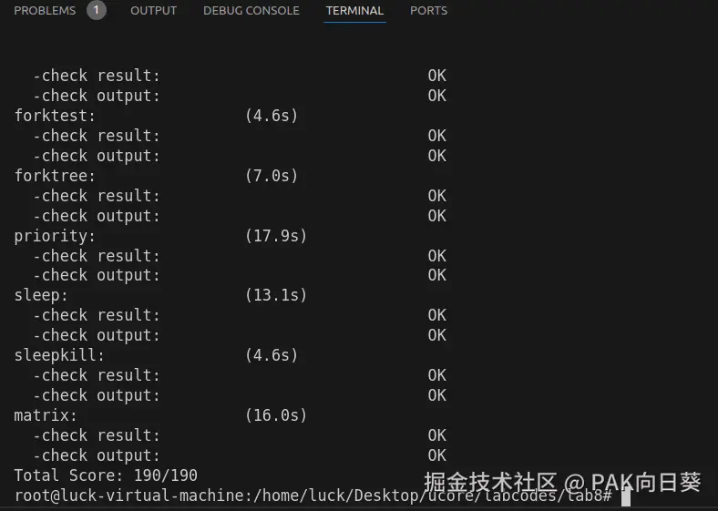

兜兜转转，终于来到最后的官邸boss啦！

# 练习1: 完成读文件操作的实现

虽然题目看着很唬人，似乎需要把uCore中整套文件系统的源码读懂才能下手。

但实际上只需要理解uCore中SFS文件系统的如下几个特点，再依靠源码中给出的提示，即使不了解文件系统的全貌，也能够把挖空处的代码给补充完成。

*   SFS文件系统中，**在逻辑上**每个文件（由）都由若干个连续的从零开始编号的逻辑块组成。每个逻辑块大小为`SFS_BLKSIZE=4096Byte`。
*   这些逻辑块会被一一映射到硬盘上的若干个（可能不连续的）物理块上。
*   `sfs_bmap_load_nolock`函数提供了将某文件的逻辑块号转换成实际物理块号的功能。
*   SFS文件系统提供的读写接口（`sfs_wbuf`、`sfs_wblock`、`sfs_rbuf`、`sfs_rblock`）只支持接收物理块号，因此在调用前需要先将逻辑块号转换成物理块号。
*   `sfs_wblock`函数只支持从内存中读出整一个block大小的数据，写入磁盘（实际是位于内存的磁盘缓冲区）指定的物理块中。类比可理解`sfs_rblock`的功能。
*   而`sfs_wbuf`函数支持从内存中读取指定大小的数据，写入磁盘指定的某一个物理块中，并且可以手工控制从这个物理块中的哪个位置开始写数据（即允许手工设置块内偏移）。类比可理解`sfs_rbuf`的功能。

```C++
// kern/fs/sfs/sfs_inode.c
/*  
 * sfs_io_nolock - Rd/Wr a file contentfrom offset position to offset+ length  disk blocks<-->buffer (in memroy)
 * @sfs:      sfs file system
 * @sin:      sfs inode in memory
 * @buf:      the buffer Rd/Wr
 * @offset:   the offset of file
 * @alenp:    the length need to read (is a pointer). and will RETURN the really Rd/Wr lenght
 * @write:    BOOL, 0 read, 1 write
 */
static int
sfs_io_nolock(struct sfs_fs *sfs, struct sfs_inode *sin, void *buf, off_t offset, size_t *alenp, bool write) {
    struct sfs_disk_inode *din = sin->din;
    assert(din->type != SFS_TYPE_DIR);
    off_t endpos = offset + *alenp, blkoff;
    *alenp = 0;
	// calculate the Rd/Wr end position
    if (offset < 0 || offset >= SFS_MAX_FILE_SIZE || offset > endpos) {
        return -E_INVAL;
    }
    if (offset == endpos) {
        return 0;
    }
    if (endpos > SFS_MAX_FILE_SIZE) {
        endpos = SFS_MAX_FILE_SIZE;
    }
    if (!write) {
        if (offset >= din->size) {
            return 0;
        }
        if (endpos > din->size) {
            endpos = din->size;
        }
    }

    int (*sfs_buf_op)(struct sfs_fs *sfs, void *buf, size_t len, uint32_t blkno, off_t offset);
    int (*sfs_block_op)(struct sfs_fs *sfs, void *buf, uint32_t blkno, uint32_t nblks);
    if (write) {
        sfs_buf_op = sfs_wbuf, sfs_block_op = sfs_wblock;
    }
    else {
        sfs_buf_op = sfs_rbuf, sfs_block_op = sfs_rblock;
    }

    int ret = 0;
    size_t size, alen = 0;
    uint32_t ino;
    uint32_t blkno = offset / SFS_BLKSIZE;          // The NO. of Rd/Wr begin block
    uint32_t nblks = endpos / SFS_BLKSIZE - blkno;  // The size of Rd/Wr blocks

    //LAB8:EXERCISE1 YOUR CODE HINT: 
    // call sfs_bmap_load_nolock, sfs_rbuf, sfs_rblock,etc. 
    // read different kind of blocks in file
	/*
	 * (1) If offset isn't aligned with the first block, Rd/Wr some content from offset to the end of the first block
	 *       NOTICE: useful function: sfs_bmap_load_nolock, sfs_buf_op
	 *               Rd/Wr size = (nblks != 0) ? (SFS_BLKSIZE - blkoff) : (endpos - offset)
	 * (2) Rd/Wr aligned blocks 
	 *       NOTICE: useful function: sfs_bmap_load_nolock, sfs_block_op
     * (3) If end position isn't aligned with the last block, Rd/Wr some content from begin to the (endpos % SFS_BLKSIZE) of the last block
	 *       NOTICE: useful function: sfs_bmap_load_nolock, sfs_buf_op	
	*/
    if ((blkoff = offset % SFS_BLKSIZE) != 0) {
        size = (nblks != 0) ? (SFS_BLKSIZE - blkoff) : (endpos - offset);
        if ((ret = sfs_bmap_load_nolock(sfs, sin, blkno, &ino)) != 0) {
            goto out;
        }
        if ((ret = sfs_buf_op(sfs, buf, size, ino, blkoff)) != 0) {
            goto out;
        }
        ++blkno;
        buf += size;
        alen += size;
        if (nblks == 0) {
            goto out;
        }
        --nblks;
    }
    while (nblks > 0) {
        if ((ret = sfs_bmap_load_nolock(sfs, sin, blkno, &ino)) != 0) {
            goto out;
        }
        if ((ret = sfs_block_op(sfs, buf, ino, 1)) != 0) {
            goto out;
        }
        ++blkno;
        --nblks;
        buf += SFS_BLKSIZE;
        alen += SFS_BLKSIZE;
    }
    if ((size = endpos % SFS_BLKSIZE) != 0) {
        if ((ret = sfs_bmap_load_nolock(sfs, sin, blkno, &ino)) != 0) {
            goto out;
        }
        if ((ret = sfs_buf_op(sfs, buf, size, ino, 0)) != 0) {
            goto out;
        }
        alen += size;
    }
out:
    *alenp = alen;
    if (offset + alen > sin->din->size) {
        sin->din->size = offset + alen;
        sin->dirty = 1;
    }
    return ret;
}
```

# 练习2: 完成基于文件系统的执行程序机制的实现

## 修改alloc\_proc和do\_fork函数

在lab8中，uCore为每个进程引入了一个类型为`struct files_struct`的数据结构，用于管理该进程的工作目录和被该进程打开的文件句柄：

```C++
// kern/fs/fs.h
struct files_struct {
    struct inode *pwd;      // inode of present working directory
    struct file *fd_array;  // opened files array
    int files_count;        // the number of opened files
    semaphore_t files_sem;  // lock protect sem
};

// kern/process/proc.h
struct proc_struct {
    // 略...
    struct files_struct *filesp;  // the file related info(pwd, files_count, files_array, fs_semaphore) of process
};
```

那么在调用`alloc_proc`函数创建PCB块时，应该将`filesp`字段的初值设成多少呢？按之前lab的经验应该设成`NULL`。我们先暂且这么做，再通过后续对代码的分析来验证我们的做法是否正确。

通过对比lab8与lab7的源码，我们注意到`kern/process/proc.c`中多了一个名为`copy_files`的函数：

```C++
// kern/process/proc.c
static int copy_files(uint32_t clone_flags, struct proc_struct *proc) {
    struct files_struct *filesp, *old_filesp = current->filesp;
    assert(old_filesp != NULL);

    if (clone_flags & CLONE_FS) {
        filesp = old_filesp;
        goto good_files_struct;
    }

    int ret = -E_NO_MEM;
    if ((filesp = files_create()) == NULL) {
        goto bad_files_struct;
    }

    if ((ret = dup_files(filesp, old_filesp)) != 0) {
        goto bad_dup_cleanup_fs;
    }

good_files_struct:
    files_count_inc(filesp);
    proc->filesp = filesp;
    return 0;

bad_dup_cleanup_fs:
    files_destroy(filesp);
bad_files_struct:
    return ret;
}
```

而该函数又会进一步调用一个名为`files_create`的函数。在该函数中，我们终于找到了真正为进程初始化`struct files_struct`数据结构的源码：

```C++
// kern/process/proc.c
struct files_struct * files_create(void) {
    //cprintf("[files_create]\n");
    static_assert((int)FILES_STRUCT_NENTRY > 128);
    struct files_struct *filesp;
    if ((filesp = kmalloc(sizeof(struct files_struct) + FILES_STRUCT_BUFSIZE)) != NULL) {
        filesp->pwd = NULL;
        filesp->fd_array = (void *)(filesp + 1);
        filesp->files_count = 0;
        sem_init(&(filesp->files_sem), 1);
        fd_array_init(filesp->fd_array);
    }
    return filesp;
}
```

这就验证了我们在`alloc_proc`中先将PCB块的`filesp`字段赋值为`NULL`是合理的。

同时结合源码中的提示我们知道，应该在创建新进程的入口函数`do_fork`中调用我们刚才发现的`copy_files`函数，来初始化新进程的`struct files_struct`数据结构。这非常简单。

唯一需要注意的就是根据函数末尾已给出的代码中`bad_fork_cleanup_fs`、`bad_fork_cleanup_kstack`和`bad_fork_cleanup_proc`三个标签的顺序，来确定要在何处调用`copy_files`函数。

代码如下：

```C++
// kern/process/proc.c
int do_fork(uint32_t clone_flags, uintptr_t stack, struct trapframe *tf) {
    
    // 略...
    
    //    2. call setup_kstack to allocate a kernel stack for child process
    if (setup_kstack(child_proc) != 0) {
        goto bad_fork_cleanup_proc;
    }
    if (copy_files(clone_flags, child_proc) != 0) {
        goto bad_fork_cleanup_kstack;
    }
    //    3. call copy_mm to dup OR share mm according clone_flag
    if (copy_mm(clone_flags, child_proc) != 0) {
        goto bad_fork_cleanup_fs;
    }
    
    // 略...
	
fork_out:
    return ret;
bad_fork_cleanup_fs:  //for LAB8
    put_files(child_proc);
bad_fork_cleanup_kstack:
    put_kstack(child_proc);
bad_fork_cleanup_proc:
    kfree(child_proc);
    goto fork_out;
}
```

## 实现load\_icode函数

这是lab8中相对来说最困难的部分。

在lab5中我们已经接触到了`load_icode`函数。`load_icode`函数为uCore拉起用户程序的核心函数`do_execve`及基于该函数的系统调用`SYS_exec`提供底层支持。

在这里我们再总结一下在lab8中该函数要实现的需求：

*   从硬盘中读取用户程序的ELF文件二进制数据，并逐段（segment）解析。
*   配置进程的用户内存描述符（通过`mm_map`函数）。
*   为进程申请物理页并设置好二级页表（通过`pgdir_alloc_page`函数）。
*   将代码段和数据段**以页为单位**从硬盘中读出，并装载到内存中（通过`load_icode_read`函数）。
*   在内存描述符中设置一块虚拟内存区域用作进程的用户堆栈，并预分配几个物理页，确保进程能够启动起来。
*   切换CPU使用的二级页表（通过`lcr3`函数）到当前进程的二级页表。
*   进一步配置用户堆栈，使得用户进程的`main`函数能够接收到调用者传递过来的启动参数。
*   设置进程的中断帧，确保中断返回后CPU翻转到用户态，并且能够正确跳转到用户程序的入口来执行。

其余的需求基本都可以通过修改lab5中的`load_icode`函数来实现。而配置用户堆栈是本次lab的一个小难点，其又可以细分为如下几步：

*   将用户进程执行`main`函数所需要的参数数组放置到用户堆栈上
*   将参数数组中每项参数的起始地址（`char*`）顺次放置到堆栈上构成一个**字符串指针数组**
*   将`char** argv`放置到堆栈上，其取值指向这个**字符串指针数组**的首地址
*   将`int argc`放置到堆栈上

最终用户进程启动前，用户堆栈的内存布局大致如下：

```text
（高地址）
           +-------------------------+<-----USTACKTOP
 +-------->|        argument 1       |
 |         +-------------------------+
 |  +----->|           ...           |
 |  |      +-------------------------+
 |  |  +-->|        argument n       |
 |  |  |   +-------------------------+
 |  |  +---|  address of argument n  |
 |  |      +-------------------------+
 |  +------|           ...           |
 |         +-------------------------+
 +---------|  address of argument 1  |<-----+
           +-------------------------+      |
           |      char** argv        |------+
           +-------------------------+
           |       int argc          |<-----esp
           +-------------------------+
（低地址）
```

完整源码如下：

```C++
// load_icode -  called by sys_exec-->do_execve
static int load_icode(int fd, int argc, char **kargv) {
    assert(argc >= 0 && argc <= EXEC_MAX_ARG_NUM);
    assert(current->mm == NULL);
    int ret = -E_NO_MEM;

    // (1) create a new mm for current process
    struct mm_struct* mm = mm_create();
    if (mm == NULL) {
        goto bad_mm;
    }
    // (2) create a new PDT, and mm->pgdir= kernel virtual addr of PDT
    if (setup_pgdir(mm) != 0) {
        goto bad_pgdir_cleanup_mm;
    }
    // (3) copy TEXT/DATA/BSS parts in binary to memory space of process
    // (3.1) read raw data content in file and resolve elfhdr
    off_t binary_file_offset = 0;
    struct elfhdr header;
    if ((ret = load_icode_read(fd, &header, sizeof(struct elfhdr), binary_file_offset)) != 0) {
        goto bad_elf_cleanup_pgdir;
    }
    if (header.e_magic != ELF_MAGIC) {
        ret = -E_INVAL_ELF;
        goto bad_elf_cleanup_pgdir;
    }
    // (3.2) read raw data content in file and resolve proghdr based on info in elfhdr
    struct proghdr prog_header;
    size_t prog_header_num = header.e_phnum;
    binary_file_offset = header.e_phoff;
    while (prog_header_num-- > 0) {
        // read program header to memory.
        if ((ret = load_icode_read(fd, &prog_header, sizeof(struct proghdr), binary_file_offset)) != 0) {
            goto bad_cleanup_mmap;
        }
        binary_file_offset += sizeof(struct proghdr);
        // check
        if (prog_header.p_type != ELF_PT_LOAD) {
            continue;
        }
        if (prog_header.p_filesz > prog_header.p_memsz) {
            ret = -E_INVAL_ELF;
            goto bad_cleanup_mmap;
        }
        if (prog_header.p_filesz == 0) {
            continue;
        }
        // (3.3) call mm_map to build vma related to TEXT/DATA
        uint32_t vm_flags = 0;
        uint32_t permission = PTE_U;
        if (prog_header.p_flags & ELF_PF_R) vm_flags |= VM_READ;
        if (prog_header.p_flags & ELF_PF_X) vm_flags |= VM_EXEC;
        if (prog_header.p_flags & ELF_PF_W) {
            vm_flags |= VM_WRITE;
            permission |= PTE_W;
        }
        if ((ret = mm_map(mm, prog_header.p_va, prog_header.p_memsz, vm_flags, NULL)) != 0) {
            goto bad_cleanup_mmap;
        }
        // (3.4) callpgdir_alloc_page to allocate page for TEXT/DATA, 
        //       read contents in file
        //       and copy them into the new allocated pages
        off_t segement_cur = prog_header.p_offset;
        off_t segement_end = segement_cur + prog_header.p_filesz;
        uintptr_t cur_addr = prog_header.p_va;
        uintptr_t end_addr = cur_addr + prog_header.p_memsz;
        struct Page* page;

#define __min__(a, b) ((a < b) ? (a) : (b))

        while (segement_cur < segement_end) {
            page = pgdir_alloc_page(mm->pgdir, cur_addr, permission);
            if (page == NULL) {
                ret = -E_NO_MEM;
                goto bad_cleanup_mmap;
            }
            size_t off = cur_addr % PGSIZE;
            size_t size = __min__(PGSIZE - off, segement_end - segement_cur);
            if ((ret = load_icode_read(fd, page2kva(page) + off, size, segement_cur)) != 0) {
                goto bad_cleanup_mmap;
            }
            cur_addr += size;
            segement_cur += size;
        }

        // (3.5) callpgdir_alloc_page to allocate pages for BSS, memset zero in these pages
        while (cur_addr < end_addr) {
            size_t off = cur_addr % PGSIZE;
            size_t size = __min__(PGSIZE - off, end_addr - cur_addr);
            if (off == 0) {
                page = pgdir_alloc_page(mm->pgdir, cur_addr, permission);
            }
            if (page == NULL) {
                ret = -E_NO_MEM;
                goto bad_cleanup_mmap;
            }
            memset(page2kva(page) + off, 0x00, size);
            cur_addr += size;
        }
    }
    sysfile_close(fd);
    // (4) call mm_map to setup user stack, and put parameters into user stack
    uint32_t vm_flags = VM_READ | VM_WRITE | VM_STACK;
    if ((ret = mm_map(mm, USTACKTOP - USTACKSIZE, USTACKSIZE, vm_flags, NULL)) != 0) {
        goto bad_cleanup_mmap;
    }
    assert(pgdir_alloc_page(mm->pgdir, USTACKTOP-PGSIZE , PTE_USER) != NULL);
    assert(pgdir_alloc_page(mm->pgdir, USTACKTOP-2*PGSIZE , PTE_USER) != NULL);
    assert(pgdir_alloc_page(mm->pgdir, USTACKTOP-3*PGSIZE , PTE_USER) != NULL);
    assert(pgdir_alloc_page(mm->pgdir, USTACKTOP-4*PGSIZE , PTE_USER) != NULL);
    
    // (5) setup current process's mm, cr3, reset pgidr (using lcr3 MARCO)
    mm_count_inc(mm);
    current->mm = mm;
    current->cr3 = PADDR(mm->pgdir);
    lcr3(PADDR(mm->pgdir));

    // (6) setup uargc and uargv in user stacks
    uintptr_t esp = USTACKTOP;
    uintptr_t temp_argv[EXEC_MAX_ARG_NUM];
    // copy each paraments to the user stack
    for (int i = 0; i < argc; ++i) {
        size_t size = strlen(kargv[i]) + 1;
        assert(size < EXEC_MAX_ARG_LEN);
        esp -= size;
        strncpy((char*)esp, kargv[i], size);
        temp_argv[i] = esp;
    }
    // set the content of argv in the user stack
    for (int i = argc - 1; i >= 0; --i) {
        esp -= sizeof(uintptr_t);
        *(uintptr_t*)esp = temp_argv[i];
    }
    // set argv and argc
    uintptr_t uargv_addr = esp;
    esp -= sizeof(uintptr_t);
    *(uintptr_t*)esp = uargv_addr;
    esp -= sizeof(int32_t);
    *(int32_t*)esp = argc;

    // (7) setup trapframe for user environment
    struct trapframe* tf = current->tf;
    tf->tf_cs = USER_CS;
    tf->tf_ds = tf->tf_es = tf->tf_ss = USER_DS;
    tf->tf_esp = esp;
    tf->tf_eip = header.e_entry;
    tf->tf_eflags |= FL_IF;

    ret = 0;
    // (8) if up steps failed, you should cleanup the env.
out:
    return ret;
bad_cleanup_mmap:
    exit_mmap(mm);
bad_elf_cleanup_pgdir:
    put_pgdir(mm->pgdir);
bad_pgdir_cleanup_mm:
    mm_destroy(mm);
bad_mm:
    goto out;
}
```

## 测试结果

修改好所有要修改的代码，执行`make grade`，应该能够得到满分结果。至此，THU UCORE LAB的所有必做任务就全部完成了。


