# 练习1：理解通过make生成执行文件的过程。

## 操作系统镜像文件ucore.img是如何一步一步生成的？

### 整体把握

由于uCore Lab1中的Makefile文件比较复杂，有一百多行，此外还附加了一个`tools/function.mk`，不便于直接上手分析。这里我决定采用自顶向下的方法，通过[uCore官方文档](https://chyyuu.gitbooks.io/ucore_os_docs/content/lab1/lab1_2_1_1_ex1.html)中提示的`make "V="`打印出构建项目时make的日志。从构建日志入手，对uCore项目的构建流程有一个整体的把握。

经过对构建日志的分析，我将uCore项目的构建过程分为了如下几个阶段：

1.  构建操作系统kernel的ELF文件

<!---->

    + cc kern/init/init.c
    gcc-5 -Ikern/init/ -fno-builtin -Wall -ggdb -m32 -gstabs -nostdinc  -fno-stack-protector -Ilibs/ -Ikern/debug/ -Ikern/driver/ -Ikern/trap/ -Ikern/mm/ -c kern/init/init.c -o obj/kern/init/init.o
    + cc kern/libs/stdio.c
    gcc-5 -Ikern/libs/ -fno-builtin -Wall -ggdb -m32 -gstabs -nostdinc  -fno-stack-protector -Ilibs/ -Ikern/debug/ -Ikern/driver/ -Ikern/trap/ -Ikern/mm/ -c kern/libs/stdio.c -o obj/kern/libs/stdio.o
    + cc kern/libs/readline.c
    gcc-5 -Ikern/libs/ -fno-builtin -Wall -ggdb -m32 -gstabs -nostdinc  -fno-stack-protector -Ilibs/ -Ikern/debug/ -Ikern/driver/ -Ikern/trap/ -Ikern/mm/ -c kern/libs/readline.c -o obj/kern/libs/readline.o
    篇幅关系，中间略...
    + cc libs/string.c
    gcc-5 -Ilibs/ -fno-builtin -Wall -ggdb -m32 -gstabs -nostdinc  -fno-stack-protector -Ilibs/  -c libs/string.c -o obj/libs/string.o
    + cc libs/printfmt.c
    gcc-5 -Ilibs/ -fno-builtin -Wall -ggdb -m32 -gstabs -nostdinc  -fno-stack-protector -Ilibs/  -c libs/printfmt.c -o obj/libs/printfmt.o
    + ld bin/kernel
    ld -m    elf_i386 -nostdlib -T tools/kernel.ld -o bin/kernel  obj/kern/init/init.o obj/kern/libs/stdio.o obj/kern/libs/readline.o obj/kern/debug/panic.o obj/kern/debug/kdebug.o obj/kern/debug/kmonitor.o obj/kern/driver/clock.o obj/kern/driver/console.o obj/kern/driver/picirq.o obj/kern/driver/intr.o obj/kern/trap/trap.o obj/kern/trap/vectors.o obj/kern/trap/trapentry.o obj/kern/mm/pmm.o  obj/libs/string.o obj/libs/printfmt.o

2\.  构建操作系统bootloader

<!---->

    + cc boot/bootasm.S
    gcc-5 -Iboot/ -fno-builtin -Wall -ggdb -m32 -gstabs -nostdinc  -fno-stack-protector -Ilibs/ -Os -nostdinc -c boot/bootasm.S -o obj/boot/bootasm.o
    + cc boot/bootmain.c
    gcc-5 -Iboot/ -fno-builtin -Wall -ggdb -m32 -gstabs -nostdinc  -fno-stack-protector -Ilibs/ -Os -nostdinc -c boot/bootmain.c -o obj/boot/bootmain.o
    + cc tools/sign.c
    gcc-5 -g -Wall -O2 obj/sign/tools/sign.o -o bin/sign
    gn/tools/sign.o
    + ld bin/bootblock
    ld -m    elf_i386 -nostdlib -N -e start -Ttext 0x7C00 obj/boot/bootasm.o obj/boot/bootmain.o -o obj/bootblock.o

3\.  生成操作系统镜像

<!---->

    'obj/bootblock.out' size: 488 bytes
    build 512 bytes boot sector: 'bin/bootblock' success!
    dd if=/dev/zero of=bin/ucore.img count=10000
    dd if=bin/bootblock of=bin/ucore.img conv=notrunc
    dd if=bin/kernel of=bin/ucore.img seek=1 conv=notrunc

下面我们对逐个构建阶段进行具体分析。

### 1. 构建操作系统kernel

这个部分从整体来看还是比较简单的，主要就是将构建kernel所需的代码文件（.c和.S）先逐个编译成可供链接的.o二进制文件，最后再进行链接。

在uCore的Makefile源代码中，又将这一过程细分为了处理`libs`目录中的代码文件，和处理`kern`目录中代码文件这两步：

```Makefile
# 为了方便展示，中间无关代码已删去
include tools/function.mk

CC		:= $(GCCPREFIX)gcc-5  # 由于我是在Ubuntu20.04上进行lab，所以手工安装了低版本的gcc
CFLAGS	:= -fno-builtin -Wall -ggdb -m32 -gstabs -nostdinc $(DEFS)
CFLAGS	+= $(shell $(CC) -fno-stack-protector -E -x c /dev/null >/dev/null 2>&1 && echo -fno-stack-protector)

listf_cc = $(call listf,$(1),$(CTYPE))
add_files_cc = $(call add_files,$(1),$(CC),$(CFLAGS) $(3),$(2),$(4))

# >>>>>>>>>>>>>>>>>>>>>>>>>>>>>>>>>>>>>>>>>>>>>>>>>>>>>>>>>>>>>>>>>>>
# include kernel/user

INCLUDE	+= libs/
CFLAGS	+= $(addprefix -I,$(INCLUDE))
LIBDIR	+= libs
$(call add_files_cc,$(call listf_cc,$(LIBDIR)),libs,)

# -------------------------------------------------------------------
# kernel

KINCLUDE	+= kern/debug/ \
			   kern/driver/ \
			   kern/trap/ \
			   kern/mm/
KSRCDIR		+= kern/init \
			   kern/libs \
			   kern/debug \
			   kern/driver \
			   kern/trap \
			   kern/mm
KCFLAGS		+= $(addprefix -I,$(KINCLUDE))
$(call add_files_cc,$(call listf_cc,$(KSRCDIR)),kernel,$(KCFLAGS))
```

Makefile源码中出现了两个比较关键的自定义函数`listf_cc`和`add_files_cc`，这里我们暂不深究它们的代码实现，只需要大概了解它们的功能即可。前者最终会调用`function.mk`中的`listf`函数，能够实现从指定的目录中提取出所有.c和.S文件的路径的功能。后者最终指向`function.mk`中定义的宏`cc_template`，即将源代码文件通过`-c`参数编译为可供链接的.o文件。这与我们通过make日志观察到的情况是一致的。

接下来我们来简单了解一下为每个代码文件逐个构建.o文件时，所用到的gcc参数：

*   \-fno-builtin：禁止编译器将程序中的某些函数替换为内联代码。这可以进一步确保编译器生成的机器代码与我们编写的程序的行为保持一致。
*   \-Wall：启用gcc的绝大部分警告功能（事实上还有级别更高的`-Wextra`）
*   \-ggdb：生成可供gdb使用的调试信息（暂时不知道具体会生成什么）。这样才能用qemu+gdb来调试bootloader or ucore。
*   \-m32：生成适用于32位环境的代码。我们用的模拟硬件是32bit的80386，所以ucore也要是32位的软件。
*   \-gstabs：生成stabs格式的调试信息（暂时不知道具体会生成什么）。这样要ucore的monitor可以显示出便于开发者阅读的函数调用栈信息
*   \-nostdinc：告诉编译器不要在标准系统目录中寻找头文件。标准系统目录中提供的头文件是给应用程序使用的，uCore作为底层的操作系统，自然不能使用。
*   \-fno-stack-protector：禁用gcc的栈保护机制。作为操作系统内核，我们手工对内存堆栈进行精细的控制，不需要这个编译器为应用程序准备的功能。关于gcc的栈保护机制，可进一步参考CSAPP中3.10.4这一节的内容。

此外，我们还注意到每条gcc命令中还出现了大量形如`-IXXX`的参数，这其实就是在告诉编译器要尝试在指定的目录中寻找头文件。例如kernel中的许多代码文件中都会包含`#include <pmm.h>`，通过在编译命令中添加`-Ikern/mm/`参数，编译器在寻找头文件`pmm.h`时就会尝试去`kern/mm/`目录中查找，进而成功找到头文件，确保了编译的顺利进行。

接下来就是调用`ld`将逐个编译所得的.o文件进行链接以得到目标文件`bin/kernel`的过程，这个过程还是比较简单的。关键参数解释如下：

*   \-m elf\_i386：指定最终生成的ELF文件的目标平台为Intel 80386
*   \-nostdlib：对于操作系统内核来说，当然不需要与C语言标准运行时库链接
*   \-T tools/kernel.ld：指定使用的链接器脚本。在`tools/kernel.ld`有关于内核内存布局和辅助符号的关键配置，这里我们先暂时不管它。

### 2.  构建操作系统bootloader

这一部分的编译、链接阶段与构建kernel大差不差，不过也就是先分别编译`boot/bootasm.S`和`boot/bootmain.c`，再将编译所得的两个.o文件链接为目标文件`obj/bootblock.o`。

此外我们注意到make工具还编译了一个名为`tools/sign.c`的代码文件为单独的可执行文件`bin/sign`。这个东西有什么用呢？这里先卖个关子。

我们主要仍然关注编译和链接时候的特殊命令参数。

我们注意到在构建bootloader时，编译命令中出现了一个新的参数`-Os`，该参数用于告诉编译器按照一定的策略对编译所得的代码体积进行压缩（例如移除未用到的代码，或尝试生成更小的指令）。这是因为bootloader只能占用磁盘0号扇区512字节那么大的空间，我们不得不要对bootloader的代码体积进行压缩。

比较有趣的是链接时候的参数：

*   \-e start：该选项指明ELF文件启动时候的入口地址。虽说最终bootloader的程序是直接在裸机上运行的，但该选项仍然是有必要的。如果不指明入口地址，则链接器会尝试查找一个名为\_start的函数（该函数定义在C语言标准运行时库中）作为入口。而我们已经在链接选项中设置了不与C语言标准库进行链接，因此这将会导致链接错误。
*   \-N: 这个参数表示不对ELF文件中的各个section进行分段（segment），并且禁止链接器通过插入空字符的方式对不同的section进行对齐（具体请参考这篇[博客](https://juejin.cn/post/7355321162530652194#heading-4)）。就uCore项目而言，如果我们将该参数去掉，则会导致链接器在`.text section`后方插入大量空字符（如下图所示），使得该节的长度变为1024字节。而我们的bootloader大小是不能超过512字节的，因此必须开启`-N`选项。
    

接下来我们重点看一下`-Ttext 0x7C00`这个链接参数。为了更好地理解这个参数，我们使用`readelf -S bootblock.o`来观察一下`bootblock.o`中各个section的内存布局。


我们注意到，对于`.text`节，链接器为其分配的首地址为`0x7c00`（见Addr字段，单位字节），与链接参数中的神秘数字保持一致。而其在ELF文件中的真实偏移量则为`0x0074`（见Off字段，单位字节）。这意味着什么呢？

我们再执行`objdump -d -m i8086 bootblock.o`反汇编命令，来观察一下bootblock.o的机器代码。注意，由于bootloader执行初期CPU仍然处于16位实模式状态（即模拟Intel 8086芯片的状态），我们这里必须要加上参数`-m i8086`才能看到正确的16位汇编机器代码。

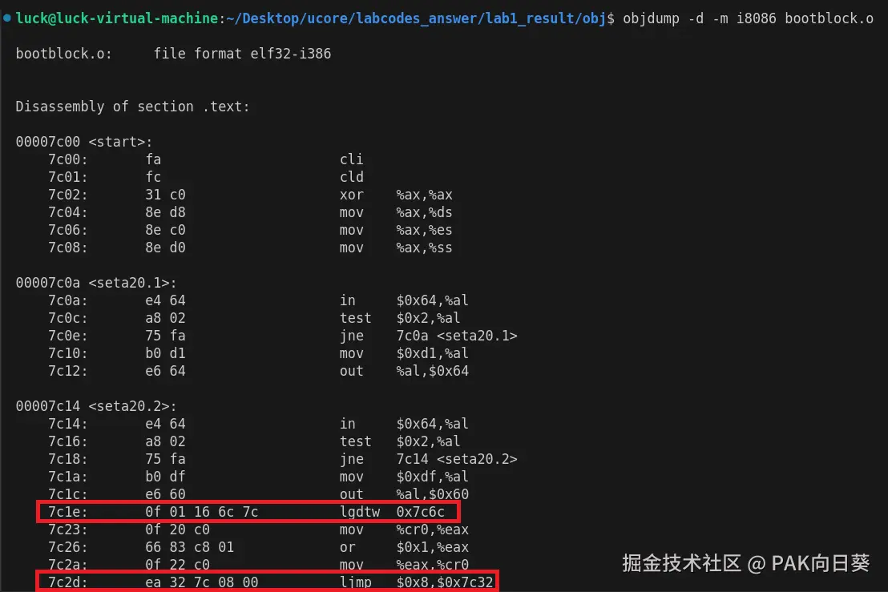

请大家注意看我框起来的两处代码。第一处代码`lgdtw  0x7c6c`是加载临时的GDT表描述符，反汇编结果显示该描述符的首地址为`0x7c6c`。而实际bootblock.o文件中，该描述符相对于`.text`节首地址的偏移量是多少呢？通过简单的分析，不难确定偏移量为`0x006c`，即和机器代码中的地址差值恰好为神秘数字`0x7c00`。

再来分析一下第二处代码`ljmp   $0x8,$0x7c32`，这条代码对应了uCore源代码文件`boot/bootasm.S`中的`ljmp $PROT_MODE_CSEG, $protcseg`这条代码。那么，`protcseg`这段代码对应的机器代码，在bootblock.o中相对于`.text`节的偏移量又是多少呢？我们同样可以确定，偏移量为`0x32`，和`ljmp $0x8,$0x7c32`中出现的内存地址差值又恰好为神秘数字`0x7c00`。

至此，我们可以大胆推测，`-Ttext 0x7C00`这个链接参数表示告诉链接器我们的bootloader程序会被放置在内存中首地址为`0x7c00`处执行，因此链接器在确定bootloader中跳转相关指令以及其他内存引用的绝对地址时，必须要在相对地址的基础上加上基地址`0x7c00`。而为什么偏偏是这个基地址呢？事实上，从Intel 8086时代开始，基于x86架构的计算机在BIOS的最后阶段就会将0号扇区中的bootloader代码直接加载到内存首地址为`0x7c00`处并跳转执行，后来这个传统便固定了下来。因此在编译和链接bootloader时，该程序中所有的内存地址都必须在`0x7c00`的基础上进行确定（毕竟它是直接在裸机上运行的，操作系统的内存映射机制还没有建立起来）。

至此虽然我们的bootloader程序已经完成了编译和链接，但故事却没有结束。这是因为bootloader是在被计算机BIOS拉起之后直接在裸机上运行的，而裸机是无法解析ELF文件格式的。我们还需要进一步对bootblock.o进行处理，相应的Makefile代码如下：

```Makefile
# 对应shell指令objcopy -S -O binary obj/bootblock.o obj/bootblock.out
@$(OBJCOPY) -S -O binary $(call objfile,bootblock) $(call outfile,bootblock)
```

这行代码会将刚才链接得到的bootblock.o中的`.text`和`.eh_frame`（与调试有关）直接复制粘贴到一个新的文件bootblock.out中，抛弃了ELF文件中的其他信息，如下图所示。在拉起bootloader时，只需要保证BIOS能够跳转到bootblock.out中的头部执行即可——那里存放着我们bootloader的第一条代码！


### 3. 生成操作系统镜像

现在`bin/kernel`和`obj/bootblock.out`都已经准备好了，我们来生成`ucore.img`。

首先我们来制作硬盘主引导扇区（MBR扇区）。这个步骤的Makefile代码如下：

```Makefile
@$(call totarget,sign) $(call outfile,bootblock) $(bootblock)
```

从这段代码来看我们需要用到刚才编辑好的可执行文件`bin/sign`，输入文件为`obj/bootblock.out`，输出文件为`bin/bootblock`。由于这个工具的功能比较简单，我这里就不多说了。下面是我加了注释的该工具的源代码：

```C++
#include <stdio.h>
#include <errno.h>
#include <string.h>
#include <sys/stat.h>

int
main(int argc, char *argv[]) {
    struct stat st;
    if (argc != 3) {
        fprintf(stderr, "Usage: <input filename> <output filename>\n");
        return -1;
    }
    // 调用Linux系统调用stat获取"obj/bootblock.out"的文件信息
    if (stat(argv[1], &st) != 0) {
        fprintf(stderr, "Error opening file '%s': %s\n", argv[1], strerror(errno));
        return -1;
    }
    printf("'%s' size: %lld bytes\n", argv[1], (long long)st.st_size);
    // 因为主引导扇区的最后两个字节要放置神秘数字0x55 0xAA，
    // 所以bootloader的最大允许大小为512-2=510个字节。
    // 如果超过就报错！
    if (st.st_size > 510) {
        fprintf(stderr, "%lld >> 510!!\n", (long long)st.st_size);
        return -1;
    }
    // 创建一个512字节的缓冲区，并用0x00填充
    char buf[512];
    memset(buf, 0, sizeof(buf));
    FILE *ifp = fopen(argv[1], "rb");
    // 把"obj/bootblock.out"中的所有字节全部读到缓冲区里去
    // 如果没有读成功就报错
    int size = fread(buf, 1, st.st_size, ifp);
    if (size != st.st_size) {
        fprintf(stderr, "read '%s' error, size is %d.\n", argv[1], size);
        return -1;
    }
    fclose(ifp);
    // 缓冲区最后两个字节放置神秘数字
    buf[510] = 0x55;
    buf[511] = 0xAA;
    // 输出"bin/bootblock"文件
    FILE *ofp = fopen(argv[2], "wb+");
    size = fwrite(buf, 1, 512, ofp);
    if (size != 512) {
        fprintf(stderr, "write '%s' error, size is %d.\n", argv[2], size);
        return -1;
    }
    fclose(ofp);
    printf("build 512 bytes boot sector: '%s' success!\n", argv[2]);
    return 0;
}
```

ok，现在主引导扇区文件`bin/bootblock`已经制作好了，下面进入正式生成`bin/ucore.img`的环节：

```Makefile
$(UCOREIMG): $(kernel) $(bootblock)
	$(V)dd if=/dev/zero of=$@ count=10000
	$(V)dd if=$(bootblock) of=$@ conv=notrunc
	$(V)dd if=$(kernel) of=$@ seek=1 conv=notrunc
```

1.  第一条指令表示创建一个大小为10000\*512=5120000字节的空文件`bin/ucore.img`（即全部字节用0x00填充）。
2.  第二条指令表示用我们准备好的`bin/bootblock`（即MBR扇区）从`bin/ucore.img`头部开始覆盖。
3.  第三条指令表示用我们准备好的`bin/kernel`从`bin/ucore.img`头部其跳过一个扇区的位置（即文件内部偏移0x200处）开始覆盖。

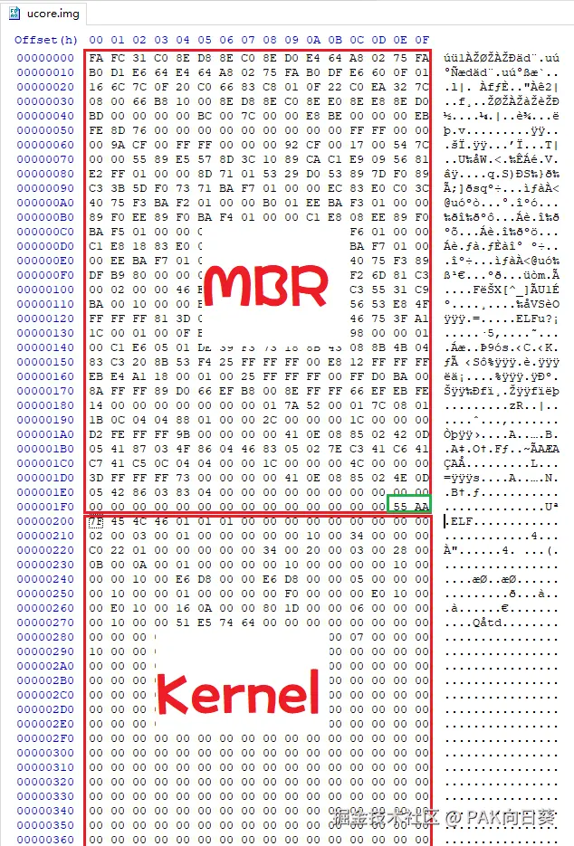

至此，我们的操作系统镜像就制作完毕啦\~。可以使用qemu进行测试了：

```Makefile
qemu: $(UCOREIMG)
	$(V)$(QEMU) -parallel stdio -hda $< -serial null
```

## 一个被系统认为是符合规范的硬盘主引导扇区的特征是什么？

这个问题的答案其实在上面我已经通过分析ucore.img的构建过程给揭示出来了。这里再总结一遍：

1.  大小为512字节，不多不少
2.  第510个（倒数第二个）字节是0x55
3.  第511个（倒数第一个）字节是0xAA

# 练习2：使用qemu执行并调试lab1中的软件。

## 从CPU加电后执行的第一条指令开始，单步跟踪BIOS的执行

按照[uCore官方文档](https://chyyuu.gitbooks.io/ucore_os_docs/content/lab1/lab1_5_appendix.html)的提示，配置好`tools/gdbinit`为如下内容：

    set architecture i8086
    target remote :1234

接着在终端执行`make debug`，弹出qemu和gdb的终端窗口。

我们先来看一下CPU上电后的第一条指令是什么。在gdb终端中输入`i r`并回车：


按照16位CPU实模式寻址的规则，CPU上电后执行的第一条指令的地址即为`(cs << 4) + ip = 0xffff0`。我们来看看具体这条指令是什么，执行`x/i 0xffff0`：


这与文档中预期的`ljmp $0xf000,$0xe05b`不太一样。经查阅[资料](https://blog.csdn.net/m0_51139704/article/details/140809192)，我得知应该是我安装的gdb版本存在bug，导致其不能正确解析16位模式下的`ljmp`指令。

虽然无法直接查看正确的`ljmp`指令反汇编内容，我们仍可以通过继续单步调试的方法来进一步确定程序接下来到底会跳转到哪里，执行`si`和`i r`：

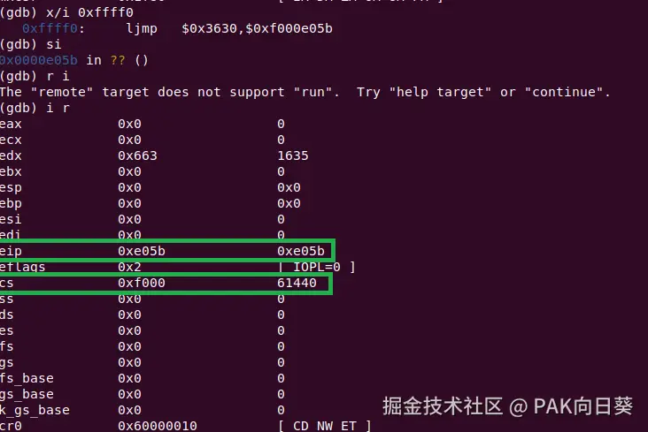

可见CPU的确会跳转到`0xe05b`处开始执行BIOS程序，验证了理论知识。

我们还可以看看BIOS程序的机器代码，执行`x/10i 0xfe05b`：

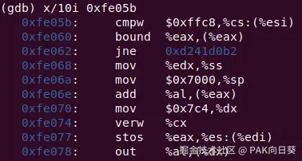

（虽然这里的反汇编结果应该也是有问题的）

## 在初始化位置0x7c00 设置实地址断点,测试断点正常

在`gdbinit`中设置断点如下：

    set architecture i8086
    target remote :1234
    break *0x7c00
    continue
    x /10i $pc

执行`make debug`结果如图所示，可见bootloader的入口地址确实在`0x7c00`处:

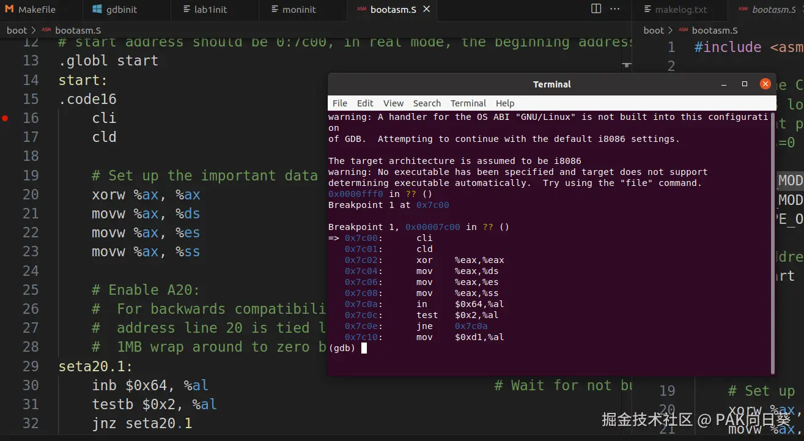

# 练习3：分析bootloader进入保护模式的过程。

关中断，标志寄存器中方向位清零，段寄存器清零：

```assembler
.globl start
start:
.code16   # 提示编译器生成针对16位CPU（即i8086）的代码
    cli                                             # Disable interrupts
    cld                                             # String operations increment

    # Set up the important data segment registers (DS, ES, SS).
    xorw %ax, %ax                                   # Segment number zero
    movw %ax, %ds                                   # -> Data Segment
    movw %ax, %es                                   # -> Extra Segment
    movw %ax, %ss                                   # -> Stack Segment
```

接下来开启A20 Gate。这一部分汇编代码主要是在与控制A20 Gate的Intel 8042芯片交互，其行为可概括如下：

1.  读`0x64`端口，此时会返回i8042芯片状态寄存器的内容，以便检测该芯片是否处于忙状态。如处于忙状态，则不停地等待。
2.  写`0x64`端口，此时会将"写Output Port"命令发送到i8042芯片的控制寄存器。
3.  读`0x64`端口，作用与第一步一致
4.  写`0x60`端口，表示将要写入Output Port的内容发送到i8042芯片的Input buffer中去。真正开启A20 Gate的控制位就包含在这次发送的数据当中。

```
    # Enable A20:
    #  For backwards compatibility with the earliest PCs, physical
    #  address line 20 is tied low, so that addresses higher than
    #  1MB wrap around to zero by default. This code undoes this.
seta20.1:
    inb $0x64, %al                                  # Wait for not busy(8042 input buffer empty).
    testb $0x2, %al
    jnz seta20.1

    movb $0xd1, %al                                 # 0xd1 -> port 0x64
    outb %al, $0x64                                 # 0xd1 means: write data to 8042's P2 port

seta20.2:
    inb $0x64, %al                                  # Wait for not busy(8042 input buffer empty).
    testb $0x2, %al
    jnz seta20.2

    movb $0xdf, %al                                 # 0xdf -> port 0x60
    outb %al, $0x60                                 # 0xdf = 11011111, means set P2's A20 bit(the 1 bit) to 1

```

更新CPU的GDTR寄存器，将临时的GDT表挂载到CPU上去，以架空CPU的段内存管理机制。

注意，通过前面对uCore项目的构建流程分析可知，这个临时的GDT表是被内嵌在MBR扇区当中的，而当前该扇区已经被BIOS加载进内存当中了，因此这个操作是安全的。

同时回想我前面对bootloader中代码内存引用的分析，我们就可以理解刚才为什么一定要清空段寄存器了。这是因为`lgdt gdtdesc`指令对应的编译结果（即`lgdtw 0x7c6c`）中已经包含了完整的`gdtdesc`的绝对地址了，不需要段基址，而现在CPU又运行在实模式状态，因此我们直接将段寄存器（确切地说是ds段寄存器）清零即可。

```assembler
    lgdt gdtdesc
# Bootstrap GDT
.p2align 2                                          # force 4 byte alignment
gdt:
    SEG_NULLASM                                     # null seg
    SEG_ASM(STA_X|STA_R, 0x0, 0xffffffff)           # code seg for bootloader and kernel
    SEG_ASM(STA_W, 0x0, 0xffffffff)                 # data seg for bootloader and kernel

gdtdesc:
    .word 0x17                                      # sizeof(gdt) - 1
    .long gdt                                       # address gdt
```

开启cr0寄存器当中的保护模式使能位，没什么好说的：

```assembler
  movl    %cr0, %eax
  orl     $CR0_PE, %eax
  movl    %eax, %cr0
```

现在A20 Gate和保护模式使能位均已经开启，让我们正式进入启用保护模式的x86-32世界。

这里为什么要使用一个`ljmp`指令呢？主要有以下几点：

1.  接下来即将执行x86-32的机器代码，但实际上现在CPU仍然处于i8086模式，如果其流水线上已经在预执行后续32位的机器代码，那么势必会得到错误的结果。我们可以通过强制跳转来清空CPU的流水线，让CPU在跳转后，确保后续代码的执行正确。
2.  CPU只有通过执行16位的`ljmp`指令，才能真正使得刚才编辑的cr0控制寄存器的保护模式使能位生效，即使得CPU正式进入32位模式，能够正确解释执行32位的x86机器代码。
3.  在执行`ljmp`指令时，CPU会自动更新`cs`段寄存器为段选择子`PROT_MODE_CSEG`，为接下来保护模式下的访存取指执行做好准备。

```assembler
.set PROT_MODE_CSEG,        0x8                     # kernel code segment selector

    # Jump to next instruction, but in 32-bit code segment.
    # Switches processor into 32-bit mode.
    ljmp $PROT_MODE_CSEG, $protcseg

.code32   # 提示编译器生成针对32位CPU（即i386）的代码
protcseg:
```

接下来我们看看在正式读取操作系统kernel的ELF文件前，bootloader还做了哪些准备工作。

由于现在已经正式进入了保护模式，因此我们要重新设置一下各个段寄存器，这步没什么好说的：

```assembler
.set PROT_MODE_DSEG,        0x10                    # kernel data segment selector

.code32                                             # Assemble for 32-bit mode
protcseg:
    # Set up the protected-mode data segment registers
    movw $PROT_MODE_DSEG, %ax                       # Our data segment selector
    movw %ax, %ds                                   # -> DS: Data Segment
    movw %ax, %es                                   # -> ES: Extra Segment
    movw %ax, %fs                                   # -> FS
    movw %ax, %gs                                   # -> GS
    movw %ax, %ss                                   # -> SS: Stack Segment
```

由于接下来要拉起C语言的代码`bootmain.c`了，我们需要为C代码准备一个运行时栈。这里uCore的作者直接就地取材，选取了`[0x0000, 0x7c00)`用作临时堆栈：

```assembler
    # Set up the stack pointer and call into C. The stack region is from 0--start(0x7c00)
    movl $0x0, %ebp # 这一句代码主要是为了辅助完成后面的练习5实验，这里我们先不用管
    movl $start, %esp
```

最后，我们终于要进入C语言的世界啦：

```assembler
    call bootmain
```

# 练习4：分析bootloader加载ELF格式的OS的过程。

## bootloader如何读取硬盘扇区的？

bootloader与磁盘交互的核心代码如下。这段代码不难，我这里就不多说了，请大家直接看注释。如果对其中的gcc内联汇编有疑问，请参考uCore的[官方文档](https://chyyuu.gitbooks.io/ucore_os_docs/content/lab0/lab0_2_3_1_4_extend_gcc_asm.html)。

作为学习操作系统原理的应用软件开发者，这里我们也暂不深究其中涉及到的硬件端口号，如果你感兴趣则可以参考uCore官方提供的[文档](https://chyyuu.gitbooks.io/ucore_os_docs/content/lab1/lab1_3_2_3_dist_accessing.html)。

大体上，可以看到我们只需要指定一个需要读取的目标扇区，通过x86架构提供的`out`指令向磁盘控制器发送读取命令和目标扇区号，再通过`in`指令就可以实现将目标扇区中的全部数据读入指定内存地址的需求。

```C++
static inline void insl(uint32_t port, void *addr, int cnt) {
    asm volatile (
            "cld;"
            "repne; insl;"
            : "=D" (addr), "=c" (cnt)
            : "d" (port), "0" (addr), "1" (cnt)
            : "memory", "cc");
}

static inline void outb(uint16_t port, uint8_t data) {
    asm volatile ("outb %0, %1" :: "a" (data), "d" (port));
}

/* waitdisk - wait for disk ready */
static void waitdisk(void) {
    while ((inb(0x1F7) & 0xC0) != 0x40)
        /* do nothing */;
}

/* readsect - read a single sector at @secno into @dst */
static void readsect(void *dst, uint32_t secno) {
    // wait for disk to be ready
    waitdisk();

    /*
        这段内联汇编会被展开成如下内容。剩下的几个outb内联汇编与之雷同。
           0x00007c9b <+49>:	mov    $0x1f2,%edx
           0x00007ca0 <+54>:	mov    $0x1,%al
           0x00007ca2 <+56>:	out    %al,(%dx)
    */
    outb(0x1F2, 1);                         // count = 1
    outb(0x1F3, secno & 0xFF);
    outb(0x1F4, (secno >> 8) & 0xFF);
    outb(0x1F5, (secno >> 16) & 0xFF);
    outb(0x1F6, ((secno >> 24) & 0xF) | 0xE0);
    outb(0x1F7, 0x20);                      // cmd 0x20 - read sectors

    // wait for disk to be ready
    waitdisk();

    // read a sector
    /*
        这段内联汇编会被展开成如下内容。
        其中目标内存地址void* dst会被分配给%ebx寄存器。
           0x00007ce7 <+125>:	mov    %ebx,%edi
           0x00007ce9 <+127>:	mov    $0x80,%ecx
           0x00007cee <+132>:	mov    $0x1f0,%edx
           0x00007cf3 <+137>:	cld    
           0x00007cf4 <+138>:	repnz insl (%dx),%es:(%edi)
    */
    insl(0x1F0, dst, SECTSIZE / 4);
}
```

> 这里插一句。我认为内联汇编函数`insl`中使用`repne`汇编指令来实现重复操作是有问题的。因为该指令表示的含义是*Repeat while ZF == 0 and ECX != 0*，而显然在前述uCore的代码中并没有涉及到与ZF寄存器相关的操作。
>
> 因此我认为这里应该使用`rep`指令更为合适，其含义为*Repeat while ECX != 0*。事实上，在与uCore同源的[mit xv6的源码](https://github.com/mit-pdos/xv6-public/blob/eeb7b415dbcb12cc362d0783e41c3d1f44066b17/x86.h#L15)中，使用的也是`rep`而非`repne`指令。

紧接着，为了方便从ELF文件中读取数据，uCore中又进一步对`read智能ct`函数进行了封装。大体上来说，我们只需要指定储存从磁盘中读取数据的目标内存区域的首地址，要读取的数据字节数和待读取数据相对于ELF文件开头的偏移量（据此计算目标扇区号），这个`readseg`函数就能完成相应的读取功能。

需要注意的是，由于借助上面提到的`readsect`函数我们只能逐个扇区从磁盘中读取数据，因此若调用`readseg`函数时目标内存地址`va`未按扇区大小（512字节）对齐，则需要对`va`进行修正。这事实上会导致ELF文件中的某些部分被重复读取两次。

```C++
static void
readseg(uintptr_t va, uint32_t count, uint32_t offset) {
    uintptr_t end_va = va + count;

    // round down to sector boundary
    va -= offset % SECTSIZE;

    // translate from bytes to sectors; kernel starts at sector 1
    uint32_t secno = (offset / SECTSIZE) + 1;

    // If this is too slow, we could read lots of sectors at a time.
    // We'd write more to memory than asked, but it doesn't matter --
    // we load in increasing order.
    for (; va < end_va; va += SECTSIZE, secno ++) {
        readsect((void *)va, secno);
    }
}
```

## bootloader是如何加载ELF格式的OS？

要在bootloader中加载uCore内核的ELF文件，我们就必须先对ELF文件的结构有一个大致的了解。这方面的资料很多，我这里不再赘述，可参考[这篇博客](https://juejin.cn/post/7355321162530652194)。

这里我们来重点分析一下kernel的program header table结构。执行`readelf -l kernel`命令，结果如下：

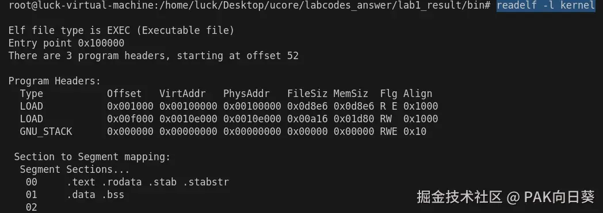

简单来说，为了方便操作系统内核加载ELF文件，这种文件格式在设计的时候引入了*Program Header Table*的概念。即将ELF文件中的.data、.text、.bss等我们常说的sections，组织为若干个segments。其中每个segment都对应ELF文件当中一片连续的数据区域。进一步地，ELF文件格式将每个segment的相关信息储存在ELF文件中一个叫*Program Header Table*的数据结构当中，便于操作系统加载。

从上面的截图中可以看到，编译器为uCore的kernel文件分配了3个segments，并将.text、.rodata、.stab和.stabstr这几个sections归入第一个segment，将.data、.bss这几个sections归入第二个segment。第三个segment看起来没什么用，我们这里先不管它。

接下来，我们来简单了解一下*Program Header Table*中每一个entry所包括的字段的含义：

*   Offset: 当前segment相对于ELF文件开头的起始位置，单位字节
*   VirtAddr、PhysAddr：指示操作系统（bootloader）将当前segment加载到内存的何处去。由于lab1中还未涉及操作系统的虚拟内存管理机制，**这里我们先把它们当成一样的，不去深究它们的区别**。
*   FileSiz：当前segment在ELF文件当中占用了多少空间，单位字节。很显然，**FileSiz和Offset共同决定了bootloader应该在磁盘的何处读取当前segment的数据**。
*   MemSiz：指示操作系统（bootloader）要在内存当中为当前segment分配多大的空间。不难理解，**我们总有MemSiz≥FileSiz**。例如在上面的截图中我们可以看到，第一个segment的MemSiz和FileSiz是相等的，这是因为这个segment当中包括的sections都是静态的、定死的数据，不需要操作系统（bootloader）为其预留更多空间。而对于第二个包括了.bss段的segment来说，因为.bss段中的数据是依赖操作系统（bootloader）临时初始化的，其值并不体现在ELF文件当中，因此在加载这个segment时，就需要在内存中预留出比FileSiz更大的空间才行，即MemSiz>FileSiz。
*   Flg：指示操作系统应该为装载当前segment的内存空间赋予何种权限。由于现在我们是在实现加载操作系统内核的bootloader，所以暂时不用去管它。
*   Align：记录当前segment在内存中的对齐方式，默认情况下为一个内存页面（4KB）那么大。实际上Align的数值已经反映在VirtAddr或者PhysAddr上了，这里我们也不用管这个字段。

理解了*Program Header Table*的概念，我们就很容易理解`bootmain.c`中真正加载kernel的源代码了：

```C++
unsigned int    SECTSIZE  =      512 ;
struct elfhdr * ELFHDR    =      ((struct elfhdr *)0x10000) ;     // scratch space

/* bootmain - the entry of bootloader */
void
bootmain(void) {
    // read the 1st page off disk
    // 先从ELF文件的头部，读4KB数据到首地址为0x10000的物理内存当中去
    // 这其中就包括了ELF Header，以及Program Header Table这两大关键数据结构
    readseg((uintptr_t)ELFHDR, SECTSIZE * 8, 0);

    // is this a valid ELF?
    if (ELFHDR->e_magic != ELF_MAGIC) {
        goto bad;
    }

    struct proghdr *ph, *eph;

    // load each program segment (ignores ph flags)
    // 根据ELF Header提供的信息，确定Program Header Table在物理内存中的首地址，以及界限
    ph = (struct proghdr *)((uintptr_t)ELFHDR + ELFHDR->e_phoff);
    eph = ph + ELFHDR->e_phnum;
    // 逐个访问Program Header Table中的entry，从磁盘中读取它们到预设的物理内存地址当中去
    for (; ph < eph; ph ++) {
        readseg(ph->p_va & 0xFFFFFF, ph->p_memsz, ph->p_offset);
    }

    // call the entry point from the ELF header
    // note: does not return
    // CPU进入kernel的入口继续执行
    // 通过readelf -h kernel命令可知，在lab1中其地址为0x10000
    ((void (*)(void))(ELFHDR->e_entry & 0xFFFFFF))();

// 碰到错误，向模拟器发送报错信息
bad:
    outw(0x8A00, 0x8A00);
    outw(0x8A00, 0x8E00);

    /* do nothing */
    while (1);
}
```

这段代码本身并不难，但这里我们不妨对比阅读一下[xv6中实现的`bootmain`函数](https://github.com/mit-pdos/xv6-public/blob/eeb7b415dbcb12cc362d0783e41c3d1f44066b17/bootmain.c)，以求加深理解：

```C++
  // Load each program segment (ignores ph flags).
  ph = (struct proghdr*)((uchar*)elf + elf->phoff);
  eph = ph + elf->phnum;
  for(; ph < eph; ph++){
    pa = (uchar*)ph->paddr;
    readseg(pa, ph->filesz, ph->off);
    if(ph->memsz > ph->filesz)
      stosb(pa + ph->filesz, 0, ph->memsz - ph->filesz);
  }
```

可以看到，xv6中的处理就比uCore更加精细一些。在xv6中，每次实际希望向硬盘读取的数据大小即为当前segment在ELF源文件中的大小。如果当前segment的memsz大于filesz，xv6手工将物理内存中需要多分配的字节全部置为`0x00`。

相比之下uCore就偷懒得多了，它直接按照memsz大小读取每个segment的数据。也就是说，在memsz大于filesz的情况下，从磁盘中读进来的共memsz-filesz那么多个字节的多余数据直接作为废数据来填充内存空间。

这种做法确实让人感到有些别扭！不过鉴于lab1的uCore代码确实可以跑起来，我这里就不去深究它到底会不会引发问题了。

到此为止，CPU就开始正式进入操作系统内核执行了。让我们来看看此时计算机物理内存中的内存布局全图：


# 练习5：实现函数调用堆栈跟踪函数

## 代码实现

这个实验看着很唬人，实际上我们只需要看懂uCore源码中给出的提示，再摸出神奇的CSAPP，就可以轻松搞定。

CSAPP中给出了x86-64架构下的函数栈帧结构，32位的x86与之一致，只不过栈上每个元素的长度都仅为4字节罢了：

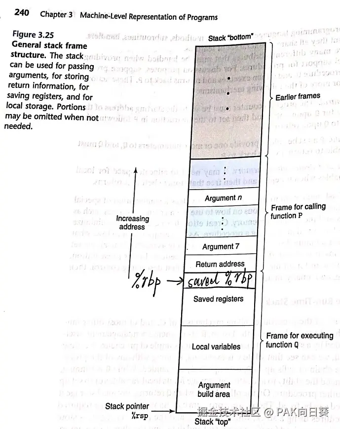

结合源码中的提示，可轻松写出代码：

```C++
void print_stackframe(void) {
     uint32_t ebp = read_ebp();  // 获取当前的ebp指针
     uint32_t eip = read_eip();  // 获取程序执行到当前行的eip指针
     for (int i = 0; i < STACKFRAME_DEPTH && ebp != 0; ++i) {
        cprintf("ebp:0x%08x eip:0x%08x args:", ebp, eip);
        // 打印栈上的函数参数。
        // 这里加2是因为我们要跳过栈上保存的老%ebp寄存器值和函数返回地址，
        // 才能定位到存放函数参数的位置
        uint32_t* args = (uint32_t*)ebp + 2;
        for (int j = 0; j < 4; ++j) {
            cprintf("0x%08x ", args[j]);
        }
        cprintf("\n");
        // 打印eip-1所指行代码的调试信息
        // 因为栈上储存的返回地址是call指令后边一条指令的首地址，
        // 所以我们要减去1，才能定位到call指令所在的位置
        print_debuginfo(eip - 1);
        // 从栈上读取出函数返回地址，和老的%ebp寄存器值
        eip = *((uint32_t*)(ebp + 4));
        ebp = *((uint32_t*)(ebp));
     }
}
```

演示效果如下：

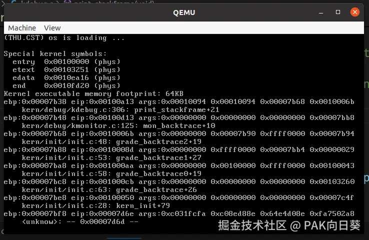

## 解释最后一行各个数值的含义

根据最后一行`eip: 0x00007d6e`的信息，我们可以推断最后一行的信息应该与bootloader中拉起`kern_init`的函数调用有关。具体见下图：

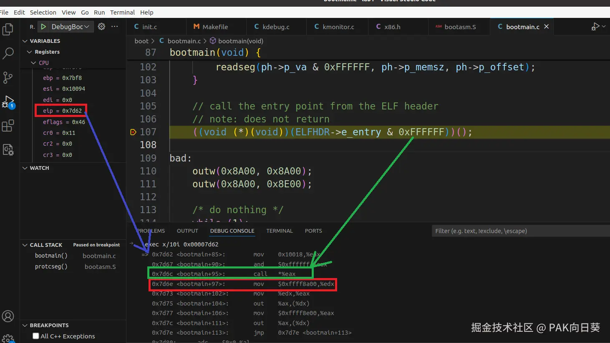

通过在vscode中调试，可以清晰地看到：bootloader调用操作系统kernel的`call`指令位于物理地址`0x00007d62`处，紧随其后的一条指令（虽然事实上它永远不会被执行）的物理地址为`0x00007d6e`。也就是说当`call   *%eax`这条指令被执行时，CPU放置在堆栈上的返回地址也应当为`0x00007d6e`，这与我们在qemu模拟器中看到的输出结果是吻合的。

那么`ebp: 0x00007bf8`这个数值又该如何理解呢？让我们回到最初的`bootasm.S`中看看：

```assembler
# start address should be 0:7c00, in real mode, the beginning address of the running bootloader
.globl start
start:
    # ......

    # Set up the stack pointer and call into C. The stack region is from 0--start(0x7c00)
    movl $0x0, %ebp
    movl $start, %esp
    call bootmain
```

我们回忆一下，`bootmain`作为一个C语言函数，需要堆栈支撑其运行，因此在汇编代码中调用该函数之前，我们将`%esp`寄存器的值设置为了`0x00007c00`，即临时堆栈的栈底为`0x00007c00`。

接下来我们继续分析。当执行`call bootmain`后，CPU自动将返回地址放置到堆栈上，这会占用4个字节。紧接着CPU跳转到`bootmain`函数执行，通过查看汇编代码，我们很容易知道就像一般的C语言函数那样，该函数首先会把旧的`%ebp`寄存器的值（在`bootasm.s`中已经被设为0）放置到堆栈上，这又会占用4个字节。

经过上述操作，我们有`%esp = 0x00007c00 -4 - 4 = 0x00007bf8`。紧接着，`bootmain`函数又会把`%esp`寄存器的值赋值给`%ebp`，因此`%ebp`寄存器的值就变成了`0x00007bf8`，意为`bootmain`函数栈帧的栈底位置。这与我们在qemu模拟器中观察到的结果相吻合。

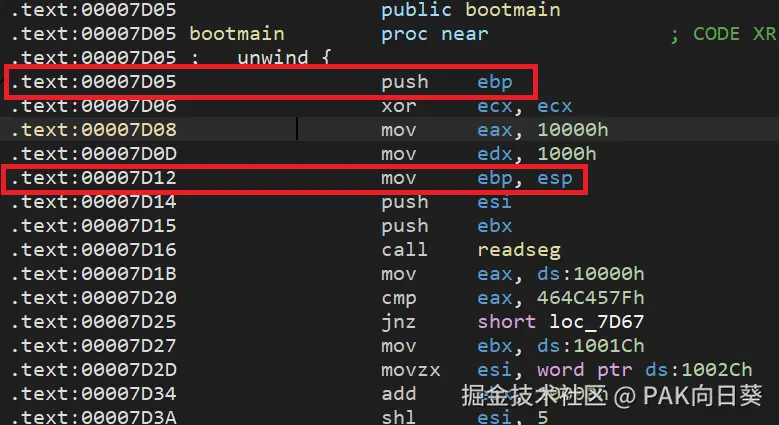

最后回到我们的`print_stackframe`函数。当`kern/init/init.c:28 kern_init+79`这部分内容被输出后，该函数紧接着从栈上拿到bootloader调用`kern_init`的返回地址（在`bootmain`函数执行`call *%eax`时入栈），和对应`bootmain`函数栈帧底部的`%ebp`寄存器的值（在`bootmain`函数刚执行时入栈，见下图），我们就看到前述的输出结果啦\~


# 练习6：完善中断初始化和处理

## 中断描述符表（也可简称为保护模式下的中断向量表）中一个表项占多少字节？其中哪几位代表中断处理代码的入口？

查看`kern/mm/mmu.h`中的中断门描述符定义如下：

```c++
/* Gate descriptors for interrupts and traps */
struct gatedesc {
    unsigned gd_off_15_0 : 16;        // low 16 bits of offset in segment
    unsigned gd_ss : 16;            // segment selector
    unsigned gd_args : 5;            // # args, 0 for interrupt/trap gates
    unsigned gd_rsv1 : 3;            // reserved(should be zero I guess)
    unsigned gd_type : 4;            // type(STS_{TG,IG32,TG32})
    unsigned gd_s : 1;                // must be 0 (system)
    unsigned gd_dpl : 2;            // descriptor(meaning new) privilege level
    unsigned gd_p : 1;                // Present
    unsigned gd_off_31_16 : 16;        // high bits of offset in segment
};
```

可见一个中断门描述符要占用64位，即8个字节。其中第0\~1字节和第7\~8字节分别表示中断处理代码偏移地址的低、高16位，第2\~3字节代表确定中断处理代码所在段的段选择子，三者共同决定了中断处理代码的入口的绝对地址。

## 请编程完善kern/trap/trap.c中对中断向量表进行初始化的函数idt\_init。

在`kern/trap/trap.c`中修改如下内容：

```c++
void idt_init(void) {
    extern uint32_t __vectors[];
    for (int i = 0; i < sizeof(idt) / sizeof(struct gatedesc); ++i) {
        SETGATE(idt[i], 0, GD_KTEXT, __vectors[i], DPL_KERNEL);
    }
    lidt(&idt_pd);
}

static void trap_dispatch(struct trapframe *tf) {
    char c;
    extern volatile size_t ticks;
    
    switch (tf->tf_trapno) {
    case IRQ_OFFSET + IRQ_TIMER:
        if (++ticks % TICK_NUM == 0) {
            ticks = 0;
            print_ticks();
        }
        break;
    // ...
    }
}
```

# 扩展练习 Challenge 1

## 理论分析

本题的需求不难理解，主要是要求**基于软中断**实现两个函数`lab1_switch_to_user`和`lab1_switch_to_kernel`，使之分别能够将CPU状态从内核态切换到用户态、从用户态切换到内核态。

这个需求看似很简单，但仔细分析一下却发现其中有个**大坑**。为了讲清楚这个大坑到底在哪里，我们首先需要理解中断（不管是硬件中断还是软中断）发生时，以及中断服务程序返回时，CPU硬件的一些动作细节。

对于进入保护模式的x86处理器而言，中断发生时是否进行特权级（privilege level）的切换，主要取决于中断门（interrupt gate）中段选择子（segment selector）字段的最低两位和处理器当前所处的特权级级别（即CS段寄存器的最低两位）是否一致。如两者不一致，且当前CPU所处的特权级通过了中断门DPL字段的校验，则会触发CPU进行特权级切换。

一般地，在CPU处理中断时发生特权级转移，都是用户态（ring3）向内核态（ring0）转移这种情况。此时为了保护用户态代码的堆栈不受污染，CPU会通过修改ss段寄存器和%esp指针的方式，临时将CPU使用的堆栈切换为一个专门用来执行中断服务程序的内核栈。

具体来说，ss段寄存器和%esp指针会被修改为何值呢？这由操作系统设定GDT表中的TSS段选择子来控制。大致上，包括xv6、Linux在内的许多操作系统都是依靠这种手段，来确保用户堆栈和中断服务程序堆栈之间相互隔离的。

这听上去似乎很完美，不过我们还要考虑到一个问题：当中断服务程序完成工作，需要退回到用户代码继续执行时，如何恢复ss段寄存器和%esp指针，使之重新指向用户栈的栈顶呢？

这一点x86架构也考虑到了。一方面，在中断导致CPU进行特权级转移的前提下，CPU在切换至内核栈后、进入中断处理程序前的时间点上，会将原先指向用户栈的ss和%esp压入内核栈；**否则CPU则不会有这步操作**。另一方面，当中断服务程序执行完毕，调用`iret`准备返回被中断的用户代码后，若CPU发现执行中断服务程序时的特权级（根据CS段寄存器的最低两位确定）与即将回退到的特权级（根据执行中断服务程序时的堆栈上存有待恢复的CS值确定）不一致，则会认为执行中断服务程序时的堆栈上还存有待恢复的ss和%esp值。那么此时CPU也会对它们进行出栈和恢复操作；**否则CPU则不会有这步操作**。

这里重点需要我们理解的是，在执行中断处理程序的过程中，CPU并没有办法"记住"进入中断的时候到底有没有发生特权级转移。当其`iret`指令时，CPU只是简单地通过比较当前CS段寄存器中最低两位的privilege字段，和存在栈上待恢复的CS值privilege字段的方式，来判断是否需要恢复ss和%esp。这就为我们在解决本题的时候埋下了大坑。

理论知识讲完了，接下来回到本题。我这里简单罗列一下分别调用这两个函数后CPU所需要经历的状态，让我们来看看大坑到底在哪里：

*   `lab1_switch_to_user`：内核态 => 内核态\[中断服务程序] =(ss、esp出栈)=> 用户态
*   `lab1_switch_to_kernel`：用户态 =(tss换栈，ss、esp入栈)=> 内核态\[中断服务程序]=> 内核态

我们先来看看`lab1_switch_to_user`，该函数在内核态中通过软中断触发中断服务程序，此过程中没有发生特权级转移，因此CPU拉起中断服务程序时并不会发生堆栈的切换，原先执行代码的堆栈信息（ss和%esp）也没有被自动保存到栈上。但接下来尴尬的事情发生了，中断服务程序结束后我们希望切换到用户态，此时在调用`iret`后CPU就会认为栈上已经有要恢复的堆栈信息并进行弹栈了，但事实上栈上并没有记录这个信息...

`lab1_switch_to_kernel`函数也存在类似的问题，不过这次是中断服务程序退出后因为没有发生特权级转移，`iret`指令无法恢复已经保存的堆栈信息...

## 最简单的解法

搞明白了坑点在哪里，我们的解决方案也呼之欲出了。既然因为特权级切换的缘故，某些操作无法由CPU自动完成，那我们手工代劳一下不就可以了嘛！

代码如下：

```C++
// kern/trap/trap.c
void idt_init(void) {
    extern uint32_t __vectors[];
    for (int i = 0; i < sizeof(idt) / sizeof(struct gatedesc); ++i) {
        SETGATE(idt[i], 0, GD_KTEXT, __vectors[i], DPL_KERNEL);
    }
    // 加上这一行，以允许处于用户态的CPU触发T_SWITCH_TOK中断来回到内核态
    SETGATE(idt[T_SWITCH_TOK], 1, GD_KTEXT, __vectors[T_SWITCH_TOK], DPL_USER);
    lidt(&idt_pd);
}

// kern/init/init.c
static void lab1_switch_to_user(void) {
    register uint32_t esp = 0;
    asm volatile (
        "movl %%esp, %0 \n"
        "pushl %1 \n"
        "pushl %2 \n"
        "int %3 \n"
        : "=r"(esp)
        : "i"(USER_DS), "0"(esp), "i"(T_SWITCH_TOU)
        : "memory"
    );
}

static void lab1_switch_to_kernel(void) {
    asm volatile (
        "int %0 \n"
        "movl %%ebp, %%esp \n"
        :
        : "i"(T_SWITCH_TOK)
        : "memory"
    );
}

// kern/trap/trap.c
static void trap_dispatch(struct trapframe *tf) {
    char c;
    extern volatile size_t ticks;
    
    switch (tf->tf_trapno) {
    // 略...
    case T_SWITCH_TOU:
        // 我们希望当中断服务程序退出后，CPU进入用户态
        tf->tf_cs = USER_CS;
        tf->tf_ds = USER_DS;
        tf->tf_es = USER_DS;
        tf->tf_fs = USER_DS;
        tf->tf_gs = USER_DS;
        // 我们希望在用户态也能执行I/O指令，否则将看不到输出结果
        tf->tf_eflags |= FL_IOPL_MASK;  
        break;
    case T_SWITCH_TOK:
        // 我们希望当中断服务程序退出后，CPU进入内核态
        tf->tf_cs = KERNEL_CS;
        tf->tf_ds = KERNEL_DS;
        tf->tf_es = KERNEL_DS;
        tf->tf_fs = KERNEL_DS;
        tf->tf_gs = KERNEL_DS;
        break;
    // 略...
}
```

这里简单解释一下`lab1_switch_to_kernel`函数中的`"movl %%ebp, %%esp \n"`这一条代码。根据已有的知识我们不难知道，由于该函数内部并没有其他任何多余的堆栈操作，在软中断执行前`%ebp`应该恰好指向该函数堆栈的栈顶。紧接着`int`指令触发了软中断，通过分析`trapentry.S`中的代码我们不难知道该`%ebp`值会被原封不动地保存到中断栈（trapframe）上去，并在中断服务程序执行末期被恢复。因此在中断服务程序退回`lab1_switch_to_kernel`函数后，我们只需要将`%ebp`重新赋值给`%esp`，就能巧妙地完成堆栈的恢复操作。

什么，你问我为什么我们不需要手工恢复ss段寄存器？兄弟别装外宾了。该函数的功能就是切换到内核态，而在中断服务程序被调用之前CPU就已经通过tss换栈的方式将ss段寄存器修改为了反映内核态的`KERNEL_DS`，因此就不需要我们再手工修改过了。

测试一下，ok代码能跑：

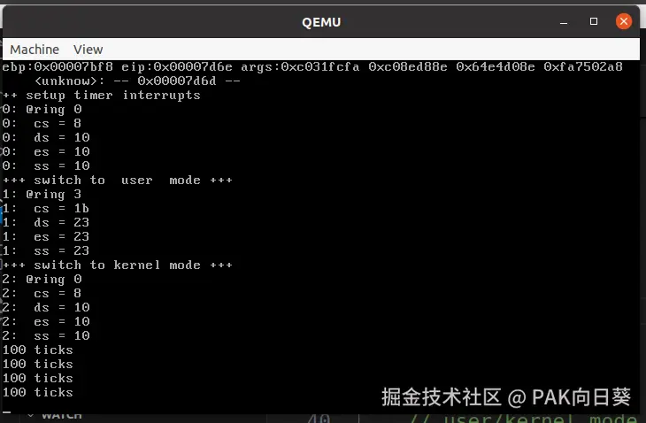

## 观摩官方参考答案

回顾上文我介绍的解决方案，其虽然很好懂，但缺点也很明显——我们必须在`lab1_switch_to_user`和`lab1_switch_to_kernel`中添加一些手工操作的汇编代码，才能完成整个流程。有没有什么方法，能够让我们把代码写成下面的这个样子？

```C++
static void lab1_switch_to_user(void) {
    asm volatile ("int %0 \n"::"i"(T_SWITCH_TOU));
}

static void lab1_switch_to_kernel(void) {
    asm volatile ("int %0 \n"::"i"(T_SWITCH_TOK));
}
```

事实上uCore官方提供的[参考答案](https://github.com/chyyuu/os_kernel_lab/blob/x86-32/labcodes_answer/lab1_result/kern/trap/trap.c#L176)就给出了一个技巧性极强的方案。下面我们就来欣赏一下他们是怎么做到的。

首先，针对本题中存在的大坑，实际上可以归纳为两点：

*   `lab1_switch_to_user`： 在进入中断（内核态=>内核态\[中断服务程序]）时，未发生特权级转移，CPU无法帮助我们自动记录下原先被中断代码的堆栈信息（即原先的`%esp`值）。
*   `lab1_switch_to_kernel`：在退出中断（内核态\[中断服务程序]=>内核态）时，未发生特权级转移，CPU执行`iret`指令时无法自动帮我们恢复原先被中断代码的堆栈信息（即原先的`%esp`值）。

### 我们先来思考如何解决第一点

由于调用`lab1_switch_to_user`函数进入中断的过程中，CPU并未发生特权级转移，对堆栈的操作始终在同一片连续的内存中进行，事实上我们可以在中断服务程序中直接计算出被中断代码的`%esp`值具体是多少，并保存到trapframe中去，这样在退出中断服务程序时CPU就能自动进行恢复了。而这实际上并不困难，因为在中断发生后，首先被CPU和uCore合力加载到堆栈上的数据就是trapframe结构体，而我们在中断服务程序`trap_dispatch`中已经拿到了该结构体的首地址，那么反推出加载trapframe之前的`%esp`值简直就是轻而易举了。

我们可以在刚才的代码上进行如下修改：

```C++
// kern/init/init.c
static void lab1_switch_to_user(void) {
	asm volatile (
            // 由于我们需要往trapframe中手工写入tf_ss和tf_esp字段，
            // 因此必须在堆栈上先预留出8字节的空间
	    "sub $0x8, %%esp \n"  
	    "int %0 \n"
	    : 
	    : "i"(T_SWITCH_TOU)
	);
}

static void trap_dispatch(struct trapframe *tf) {
    // 略...
    case T_SWITCH_TOU:
        if (tf->tf_cs != USER_CS) {
            tf->tf_cs = USER_CS;
            tf->tf_ds = USER_DS;
            tf->tf_es = USER_DS;
            tf->tf_fs = USER_DS;
            tf->tf_gs = USER_DS;
            tf->tf_ss = USER_DS;
            tf->tf_eflags |= FL_IOPL_MASK;
            tf->tf_esp = (uint32_t)tf + sizeof(struct trapframe);
        }
        break;
    // 略...
}
```

看到这里，你可能会吐槽，我们这不是还没有完全消除内联汇编中多余的代码嘛！兄弟别着急，等下我们就来看uCore官方的实现，这里只是先了解原理。

### 接着我们来看看如何解决第二点

既然无法依赖CPU自动为我们恢复`%esp`的值，那我们只能找个机会来手工修改`%esp`寄存器的值了。存在这样的机会吗？让我们看看`trapentry.S`的源代码：

```assembler
.text
.globl __alltraps
__alltraps:
    # push registers to build a trap frame
    # therefore make the stack look like a struct trapframe
    pushl %ds
    pushl %es
    pushl %fs
    pushl %gs
    pushal

    # load GD_KDATA into %ds and %es to set up data segments for kernel
    movl $GD_KDATA, %eax
    movw %ax, %ds
    movw %ax, %es

    # push %esp to pass a pointer to the trapframe as an argument to trap()
    pushl %esp

    # call trap(tf), where tf=%esp
    call trap

    # pop the pushed stack pointer
    # 这一句代码在xv6里仅仅是简单的addl $4, %esp
    # 这里应该是uCore官方为了出题专门改的
    popl %esp
    
    # return falls through to trapret...
.globl __trapret
__trapret:
    # restore registers from stack
    popal

    # restore %ds, %es, %fs and %gs
    popl %gs
    popl %fs
    popl %es
    popl %ds

    # get rid of the trap number and error code
    addl $0x8, %esp
    iret
```

我们注意到在`__alltraps`中在初始化完`trapframe`结构体，切换相关段寄存器到内核态之后，调用中断服务程序`trap`之前，这段代码还做了一件事。那就是把`%esp`寄存器（此时指向`trapframe`结构体的首地址）的值压到栈上，那是因为只有这样接下来的用C语言编写的中断服务程序才能通过该首地址访问到`trapframe`结构体。紧接着关键的地方来了，在中断服务程序退出后，`popl %esp`这句代码又会把栈顶位置的四个字节（对应放置`trapframe`首地址的地方）弹出并赋值给`%esp`寄存器——这就给了我们大做文章的机会！！！

试想一下，如果我们可以在中断服务程序中修改堆栈中放置`trapframe`结构体首地址的这四个字节的信息，我们就可以在`trap`函数退出后，随心所欲地让`%esp`重定位到我们想定位到的地方——也就是我们希望恢复的被中断代码的堆栈栈顶处！

**到目前为止，我们已经有了完美解决这两个问题的思路。** 接下来就让我们看看uCore官方是如何利用这两个思路来实现中断服务程序的。

### 代码实现

uCore官方提供的参考答案代码如下：

```C++
/* temporary trapframe or pointer to trapframe */
struct trapframe switchk2u, *switchu2k;

/* trap_dispatch - dispatch based on what type of trap occurred */
static void
trap_dispatch(struct trapframe *tf) {
    char c;

    switch (tf->tf_trapno) {
    // 略...
    case T_SWITCH_TOU:
        if (tf->tf_cs != USER_CS) {
            switchk2u = *tf;
            switchk2u.tf_cs = USER_CS;
            switchk2u.tf_ds = switchk2u.tf_es = switchk2u.tf_ss = USER_DS;
            // 因为实际上堆栈上的trapframe结构体并不包括tf_ss和tf_esp这两个字段（共8个字节），
            // 所以这里在计算原%esp值是还要再减去8。
            switchk2u.tf_esp = (uint32_t)tf + sizeof(struct trapframe) - 8;
		
            // set eflags, make sure ucore can use io under user mode.
            // if CPL > IOPL, then cpu will generate a general protection.
            switchk2u.tf_eflags |= FL_IOPL_MASK;
		
            // set temporary stack
            // then iret will jump to the right stack
            *((uint32_t *)tf - 1) = (uint32_t)&switchk2u; 
        }
        break;
    case T_SWITCH_TOK:
        if (tf->tf_cs != KERNEL_CS) {
            tf->tf_cs = KERNEL_CS;
            tf->tf_ds = tf->tf_es = KERNEL_DS;
            tf->tf_eflags &= ~FL_IOPL_MASK;
            // 因为在"内核态[中断服务程序]=>内核态"时，CPU执行iret指令不会自动恢复ss和%esp，
            // 所以我们这里只需要（也只能需要）在tf->tf_esp之下开辟一段大小
            // 为sizeof(struct trapframe) - 8的空间来放置新构造的trapframe结构体。
            // 这样可以确保__trapret中的代码执行完所有pop操作后，%esp的值恰好恢复为tf->tf_esp。
            switchu2k = (struct trapframe *)(tf->tf_esp - (sizeof(struct trapframe) - 8));
            memmove(switchu2k, tf, sizeof(struct trapframe) - 8);
            *((uint32_t *)tf - 1) = (uint32_t)switchu2k;
        }
        break;
    // 略...
}
```

**我们先来看看`T_SWITCH_TOU`这个中断服务的实现。** 可以看到，其实现代码与我们刚才进行的分析基本一致。但为了解决堆栈上没有多余空间以便我们向`trapframe`结构体中写入`tf_ss`和`tf_esp`字段的问题，这份代码选择另行定义一个名为`switchk2u`的`trapframe`结构体，将触发中断时CPU和uCore建立起来的`trapframe`结构体中的内容赋值给它。之后，我们向`switchk2u`的`tf_ss`和`tf_esp`字段写入数据，这个操作是绝对安全的。

接下来，为了确保退出`trap_dispatch`函数后`trapenrty.S`中的后续代码能以`switchk2u`这个结构体（而非原先在栈上的`trapframe`）为参照来恢复执行被中断代码，我们需要修改堆栈中放置trapframe结构体首地址的这四个字节，即用`switchk2u`的首地址顶替掉原先`trapframe`结构体的首地址。通过前面的分析我们很容易知道，这四个字节正好就是指针`struct trapframe *tf`所指位置的前四个字节！

**我们再来看看T\_SWITCH\_TOK。** 前面提到，实现用户态切换为内核态的主要难点是"内核态\[中断服务程序]=>内核态"时CPU不会自动恢复`%esp`寄存器的值。因此我们只需要在我们的目标地址`tf->tf_esp`的下方精心构造一个新的`trapframe`结构体`switchu2k`，再用其首地址顶替掉原来在栈上的`trapframe`结构体的地址。根据我们前面的分析，通过这样的构造，当`__trapret`中的代码通过一系列堆栈操作完成对被中断程序的恢复之后，我们关切的`%esp`寄存器的值自然而然就会变成我们的目标值`tf->tf_esp`。**真是令人拍案叫绝！！！**

# 扩展练习 Challenge 2

有了Challenge 1打下的坚实基础，Challenge 2就容易得多了。这里直接上代码：

```C++
// kern/init/init.c
static void lab1_switch_to_user(void) {
    asm volatile ("int %0 \n"::"i"(T_SWITCH_TOU));
}

static void lab1_switch_to_kernel(void) {
    asm volatile ("int %0 \n"::"i"(T_SWITCH_TOK));
}

// kern/trap/trap.c
struct trapframe switchk2u, *switchu2k;

static inline __attribute__((always_inline))
void switch_kernel_to_user(struct trapframe* tf) {
    if (tf->tf_cs != USER_CS) {
        switchk2u = *tf;
        switchk2u.tf_cs = USER_CS;
        switchk2u.tf_ds = switchk2u.tf_es = switchk2u.tf_ss = USER_DS;
        switchk2u.tf_esp = (uint32_t)tf + sizeof(struct trapframe) - 8;
    
        // set eflags, make sure ucore can use io under user mode.
        // if CPL > IOPL, then cpu will generate a general protection.
        switchk2u.tf_eflags |= FL_IOPL_MASK;
    
        // set temporary stack
        // then iret will jump to the right stack
        *((uint32_t *)tf - 1) = (uint32_t)&switchk2u; 
    }
}

static inline __attribute__((always_inline)) 
void switch_user_to_kernel(struct trapframe* tf) {
    if (tf->tf_cs != KERNEL_CS) {
        tf->tf_cs = KERNEL_CS;
        tf->tf_ds = tf->tf_es = KERNEL_DS;
        tf->tf_eflags &= ~FL_IOPL_MASK;
        switchu2k = (struct trapframe *)(tf->tf_esp - (sizeof(struct trapframe) - 8));
        memmove(switchu2k, tf, sizeof(struct trapframe) - 8);
        *((uint32_t *)tf - 1) = (uint32_t)switchu2k;
    }
}

/* trap_dispatch - dispatch based on what type of trap occurred */
static void trap_dispatch(struct trapframe *tf) {
    char c;
    extern volatile size_t ticks;
    
    switch (tf->tf_trapno) {
    case IRQ_OFFSET + IRQ_TIMER:
        if (++ticks % TICK_NUM == 0) {
            ticks = 0;
            print_ticks();
        }
        break;
    case IRQ_OFFSET + IRQ_COM1:
        c = cons_getc();
        cprintf("serial [%03d] %c\n", c, c);
        break;
    case IRQ_OFFSET + IRQ_KBD:
        c = cons_getc();
        cprintf("kbd [%03d] %c\n", c, c);
        if (c == '3') {
            switch_kernel_to_user(tf);
            cprintf("+++ switch to  user  mode +++\n");
        } else if (c == '0') {
            switch_user_to_kernel(tf);
            cprintf("+++ switch to kernel mode +++\n");
        }
        break;
    case T_SWITCH_TOU:
        switch_kernel_to_user(tf);
        break;
    case T_SWITCH_TOK:
        switch_user_to_kernel(tf);
        break;
    case IRQ_OFFSET + IRQ_IDE1:
    case IRQ_OFFSET + IRQ_IDE2:
        /* do nothing */
        break;
    default:
        // in kernel, it must be a mistake
        if ((tf->tf_cs & 3) == 0) {
            print_trapframe(tf);
            panic("unexpected trap in kernel.\n");
        }
    }
}
```

# Lab1，拿下！

至此，uCore Lab1就全部搞定了（此处应有掌声，啪啪啪啪！）。最终评测结果如下：


