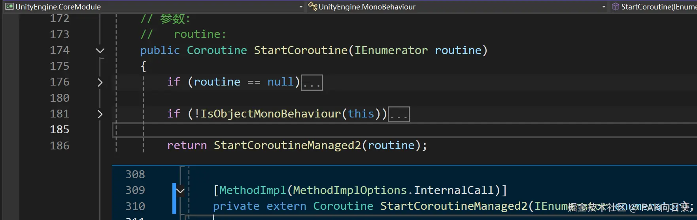
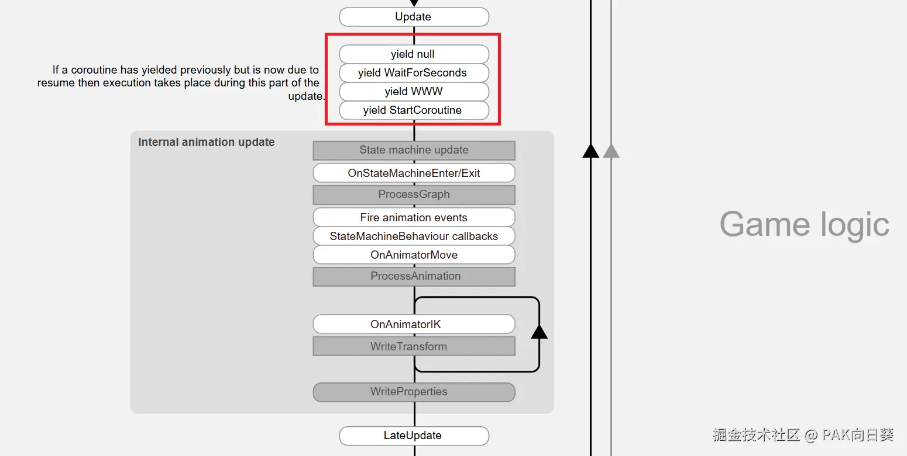

协程（Coroutine）是Unity引擎所提供的一种强大而神奇的机制。它允许开发者将动画等耗时较久的任务打散到多帧（即多次事件循环）执行，以避免此类任务阻塞游戏主线程（即单次事件循环）的正常执行。

在Unity项目中，协程的实现由C#编译器和Unity引擎底层密切配合实现，下面我将逐一为你拆解它们在实现协程过程中所扮演的角色。

# C#编译器提供的支持

为了说明Unity引擎中协程机制的工作原理，这里首先给出一个具体的C#示例代码。后文中我将结合这个具体的实例进行说明。

```C#
class MyClass : MonoBehaviour {
    private void Start()
    {
        StartCoroutine(TestEnumerator());
    }
    private IEnumerator TestEnumerator()
    {
        UnityEngine.Debug.Log("wait for 1s");
        yield return new WaitForSeconds(1f);
        UnityEngine.Debug.Log("wait for 2s");
        yield return new WaitForSeconds(2f);
        UnityEngine.Debug.Log("wait for 3s");
        yield return new WaitForSeconds(3f);
        UnityEngine.Debug.Log("Final");
    }
}
```

在调用Start函数后，它会将枚举器函数TestEnumerator的返回结果作为实参传入StartCoroutine函数（事实上它是Unity引擎提供的基类MonoBehaviour的一个方法），而后协程就会开始执行，而其执行效果应该是显而易见的。首先它会输出字符串"wait for 1s"，等待1秒之后输出"wait for 2s"，再等待2秒之后输出"wait for 3s"，最后再等待3秒后输出"Final"。

通过观察Reflector（一款C#程序逆向工具）反编译Unity项目构建后所得Assembly-CSharp.dll文件（其中储存着Unity项目中所有C#源码经编译所得的字节码指令）的结果，我们可以看到在最终的编译产物中并没有TestEnumerator函数的对应代码，取而代之的是一个继承自IEnumerator的类（下文称做“枚举器类”），如下所示。

注意，这里为了方便说明问题，我对展示代码进行了必要的删改。

```C#
private sealed class <TestEnumerator>d__1 : IEnumerator
{
    private int <>1__state;
    private object <>2__current;
    public Test <>4__this;
    public <TestEnumerator>d__1(int <>1__state)
    {
        this.<>1__state = <>1__state;
    }
    private bool MoveNext()
    {
        switch (this.<>1__state)
        {
            case 0:
                this.<>1__state = -1;
                UnityEngine.Debug.Log("wait for 1s");
                this.<>2__current = new WaitForSeconds(1f);
                this.<>1__state = 1;
                return true;
            case 1:
                this.<>1__state = -1;
                UnityEngine.Debug.Log("wait for 2s");
                this.<>2__current = new WaitForSeconds(2f);
                this.<>1__state = 2;
                return true;
            case 2:
                this.<>1__state = -1;
                UnityEngine.Debug.Log("wait for 3s");
                this.<>2__current = new WaitForSeconds(3f);
                this.<>1__state = 3;
                return true;
            case 3:
                UnityEngine.Debug.Log("Final");
                this.<>1__state = -1;
                return false;
        }
        return false;
    }
    object IEnumerator.Current
    {
        get
        {
            return this.<>2__current;
        }
    }
}
```

通过观察这个类的代码，我们不难发现，枚举器函数的本质其实是一个有限状态机（Fnite-Sate Machine）。原先枚举器函数中看似连成一体的代码，都会以yield return语句为界限被编译器划分为有限状态机中的若干状态，封装进枚举器类的MoveNext方法当中。

同时，枚举器类中还包含一个名为1\_\_state的成员变量，用于表示有限状态机当前所处的状态。当MoveNext方法每次被调用时，都会执行1\_\_state所指示状态所对应的那部分代码。

另外，有限状态机的状态应该是能够发生迁移的，这只需要通过修改1\_\_state成员变量的值就能办到。

从枚举器类的代码可以看出，在本文所举的这个具体例子中，状态机状态迁移的条件是非常简单的：当某一个状态下的代码执行完毕后，就应该迁移到下一个状态。

枚举器类中还有两个非常值得关注的细节。

1.  原枚举器函数中yield return语句后跟随的返回值（在本例中是一个用于描述等待时间的WaitForSeconds实例对象），在编译器生成的枚举器类中，在有限状态机相应代码执行后，被挂载到了2\_\_current这个成员变量上。又注意到，枚举器类中提供了一个访问器方法IEnumerator.Current，使得外部代码可以很方便地获取到每一次yield return语句所“返回”的结果。
2.  编译器生成的枚举器类MoveNext以布尔值作为每次调用的返回值。当有限状态机还未处于最终状态时，调用MoveNext方法会得到true，这对应于原枚举器函数中的代码还未被全部执行完毕。而当有限状态机已处于最终状态，调用MoveNext方法则会得到false，这对应于原枚举器函数中的所有代码都已经被执行完毕了。通过判断调用MoveNext方法所得到的返回值，外部代码可以很轻松地了解到有限状态机是否已经进入了最终状态。

基于以上分析，对于任何稍有编程经验的人，都不难推测出枚举器TestEnumerator作为协程工作的大致方式：

*   在第一次执行其对应枚举器类的MoveNext方法后，根据从Current访问器获取到的WaitForSeconds实例对象可以知道应等待的时间是多少
*   等这个时间一过，就再次调用MoveNext方法。
*   如此循环往复上述过程，直至调用MoveNext方法得到值为false的返回值即可停止。

# Unity引擎底层提供的支持

通过前文的分析，我们已经认识到C#编程语言中枚举器函数的本质是一个有限状态机，并且生成这个有限状态机所对应枚举器类代码的工作是由C#编译器完成的。

此外，我们还大致推测出了协程工作的方式。那么现在的问题是：谁来负责在何时的时机，调用枚举器类的MoveNext方法呢？通过简单的思考，不难推知，这个工作只能由Unity引擎来完成！

下面以Unity 4.3.1f1版本源码为例，来具体说明这个过程。同样地，为了行文方便，在下文中我也会对实际的源代码进行删改。

## C#层的封装

根据前面的分析，我们可以知道用于启动协程的StartCoroutine函数实际上接收的是一个迭代器类的实例化对象。

如下图所示，通过查看StartCoroutine函数的源代码，可知它会进一步调用StartCoroutineManaged2函数，而该函数属于InternalCall类别，即其是在Unity引擎内部使用C++代码实现的。



## C++层实现

### 协程初始化与注册的实现

在Runtime/Mono/MonoBehaviour.cpp中，可以找到StartCoroutineManaged2函数的源代码。这部分的代码的大致意思是，首先调用CreateCoroutine函数创建一个协程C++对象，然后调用CreateManagedWrapperForCoroutine函数将该对象封装成一个C#对象，返回给上层的C#脚本。

```C++
ScriptingObjectPtr MonoBehaviour::StartCoroutineManaged2 (ScriptingObjectPtr enumerator)
{
	if (!IsActive ())
	{
		// 当Game Object被禁用时，无法启动协程…
		return SCRIPTING_NULL;
	}
	Coroutine* coroutine = CreateCoroutine(enumerator, SCRIPTING_NULL);
	return CreateManagedWrapperForCoroutine(coroutine);
}
```

别忘了我们感兴趣的问题是“协程是如何被执行的”。于是进入CreateCoroutine函数进行进一步分析。

阅读源码可知，该函数除了创建并初始化协程对象外，还会在当前轮事件循环中，通过调用协程对象的Run方法来直接启动协程的执行。

此外，从该函数中最后对协程对象引用计数的分类讨论来看，在Run方法执行的过程中，Unity引擎就可以判断出该协程是否需要等待若干帧之后才能被释放。

```C++
Coroutine* MonoBehaviour::CreateCoroutine(ScriptingObjectPtr userCoroutine, ScriptingMethodPtr method)
{
    // 获取枚举器实例对象的MoveNext方法指针
	ScriptingMethodPtr moveNext = scripting_object_get_virtual_method(userCoroutine, MONO_COMMON.IEnumerator_MoveNext, GetScriptingMethodRegistry());
    // 获取枚举器实例对象的Current方法指针
	ScriptingMethodPtr current = scripting_object_get_virtual_method(userCoroutine, MONO_COMMON.IEnumerator_Current, GetScriptingMethodRegistry());

    // 创建协程对象，并设置其一些属性的初值…
	Coroutine* coroutine = new Coroutine ();
	coroutine->m_CoroutineEnumerator = userCoroutine;  // 绑定协程对象对应的枚举器实例
	coroutine->SetMoveNextMethod(moveNext);  // 获取枚举器实例的MoveNext方法指针
	coroutine->SetCurrentMethod(current);  // 获取枚举器实例的Current方法指针
	coroutine->m_Behaviour = this;
	coroutine->m_ContinueWhenFinished = NULL;
	coroutine->m_WaitingFor = NULL;
	coroutine->m_RefCount = 1;
    // 略…

    // 将新创建的协程对象储存到挂载在MonoBehaviour实例上的协程列表中
	m_ActiveCoroutines.push_back (*coroutine);
    // 开始执行协程
	m_ActiveCoroutines.back ().Run ();

// 如果协程对象的引用计数没有增加，即刚才协程在当前帧内就全部执行完毕了，
// 直接释放协程对象，并且返回NULL
	if (coroutine->m_RefCount <= 1)
	{
		Coroutine::CleanupCoroutine(coroutine);
		return NULL;
	}
	
// 如果协程对象的引用计数相比创建时增加，说明协程要等到后续帧才会全部执行完毕，
// 这时将协程对象的引用计数减去1（不会释放协程对象），
// 然后返回该对象给上层C#脚本即可。
	Coroutine::CleanupCoroutine(coroutine);
	return coroutine;				
}
```

下面进入协程对象的Run方法进一步分析，这部分代码位于Runtime/Mono/ Coroutine.cpp文件，如下所示。

阅读这一部分源码，我们可以看到该函数会调用协程对应的枚举器实例的MoveNext方法，以使得协程往下执行一步（即状态机的状态发生一次迁移）。

之后，只需根据MoveNext方法返回的结果，即可判断出协程是否已完全执行完毕（即状态机是否已经进入最终状态）。如果还未完全执行完毕，则调用ProcessCoroutineCurrent函数进一步进行处理。

这与我们前面分析C#枚举器函数时所得出的结论是完全吻合的。

```C++
void Coroutine::Run ()
{
// 为了防止调用MoveNext方法期间，协程对象被垃圾回收，引用计数需要加1
	m_RefCount++;
     // 调用协程对象绑定的枚举器实例的MoveNext方法，返回值存入keepLooping变量
	ScriptingExceptionPtr exception = NULL;
	bool keepLooping = InvokeMoveNext(&exception);
	// MoveNext方法调用结束，协程对象的引用计数减1
	CleanupCoroutine(this);
	// 如果MoveNext方法返回false，说明当前协程已经全部执行完毕
	if (!keepLooping)
	{
		// 如果有另外一个协程正在等待当前协程执行完毕
		if (m_ContinueWhenFinished)
		{
			// 调用正在等待当前协程执行完毕的那个协程的Run方法，使其继续向下执行
              // 具体代码略…
		}
         // 当前协程的生命周期已全部结束，直接退出Run函数的执行即可。
		return;
	}
     // 如果MoveNext方法返回true，说明当前协程还没有被全部执行完毕。
     // 根据协程中yield return语句返回的结果，进行进一步处理。
	ProcessCoroutineCurrent();
}
```

我们不难理解，如果当前协程还没有完全执行完毕，即协程执行中途被yield return语句中断了执行，那么这时候Unity引擎就需要根据该语句反馈的结果，以确定下一次继续执行该协程的时机，然后转而继续执行事件循环中的其他逻辑。

**这就是Unity协程不会阻塞游戏主事件循环的本质。** 而ProcessCoroutineCurrent函数承担的就是这部分任务。

在正式继续往下分析Unity引擎源码之前，我们不妨首先翻阅一下Unity引擎的官方文档，以了解在Unity中支持处理哪些协程代码中通过yield return语句所反馈的结果。

我将其汇总如下表所示。

| 反馈结果                                        | 说明                                                                   |
| ------------------------------------------- | -------------------------------------------------------------------- |
| `yield return null;`                        | 表示当前协程等待到下一帧进行渲染时，继续往下执行。                                            |
| `yield return new WaitForEndOfFrame();`     | 表示当前协程等待到当前帧渲染结束后，继续往下执行。                                            |
| `yield return new WaitForSeconds(seconds);` | 表示当前协程等待若seconds秒后，继续往下执行。**最常用！**                                   |
| `yield return WaitForFixedUpdate();`        | 表示当前协程等待到下一次固定时间间隔周期结束后（即所有GameObject的FixedUpdate方法下一次被调用后），再继续往下执行。 |
| `yield return WWW对象;`                       | 表示当前协程发起一个网络请求。当网络请求结束后，当前协程方可继续向下执行。                                |
| `yield return 另一个Coroutine对象;`              | 表示当前协程需等待另一个协程执行完毕后，方可继续向下执行。一般地，另一个协程亦可以通过StartCoroutine函数创建。       |

在了解了Unity所支持处理的几种协程代码反馈情况后，让我们继续向下分析源码，看看这几种情况分别对应于源码中的哪些部分。注意，在本文中我仅会展开分析yield return new WaitForSeconds这种情况。另外的情况分析方法与之类似，故不再赘述。

上文提及的ProcessCoroutineCurrent函数实现源码如下所示。可以看到该函数的实现是比较简单的，仅提供了针对yield return null这种情况的处理。针对其余几种情况的处理，还需要进一步分析HandleIEnumerableCurrentReturnValue函数。

```C++
void Coroutine::ProcessCoroutineCurrent()
{
	ScriptingExceptionPtr exception = NULL;
     // 获取协程对应的枚举器实例的Current方法
	ScriptingInvocation invocation(m_Current);
	// …
    // 调用Current方法，即可获取到yield return语句反馈的结果，储存在monoWait变量中。
	ScriptingObjectPtr monoWait = invocation.Invoke(&exception);
	// 处理yield return null这种情况
	if (monoWait == SCRIPTING_NULL)
	{
		// 将协程延迟到下一帧渲染时继续执行，具体代码略…
		return;
	}
     // 否则继续调用这个函数进一步处理其他情况
	HandleIEnumerableCurrentReturnValue(monoWait);
}
```

终于来到HandleIEnumerableCurrentReturnValue函数了！如下所示，在这个函数中我们终于见到了对于yield return语句每一种反馈结果的处理情况。

```C++
void Coroutine::HandleIEnumerableCurrentReturnValue(ScriptingObjectPtr monoWait)
{
	// 略…
	// 处理`yield return new WaitForSeconds`这种情况
	if (scripting_class_is_subclass_of (waitClass, classes.waitForSeconds)) {
		m_RefCount++;
		float wait;
         // 从WaitForSeconds对象中提取出要等待的秒数，储存在wait变量当中。
		MarshallManagedStructIntoNative(monoWait,&wait);
// 调用CallDelayed函数，将当前协程对象添加到延时队列中去。
		CallDelayed (ContinueCoroutine, m_Behaviour, wait, this, 0.0F, CleanupCoroutine, DelayedCallManager::kRunDynamicFrameRate | DelayedCallManager::kWaitForNextFrame);
         // 当前帧中对该协程对象的处理全部结束，直接返回即可。
		return;
	}
	// 处理`yield return new WaitForEndOfFrame()`这种情况
	if (scripting_class_is_subclass_of (waitClass, classes.waitForFixedUpdate)) {
		// …
	}
	// 处理`yield return new WaitForEndOfFrame()`这种情况
	if (scripting_class_is_subclass_of (waitClass, classes.waitForEndOfFrame)) {
		// …
	}
	// 处理` yield return 另一个Coroutine对象`这种情况
	if (scripting_class_is_subclass_of (waitClass, classes.coroutine)) {
		// … 
	}
	// 处理` yield return WWW对象`这种情况
	if (classes.www && scripting_class_is_subclass_of (waitClass, classes.www )) {
		// …
	}
    // 略…
}
```

以`yield return new WaitForSeconds`这种情况为例，我们下一个要解决的问题是, Unity引擎如何在准确的时机继续调度协程继续向下执行呢？可以看到，想要解决这个问题，就必须进一步分析清楚CallDelayed函数。

### 控制协程向下执行的实现

CallDelayed函数的实现代码位于Runtime/GameCode/CallDelayed.cpp文件。阅读其源码可知，该函数的主要功能是将要延迟被调度的任务及其元信息封装成一个Callback对象，然后挂载到Unity引擎的延迟调度任务队列m\_CallObjects当中去。

阅读Runtime/GameCode/CallDelayed.h中的代码可知，m\_CallObjects的作用相当于一个优先队列，会按照被任务调度执行时间的早晚顺序，对存入其中的Callback对象进行排序。由于这部分代码比较简单，就不在文中给出了。

```C++
void CallDelayed (DelayedCall *func, PPtr<Object> o, float time, void* userData, float repeatRate, CleanupUserData* cleanup, int mode)
{
    // 创建Callback对象
	DelayedCallManager::Callback callback;
     // 记录发起延迟调度任务的对象指针
     // 在本例中，该指针执行的应为挂载相应协程代码脚本的MonoBehaviour对象
     callback. object = o;
	// 计算回调函数被调度执行的时间，即`当前系统时间+需要延迟等待的时间`
	callback.time = time + GetCurTime ();
	// 设置需要被延迟调度的任务的函数指针。在本例中func指针指向ContinueCoroutine。
	callback.call = func;
// 设置延迟任务被调度后，需要传递给相应回调函数的参数。
// 在本例中，这个要传递的参数即为相应协程对象的指针。
	callback.userData = userData;
     // 其他属性的设置略…
     // 将Callback对象添加到延迟调度队列当中去。
	GetDelayedCallManager ().m_CallObjects.insert (callback);
}
```

接下来的故事应该很容易能够猜到了。在Unity每次执行事件循环时，都会在一定的时机遍历延迟调度队列m\_CallObjects，将当前的系统时间与队列中那些延时任务的被调度执行时间进行对比。

若某个任务的被调度执行时间小于等于当前的系统时间，那么就从队列中取出这个任务，执行其回调函数。

而在本例中，回调函数为ContinueCoroutine，那么它被执行后，就应该会继续调用对应协程对象的Run方法，使得协程能够相应地执行下去。这样就能够实现协程被调度的效果。

具体到源码，遍历并检查延迟调度任务的工作由DelayedCallManager::Update函数实现。而让相应协程继续向下执行的工作由ContinueCoroutine实现。

可以看到，它们的行为与我们的猜测完全一致！

```C++
// Call all delayed functions when the time has come.
void DelayedCallManager::Update (int modeMask)
{
	// 获取当前系统时间
	float time = GetCurTime();
// 从优先队列的头部（即被延迟调度时间最早的任务）开始遍历，
// 直至当前任务的被延迟调度时间比当前系统时间还晚。
	Container::iterator i = m_CallObjects.begin ();
	while (i !=  m_CallObjects.end () && i->time <= time)
	{
		m_NextIterator = i;	m_NextIterator++;
// 校验代码略…
		// 从优先队列中取出Callback对象
		Callback &cb = const_cast<Callback&> (*i);
         // 执行绑定在Callback对象上的回调函数
Object *o = Object::IDToPointer (cb.object.GetInstanceID ());
		void* userData = cb.userData;
		DelayedCall* callback = cb.call; 
callback (o, userData);
		// 收尾代码略…
		i = m_NextIterator;		
	}
}
```

```C++
void Coroutine::ContinueCoroutine (Object* o, void* userData)
{
	// 获取到要继续向下执行的协程对象
Coroutine* coroutine = (Coroutine*)userData;
	// 如果该协程对象绑定的MonoBehaviour对象，和发起调用时绑定的不一致，就抛出错误。
	if ((Object*)coroutine->m_Behaviour != o) {
		// …
		return;
	}
// 调用Run方法，继续向下执行协程对象
	coroutine->Run ();
}
```

### 协程调度的时机

到此我们已经基本捋清楚了Unity引擎中协程执行的逻辑。

现在还剩最后一个问题：在每次事件循环中，Unity引擎是具体在哪个时机来调用DelayedCallManager::Update函数以实现对协程的调度的呢？

由于Unity引擎事件循环的源码非常复杂，不便于直接翻阅，首先我们可以先看一下Unity的官方文档是怎么说的。

如下图所示，官方文档中给出了协程被调度执行的时机：全体GameObject的Update方法被执行后，全体GameObject的LateUpdate方法被执行前。



最后，我们按图索骥，在引擎的事件循环源码中成功找到了相应的代码，成功验证了Unity官方文档的说法。如下所示，这部分代码位于Runtime/Misc/Player.cpp。

```C++
bool PlayerLoop (bool batchMode, bool performRendering, IHookEvent* pHookEvt) {
// 略…
// 执行所有GameObject的Update方法
GetBehaviourManager ().Update ();
// 略…
// 调度执行协程
	GetDelayedCallManager ().Update (DelayedCallManager::kRunDynamicFrameRate);
	// 更新动画
	CALL_UPDATE_MODULAR(AnimatorUpdateFKMove);
	CALL_UPDATE_MODULAR(LegacyAnimationUpdate);
	CALL_UPDATE_MODULAR(AnimatorUpdateRetargetIKWrite);
	// 略…
     //执行所有GameObject的LateUpdate方法
	GetLateBehaviourManager ().Update ();
// 略…
}
```

# 总结

通过对Unity引擎底层源码的阅读分析，我们可以将Unity引擎中协程机制的本质，总结为如下几点：

1.  **有限状态机模型**：协程的核心逻辑被分解为多个状态，通过状态迁移实现分段执行。MoveNext方法是状态迁移的执行入口，每次调用后状态机会进入下一个状态。
2.  **非阻塞设计**：通过yield return反馈的中间结果，Unity引擎能够根据具体条件（如时间、帧数或事件）决定何时恢复协程执行，而不影响主线程的运行。这种设计确保了游戏的实时性。
3.  **引擎支持与事件循环**：Unity引擎的底层通过延迟任务队列管理协程调度，与事件循环紧密结合。在每帧的Update和LateUpdate方法之间，协程的调度逻辑被执行，确保协程与游戏主线程协同工作。
