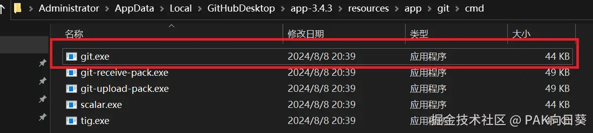
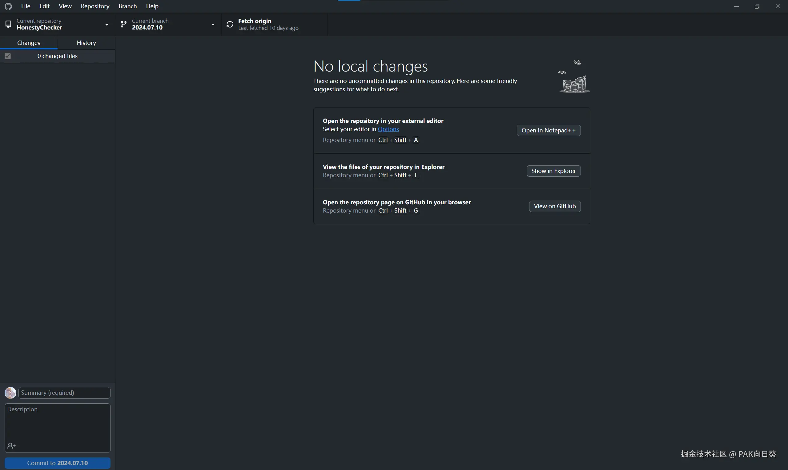

某同学反映在他的电脑上正确安装GitHub Desktop软件并登录他的账号后，无法正常从github.com上下载仓库代码。我遂展开排查。

在该同学的电脑上尝试拉取仓库，会抛出如下错误：

```
fatal: unable to connect to github.com:
github.com[0: 20.205.243.166]: errno=Unknown error
```

# 是网络原因吗？

我首先检查是不是网络原因导致连接github网站超时导致。但在终端执行ping操作后，发现一切正常。此外，打开浏览器也能正常访问github网站，以及下载代码。

```
C:\Users\Administrator>ping github.com

正在 Ping github.com [20.205.243.166] 具有 32 字节的数据:
来自 20.205.243.166 的回复: 字节=32 时间=96ms TTL=111
来自 20.205.243.166 的回复: 字节=32 时间=91ms TTL=111
来自 20.205.243.166 的回复: 字节=32 时间=102ms TTL=111
来自 20.205.243.166 的回复: 字节=32 时间=93ms TTL=111

20.205.243.166 的 Ping 统计信息:
    数据包: 已发送 = 4，已接收 = 4，丢失 = 0 (0% 丢失)，
往返行程的估计时间(以毫秒为单位):
    最短 = 91ms，最长 = 102ms，平均 = 95ms
```

接下来，我检查了该同学电脑上的`C:\Windows\System32\drivers\etc\hosts`配置文件，也没有发现有关github网站的相关配置，说明不可能是该同学电脑上的软件乱改hosts导致的。

# 出人意料！？

经与该同学沟通得知，他的电脑上曾使用过某款"GitHub加速器"软件。我遂怀疑该软件会污染电脑上安装的git工具的配置。但现在毕竟还只是一个猜测，实践出真知，我要进一步进行排查确认。

我们知道，GitHub Desktop客户端内置了一个git工具，客户端的上传/下载代码功能在本质上都是依赖这个git工具实现的。在该同学的电脑上，其位置位于`C:\Users\Administrator\AppData\Local\GitHubDesktop\app-3.4.3\resources\app\git\cmd`



打开终端，定位到该目录，我首先尝试直接执行`git clone`命令，果不其然得到了如下结果：

```
PS C:\Users\Administrator\AppData\Local\GitHubDesktop\app-3.4.3\resources\app\git\cmd> 
git clone https://github.com/WU-SUNFLOWER/HonestyChecker.git 
Cloning into 'HonestyChecker'... 
fatal: unable to connect to github.com: github.com[0: 20.205.243.166]:
errno=Unknown error
```

但我仍然不死心，抱着试试看的心态将命令中的`https`替换为`http`。接下来的结果却出乎我的意料：

```
PS C:\Users\Administrator\AppData\Local\GitHubDesktop\app-3.4.3\resources\app\git\cmd>
git clone http://github.com/WU-SUNFLOWER/HonestyChecker.git
Cloning into 'HonestyChecker'...
warning: redirecting to https://github.com/WU-SUNFLOWER/HonestyChecker.git/
remote: Enumerating objects: 150, done.
remote: Counting objects: 100% (150/150), done.
remote: Compressing objects: 100% (118/118), done.
remote: Total 150 (delta 63), reused 113 (delta 29), pack-reused 0R
Receiving objects: 100% (150/150), 58.33 KiB | 1012.00 KiB/s, done.
Resolving deltas: 100% (63/63), done.
```

神马，这居然就能下载代码了？！

当然，排错过程到这绝非戛然而止。毕竟在GitHub Desktop客户端中，即使你手工将拉取仓库URL中的`https`替换为`http`，该客户端也会暖心地再给改回来...

# 定位问题！

经过进一步查询资料，我注意到`git clone`命令若带上参数`-v`，则会输出拉取代码过程中的具体信息。于是我进行进一步的尝试，以期能有所发现。

```
PS C:\Users\Administrator\AppData\Local\GitHubDesktop\app-3.4.3\resources\app\git\cmd> 
git clone -v https://github.com/WU-SUNFLOWER/HonestyChecker.git 
Cloning into 'HonestyChecker'... 
Looking up github.com ... done. 
Connecting to github.com (port 9418) ... 
fatal: unable to connect to github.com: github.com[0: 20.205.243.166]: 
errno=Unknown error
```

奇怪！

我们知道，9418端口是默认的git协议端口。但现在我明明在使用https协议（默认端口为443），git工具怎么会去访问9418这个端口呢？

接下来，我对git工具的设置进行检查：

```
C:\Users\Administrator\AppData\Local\GitHubDesktop\app-3.4.3\resources\app\git\cmd> 
git config --global -l
user.name=WU-SUNFLOWER
url.https://.insteadof=ssh://git@
url.git://.insteadof=https://
http.sslverify=false
filter.lfs.clean=git-lfs clean -- %f
filter.lfs.smudge=git-lfs smudge -- %f
filter.lfs.process=git-lfs filter-process
filter.lfs.required=true
url.https://github.com/.insteadof=git://github.com/
```

这几条配置引起了我的注意：

```
url.https://.insteadof=ssh://git@
url.git://.insteadof=https://
url.https://github.com/.insteadof=git://github.com/
http.sslverify=false
```

1. 这条配置表示当 Git 尝试访问以 `ssh://git@` 开头的 URL 时，实际上使用 `https://` 协议来替代。
2. 这条配置表示当 Git 尝试访问以 https:// 开头的 URL 时，使用 git:// 协议来替代。
3. 这条配置表示当 Git 尝试访问以 git://github.com/ 开头的 URL 时，将其替换为使用 HTTPS 协议的 URL。
4. 这条配置禁用了 SSL 验证，可能会扰乱https协议的连接。

这几条配置显然扰乱了git工具的正常工作（**极有可能是该同学之前使用的所谓"github加速器"所为**），尤其是第2条配置。这就解释了为什么当我们执行`git clone https://...`时，git工具会尝试连接git协议专用的端口。

# 解决方案

还是在git工具所在的目录，我执行如下命令来清除这些错误的配置：

```
git config --global --unset url.git://.insteadof
git config --global --unset url.https://github.com/.insteadof
git config --global --unset url.https://.insteadof
git config --global http.sslverify true
```

再次`git config --global -l`确认修改生效后，我再次打开该同学电脑上的GitHub Desktop客户端来尝试拉取我们的代码仓库，不负众望——成功！


