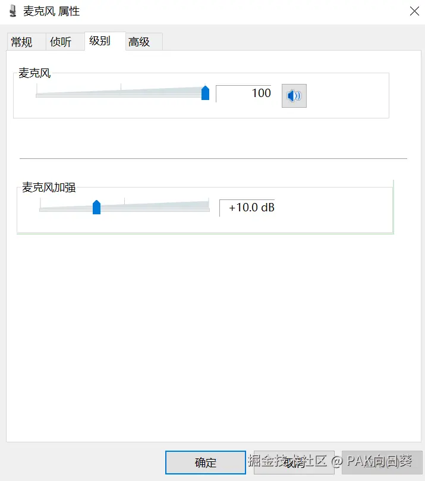
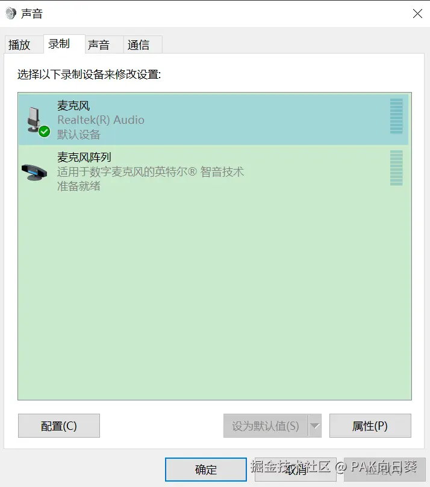
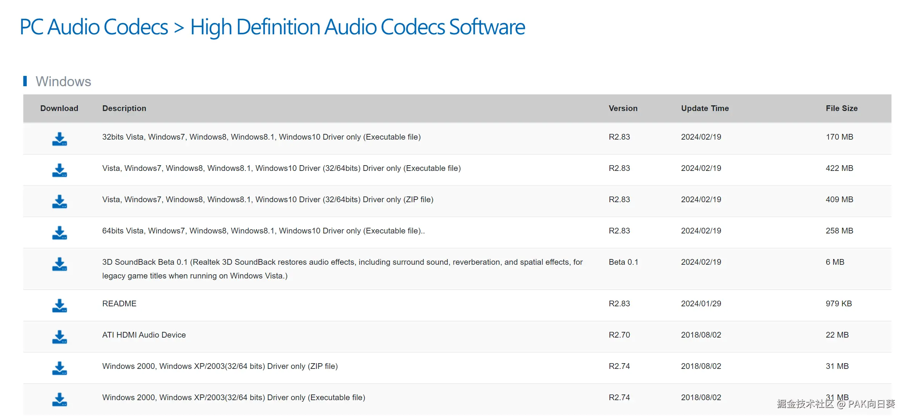
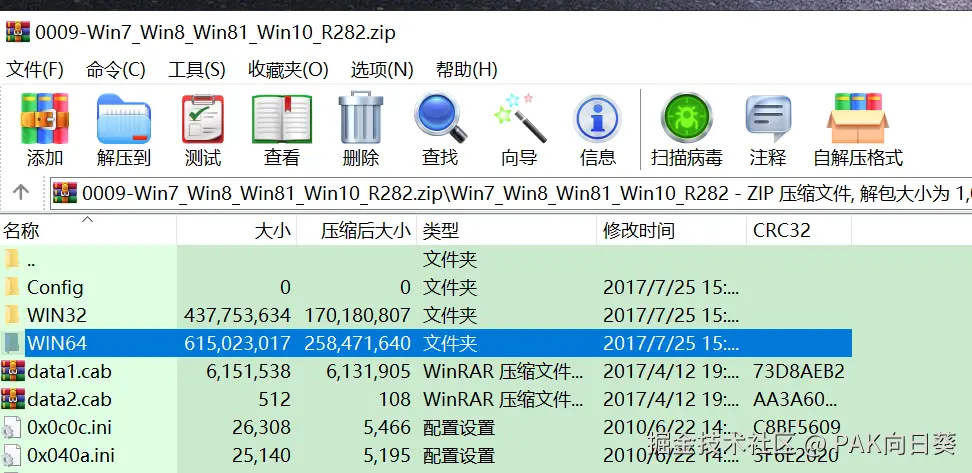
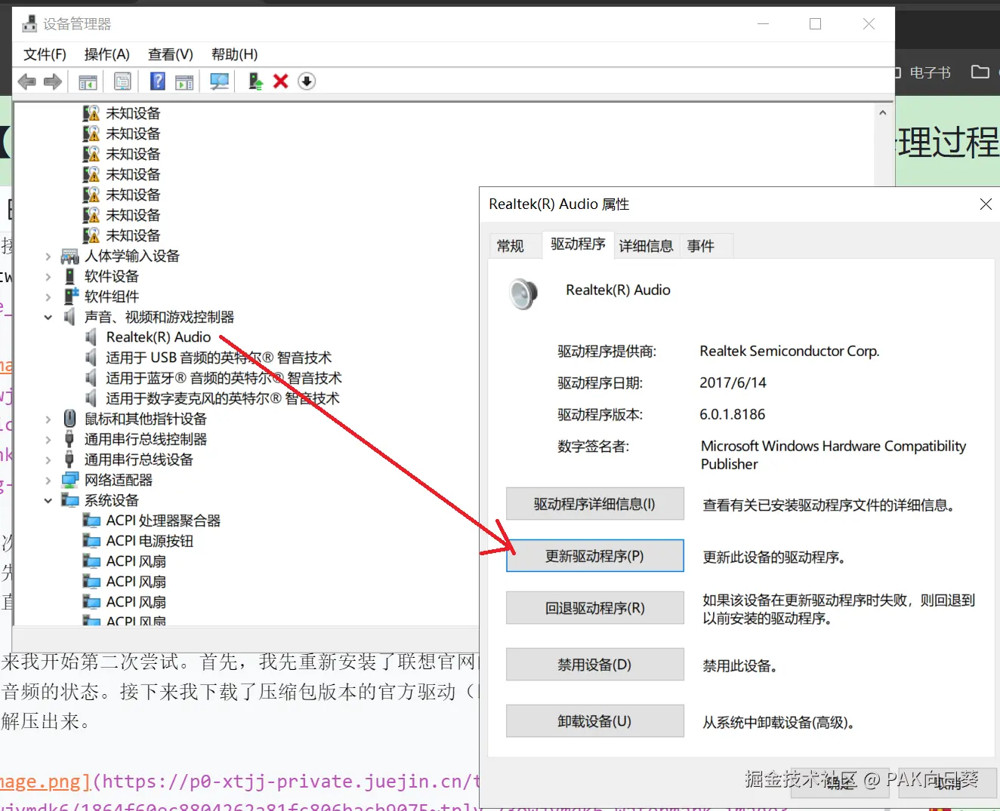
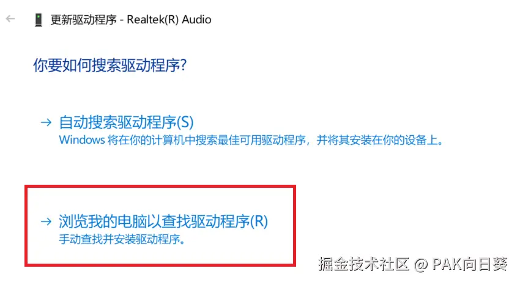
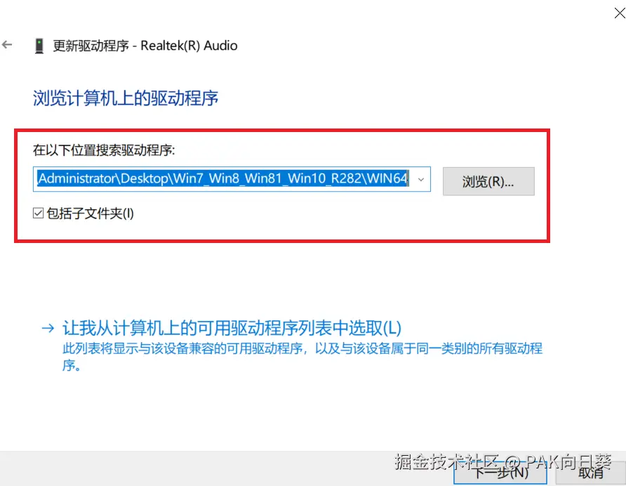
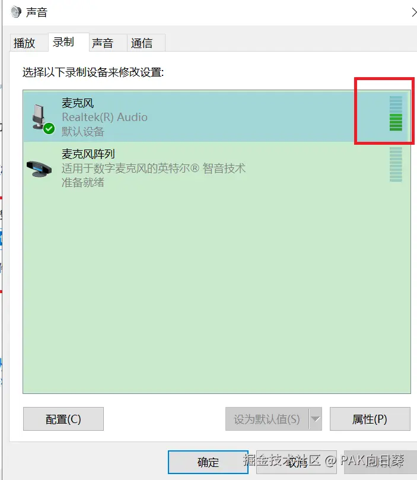

# 背景信息

新换的联想笔记本电脑，型号为`小新Pro 16IRH8 (2023款)`。预装的系统为Windows11家庭版，拿到新电脑后我立马火速换系统，重装后的系统为Windows Server 2022 Standard，内核版本21H2。

# 驱动安装

重装系统后的第一件事就是装驱动，我打开[联想官网](https://newsupport.lenovo.com.cn/)下载官方版的驱动安装包。从官网信息来看，这款电脑需要同时安装`Realtek Audio Driver 声卡驱动`和`Intel Smart Sound Technology (SST) Driver 英特尔智能声音技术（SST）驱动程序`这两个声卡驱动软件。经过实际测试我也验证，这两个驱动必须同时安装，电脑的音频功能才能正常使用。

由于使用的是server版的系统，因此除了安装系统我们还需要手工开启Windows的音频服务。这个操作网上教程很多，这里我不再赘述。

另外经实际测试，某些驱动管理软件会推荐你再在这款电脑上安装其他乱七八糟的一些驱动。经本人测试请不要安装，否则可能会导致电脑的音频功能无法正常使用！

# 碰到问题

在成功安装完联想官方提供的驱动后，我发现电脑自带的音响外放，以及耳机（这款电脑提供耳麦一体化接口）确实都可以听到声音了。但接下来尴尬的事情发生了，虽然插上耳机后，在下图中的面板可以看到系统检测到了耳机上麦克风的存在，并且我也设置了麦克风的采样级别，但是通过麦克风却无法输入任何声音......

# 踩坑历程

这部分先略过，以后有空再补充。

大体上来讲，既然系统可以识别出耳机麦克风的存在，那么我推定肯定是驱动的问题，导致麦克风无法正常使用。在此过程中，我尝试了各种驱动管理软件来试图修复这个问题，但都无疾而终。此外，我还下载了Microsoft Store中螃蟹厂提供的Realtek Audio Console，但里面也没有能够帮助我解决这个问题的选项。

# 成功修复

最后在我万念俱灰，准备再去电脑维修店跑一趟之际（他们大概率会劝我把系统重新装回联想定制版的Windows11...），我打算最后死马当活马医一次。

我直接打开了Realtek官网，找到螃蟹厂官方的声卡驱动（High Definition Audio Codecs Software）[下载页面](https://www.realtek.com/Download/List?cate_id=593&menu_id=298)。

第一次尝试的时候，我下载了安装包版本的官方驱动（即图中第二项）。安装前，该安装包会自动把我原先安装在电脑上的两个联想官方提供的声卡驱动全部卸载掉，然后重新安装它的驱动。经测试，这会直接导致我的电脑直接无法使用声音功能，尝试失败！

接下来我开始第二次尝试。首先，我先重新安装了联想官网的那两个驱动，确保电脑恢复到至少可以播放音频的状态。接下来我下载了压缩包版本的官方驱动（即图中的第三项），并将其中的所有文件全部解压出来。

接下来，我打开Windows的设备管理器，在`视频、音频和游戏控制器`一项中找到我们的目标，并进行如下图所示的一系列操作。

这里我们定位到realtek官方驱动压缩包解压出来的WIN64文件夹，再点下一步继续。注意，接下来Windows可能会弹出对话框提示"未知驱动，强行安装可能会导致设备损坏"之类的弹窗，我们不需要予以理睬。

之后一切顺利的话，系统应该会自动为我们安装好官方版本的声卡。重新启动机器，再进入声音界面测试麦克风，我们发现已经可以正常输入声音了，大功告成！

